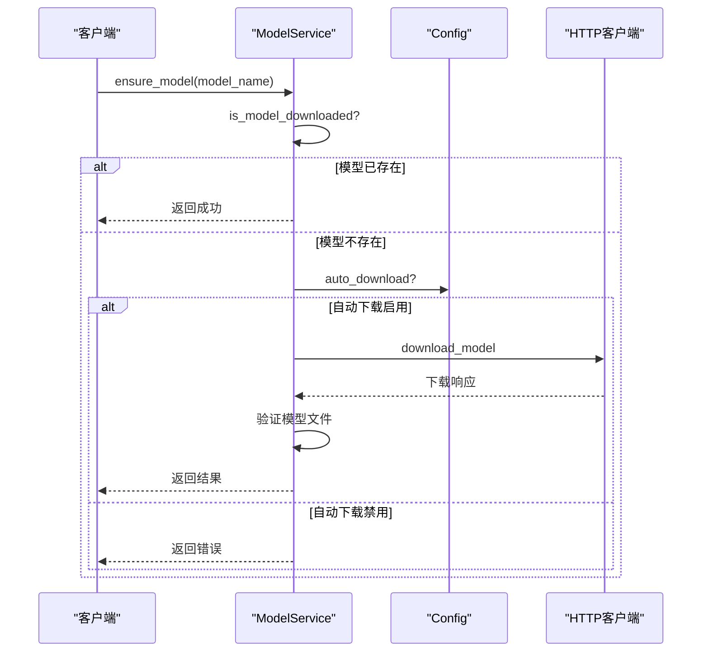
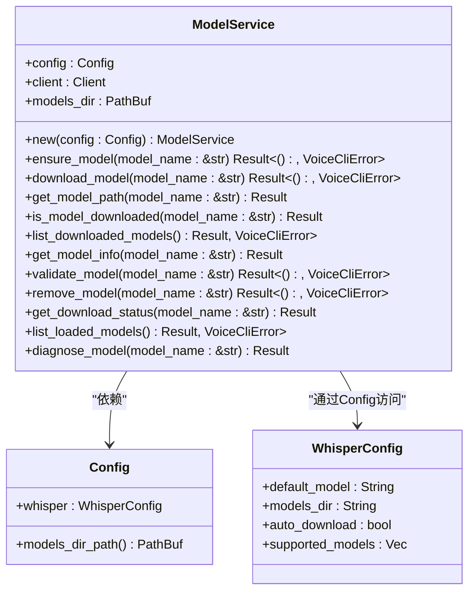
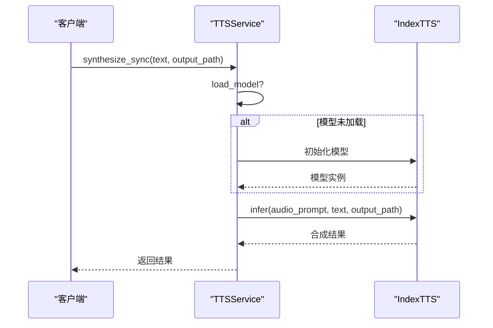
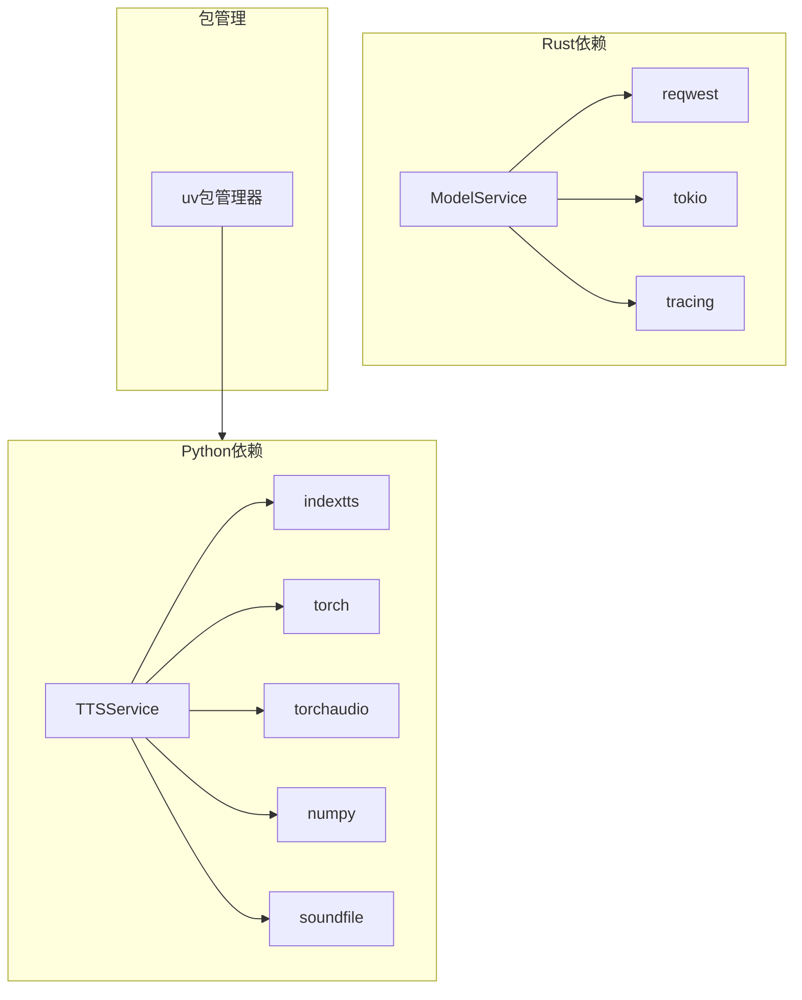

# 模型加载与管理

<cite>
**本文档引用的文件**   
- [model_service.rs](file://voice-cli/src/services/model_service.rs)
- [config.rs](file://voice-cli/src/config.rs)
- [config.rs](file://voice-cli/src/models/config.rs)
- [tts_service.py](file://voice-cli/tts_service.py)
- [INDEXTTS_SETUP.md](file://voice-cli/INDEXTTS_SETUP.md)
</cite>

## 目录
1. [简介](#简介)
2. [项目结构](#项目结构)
3. [核心组件](#核心组件)
4. [架构概述](#架构概述)
5. [详细组件分析](#详细组件分析)
6. [依赖分析](#依赖分析)
7. [性能考虑](#性能考虑)
8. [故障排除指南](#故障排除指南)
9. [结论](#结论)

## 简介
本文档详细说明了`model_service.rs`如何实现本地TTS模型（如IndexTTS）的加载、初始化和生命周期管理。解释了模型缓存机制的设计原理，包括内存缓存与磁盘缓存的协同策略。描述了版本控制逻辑，支持多版本模型共存与选择性加载。阐述了热更新机制的工作流程，如何在不中断服务的情况下替换模型文件。结合代码示例展示了模型加载失败时的重试机制与降级策略。提供了配置项说明以控制模型路径、自动加载行为和资源限制。分析了相关日志输出以便诊断模型初始化问题。

## 项目结构
`voice-cli`项目中的模型服务主要位于`voice-cli/src/services/model_service.rs`文件中，负责管理TTS模型的下载、验证和生命周期。模型配置在`voice-cli/src/models/config.rs`中定义，而实际的TTS服务实现则在`voice-cli/tts_service.py`中。项目还包含`INDEXTTS_SETUP.md`文档，详细说明了IndexTTS的安装和配置过程。

```mermaid
graph TB
subgraph "模型服务"
ModelService[model_service.rs]
Config[config.rs]
end
subgraph "TTS服务"
TTSService[tts_service.py]
end
ModelService --> Config : "读取配置"
TTSService --> ModelService : "调用模型管理"
```

**图示来源**
- [model_service.rs](file://voice-cli/src/services/model_service.rs)
- [config.rs](file://voice-cli/src/models/config.rs)
- [tts_service.py](file://voice-cli/tts_service.py)

**章节来源**
- [model_service.rs](file://voice-cli/src/services/model_service.rs)
- [config.rs](file://voice-cli/src/models/config.rs)

## 核心组件
`ModelService`是管理TTS模型的核心组件，负责模型的下载、验证和生命周期管理。它通过`Config`结构体读取配置信息，包括模型目录、默认模型名称和是否自动下载模型。`ModelService`提供了`ensure_model`方法来确保模型可用，如果模型不存在且配置允许自动下载，则会触发下载流程。

**章节来源**
- [model_service.rs](file://voice-cli/src/services/model_service.rs#L15-L522)
- [config.rs](file://voice-cli/src/models/config.rs#L1-L720)

## 架构概述
`ModelService`通过异步方式下载模型文件，使用`reqwest`客户端从Hugging Face仓库下载模型，并在下载过程中提供进度跟踪。下载完成后，会对模型文件进行基本验证，包括检查文件大小和可读性。模型文件存储在配置指定的目录中，文件名遵循`ggml-{model_name}.bin`的命名约定。



**图示来源**
- [model_service.rs](file://voice-cli/src/services/model_service.rs#L15-L522)

## 详细组件分析

### ModelService分析
`ModelService`通过`ensure_model`方法确保模型可用。该方法首先检查模型是否已下载，如果已下载则直接返回；如果未下载且配置允许自动下载，则调用`download_model`方法下载模型。下载过程中使用临时文件，下载完成后重命名为最终文件名，确保原子性。

#### 对象导向组件：


**图示来源**
- [model_service.rs](file://voice-cli/src/services/model_service.rs#L15-L522)
- [config.rs](file://voice-cli/src/models/config.rs#L1-L720)

### TTS服务分析
`TTSService`是Python实现的TTS服务，负责调用IndexTTS库进行语音合成。它通过`load_model`方法加载模型，支持从指定路径或默认路径加载。服务还提供了同步和异步的语音合成接口。

#### API/服务组件：


**图示来源**
- [tts_service.py](file://voice-cli/tts_service.py#L1-L428)

**章节来源**
- [tts_service.py](file://voice-cli/tts_service.py#L1-L428)

## 依赖分析
`ModelService`依赖于`reqwest`进行HTTP请求，`tokio`进行异步文件操作，以及`tracing`进行日志记录。`TTSService`依赖于`indextts`库进行语音合成，以及`torch`、`torchaudio`等深度学习库。项目通过`uv`包管理器管理Python依赖，确保环境一致性。



**图示来源**
- [model_service.rs](file://voice-cli/src/services/model_service.rs)
- [tts_service.py](file://voice-cli/tts_service.py)

**章节来源**
- [model_service.rs](file://voice-cli/src/services/model_service.rs)
- [tts_service.py](file://voice-cli/tts_service.py)

## 性能考虑
模型下载过程中使用了流式下载和进度跟踪，避免了内存溢出。下载时使用临时文件，确保文件完整性。模型验证仅检查文件大小和可读性，避免了昂贵的格式验证。TTS服务支持异步合成，通过线程池执行同步操作，避免阻塞事件循环。

## 故障排除指南
当模型加载失败时，可以通过以下步骤进行诊断：
1. 检查模型文件是否存在且可读
2. 验证文件大小是否在预期范围内
3. 检查网络连接是否正常
4. 查看日志输出以获取详细错误信息

`ModelService`提供了`diagnose_model`方法，可以诊断模型文件问题并提供修复建议。

**章节来源**
- [model_service.rs](file://voice-cli/src/services/model_service.rs#L450-L522)
- [INDEXTTS_SETUP.md](file://voice-cli/INDEXTTS_SETUP.md#L1-L431)

## 结论
`ModelService`和`TTSService`共同实现了TTS模型的完整生命周期管理。`ModelService`负责模型的下载和验证，而`TTSService`负责模型的加载和语音合成。两者通过清晰的接口分离关注点，确保了系统的可维护性和可扩展性。配置系统提供了灵活的控制选项，支持环境变量覆盖，便于在不同环境中部署。