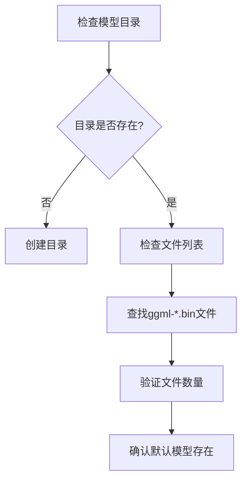
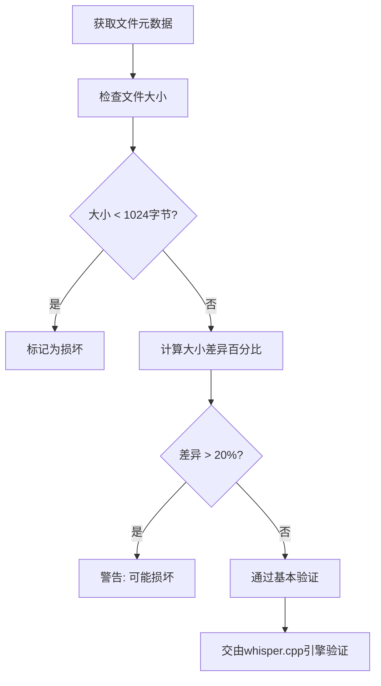
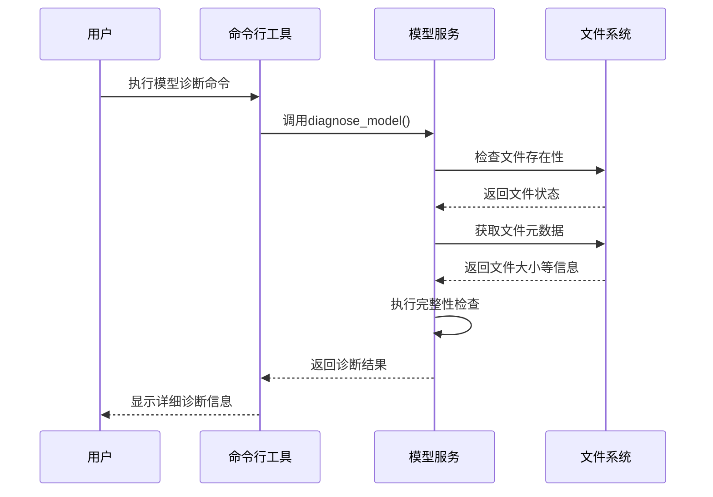
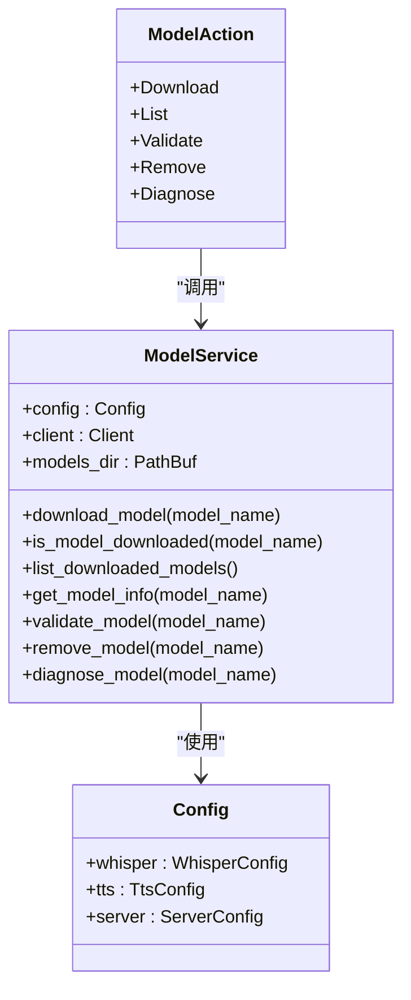

# 模型加载失败诊断

<cite>
**本文档引用文件**   
- [model_service.rs](file://voice-cli/src/services/model_service.rs)
- [MODEL_VALIDATION_FIX.md](file://voice-cli/MODEL_VALIDATION_FIX.md)
- [model.rs](file://voice-cli/src/cli/model.rs)
- [config.yml](file://voice-cli/config.yml)
</cite>

## 目录
1. [简介](#简介)
2. [常见故障类型](#常见故障类型)
3. [日志关键字分析](#日志关键字分析)
4. [模型目录结构检查](#模型目录结构检查)
5. [文件完整性与版本兼容性](#文件完整性与版本兼容性)
6. [环境变量与详细日志](#环境变量与详细日志)
7. [典型错误堆栈与修复建议](#典型错误堆栈与修复建议)
8. [诊断工具使用指南](#诊断工具使用指南)
9. [结论](#结论)

## 简介
本文档旨在建立系统化的模型加载失败诊断流程，涵盖文件缺失、格式错误、权限不足等常见问题。通过分析代码库中的实现逻辑，提供完整的故障排查方案，帮助用户快速定位并解决模型加载问题。

## 常见故障类型

模型加载失败通常由以下几种原因导致：

- **文件缺失**：模型文件未下载或被意外删除
- **文件损坏**：下载过程中断导致文件不完整
- **权限不足**：程序无权读取模型文件
- **路径配置错误**：模型目录路径配置不正确
- **版本不兼容**：模型文件与当前系统版本不匹配

**Section sources**
- [model_service.rs](file://voice-cli/src/services/model_service.rs#L230-L271)
- [config.yml](file://voice-cli/config.yml#L1-L100)

## 日志关键字分析

当模型加载失败时，系统会输出特定的错误信息，以下是关键日志关键字及其含义解析：

- **"Failed to read model file"**：无法读取模型文件，可能是权限问题或文件被占用
- **"Model file too small"**：模型文件大小异常，通常小于1KB，表明文件不完整
- **"Model not found"**：指定的模型文件不存在
- **"File is not readable"**：文件存在但程序无读取权限
- **"Model validation failed"**：模型验证失败，可能文件损坏

这些日志信息可以帮助快速定位故障点，建议在排查问题时首先检查日志输出。

**Section sources**
- [model_service.rs](file://voice-cli/src/services/model_service.rs#L273-L309)
- [model_service.rs](file://voice-cli/src/services/model_service.rs#L448-L493)

## 模型目录结构检查

正确的模型目录结构对于模型加载至关重要。根据配置文件，模型默认存储在`./models`目录下，文件命名遵循`ggml-{model_name}.bin`格式。

**Diagram sources**
- [config.yml](file://voice-cli/config.yml#L1-L100)
- [model_service.rs](file://voice-cli/src/services/model_service.rs#L230-L271)

**Section sources**
- [config.yml](file://voice-cli/config.yml#L1-L100)
- [model_service.rs](file://voice-cli/src/services/model_service.rs#L230-L271)

## 文件完整性与版本兼容性

文件完整性检查主要通过文件大小验证来实现。系统为不同型号的模型预设了预期大小，实际文件大小与预期值差异超过20%时会发出警告。

**Diagram sources**
- [model_service.rs](file://voice-cli/src/services/model_service.rs#L273-L309)
- [MODEL_VALIDATION_FIX.md](file://voice-cli/MODEL_VALIDATION_FIX.md#L0-L65)

**Section sources**
- [model_service.rs](file://voice-cli/src/services/model_service.rs#L273-L309)
- [MODEL_VALIDATION_FIX.md](file://voice-cli/MODEL_VALIDATION_FIX.md#L0-L65)

## 环境变量与详细日志

通过设置环境变量可以启用详细日志输出，帮助诊断问题。建议将日志级别设置为"debug"或"trace"以获取更多信息。

**Diagram sources**
- [model_service.rs](file://voice-cli/src/services/model_service.rs#L413-L493)
- [model.rs](file://voice-cli/src/cli/model.rs#L203-L241)

**Section sources**
- [model_service.rs](file://voice-cli/src/services/model_service.rs#L413-L493)
- [model.rs](file://voice-cli/src/cli/model.rs#L203-L241)

## 典型错误堆栈与修复建议

### 路径配置错误
**现象**：模型文件实际存在于其他位置，但程序在默认路径下查找失败。

**修复建议**：
1. 检查`config.yml`中的`whisper.models_dir`配置
2. 确保路径正确且程序有读写权限
3. 使用绝对路径避免相对路径问题

### 依赖库缺失
**现象**：模型文件完整但无法加载，通常与whisper.cpp引擎相关。

**修复建议**：
1. 确认Python环境已正确安装
2. 检查CUDA环境配置（如使用GPU加速）
3. 验证相关依赖库版本兼容性

**Section sources**
- [config.yml](file://voice-cli/config.yml#L1-L100)
- [model_service.rs](file://voice-cli/src/services/model_service.rs#L86-L123)

## 诊断工具使用指南

系统提供了完整的模型管理命令行工具，主要命令包括：

- `voice-cli model download {model_name}`：下载指定模型
- `voice-cli model list`：列出所有可用和已下载的模型
- `voice-cli model validate`：验证已下载模型的完整性
- `voice-cli model remove {model_name}`：删除指定模型
- `voice-cli model diagnose {model_name}`：诊断模型问题并提供修复建议

**Diagram sources**
- [model_service.rs](file://voice-cli/src/services/model_service.rs#L0-L522)
- [model.rs](file://voice-cli/src/cli/model.rs#L0-L242)
- [model_service.rs](file://voice-cli/src/services/model_service.rs#L65-L90)

**Section sources**
- [model_service.rs](file://voice-cli/src/services/model_service.rs#L0-L522)
- [model.rs](file://voice-cli/src/cli/model.rs#L0-L242)
- [model_service.rs](file://voice-cli/src/services/model_service.rs#L65-L90)

## 结论

通过系统化的诊断流程，可以有效解决模型加载失败问题。关键在于：
1. 首先检查日志中的关键字定位问题类型
2. 验证模型目录结构和文件完整性
3. 使用诊断工具获取详细信息
4. 根据具体错误采取相应的修复措施

建议定期使用`voice-cli model validate`命令检查模型状态，预防潜在问题。