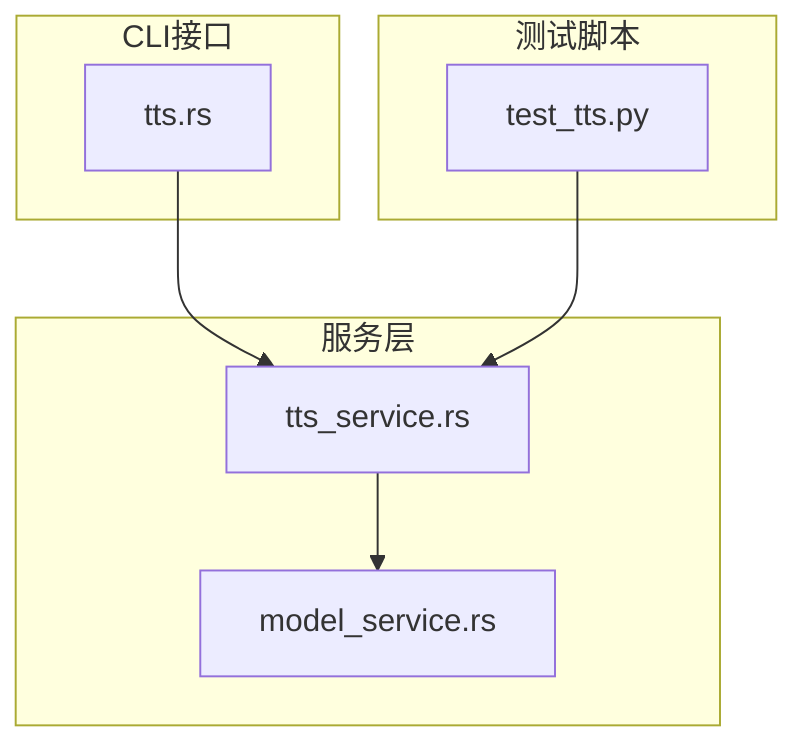
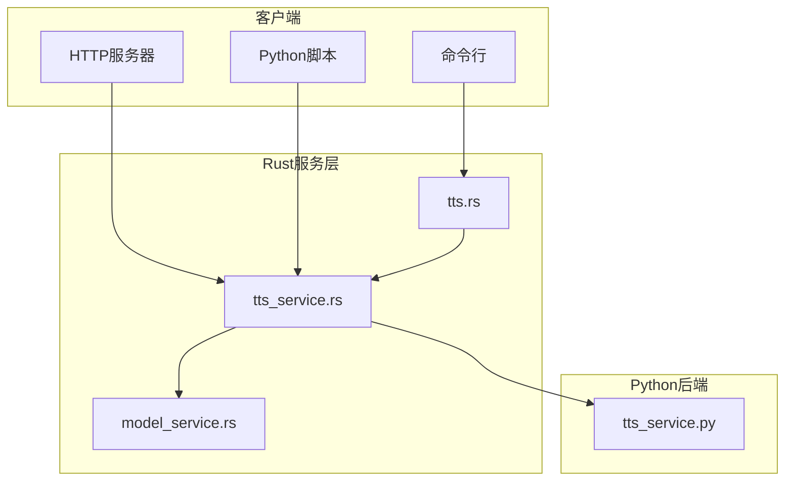
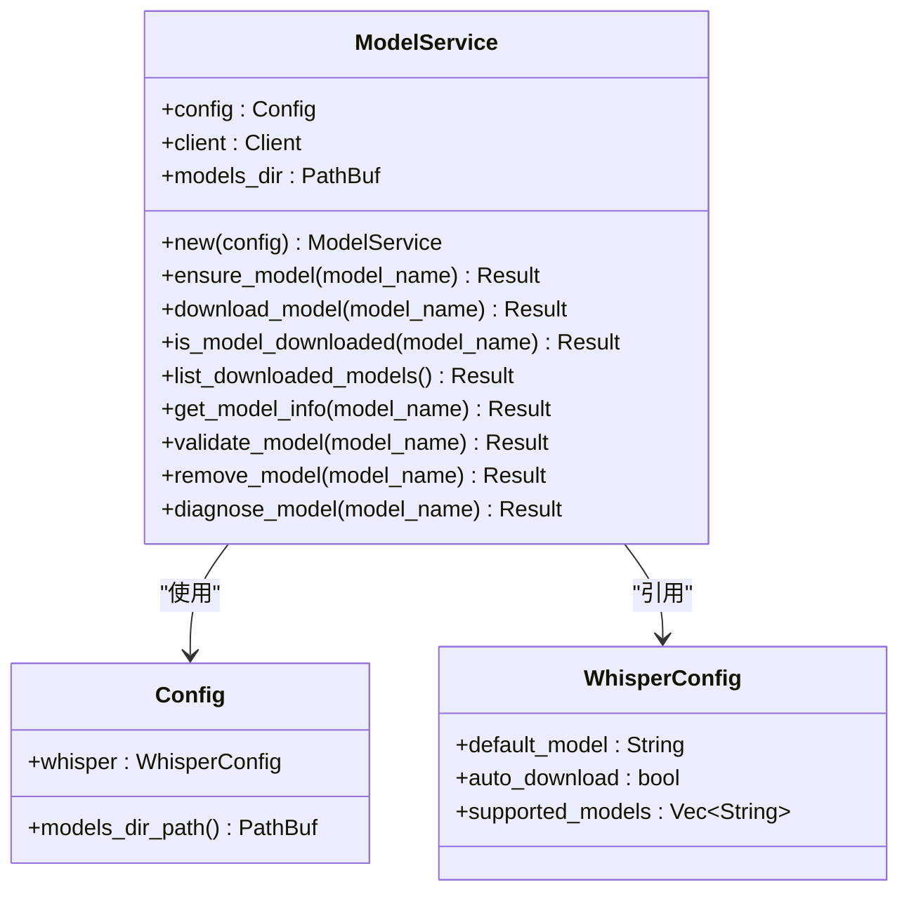
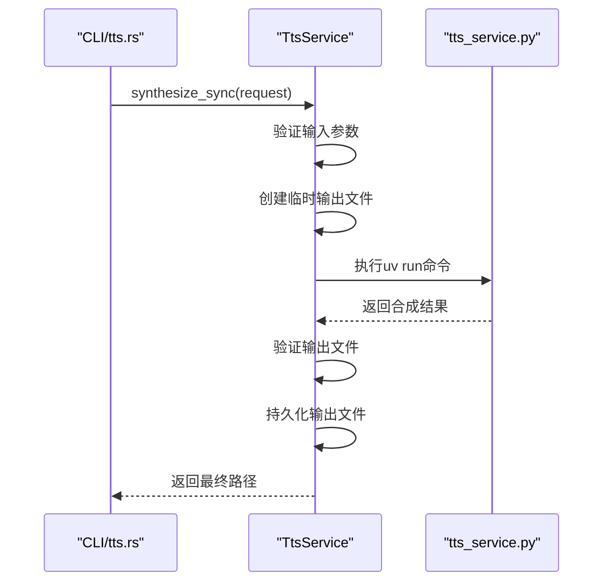
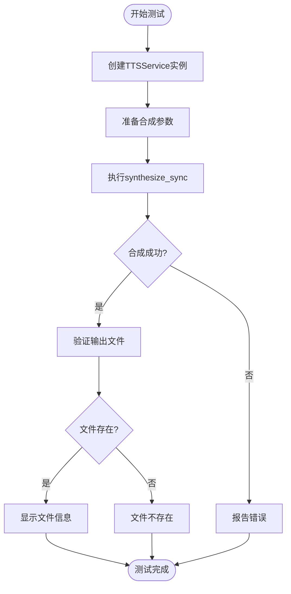
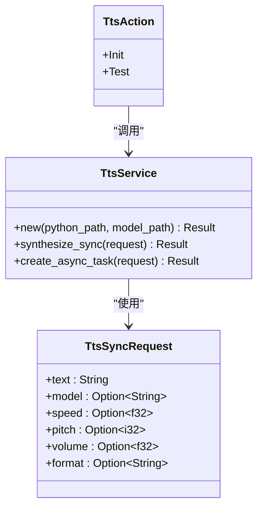
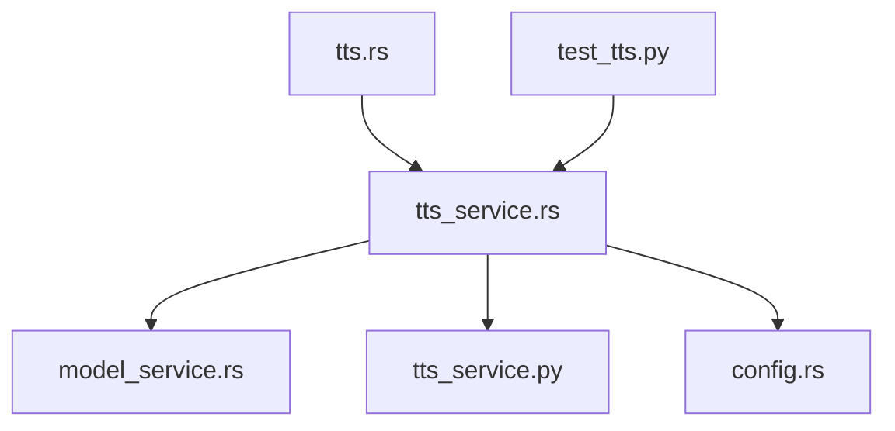
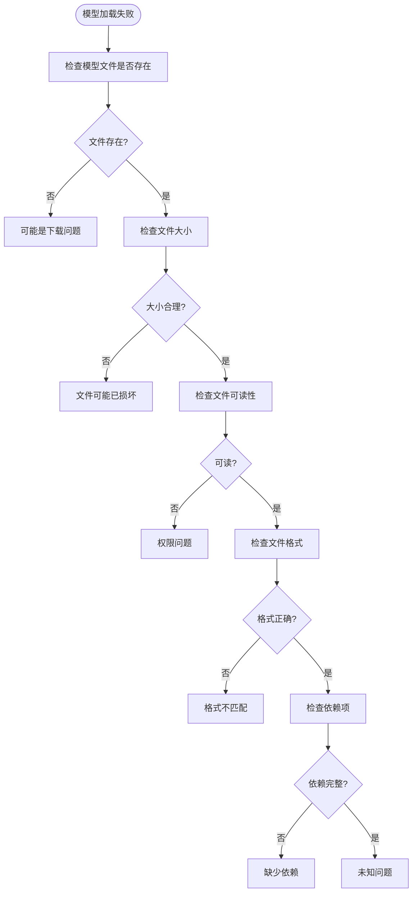

# 模型服务集成

<cite>
**本文档引用的文件**   
- [model_service.rs](file://voice-cli/src/services/model_service.rs)
- [tts_service.rs](file://voice-cli/src/services/tts_service.rs)
- [test_tts.py](file://voice-cli/fixtures/test_tts.py)
- [tts.rs](file://voice-cli/src/cli/tts.rs)
</cite>

## 目录
1. [简介](#简介)
2. [项目结构](#项目结构)
3. [核心组件](#核心组件)
4. [架构概述](#架构概述)
5. [详细组件分析](#详细组件分析)
6. [依赖分析](#依赖分析)
7. [性能考虑](#性能考虑)
8. [故障排除指南](#故障排除指南)
9. [结论](#结论)

## 简介
本文档详细说明了 `model_service.rs` 如何加载和管理本地TTS模型（如IndexTTS），包括模型缓存、版本控制与热更新机制。描述了 `tts_service.rs` 提供的高层接口如何被CLI和HTTP服务器调用。结合 `test_tts.py` 示例脚本，展示如何通过Python客户端发送文本请求并接收音频响应。解释CLI模块中 `tts.rs` 如何解析命令行参数并调用服务层完成同步/异步语音合成。提供模型加载失败的诊断流程与日志分析方法。

## 项目结构
本项目采用模块化设计，主要分为CLI、服务层、模型定义和测试脚本等部分。TTS相关功能集中在 `voice-cli` 子目录下，包含服务实现、命令行接口和测试用例。

**图示来源**
- [tts.rs](file://voice-cli/src/cli/tts.rs)
- [tts_service.rs](file://voice-cli/src/services/tts_service.rs)
- [model_service.rs](file://voice-cli/src/services/model_service.rs)
- [test_tts.py](file://voice-cli/fixtures/test_tts.py)

**章节来源**
- [tts.rs](file://voice-cli/src/cli/tts.rs)
- [tts_service.rs](file://voice-cli/src/services/tts_service.rs)

## 核心组件
文档的核心组件包括模型管理服务、TTS服务、CLI命令处理器和Python测试脚本。这些组件协同工作，实现了完整的文本到语音转换功能。

**章节来源**
- [model_service.rs](file://voice-cli/src/services/model_service.rs#L1-L522)
- [tts_service.rs](file://voice-cli/src/services/tts_service.rs#L1-L287)

## 架构概述
系统采用分层架构，从CLI或HTTP接口接收请求，通过TTS服务协调模型管理，最终调用Python后端完成语音合成。模型服务负责模型的下载、验证和缓存管理。

**图示来源**
- [tts.rs](file://voice-cli/src/cli/tts.rs)
- [tts_service.rs](file://voice-cli/src/services/tts_service.rs)
- [model_service.rs](file://voice-cli/src/services/model_service.rs)

## 详细组件分析

### 模型服务分析
`model_service.rs` 负责管理TTS模型的生命周期，包括下载、验证、缓存和诊断。

#### 模型加载与管理

**图示来源**
- [model_service.rs](file://voice-cli/src/services/model_service.rs#L1-L522)
- [config.rs](file://voice-cli/src/config.rs)

**章节来源**
- [model_service.rs](file://voice-cli/src/services/model_service.rs#L1-L522)

### TTS服务分析
`tts_service.rs` 提供高层TTS接口，处理同步和异步语音合成请求。

#### 服务接口与调用流程

**图示来源**
- [tts_service.rs](file://voice-cli/src/services/tts_service.rs#L1-L287)
- [tts.rs](file://voice-cli/src/cli/tts.rs#L1-L123)

**章节来源**
- [tts_service.rs](file://voice-cli/src/services/tts_service.rs#L1-L287)

### Python客户端分析
`test_tts.py` 展示了如何通过Python脚本调用TTS服务。

#### Python调用流程

**图示来源**
- [test_tts.py](file://voice-cli/fixtures/test_tts.py#L1-L63)

**章节来源**
- [test_tts.py](file://voice-cli/fixtures/test_tts.py#L1-L63)

### CLI命令分析
`tts.rs` 处理命令行参数并调用服务层。

#### 命令处理逻辑

**图示来源**
- [tts.rs](file://voice-cli/src/cli/tts.rs#L1-L123)
- [tts_service.rs](file://voice-cli/src/services/tts_service.rs#L1-L287)

**章节来源**
- [tts.rs](file://voice-cli/src/cli/tts.rs#L1-L123)

## 依赖分析
系统组件间存在明确的依赖关系，确保功能的正确实现和调用。

**图示来源**
- [tts.rs](file://voice-cli/src/cli/tts.rs)
- [tts_service.rs](file://voice-cli/src/services/tts_service.rs)
- [model_service.rs](file://voice-cli/src/services/model_service.rs)
- [config.rs](file://voice-cli/src/config.rs)

**章节来源**
- [tts.rs](file://voice-cli/src/cli/tts.rs#L1-L123)
- [tts_service.rs](file://voice-cli/src/services/tts_service.rs#L1-L287)

## 性能考虑
- 模型下载支持进度跟踪和断点续传
- TTS合成使用临时文件避免中间状态污染
- 输出文件持久化到专用目录便于管理
- 异步任务支持预估处理时间
- 模型缓存减少重复下载开销

## 故障排除指南
当模型加载失败时，可按以下流程进行诊断：

**章节来源**
- [model_service.rs](file://voice-cli/src/services/model_service.rs#L1-L522)
- [tts_service.rs](file://voice-cli/src/services/tts_service.rs#L1-L287)

## 结论
本文档详细分析了TTS模型服务的架构和实现。`model_service.rs` 提供了完整的模型生命周期管理，`tts_service.rs` 封装了高层接口，CLI和Python脚本提供了多种调用方式。系统设计考虑了缓存、错误处理和诊断能力，确保了稳定可靠的语音合成服务。