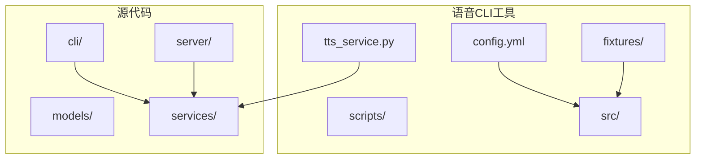
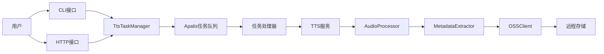
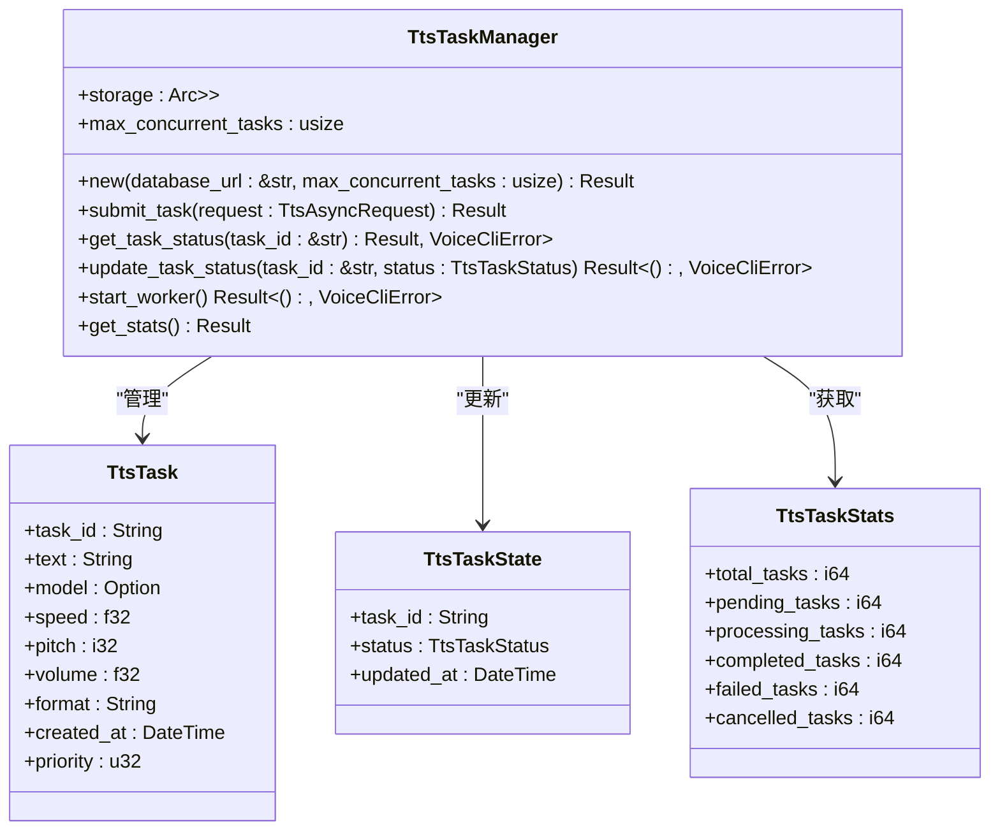
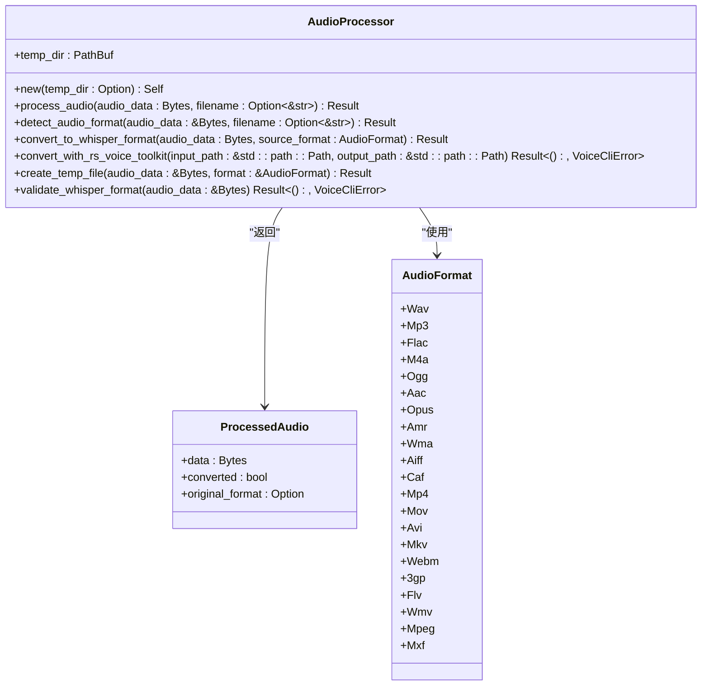
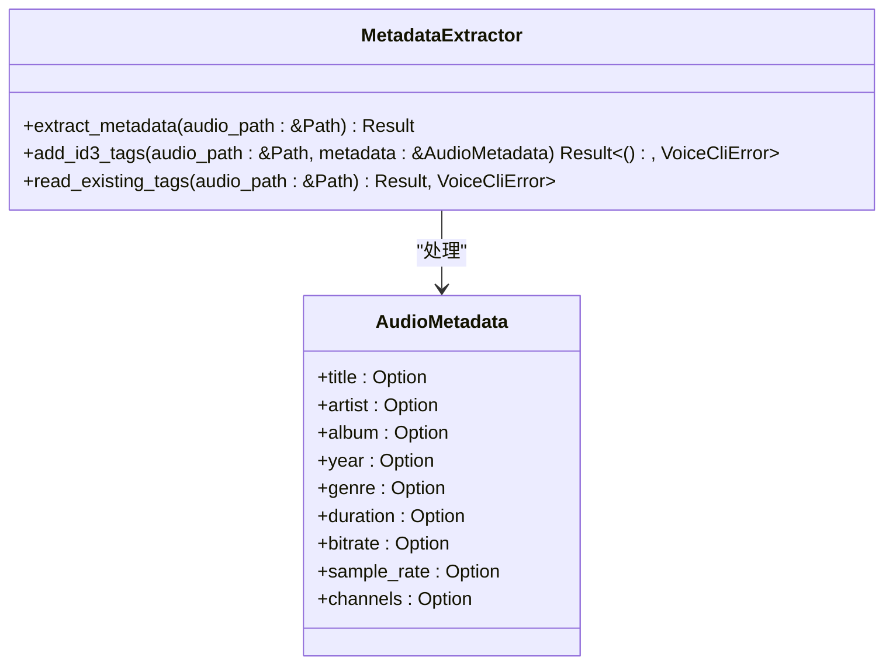
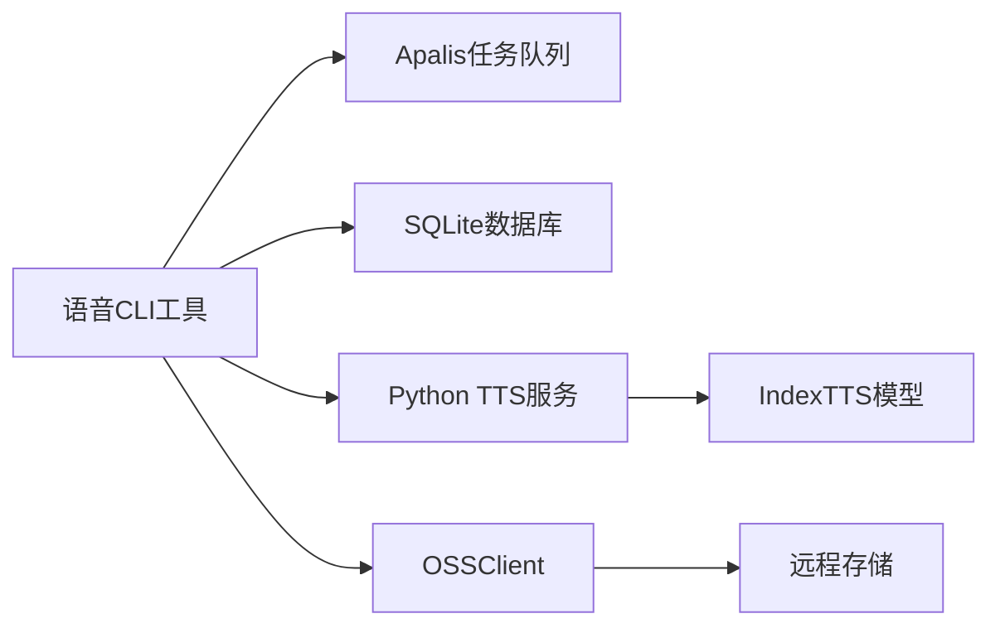

# 语音CLI工具

<cite>
**本文档中引用的文件**  
- [config.yml](file://voice-cli/config.yml)
- [test_tts.py](file://voice-cli/fixtures/test_tts.py)
- [tts_task_manager.rs](file://voice-cli/src/services/tts_task_manager.rs)
- [audio_processor.rs](file://voice-cli/src/services/audio_processor.rs)
- [metadata_extractor.rs](file://voice-cli/src/services/metadata_extractor.rs)
- [tts.rs](file://voice-cli/src/cli/tts.rs)
- [tts_service.py](file://voice-cli/tts_service.py)
</cite>

## 目录
1. [简介](#简介)
2. [项目结构](#项目结构)
3. [核心组件](#核心组件)
4. [架构概述](#架构概述)
5. [详细组件分析](#详细组件分析)
6. [依赖分析](#依赖分析)
7. [性能考虑](#性能考虑)
8. [故障排除指南](#故障排除指南)
9. [结论](#结论)

## 简介
语音CLI工具是一个基于命令行的文本转语音（TTS）接口，支持通过配置文件设置TTS模型路径、音频输出格式（如MP3、WAV）和采样率。该工具通过与Apalis任务队列集成，实现异步语音合成任务的提交与状态追踪。生成的音频流由AudioProcessor处理，并通过MetadataExtractor添加ID3标签等元数据。结合test_tts.py示例，用户可通过HTTP请求触发语音合成任务并监听SteppedTask状态变更。此外，该工具还支持与OSSClient集成，自动上传生成的音频文件。

## 项目结构
语音CLI工具的项目结构清晰，主要包含配置文件、脚本、源代码和服务组件。核心功能位于`voice-cli`目录下，包括配置文件`config.yml`、测试脚本`test_tts.py`以及源代码目录`src`。源代码目录进一步划分为CLI接口、模型定义、服务器逻辑和服务组件。

**Diagram sources**
- [config.yml](file://voice-cli/config.yml)
- [src](file://voice-cli/src)

**Section sources**
- [config.yml](file://voice-cli/config.yml)
- [src](file://voice-cli/src)

## 核心组件
语音CLI工具的核心组件包括TtsTaskManager、AudioProcessor、MetadataExtractor和OSSClient集成模块。这些组件协同工作，实现从文本输入到音频输出的完整流程。

**Section sources**
- [tts_task_manager.rs](file://voice-cli/src/services/tts_task_manager.rs)
- [audio_processor.rs](file://voice-cli/src/services/audio_processor.rs)
- [metadata_extractor.rs](file://voice-cli/src/services/metadata_extractor.rs)

## 架构概述
语音CLI工具采用模块化架构，各组件通过清晰的接口进行通信。用户通过CLI或HTTP接口提交TTS任务，任务被提交到Apalis任务队列中。TtsTaskManager负责管理任务的生命周期，包括提交、状态查询和结果存储。AudioProcessor负责处理生成的音频流，确保其符合目标格式要求。MetadataExtractor为音频文件添加ID3标签等元数据。最后，OSSClient负责将生成的音频文件上传到远程存储。

**Diagram sources**
- [tts_task_manager.rs](file://voice-cli/src/services/tts_task_manager.rs)
- [audio_processor.rs](file://voice-cli/src/services/audio_processor.rs)
- [metadata_extractor.rs](file://voice-cli/src/services/metadata_extractor.rs)
- [tts_service.py](file://voice-cli/tts_service.py)

## 详细组件分析

### TtsTaskManager分析
TtsTaskManager是语音CLI工具的核心组件之一，负责管理TTS任务的生命周期。它与Apalis任务队列协同工作，实现异步任务的提交与状态追踪。

#### 类图

**Diagram sources**
- [tts_task_manager.rs](file://voice-cli/src/services/tts_task_manager.rs)

**Section sources**
- [tts_task_manager.rs](file://voice-cli/src/services/tts_task_manager.rs)

### AudioProcessor分析
AudioProcessor负责处理生成的音频流，确保其符合目标格式要求。它支持多种音频格式的检测和转换，并能验证音频文件是否符合Whisper系统的格式要求。

#### 类图

**Diagram sources**
- [audio_processor.rs](file://voice-cli/src/services/audio_processor.rs)

**Section sources**
- [audio_processor.rs](file://voice-cli/src/services/audio_processor.rs)

### MetadataExtractor分析
MetadataExtractor为生成的音频文件添加ID3标签等元数据，增强文件的可管理性和可识别性。

#### 类图

**Diagram sources**
- [metadata_extractor.rs](file://voice-cli/src/services/metadata_extractor.rs)

**Section sources**
- [metadata_extractor.rs](file://voice-cli/src/services/metadata_extractor.rs)

## 依赖分析
语音CLI工具依赖多个外部组件和库，包括Apalis任务队列、SQLite数据库、Python TTS服务和OSSClient。这些依赖通过清晰的接口进行集成，确保系统的可维护性和可扩展性。

**Diagram sources**
- [tts_task_manager.rs](file://voice-cli/src/services/tts_task_manager.rs)
- [config.yml](file://voice-cli/config.yml)
- [tts_service.py](file://voice-cli/tts_service.py)

**Section sources**
- [tts_task_manager.rs](file://voice-cli/src/services/tts_task_manager.rs)
- [config.yml](file://voice-cli/config.yml)
- [tts_service.py](file://voice-cli/tts_service.py)

## 性能考虑
语音CLI工具在设计时充分考虑了性能因素。通过Apalis任务队列实现异步处理，避免阻塞主线程。AudioProcessor采用高效的音频转换算法，并利用临时文件减少内存占用。TtsTaskManager通过SQLite数据库持久化任务状态，确保系统重启后任务不丢失。此外，配置文件中的`max_concurrent_tasks`参数允许用户根据硬件资源调整并发任务数，优化系统性能。

## 故障排除指南
当语音CLI工具出现问题时，可参考以下步骤进行排查：

1. 检查配置文件`config.yml`中的路径是否正确，特别是`python_path`和`model_path`。
2. 确认Python环境已正确安装，并且TTS服务脚本可执行。
3. 检查SQLite数据库文件是否存在，以及是否有足够的写入权限。
4. 查看日志文件以获取详细的错误信息。
5. 使用`test_tts.py`脚本验证基本功能是否正常。

**Section sources**
- [config.yml](file://voice-cli/config.yml)
- [test_tts.py](file://voice-cli/fixtures/test_tts.py)
- [tts_task_manager.rs](file://voice-cli/src/services/tts_task_manager.rs)

## 结论
语音CLI工具提供了一个功能完整、架构清晰的文本转语音解决方案。通过合理的模块划分和依赖管理，该工具实现了高效、可靠的语音合成服务。其与Apalis任务队列和OSSClient的集成，进一步增强了系统的异步处理能力和云存储支持。未来可考虑增加更多音频格式支持、优化音频转换算法以及增强错误处理机制。