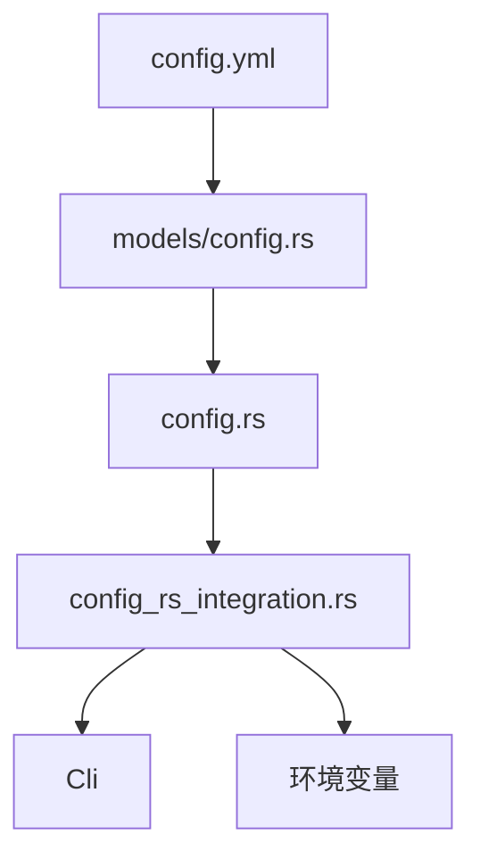
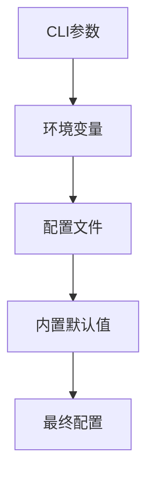
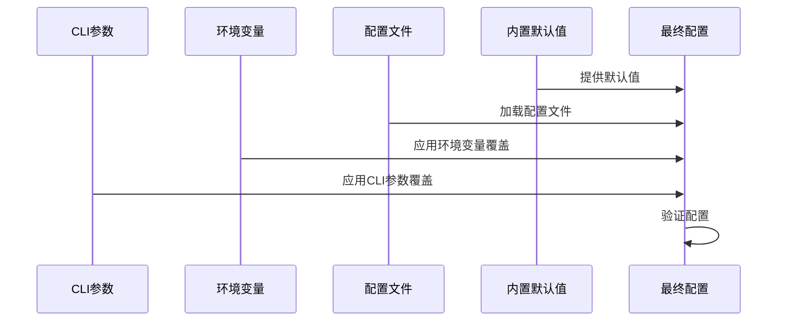
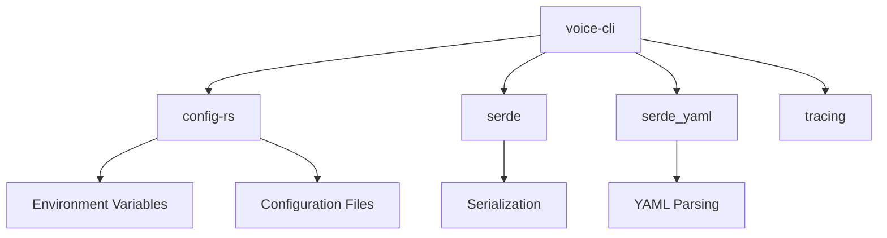

# 配置管理

<cite>
**本文档中引用的文件**  
- [config.yml](file://voice-cli/config.yml)
- [config.rs](file://voice-cli/src/config.rs)
- [models/config.rs](file://voice-cli/src/models/config.rs)
- [config_rs_integration.rs](file://voice-cli/src/config_rs_integration.rs)
</cite>

## 目录
1. [简介](#简介)
2. [项目结构](#项目结构)
3. [核心组件](#核心组件)
4. [架构概述](#架构概述)
5. [详细组件分析](#详细组件分析)
6. [依赖分析](#依赖分析)
7. [性能考虑](#性能考虑)
8. [故障排除指南](#故障排除指南)
9. [结论](#结论)

## 简介
本文档详细说明语音CLI工具的配置系统，涵盖`config.yml`中各项参数的含义与使用方法，包括TTS模型路径、音频输出格式（MP3/WAV）、采样率、OSS上传配置、任务队列连接参数等。解释`config.rs`如何通过`config_rs_integration`实现配置的层级加载与环境变量覆盖机制。结合实际配置示例，展示开发、测试、生产环境的不同配置模式。说明如何通过中间件配置启用HTTP追踪、请求日志和超时控制。提供常见配置错误的排查方法。

## 项目结构
语音CLI工具的配置系统主要由`config.yml`配置文件、`src/models/config.rs`中的配置结构体定义、`src/config.rs`中的配置加载逻辑以及`src/config_rs_integration.rs`中的层级配置集成组成。配置文件位于项目根目录，模型和日志目录默认为相对路径。



**Diagram sources**
- [config.yml](file://voice-cli/config.yml)
- [config.rs](file://voice-cli/src/config.rs)
- [models/config.rs](file://voice-cli/src/models/config.rs)
- [config_rs_integration.rs](file://voice-cli/src/config_rs_integration.rs)

**Section sources**
- [config.yml](file://voice-cli/config.yml)
- [config.rs](file://voice-cli/src/config.rs)

## 核心组件
配置系统的核心组件包括`Config`结构体，它定义了服务器、Whisper转录、TTS、日志、守护进程和任务管理等模块的配置参数。`ConfigRsLoader`负责实现配置的层级加载，支持CLI参数、环境变量和配置文件的优先级覆盖。

**Section sources**
- [models/config.rs](file://voice-cli/src/models/config.rs#L1-L720)
- [config_rs_integration.rs](file://voice-cli/src/config_rs_integration.rs#L1-L227)

## 架构概述
配置系统采用分层加载机制，优先级从高到低为：CLI参数 > 环境变量 > 配置文件 > 内置默认值。`config-rs`库用于实现配置的合并与解析，`serde`用于序列化和反序列化YAML配置文件。



**Diagram sources**
- [config_rs_integration.rs](file://voice-cli/src/config_rs_integration.rs#L1-L227)

## 详细组件分析

### 配置参数详解
#### 服务器配置
```yaml
server:
  host: "0.0.0.0"
  port: 8080
  max_file_size: 209715200
  cors_enabled: true
```
- **host**: 服务器绑定地址，0.0.0.0表示监听所有接口
- **port**: 服务器端口
- **max_file_size**: 上传文件最大大小（字节）
- **cors_enabled**: 是否启用CORS

#### TTS配置
```yaml
tts:
  python_path: ".venv/bin/python"
  model_path: "./checkpoints"
  default_model: "default"
  supported_formats: ["mp3", "wav"]
  max_text_length: 5000
  default_speed: 1.0
  default_pitch: 0
  default_volume: 1.0
  timeout_seconds: 300
  script_path: "tts_service.py"
```
- **python_path**: Python解释器路径
- **model_path**: TTS模型路径
- **default_model**: 默认语音模型
- **supported_formats**: 支持的音频格式
- **max_text_length**: 最大文本长度
- **default_speed**: 默认语速（0.5-2.0）
- **default_pitch**: 默认音调（-20到20）
- **default_volume**: 默认音量（0.5-2.0）
- **timeout_seconds**: TTS处理超时时间（秒）

#### 任务管理配置
```yaml
task_management:
  max_concurrent_tasks: 4
  retry_attempts: 2
  task_timeout_seconds: 3600
  catch_panic: true
  task_retention_minutes: 1440
  sqlite_db_path: "./data/tasks.db"
```
- **max_concurrent_tasks**: 最大并发任务数
- **retry_attempts**: 任务失败重试次数
- **task_timeout_seconds**: 任务处理超时时间（秒）
- **catch_panic**: 是否捕获执行中的panic
- **task_retention_minutes**: 任务保留时间（分钟）
- **sqlite_db_path**: SQLite数据库文件路径

### 配置加载机制
#### 层级加载与环境变量覆盖
`ConfigRsLoader`实现配置的层级加载，支持环境变量覆盖。环境变量前缀为`VOICE_CLI_`，例如`VOICE_CLI_PORT`覆盖`server.port`。



**Diagram sources**
- [config_rs_integration.rs](file://voice-cli/src/config_rs_integration.rs#L1-L227)

#### 环境变量映射
| 配置项 | 环境变量 | 说明 |
|--------|----------|------|
| server.host | VOICE_CLI_HOST | 服务器主机 |
| server.port | VOICE_CLI_PORT | 服务器端口 |
| logging.level | VOICE_CLI_LOG_LEVEL | 日志级别 |
| whisper.default_model | VOICE_CLI_DEFAULT_MODEL | 默认模型 |
| task_management.max_concurrent_tasks | VOICE_CLI_MAX_CONCURRENT_TASKS | 最大并发任务数 |

**Section sources**
- [config_rs_integration.rs](file://voice-cli/src/config_rs_integration.rs#L1-L227)

### 中间件配置
通过中间件可以启用HTTP追踪、请求日志和超时控制。相关配置在`src/server/middleware_config.rs`中定义，通过`server/middleware.rs`加载。

**Section sources**
- [src/server/middleware_config.rs](file://voice-cli/src/server/middleware_config.rs)
- [src/server/middleware.rs](file://voice-cli/src/server/middleware.rs)

## 依赖分析
配置系统依赖`config-rs`库进行配置管理，`serde`和`serde_yaml`用于序列化，`tracing`用于日志记录。`config-rs`提供环境变量和配置文件的合并功能。



**Diagram sources**
- [Cargo.toml](file://voice-cli/Cargo.toml)
- [config_rs_integration.rs](file://voice-cli/src/config_rs_integration.rs)

## 性能考虑
配置系统在启动时一次性加载和验证所有配置，避免运行时解析开销。使用`config-rs`的缓存机制提高配置访问性能。任务队列的缓冲区大小和并发数可根据系统资源调整以优化性能。

## 故障排除指南
#### 常见配置错误
- **配置文件不存在**: 系统会生成默认配置文件
- **环境变量格式错误**: 检查环境变量值是否符合预期类型
- **路径不存在**: 确保日志目录、模型目录等路径存在
- **端口被占用**: 更改`server.port`配置

#### 验证配置
使用`config.validate()`方法验证配置的正确性，确保所有必需字段都已正确设置。

**Section sources**
- [models/config.rs](file://voice-cli/src/models/config.rs#L1-L720)

## 结论
语音CLI工具的配置系统提供了灵活的配置管理机制，支持多层级配置加载和环境变量覆盖。通过合理的配置，可以适应开发、测试和生产环境的不同需求。建议在生产环境中使用环境变量覆盖敏感配置，如数据库连接信息。