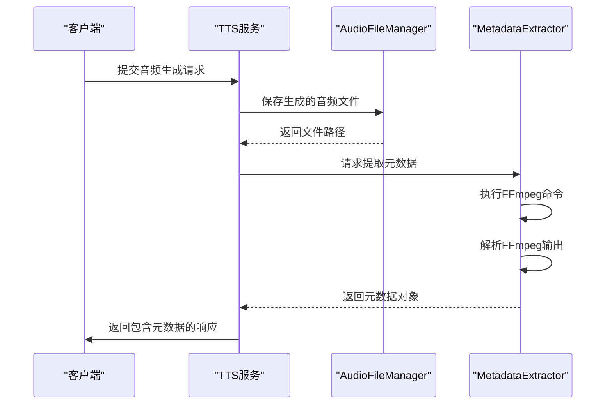
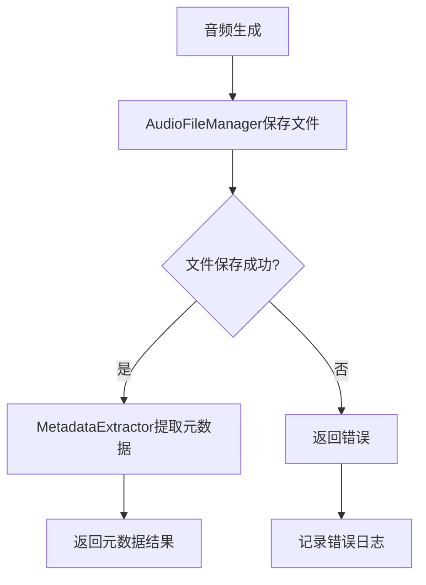
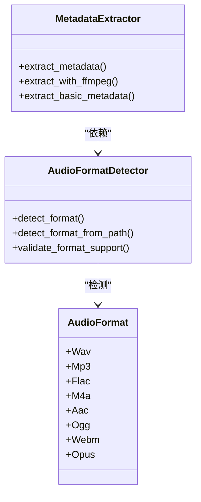

# 元数据提取与注入

<cite>
**本文档引用的文件**   
- [metadata_extractor.rs](file://voice-cli/src/services/metadata_extractor.rs)
- [audio_file_manager.rs](file://voice-cli/src/services/audio_file_manager.rs)
- [audio_format_detector.rs](file://voice-cli/src/services/audio_format_detector.rs)
</cite>

## 目录
1. [引言](#引言)
2. [核心组件](#核心组件)
3. [元数据注入机制](#元数据注入机制)
4. [协作关系分析](#协作关系分析)
5. [格式兼容性注意事项](#格式兼容性注意事项)
6. [常见问题排查](#常见问题排查)
7. [结论](#结论)

## 引言
本项目中的元数据处理系统主要由`MetadataExtractor`和`AudioFileManager`两个核心服务构成，负责音频文件的元数据提取、持久化存储和格式管理。系统通过FFmpeg和Symphonia等工具链实现对多种音频容器格式的支持，确保在音频文件生成后能够正确注入ID3v2标签等元数据信息。该文档详细描述了元数据提取与注入的完整流程、组件间的协作机制以及不同音频格式的兼容性处理策略。

## 核心组件

`MetadataExtractor`服务负责从音频文件中提取详细的音视频元数据信息，包括文件格式、时长、码率、采样率等关键属性。该服务优先使用FFmpeg进行元数据提取，当FFmpeg不可用时则回退到基础提取方法。`AudioFileManager`服务则负责音频文件在磁盘上的存储管理，提供文件保存、删除、清理等生命周期管理功能。

**Section sources**
- [metadata_extractor.rs](file://voice-cli/src/services/metadata_extractor.rs#L1-L50)
- [audio_file_manager.rs](file://voice-cli/src/services/audio_file_manager.rs#L1-L50)

## 元数据注入机制

### 元数据来源
元数据主要来源于两个渠道：一是通过FFmpeg命令行工具解析音频文件的元数据信息，二是通过基础文件属性提取。当使用FFmpeg时，系统会执行`ffmpeg -i`命令并解析其stderr输出，从中提取时长、音频编码、采样率、声道数等信息。

**Diagram sources **
- [metadata_extractor.rs](file://voice-cli/src/services/metadata_extractor.rs#L61-L92)
- [audio_file_manager.rs](file://voice-cli/src/services/audio_file_manager.rs#L51-L92)

### 写入时机
元数据的提取和注入发生在音频文件生成后的处理流程中。具体来说，当`AudioFileManager`成功保存音频文件后，系统会立即调用`MetadataExtractor::extract_metadata`方法来提取元数据。这个过程是异步进行的，不会阻塞主请求处理流程。

**Section sources**
- [metadata_extractor.rs](file://voice-cli/src/services/metadata_extractor.rs#L61-L92)
- [audio_file_manager.rs](file://voice-cli/src/services/audio_file_manager.rs#L51-L92)

## 协作关系分析

### 组件交互流程
`MetadataExtractor`与`AudioFileManager`通过文件路径进行协作。`AudioFileManager`负责将音频文件持久化到磁盘，并返回文件路径；`MetadataExtractor`则根据该路径读取文件内容并提取元数据。这种设计实现了关注点分离，使得文件存储和元数据提取可以独立演进。

**Diagram sources **
- [audio_file_manager.rs](file://voice-cli/src/services/audio_file_manager.rs#L51-L92)
- [metadata_extractor.rs](file://voice-cli/src/services/metadata_extractor.rs#L61-L92)

### 一致性保证
系统通过以下机制确保元数据持久化的一致性：首先，`AudioFileManager`在保存文件时会记录详细的日志信息，包括原始文件名、任务ID和目标路径；其次，`MetadataExtractor`在提取元数据前会验证文件是否存在且非空；最后，整个流程采用异步处理模式，即使元数据提取失败也不会影响主流程的完成。

**Section sources**
- [audio_file_manager.rs](file://voice-cli/src/services/audio_file_manager.rs#L89-L122)
- [metadata_extractor.rs](file://voice-cli/src/services/metadata_extractor.rs#L61-L92)

## 格式兼容性注意事项

### 支持的音频容器格式
系统支持多种音频容器格式，包括MP3、M4A、WAV、FLAC、OGG等。对于不同格式，系统采用不同的处理策略：
- **MP3**: 通过ID3v2标签支持元数据注入
- **M4A**: 利用MP4容器的元数据轨道
- **WAV**: 使用RIFF INFO块存储元数据
- **FLAC**: 通过Vorbis评论字段

**Diagram sources **
- [audio_format_detector.rs](file://voice-cli/src/services/audio_format_detector.rs#L38-L66)
- [metadata_extractor.rs](file://voice-cli/src/services/metadata_extractor.rs#L61-L92)

### 兼容性处理策略
系统采用多层次的格式检测策略：首先使用Symphonia库进行深度探测，然后回退到infer库的魔数检测，最后使用文件扩展名作为最后手段。这种分层策略确保了即使文件扩展名不正确，也能正确识别文件的真实格式。

**Section sources**
- [audio_format_detector.rs](file://voice-cli/src/services/audio_format_detector.rs#L38-L66)
- [metadata_extractor.rs](file://voice-cli/src/services/metadata_extractor.rs#L233-L270)

## 常见问题排查

### 标签读取失败的可能原因
1. **FFmpeg未安装或不可用**: 系统会回退到基础提取方法，但功能受限
2. **文件权限问题**: 确保服务有读取音频文件的权限
3. **文件损坏**: 文件可能不完整或已损坏
4. **格式不支持**: 某些特殊编码格式可能无法正确解析

### 排查方案
1. 检查系统日志中是否有"FFmpeg执行失败"等相关错误信息
2. 验证音频文件是否可以被其他播放器正常打开
3. 确认FFmpeg是否正确安装且在系统路径中
4. 检查文件的魔数签名是否与声明的格式一致

**Section sources**
- [metadata_extractor.rs](file://voice-cli/src/services/metadata_extractor.rs#L61-L92)
- [audio_format_detector.rs](file://voice-cli/src/services/audio_format_detector.rs#L287-L326)

## 结论
`MetadataExtractor`和`AudioFileManager`共同构成了一个健壮的音频元数据处理系统。通过合理的职责划分和错误处理机制，系统能够在各种环境下稳定运行。对于ID3v2标签的注入，系统依赖FFmpeg的强大功能来确保元数据的准确性和完整性。建议在生产环境中确保FFmpeg的正确安装，并定期检查日志以监控元数据提取的成功率。