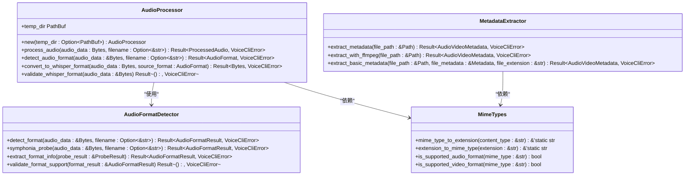
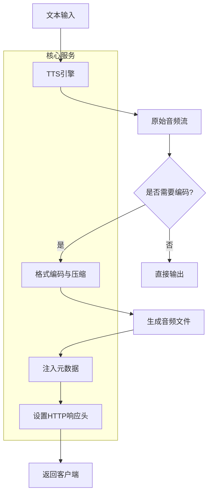
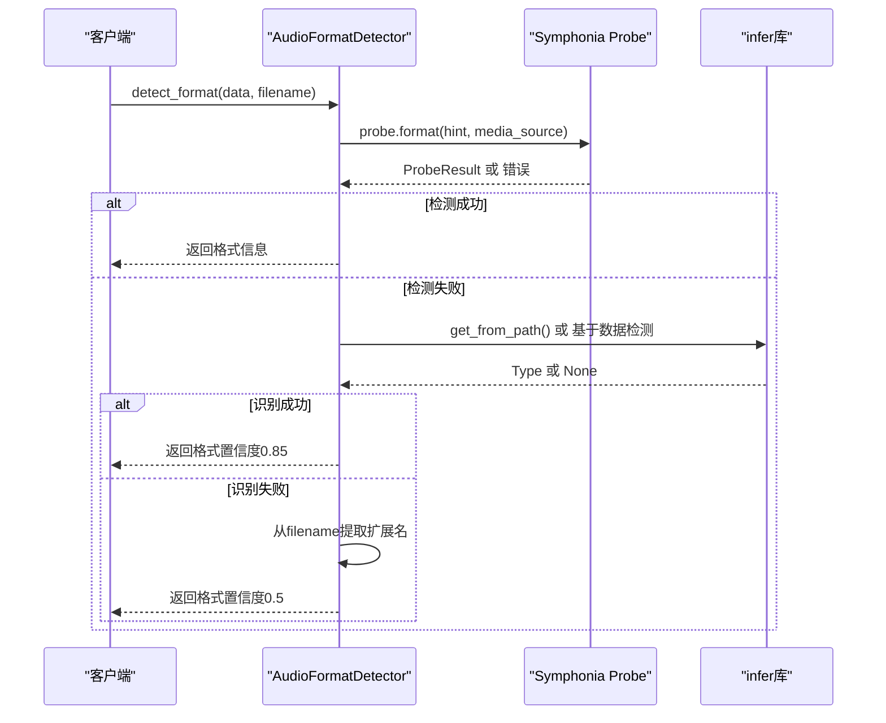
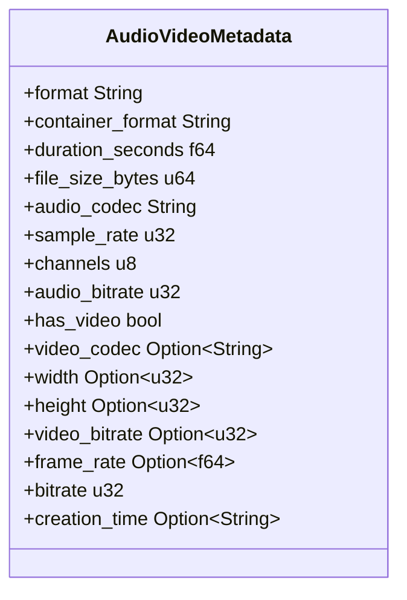
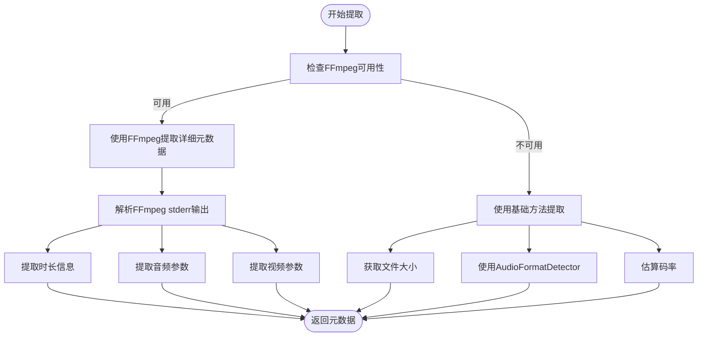

# 音频处理与元数据

<cite>
**本文档引用的文件**  
- [audio_processor.rs](file://voice-cli/src/services/audio_processor.rs)
- [audio_format_detector.rs](file://voice-cli/src/services/audio_format_detector.rs)
- [metadata_extractor.rs](file://voice-cli/src/services/metadata_extractor.rs)
- [mime_types.rs](file://voice-cli/src/utils/mime_types.rs)
</cite>

## 目录
1. [引言](#引言)
2. [核心组件分析](#核心组件分析)
3. [音频处理流水线架构](#音频处理流水线架构)
4. [音频格式检测机制](#音频格式检测机制)
5. [元数据提取与注入](#元数据提取与注入)
6. [MIME类型映射与Content-Type设置](#mime类型映射与content-type设置)
7. [性能优化建议](#性能优化建议)
8. [常见格式兼容性问题与解决方案](#常见格式兼容性问题与解决方案)
9. [结论](#结论)

## 引言
本项目实现了一个完整的音频处理系统，核心功能包括：通过TTS引擎生成原始音频流并进行格式编码与压缩、基于文件头或扩展名识别音频格式、为音频文件注入ID3标签等元数据、以及根据MIME类型正确设置HTTP响应的Content-Type。该系统广泛应用于语音合成、音频转录和多媒体服务场景。

## 核心组件分析

### AudioProcessor 音频处理器
`AudioProcessor` 是音频处理的核心服务，负责将输入音频转换为Whisper兼容格式（16kHz、单声道、16位PCM WAV），并调用TTS引擎生成音频流。



**图示来源**  
- [audio_processor.rs](file://voice-cli/src/services/audio_processor.rs#L26-L313)
- [audio_format_detector.rs](file://voice-cli/src/services/audio_format_detector.rs#L20-L327)
- [metadata_extractor.rs](file://voice-cli/src/services/metadata_extractor.rs#L20-L353)
- [mime_types.rs](file://voice-cli/src/utils/mime_types.rs#L10-L230)

**本节来源**  
- [audio_processor.rs](file://voice-cli/src/services/audio_processor.rs#L26-L313)

## 音频处理流水线架构



**图示来源**  
- [audio_processor.rs](file://voice-cli/src/services/audio_processor.rs#L26-L313)
- [tts_service.rs](file://voice-cli/src/services/tts_service.rs#L177-L205)

## 音频格式检测机制

### 检测流程
`AudioFormatDetector` 使用多级检测策略：

1. **Symphonia探针**：主检测方法，解析音频容器格式
2. **infer库**：基于“魔数”进行文件类型识别
3. **文件扩展名**：作为最后的回退机制



**图示来源**  
- [audio_format_detector.rs](file://voice-cli/src/services/audio_format_detector.rs#L20-L327)

**本节来源**  
- [audio_format_detector.rs](file://voice-cli/src/services/audio_format_detector.rs#L20-L327)

## 元数据提取与注入

### 元数据结构
`AudioVideoMetadata` 结构体包含音频/视频文件的完整元数据：



### 提取流程


**图示来源**  
- [metadata_extractor.rs](file://voice-cli/src/services/metadata_extractor.rs#L20-L353)

**本节来源**  
- [metadata_extractor.rs](file://voice-cli/src/services/metadata_extractor.rs#L20-L353)

## MIME类型映射与Content-Type设置

### 映射机制
系统通过 `mime_types.rs` 模块实现MIME类型与文件扩展名的双向映射。

```mermaid
classDiagram
class MimeTypesUtils {
+mime_type_to_extension(content_type : &str) &'static str
+extension_to_mime_type(extension : &str) &'static str
+get_file_extension(content_type : &str, url : &str) &'static str
+is_supported_audio_format(mime_type : &str) bool
+is_supported_media_format(mime_type : &str) bool
}
MimeTypesUtils : 支持的音频类型 :
MimeTypesUtils : - audio/mpeg → mp3
MimeTypesUtils : - audio/wav → wav
MimeTypesUtils : - audio/flac → flac
MimeTypesUtils : - audio/ogg → ogg
MimeTypesUtils : - audio/aac → aac
MimeTypesUtils : - audio/opus → opus
MimeTypesUtils : 支持的视频类型 :
MimeTypesUtils : - video/mp4 → mp4
MimeTypesUtils : - video/webm → webm
MimeTypesUtils : - video/x-matroska → mkv
```

### HTTP响应设置
当服务返回音频文件时，会根据文件扩展名查询对应的MIME类型，并设置 `Content-Type` 头部。

**本节来源**  
- [mime_types.rs](file://voice-cli/src/utils/mime_types.rs#L10-L230)

## 性能优化建议

### 1. 缓存频繁访问的元数据
对于经常访问的音频文件，可将提取的元数据缓存到Redis或内存中，避免重复调用FFmpeg。

### 2. 并行处理多个音频文件
使用Tokio任务池并行处理多个音频转码请求，提高吞吐量。

### 3. 减少临时文件I/O
尽量在内存中完成音频处理，减少对磁盘临时文件的读写操作。

### 4. 预加载常用模型
TTS和语音识别模型较大，建议在服务启动时预加载，避免首次请求延迟过高。

### 5. 使用更高效的音频编解码器
对于内部处理，可考虑使用Opus等高效编解码器减少带宽和存储开销。

## 常见格式兼容性问题与解决方案

### 1. MP3文件ID3标签干扰
**问题**：某些MP3文件的ID3v2标签会影响格式检测。
**解决方案**：在检测前跳过ID3标签头部，或使用Symphonia等专业库进行解析。

### 2. 非标准WAV头
**问题**：部分WAV文件头不符合标准，导致解析失败。
**解决方案**：增强WAV头验证逻辑，允许一定程度的非标准格式。

### 3. 缺失文件扩展名
**问题**：URL中无扩展名时难以确定输出格式。
**解决方案**：结合Content-Type头部和URL路径智能推断扩展名。

### 4. 不支持的编码格式
**问题**：如ALAC、WMA等格式可能不被支持。
**解决方案**：明确列出支持的格式，在文档中说明，并返回清晰的错误信息。

### 5. 大文件处理超时
**问题**：长音频文件处理时间过长导致超时。
**解决方案**：提供异步API，返回任务ID供客户端轮询状态。

## 结论
本系统通过 `AudioProcessor`、`AudioFormatDetector`、`MetadataExtractor` 和 `mime_types` 四个核心模块，构建了一个健壮的音频处理流水线。系统采用多级检测策略确保格式识别的准确性，利用FFmpeg实现高质量元数据提取，并通过精确的MIME类型映射保证HTTP响应的正确性。建议在生产环境中实施缓存、并行处理等优化措施，以提升系统性能和用户体验。