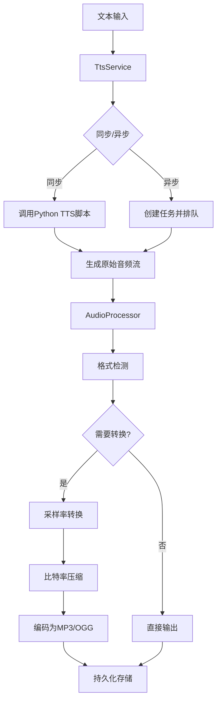
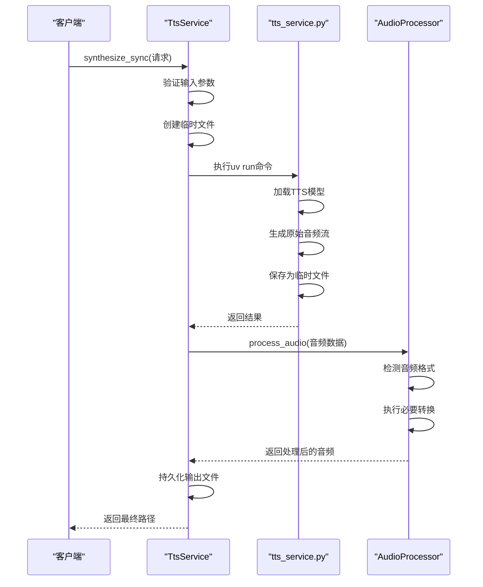
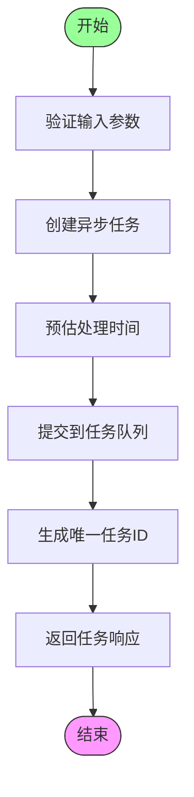
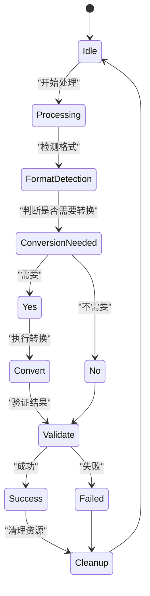
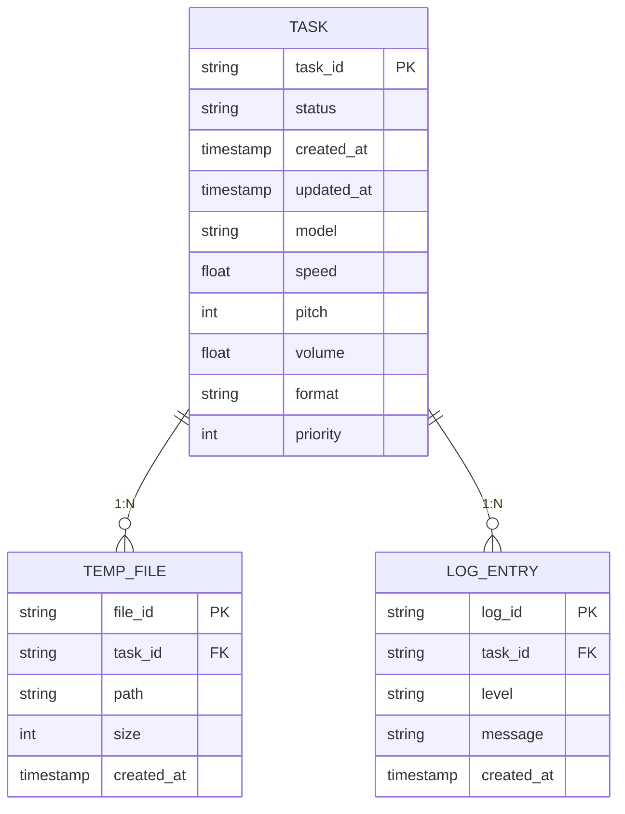

# 音频处理流水线

<cite>
**本文档引用的文件**
- [audio_processor.rs](file://voice-cli/src/services/audio_processor.rs)
- [tts_service.rs](file://voice-cli/src/services/tts_service.rs)
- [tts_service.py](file://voice-cli/tts_service.py)
</cite>

## 目录
1. [简介](#简介)
2. [核心组件](#核心组件)
3. [音频处理架构](#音频处理架构)
4. [TTS引擎协同工作模式](#tts引擎协同工作模式)
5. [异步处理与缓冲策略](#异步处理与缓冲策略)
6. [内存管理与错误恢复](#内存管理与错误恢复)
7. [高并发性能调优](#高并发性能调优)
8. [结论](#结论)

## 简介
本文档深入阐述了AudioProcessor如何协调TTS引擎生成原始音频流，并执行后续编码、采样率转换与比特率压缩的完整流程。重点分析了异步处理中的缓冲策略、内存管理与错误恢复机制，结合tts_service.rs说明语音合成与音频编码的协同工作模式，并提供高并发场景下的性能调优建议。

## 核心组件

本系统的核心音频处理功能由AudioProcessor和TtsService两个主要组件构成。AudioProcessor负责音频格式检测、转换和验证，确保音频数据符合后续处理要求。TtsService则负责协调TTS引擎执行文本到语音的转换任务。

**Section sources**
- [audio_processor.rs](file://voice-cli/src/services/audio_processor.rs#L0-L314)
- [tts_service.rs](file://voice-cli/src/services/tts_service.rs#L0-L287)

## 音频处理架构

**Diagram sources**
- [audio_processor.rs](file://voice-cli/src/services/audio_processor.rs#L0-L314)
- [tts_service.rs](file://voice-cli/src/services/tts_service.rs#L0-L287)

## TTS引擎协同工作模式

TtsService通过调用外部Python脚本与TTS引擎进行交互，实现文本到语音的转换。该服务首先验证输入参数，然后创建临时文件用于存储生成的音频数据。

**Diagram sources**
- [tts_service.rs](file://voice-cli/src/services/tts_service.rs#L0-L287)
- [tts_service.py](file://voice-cli/tts_service.py#L0-L428)

**Section sources**
- [tts_service.rs](file://voice-cli/src/services/tts_service.rs#L0-L287)
- [tts_service.py](file://voice-cli/tts_service.py#L0-L428)

## 异步处理与缓冲策略

系统采用异步任务模式处理TTS请求，通过任务队列管理并发请求。每个任务在执行时都会创建独立的临时文件进行缓冲，避免内存溢出。

**Diagram sources**
- [tts_service.rs](file://voice-cli/src/services/tts_service.rs#L177-L205)
- [audio_processor.rs](file://voice-cli/src/services/audio_processor.rs#L266-L313)

**Section sources**
- [tts_service.rs](file://voice-cli/src/services/tts_service.rs#L177-L205)
- [audio_processor.rs](file://voice-cli/src/services/audio_processor.rs#L266-L313)

## 内存管理与错误恢复

系统通过临时文件和流式处理实现高效的内存管理。所有音频处理都在临时目录中进行，处理完成后自动清理资源。错误恢复机制包括参数验证、格式检测和异常捕获。

**Diagram sources**
- [audio_processor.rs](file://voice-cli/src/services/audio_processor.rs#L0-L314)
- [tts_service.rs](file://voice-cli/src/services/tts_service.rs#L0-L287)

**Section sources**
- [audio_processor.rs](file://voice-cli/src/services/audio_processor.rs#L0-L314)
- [tts_service.rs](file://voice-cli/src/services/tts_service.rs#L0-L287)

## 高并发性能调优

为应对高并发场景，系统采用以下性能优化策略：使用无锁任务管理器、预估处理时间、合理设置超时机制和资源池化。

**Diagram sources**
- [tts_service.rs](file://voice-cli/src/services/tts_service.rs#L0-L287)
- [audio_processor.rs](file://voice-cli/src/services/audio_processor.rs#L0-L314)

**Section sources**
- [tts_service.rs](file://voice-cli/src/services/tts_service.rs#L0-L287)
- [audio_processor.rs](file://voice-cli/src/services/audio_processor.rs#L0-L314)

## 结论
本系统通过AudioProcessor和TtsService的协同工作，实现了高效的音频处理流水线。采用异步处理模式和合理的缓冲策略，确保了系统在高并发场景下的稳定性和性能。完善的错误恢复机制和内存管理策略进一步提升了系统的可靠性。