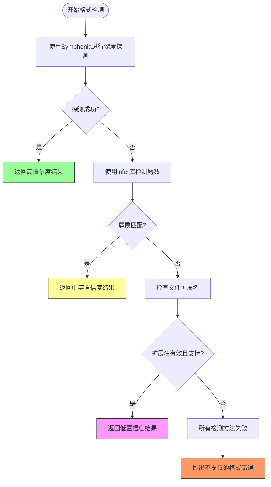
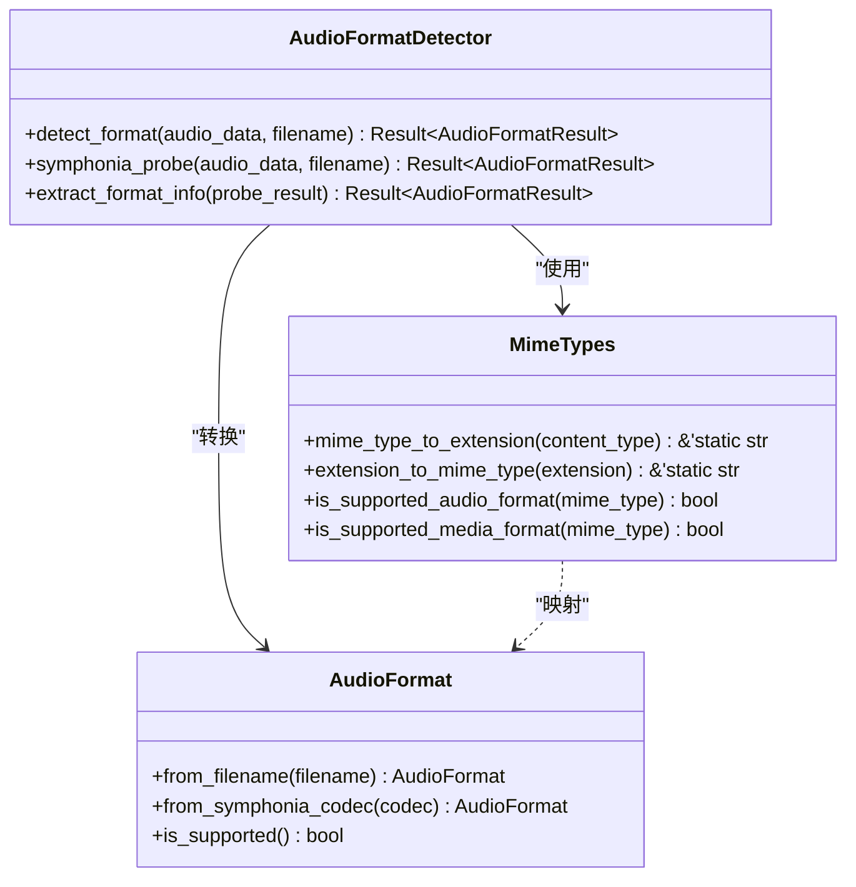
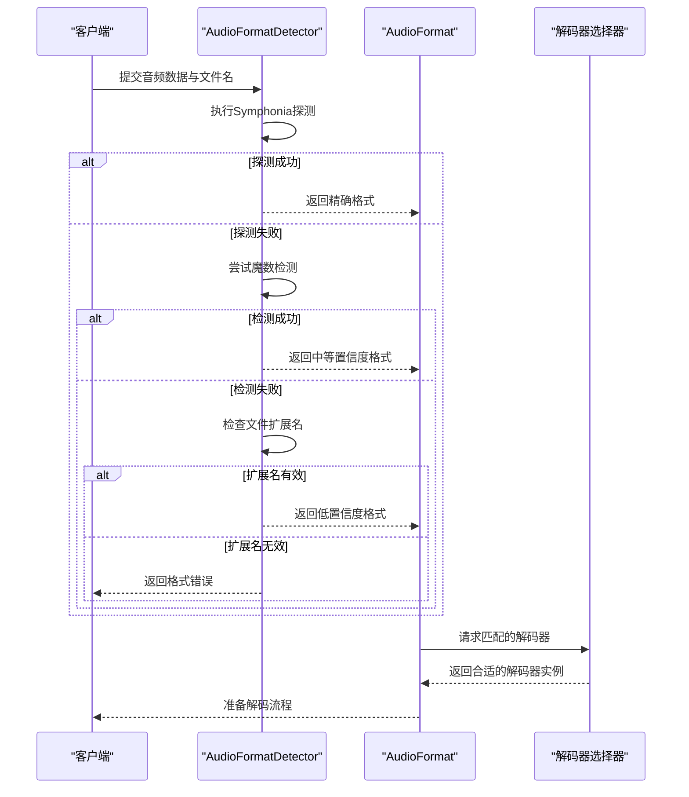
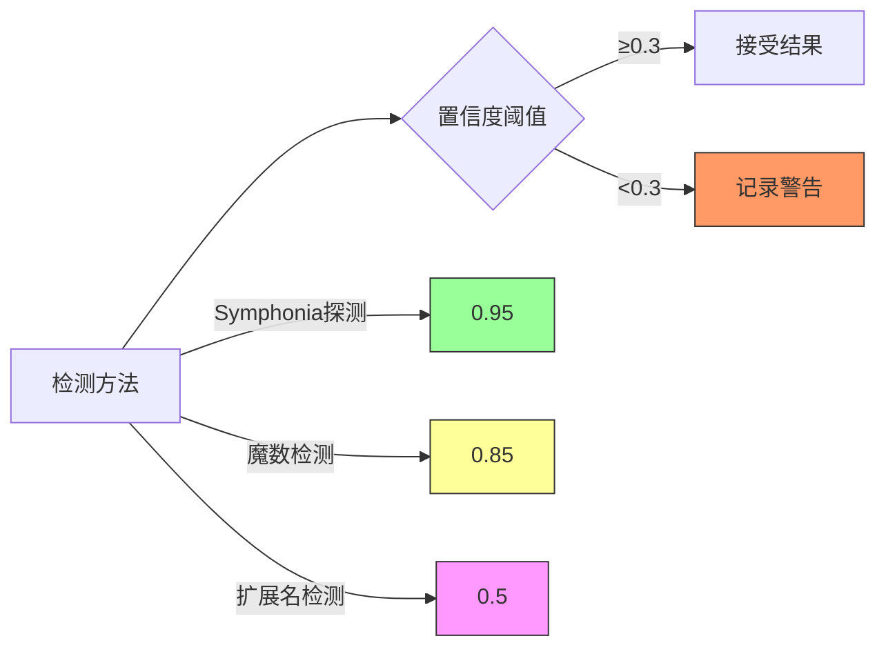

# 音频格式检测

<cite>
**本文档中引用的文件**   
- [audio_format_detector.rs](file://voice-cli/src/services/audio_format_detector.rs)
- [mime_types.rs](file://voice-cli/src/utils/mime_types.rs)
</cite>

## 目录
1. [简介](#简介)
2. [核心组件](#核心组件)
3. [格式检测机制](#格式检测机制)
4. [MIME类型映射集成](#mime类型映射集成)
5. [解码器选择策略](#解码器选择策略)
6. [模糊与未知格式处理](#模糊与未知格式处理)
7. [调试方法](#调试方法)
8. [扩展自定义格式](#扩展自定义格式)

## 简介
本系统通过双重机制实现音频格式的智能识别：基于文件魔数（magic number）的二进制签名检测和文件扩展名分析。系统优先使用Symphonia库进行深度格式探测，结合infer库的魔数识别能力，并通过文件扩展名作为降级检测手段。检测结果与MIME类型映射表集成，确保格式识别的准确性，并为后续的解码器选择提供可靠依据。

## 核心组件

**Section sources**
- [audio_format_detector.rs](file://voice-cli/src/services/audio_format_detector.rs#L1-L328)
- [mime_types.rs](file://voice-cli/src/utils/mime_types.rs#L1-L231)

## 格式检测机制
系统采用分层检测策略，按优先级顺序执行多种检测方法：



**Diagram sources**
- [audio_format_detector.rs](file://voice-cli/src/services/audio_format_detector.rs#L45-L85)

### 主要检测方法
1. **Symphonia探测**：作为主要检测方法，通过分析音频数据的容器格式和编解码器参数进行精确识别
2. **魔数检测**：利用infer库读取文件头部的二进制签名，匹配已知格式的魔数特征
3. **扩展名检测**：当上述方法失败时，根据文件扩展名进行格式推断

**Section sources**
- [audio_format_detector.rs](file://voice-cli/src/services/audio_format_detector.rs#L45-L85)

## MIME类型映射集成
系统通过`mime_types.rs`文件中的映射表实现格式与MIME类型的双向转换，确保跨系统兼容性。



**Diagram sources**
- [mime_types.rs](file://voice-cli/src/utils/mime_types.rs#L1-L231)
- [audio_format_detector.rs](file://voice-cli/src/services/audio_format_detector.rs#L1-L328)

### MIME类型映射表
系统维护了完整的音视频格式MIME类型映射关系，支持主流音频格式的识别与转换。

| MIME类型 | 文件扩展名 | 支持状态 |
|---------|-----------|---------|
| audio/mpeg | mp3 | 支持 |
| audio/wav | wav | 支持 |
| audio/flac | flac | 支持 |
| audio/mp4 | m4a | 支持 |
| audio/ogg | ogg | 支持 |
| audio/aac | aac | 支持 |
| audio/opus | opus | 支持 |
| audio/webm | webm | 支持 |
| audio/x-ms-wma | wma | 支持 |
| audio/x-aiff | aiff | 支持 |
| audio/x-caf | caf | 支持 |

**Section sources**
- [mime_types.rs](file://voice-cli/src/utils/mime_types.rs#L1-L231)

## 解码器选择策略
系统根据格式检测结果中的`AudioFormat`枚举值选择相应的解码器，确保正确的音频处理流程。



**Diagram sources**
- [audio_format_detector.rs](file://voice-cli/src/services/audio_format_detector.rs#L45-L85)

## 模糊与未知格式处理
系统实现了完善的降级策略和错误处理机制，确保在格式识别不确定时仍能提供合理的处理方案。

### 置信度分级
系统为不同检测方法分配不同的置信度权重：
- Symphonia探测：0.95（高置信度）
- 魔数检测：0.85（中等置信度）
- 文件扩展名：0.5（低置信度）

当置信度低于0.3时，系统会记录警告日志，提示检测结果可能不可靠。



**Diagram sources**
- [audio_format_detector.rs](file://voice-cli/src/services/audio_format_detector.rs#L185-L210)

**Section sources**
- [audio_format_detector.rs](file://voice-cli/src/services/audio_format_detector.rs#L185-L210)

## 调试方法
当音频格式识别失败时，可采用以下调试步骤定位问题：

### 常见问题排查
1. **检查文件完整性**：确保音频文件未损坏，能够被标准播放器正常播放
2. **验证文件头部**：使用十六进制编辑器检查文件魔数是否符合预期格式
3. **确认扩展名匹配**：确保文件扩展名与实际格式一致
4. **查看日志输出**：检查系统日志中关于格式检测的详细信息

### 调试工具建议
- 使用`hexdump`或类似工具查看文件前几个字节的魔数
- 通过`ffprobe`等专业工具验证音频文件的元数据
- 启用系统详细日志模式，获取完整的检测流程信息

**Section sources**
- [audio_format_detector.rs](file://voice-cli/src/services/audio_format_detector.rs#L45-L85)
- [mime_types.rs](file://voice-cli/src/utils/mime_types.rs#L1-L231)

## 扩展自定义格式
系统设计支持通过修改MIME类型映射表来扩展对自定义音频格式的支持。

### 扩展步骤
1. 在`mime_types.rs`中添加新的MIME类型与扩展名映射
2. 更新`AudioFormat`枚举以支持新格式
3. 确保Symphonia库支持新格式的探测
4. 添加相应的解码器实现

### 修改示例
要添加对新格式`audio/custom`的支持，需在`mime_types.rs`中添加：
```rust
"audio/custom" => "cust",
```

并在`extension_to_mime_type`函数中添加：
```rust
"cust" => "audio/custom",
```

**Section sources**
- [mime_types.rs](file://voice-cli/src/utils/mime_types.rs#L1-L231)