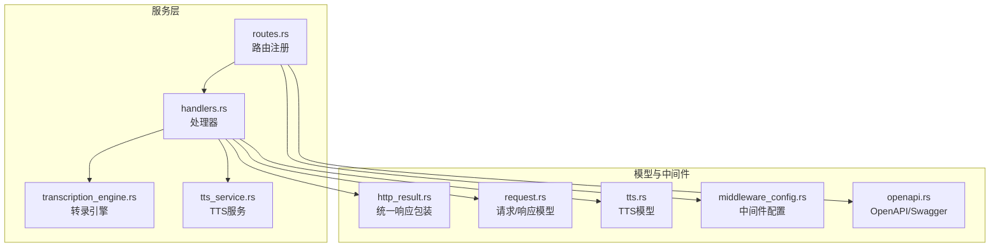
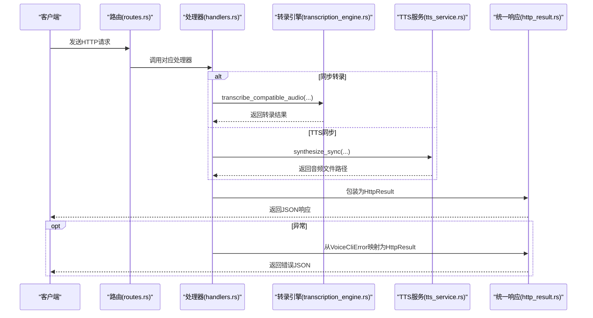
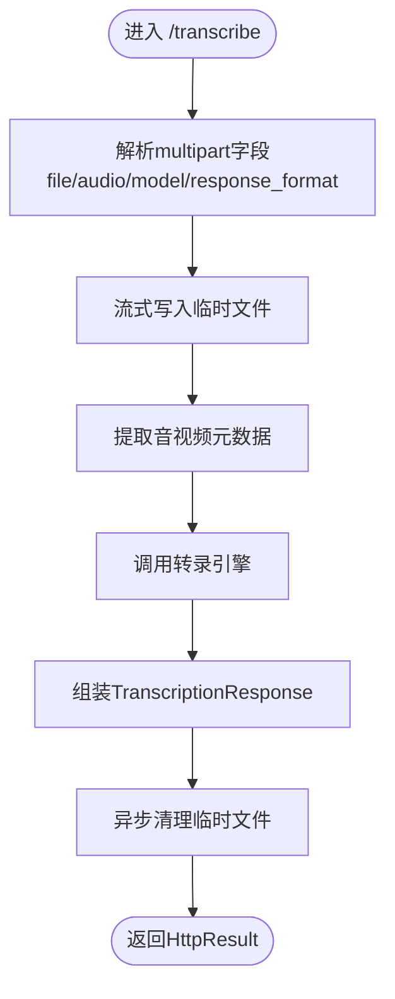
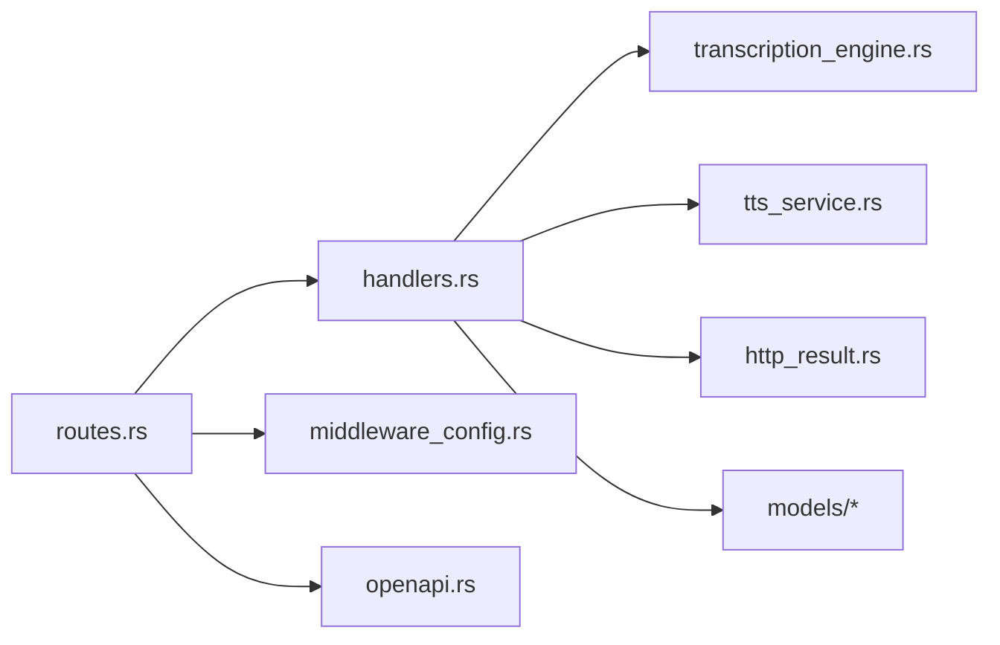

# API接口

<cite>
**本文引用的文件**
- [routes.rs](file://voice-cli/src/server/routes.rs)
- [handlers.rs](file://voice-cli/src/server/handlers.rs)
- [http_result.rs](file://voice-cli/src/models/http_result.rs)
- [request.rs](file://voice-cli/src/models/request.rs)
- [tts.rs](file://voice-cli/src/models/tts.rs)
- [middleware_config.rs](file://voice-cli/src/server/middleware_config.rs)
- [openapi.rs](file://voice-cli/src/openapi.rs)
- [transcription_engine.rs](file://voice-cli/src/services/transcription_engine.rs)
- [tts_service.rs](file://voice-cli/src/services/tts_service.rs)
- [error.rs](file://voice-cli/src/error.rs)
</cite>

## 目录
1. [简介](#简介)
2. [项目结构](#项目结构)
3. [核心组件](#核心组件)
4. [架构总览](#架构总览)
5. [详细组件分析](#详细组件分析)
6. [依赖关系分析](#依赖关系分析)
7. [性能考量](#性能考量)
8. [故障排查指南](#故障排查指南)
9. [结论](#结论)
10. [附录](#附录)

## 简介
本文件系统性梳理语音处理服务的HTTP API接口，覆盖语音转录（同步与异步）、健康检查、模型管理、任务管理（状态查询、结果获取、取消、重试、删除、统计）以及TTS（同步与异步）能力。文档详细说明每个端点的请求方法、URL路径、请求参数、请求体结构、响应格式与错误码，并重点解释multipart/form-data上传实现细节与JSON API的序列化/反序列化处理。同时结合handlers.rs中的具体实现，分析请求处理流程与异常传播机制，并提供curl示例与客户端集成建议（同步与异步模式）。

## 项目结构
- 路由与中间件：在routes.rs中定义所有HTTP端点；在middleware_config.rs中统一挂载请求体大小限制、CORS、日志与追踪中间件。
- 处理器：在handlers.rs中实现各端点逻辑，负责参数解析、业务编排、错误转换与响应封装。
- 数据模型：在models子模块中定义请求/响应结构、通用HTTP结果包装与任务状态等。
- 服务层：在services子模块中封装转录引擎与TTS服务，隔离底层实现细节。
- OpenAPI：在openapi.rs中导出Swagger UI与OpenAPI规范，便于联调与文档化。

图表来源
- [routes.rs](file://voice-cli/src/server/routes.rs#L1-L46)
- [handlers.rs](file://voice-cli/src/server/handlers.rs#L1-L120)
- [transcription_engine.rs](file://voice-cli/src/services/transcription_engine.rs#L1-L60)
- [tts_service.rs](file://voice-cli/src/services/tts_service.rs#L1-L60)
- [http_result.rs](file://voice-cli/src/models/http_result.rs#L1-L60)
- [request.rs](file://voice-cli/src/models/request.rs#L1-L60)
- [tts.rs](file://voice-cli/src/models/tts.rs#L1-L40)
- [middleware_config.rs](file://voice-cli/src/server/middleware_config.rs#L1-L38)
- [openapi.rs](file://voice-cli/src/openapi.rs#L1-L40)

章节来源
- [routes.rs](file://voice-cli/src/server/routes.rs#L1-L46)
- [middleware_config.rs](file://voice-cli/src/server/middleware_config.rs#L1-L38)
- [openapi.rs](file://voice-cli/src/openapi.rs#L1-L40)

## 核心组件
- 路由与端点
  - 健康检查：GET /health
  - 模型列表：GET /models
  - 同步转录：POST /transcribe（multipart/form-data）
  - URL异步转录：POST /api/v1/tasks/transcribeFromUrl（application/json）
  - 异步转录：POST /api/v1/tasks/transcribe（multipart/form-data）
  - 任务管理：GET/DELETE /api/v1/tasks/{task_id}、GET /api/v1/tasks/{task_id}/result、POST /api/v1/tasks/{task_id}/cancel、POST /api/v1/tasks/{task_id}/retry、GET /api/v1/tasks/stats
  - TTS同步：POST /tts/sync（application/json）
  - TTS异步：POST /api/v1/tasks/tts（application/json）

- 中间件与限流
  - 请求体大小限制、CORS、连接关闭提示、基础追踪与日志记录统一挂载。

- 统一响应与错误映射
  - HttpResult统一包装code/message/data/tid；VoiceCliError到HttpResult的映射，自动转换为标准错误响应。

章节来源
- [routes.rs](file://voice-cli/src/server/routes.rs#L1-L46)
- [handlers.rs](file://voice-cli/src/server/handlers.rs#L93-L118)
- [http_result.rs](file://voice-cli/src/models/http_result.rs#L1-L60)
- [error.rs](file://voice-cli/src/error.rs#L1-L60)
- [middleware_config.rs](file://voice-cli/src/server/middleware_config.rs#L1-L38)

## 架构总览
下图展示请求从路由到处理器、再到服务层与外部依赖的流转过程，以及错误如何被统一捕获与转换。

图表来源
- [routes.rs](file://voice-cli/src/server/routes.rs#L1-L46)
- [handlers.rs](file://voice-cli/src/server/handlers.rs#L146-L259)
- [transcription_engine.rs](file://voice-cli/src/services/transcription_engine.rs#L77-L126)
- [tts_service.rs](file://voice-cli/src/services/tts_service.rs#L93-L140)
- [http_result.rs](file://voice-cli/src/models/http_result.rs#L81-L169)

## 详细组件分析

### 健康检查 /health
- 方法与路径：GET /health
- 请求参数：无
- 请求体：无
- 响应格式：HttpResult<HealthResponse>
  - 字段：status、models_loaded、uptime、version
- 错误码：200（健康）、500（异常）
- 实现要点：计算服务启动至今的运行时长，返回固定版本号。

章节来源
- [handlers.rs](file://voice-cli/src/server/handlers.rs#L93-L118)
- [request.rs](file://voice-cli/src/models/request.rs#L116-L131)

### 模型列表 /models
- 方法与路径：GET /models
- 请求参数：无
- 请求体：无
- 响应格式：HttpResult<ModelsResponse>
  - 字段：available_models、loaded_models、model_info
- 错误码：200、500
- 实现要点：从配置中读取支持模型列表与默认模型，简化返回。

章节来源
- [handlers.rs](file://voice-cli/src/server/handlers.rs#L119-L145)
- [request.rs](file://voice-cli/src/models/request.rs#L133-L159)

### 同步转录 /transcribe（multipart/form-data）
- 方法与路径：POST /transcribe
- 请求参数：multipart/form-data
  - file/audio（必填）：音频文件（支持多种格式，内部会探测并必要时转换为兼容格式）
  - model（可选）：模型名称（未提供则使用配置默认模型）
  - response_format（可选）：响应格式（未提供则使用默认）
- 请求体：multipart/form-data
- 响应格式：HttpResult<TranscriptionResponse>
  - 字段：text、segments（start/end/text/confidence）、language、duration、processing_time、metadata
- 错误码：200、400、413、500
- 实现要点：
  - 使用流式写入临时文件，避免内存占用
  - 提取音视频元数据（若可得），并转换为统一结构
  - 调用转录引擎进行转录，内部可能对音频进行兼容性转换
  - 结果转换为统一响应结构，清理临时文件（异步清理，不影响响应）
- 异常传播：VoiceCliError映射为HttpResult，常见错误如文件过大、格式不支持、转录失败、超时等。

图表来源
- [handlers.rs](file://voice-cli/src/server/handlers.rs#L146-L259)
- [handlers.rs](file://voice-cli/src/server/handlers.rs#L660-L800)
- [transcription_engine.rs](file://voice-cli/src/services/transcription_engine.rs#L77-L126)
- [request.rs](file://voice-cli/src/models/request.rs#L74-L115)

章节来源
- [handlers.rs](file://voice-cli/src/server/handlers.rs#L146-L259)
- [handlers.rs](file://voice-cli/src/server/handlers.rs#L660-L800)
- [transcription_engine.rs](file://voice-cli/src/services/transcription_engine.rs#L77-L126)
- [request.rs](file://voice-cli/src/models/request.rs#L74-L115)

### URL异步转录 /api/v1/tasks/transcribeFromUrl（application/json）
- 方法与路径：POST /api/v1/tasks/transcribeFromUrl
- 请求参数：无
- 请求体：UrlTranscriptionRequest（字段：url、model、response_format）
- 响应格式：HttpResult<AsyncTaskResponse>
  - 字段：task_id、status（Pending）、estimated_completion
- 错误码：200、400、500
- 实现要点：从URL提取文件名，提交任务到无锁任务管理器，返回任务ID。

章节来源
- [handlers.rs](file://voice-cli/src/server/handlers.rs#L334-L401)
- [request.rs](file://voice-cli/src/models/request.rs#L652-L659)
- [models/mod.rs](file://voice-cli/src/models/mod.rs#L38-L66)

### 异步转录 /api/v1/tasks/transcribe（multipart/form-data）
- 方法与路径：POST /api/v1/tasks/transcribe
- 请求参数：multipart/form-data
  - file/audio（必填）：音频文件
  - model（可选）：模型名称（未提供则使用配置默认模型）
  - response_format（可选）：响应格式
- 请求体：multipart/form-data
- 响应格式：HttpResult<AsyncTaskResponse>
- 错误码：200、400、413、500
- 实现要点：与同步转录类似，但提交任务到队列，立即返回任务ID。

章节来源
- [handlers.rs](file://voice-cli/src/server/handlers.rs#L261-L333)
- [handlers.rs](file://voice-cli/src/server/handlers.rs#L660-L800)

### 任务管理（状态/结果/取消/重试/删除/统计）
- 获取任务状态：GET /api/v1/tasks/{task_id}
  - 响应：HttpResult<TaskStatusResponse>
  - 错误：404（任务不存在）、500
- 获取任务结果：GET /api/v1/tasks/{task_id}/result
  - 响应：HttpResult<TranscriptionResponse>
  - 错误：404（任务不存在或结果不可用）、400（任务未完成）、500
- 取消任务：POST /api/v1/tasks/{task_id}/cancel
  - 响应：HttpResult<CancelResponse>
  - 错误：404、400、500
- 重试任务：POST /api/v1/tasks/{task_id}/retry
  - 响应：HttpResult<RetryResponse>
  - 错误：404、400、500
- 删除任务：DELETE /api/v1/tasks/{task_id}
  - 响应：HttpResult<DeleteResponse>
  - 错误：404、500
- 任务统计：GET /api/v1/tasks/stats
  - 响应：HttpResult<TaskStatsResponse>
  - 错误：500

章节来源
- [handlers.rs](file://voice-cli/src/server/handlers.rs#L403-L640)
- [models/mod.rs](file://voice-cli/src/models/mod.rs#L38-L115)

### TTS同步 /tts/sync（application/json）
- 方法与路径：POST /tts/sync
- 请求参数：无
- 请求体：TtsSyncRequest（字段：text、model、speed、pitch、volume、format）
- 响应格式：二进制音频文件（Content-Type依据文件扩展名）
- 错误码：200、400、500
- 实现要点：校验文本长度与参数范围，调用TTS服务合成，读取文件并返回。

章节来源
- [handlers.rs](file://voice-cli/src/server/handlers.rs#L857-L958)
- [tts.rs](file://voice-cli/src/models/tts.rs#L6-L21)
- [tts_service.rs](file://voice-cli/src/services/tts_service.rs#L93-L140)

### TTS异步 /api/v1/tasks/tts（application/json）
- 方法与路径：POST /api/v1/tasks/tts
- 请求参数：无
- 请求体：TtsAsyncRequest（字段：text、model、speed、pitch、volume、format、priority）
- 响应格式：HttpResult<TtsTaskResponse>
  - 字段：task_id、message、estimated_duration
- 错误码：202（任务已接受）、400、500
- 实现要点：校验文本长度与参数范围，创建异步任务并返回任务ID（当前为模拟，后续可接入TTS任务管理器）。

章节来源
- [handlers.rs](file://voice-cli/src/server/handlers.rs#L958-L1015)
- [tts.rs](file://voice-cli/src/models/tts.rs#L23-L40)
- [tts_service.rs](file://voice-cli/src/services/tts_service.rs#L216-L244)

## 依赖关系分析
- 路由到处理器：routes.rs注册端点并注入共享状态（AppState），handlers.rs按端点实现业务逻辑。
- 处理器到服务层：转录引擎与TTS服务分别封装底层实现，避免在处理器中直接耦合外部库。
- 统一响应与错误：http_result.rs提供统一响应结构与错误映射；error.rs定义错误类型，handlers.rs与http_result.rs共同保证错误传播一致性。
- 中间件：middleware_config.rs集中挂载请求体大小限制、CORS、追踪与日志中间件，确保全局一致的行为。

图表来源
- [routes.rs](file://voice-cli/src/server/routes.rs#L1-L46)
- [handlers.rs](file://voice-cli/src/server/handlers.rs#L1-L120)
- [transcription_engine.rs](file://voice-cli/src/services/transcription_engine.rs#L1-L40)
- [tts_service.rs](file://voice-cli/src/services/tts_service.rs#L1-L40)
- [http_result.rs](file://voice-cli/src/models/http_result.rs#L1-L40)
- [middleware_config.rs](file://voice-cli/src/server/middleware_config.rs#L1-L38)
- [openapi.rs](file://voice-cli/src/openapi.rs#L1-L40)

章节来源
- [routes.rs](file://voice-cli/src/server/routes.rs#L1-L46)
- [handlers.rs](file://voice-cli/src/server/handlers.rs#L1-L120)
- [http_result.rs](file://voice-cli/src/models/http_result.rs#L1-L60)
- [error.rs](file://voice-cli/src/error.rs#L1-L60)
- [middleware_config.rs](file://voice-cli/src/server/middleware_config.rs#L1-L38)

## 性能考量
- 流式处理：同步转录与异步转录均采用流式写入临时文件，避免大文件导致内存峰值过高。
- 并发与缓存：转录引擎对模型进行缓存，避免重复加载；使用并发安全的数据结构提升多请求场景下的性能。
- 超时控制：转录过程设置超时，防止长时间阻塞；超时错误映射为明确的错误码。
- 中间件限制：通过请求体大小限制与CORS策略，减少异常请求对系统的影响。

章节来源
- [handlers.rs](file://voice-cli/src/server/handlers.rs#L660-L800)
- [transcription_engine.rs](file://voice-cli/src/services/transcription_engine.rs#L1-L40)
- [transcription_engine.rs](file://voice-cli/src/services/transcription_engine.rs#L77-L126)
- [middleware_config.rs](file://voice-cli/src/server/middleware_config.rs#L1-L38)

## 故障排查指南
- 常见错误与映射
  - 文件过大：413（Payload Too Large）
  - 格式不支持/参数无效：400（Bad Request）
  - 任务不存在：404（Not Found）
  - 转录超时：408（Request Timeout）
  - 网络/存储/序列化错误：500（Internal Server Error）
- 定位手段
  - 查看统一响应中的code/message，结合服务日志定位问题。
  - 对于multipart上传失败，检查字段名是否正确（file/audio）、文件是否为空、是否超过请求体限制。
  - 对于URL异步转录，确认URL可达且文件存在。
- 建议
  - 在客户端侧对输入参数进行预校验，减少无效请求。
  - 对于大文件，优先使用异步转录并轮询任务状态。

章节来源
- [http_result.rs](file://voice-cli/src/models/http_result.rs#L93-L169)
- [error.rs](file://voice-cli/src/error.rs#L108-L164)
- [handlers.rs](file://voice-cli/src/server/handlers.rs#L660-L800)

## 结论
本服务提供了完整的语音转录与TTS能力，覆盖同步与异步两种模式，并以统一的OpenAPI文档与中间件体系保障易用性与稳定性。通过流式处理、模型缓存与超时控制，系统在高并发场景下仍能保持良好性能。建议在生产环境中配合任务队列与监控体系，进一步提升可靠性与可观测性。

## 附录

### curl示例与客户端集成指南

- 健康检查
  - curl -X GET http://localhost:8080/health

- 获取模型列表
  - curl -X GET http://localhost:8080/models

- 同步转录（multipart/form-data）
  - curl -X POST http://localhost:8080/transcribe -F "audio=@/path/to/audio.wav" -F "model=base" -F "response_format=json"

- URL异步转录（application/json）
  - curl -X POST http://localhost:8080/api/v1/tasks/transcribeFromUrl -H "Content-Type: application/json" -d '{"url":"https://example.com/audio.mp3","model":"base"}'

- 异步转录（multipart/form-data）
  - curl -X POST http://localhost:8080/api/v1/tasks/transcribe -F "audio=@/path/to/audio.wav"

- 查询任务状态
  - curl -X GET http://localhost:8080/api/v1/tasks/{task_id}

- 获取任务结果
  - curl -X GET http://localhost:8080/api/v1/tasks/{task_id}/result

- 取消/重试/删除任务
  - curl -X POST http://localhost:8080/api/v1/tasks/{task_id}/cancel
  - curl -X POST http://localhost:8080/api/v1/tasks/{task_id}/retry
  - curl -X DELETE http://localhost:8080/api/v1/tasks/{task_id}

- 任务统计
  - curl -X GET http://localhost:8080/api/v1/tasks/stats

- TTS同步（application/json）
  - curl -X POST http://localhost:8080/tts/sync -H "Content-Type: application/json" -d '{"text":"你好世界","speed":1.0,"pitch":0,"volume":1.0,"format":"mp3"}'

- TTS异步（application/json）
  - curl -X POST http://localhost:8080/api/v1/tasks/tts -H "Content-Type: application/json" -d '{"text":"你好世界","speed":1.0,"pitch":0,"volume":1.0,"format":"wav","priority":"Normal"}'

- 客户端集成建议
  - 同步模式：适用于小文件或低延迟需求；注意控制音频大小与网络状况。
  - 异步模式：适用于大文件或批量任务；提交后轮询任务状态，完成后拉取结果。
  - 错误处理：根据code/message进行分支处理，必要时重试或回退。
  - 资源清理：异步转录完成后，客户端可自行清理本地临时文件；服务端也会异步清理临时文件。

章节来源
- [routes.rs](file://voice-cli/src/server/routes.rs#L1-L46)
- [handlers.rs](file://voice-cli/src/server/handlers.rs#L857-L1015)
- [openapi.rs](file://voice-cli/src/openapi.rs#L1-L40)