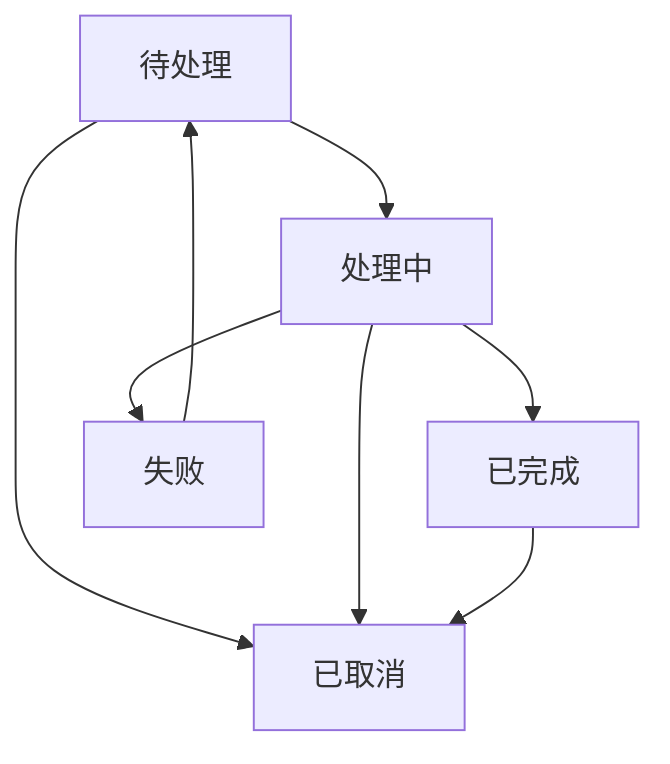
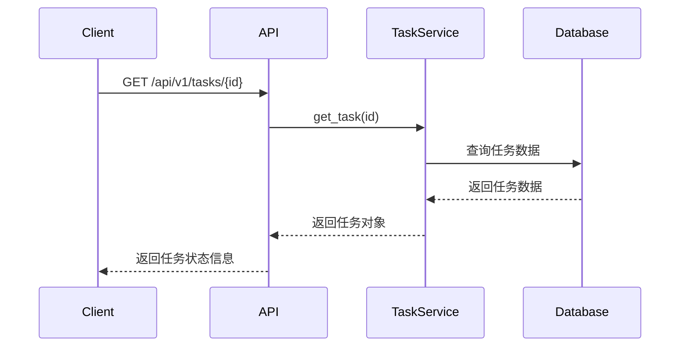

# 任务状态机

<cite>
**本文档引用的文件**
- [stepped_task.rs](file://voice-cli/src/models/stepped_task.rs)
- [task_status.rs](file://document-parser/src/models/task_status.rs)
- [document_task.rs](file://document-parser/src/models/document_task.rs)
- [task_service.rs](file://document-parser/src/services/task_service.rs)
- [task_handler.rs](file://document-parser/src/handlers/task_handler.rs)
</cite>

## 目录
1. [引言](#引言)
2. [任务状态定义](#任务状态定义)
3. [状态转换规则](#状态转换规则)
4. [状态变更触发条件与副作用](#状态变更触发条件与副作用)
5. [状态持久化机制](#状态持久化机制)
6. [状态查询API设计](#状态查询api设计)
7. [异常场景下的健壮性保障](#异常场景下的健壮性保障)
8. [结论](#结论)

## 引言
SteppedTask任务状态机是文档解析系统中的核心组件，负责管理任务的全生命周期。该状态机通过定义清晰的状态和转换规则，确保任务在不同处理阶段的有序流转。系统实现了从任务创建到完成或失败的完整状态管理，支持任务进度跟踪、错误处理和资源清理等关键功能。状态机的设计充分考虑了系统的可靠性和可维护性，为用户提供了一致的任务处理体验。

**Section sources**
- [document_task.rs](file://document-parser/src/models/document_task.rs#L1-L100)

## 任务状态定义
SteppedTask状态机定义了五种核心状态：待处理(Pending)、处理中(Processing)、已完成(Completed)、失败(Failed)和已取消(Cancelled)。每种状态都有其特定的属性和语义，用于准确描述任务的当前状况。

待处理状态表示任务已提交但尚未开始处理，包含任务入队时间。处理中状态表示任务正在执行，包含当前处理阶段、开始时间和进度详情。已完成状态表示任务成功完成，包含完成时间、处理耗时和结果摘要。失败状态表示任务处理失败，包含错误信息、失败时间和重试次数。已取消状态表示任务被主动取消，包含取消时间和原因。

**Section sources**
- [task_status.rs](file://document-parser/src/models/task_status.rs#L9-L33)

## 状态转换规则
状态机的状态转换遵循严格的规则，确保状态流转的正确性和一致性。状态转换图展示了各状态之间的合法转换路径。

待处理状态可以转换为处理中、失败或已取消状态。处理中状态可以转换为已完成、失败或已取消状态。失败状态可以重新转换为待处理状态以支持重试。已完成和已取消状态为终态，不能转换到其他状态。这种设计确保了任务状态的单向性和可预测性。

**Diagram sources**
- [task_status.rs](file://document-parser/src/models/task_status.rs#L470-L487)
- [document_task.rs](file://document-parser/src/models/document_task.rs#L208-L219)

## 状态变更触发条件与副作用
状态变更由特定的触发条件驱动，并伴随相应的副作用。这些机制确保了状态机的正确运行和系统的稳定性。

待处理状态的触发条件是任务创建或重试请求。处理中状态的触发条件是任务开始执行，此时会记录开始时间并初始化进度。已完成状态的触发条件是任务成功完成，此时会计算处理耗时并生成结果摘要。失败状态的触发条件是处理过程中发生错误，此时会记录错误信息并增加重试计数。已取消状态的触发条件是用户取消请求或系统超时。

状态变更的副作用包括日志记录、回调通知和资源清理。每次状态变更都会记录详细的日志信息，便于问题排查和系统监控。关键状态变更会触发回调通知，告知相关系统组件。终态状态变更会触发资源清理，释放占用的系统资源。

**Section sources**
- [task_status.rs](file://document-parser/src/models/task_status.rs#L229-L271)
- [document_task.rs](file://document-parser/src/models/document_task.rs#L232-L249)

## 状态持久化机制
状态机通过持久化机制保证故障恢复后任务状态的一致性。系统使用Sled嵌入式数据库存储任务状态，确保数据的可靠性和持久性。

任务状态的持久化通过TaskService组件实现。每次状态变更后，系统会立即将更新后的任务数据写入数据库，并调用flush操作确保数据持久化到磁盘。这种设计避免了内存数据丢失的风险，即使在系统崩溃后也能恢复任务的最新状态。

持久化机制还支持任务的过期清理。系统定期扫描数据库，清理过期的任务记录和相关临时文件，防止存储空间的无限增长。这种机制确保了系统的长期稳定运行。

**Section sources**
- [task_service.rs](file://document-parser/src/services/task_service.rs#L74-L87)
- [document_task.rs](file://document-parser/src/models/document_task.rs#L463-L498)

## 状态查询API设计
状态查询API为外部系统提供了访问任务状态的标准接口。API设计遵循RESTful原则，使用HTTP方法和状态码表示操作结果。

API提供了获取单个任务状态和批量查询任务状态的功能。响应数据包含任务ID、当前状态、进度信息、错误详情等关键字段。为了提高性能，API支持分页查询和字段过滤。

API使用SimpleTaskStatus枚举简化状态表示，便于前端展示。同时提供详细的错误码和建议，帮助调用方处理各种异常情况。API还支持SSE(Server-Sent Events)流式响应，实现实时状态更新。

**Diagram sources**
- [task_handler.rs](file://document-parser/src/handlers/task_handler.rs#L214-L246)
- [task_service.rs](file://document-parser/src/services/task_service.rs#L58-L71)

## 异常场景下的健壮性保障
状态机在异常场景下具备良好的健壮性保障措施。系统通过多种机制确保在各种异常情况下仍能正确处理任务。

对于网络异常，系统实现了重试机制和超时控制。可恢复的错误会自动重试，不可恢复的错误会记录并终止任务。对于系统崩溃，持久化机制确保任务状态不丢失，重启后可继续处理。

状态机还实现了状态转换验证，防止非法状态转换。每次状态变更前都会验证转换的合法性，确保状态机的完整性。系统还提供了任务取消和强制终止功能，允许在必要时手动干预任务执行。

**Section sources**
- [task_status.rs](file://document-parser/src/models/task_status.rs#L470-L487)
- [document_task.rs](file://document-parser/src/models/document_task.rs#L328-L336)

## 结论
SteppedTask任务状态机通过清晰的状态定义、严格的转换规则和可靠的持久化机制，为文档解析系统提供了稳定的状态管理能力。状态机的设计充分考虑了系统的可靠性、可维护性和用户体验，支持任务的全生命周期管理。通过完善的API设计和异常处理机制，系统能够在各种场景下正确处理任务，确保服务的稳定性和可用性。