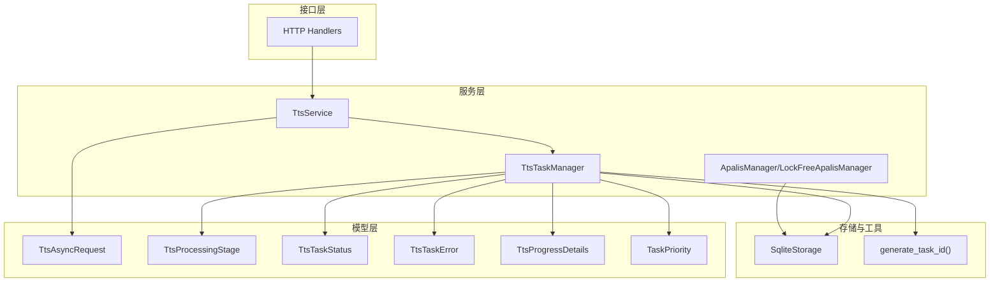
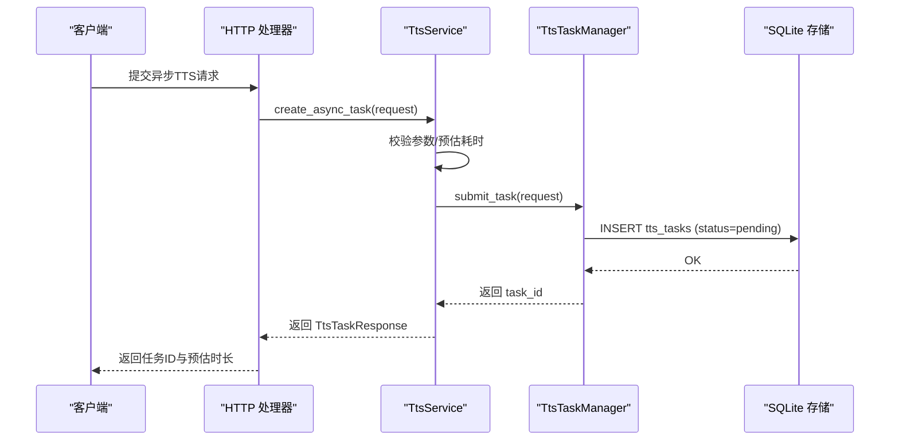
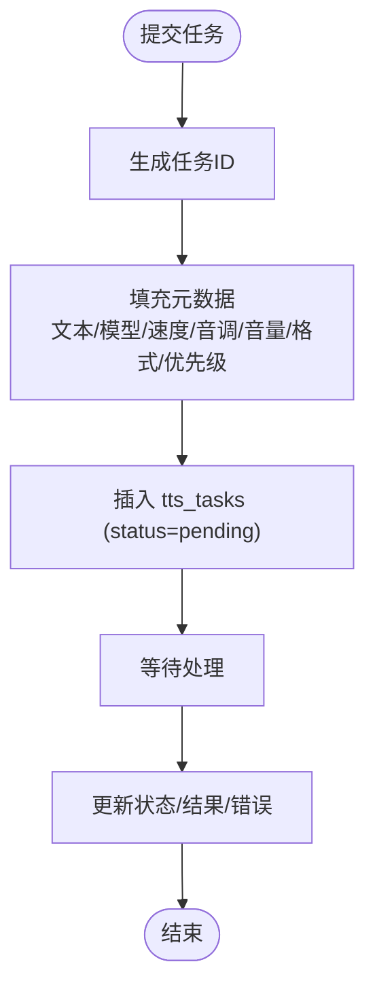
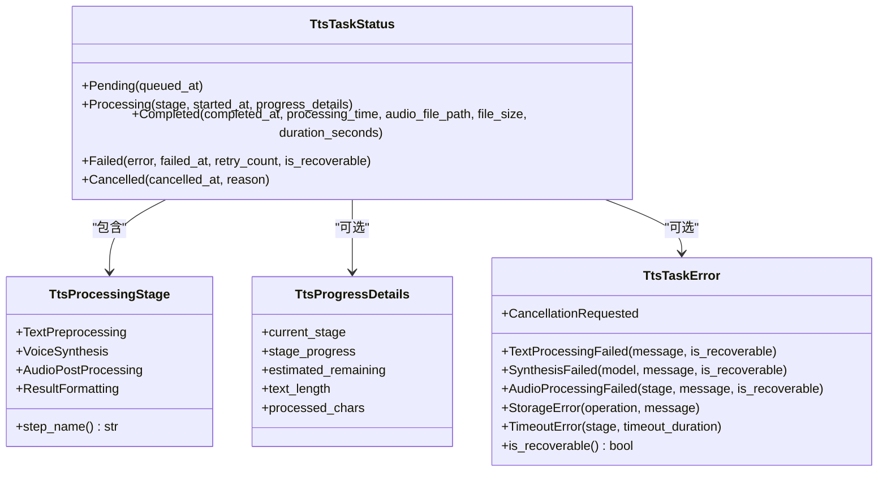
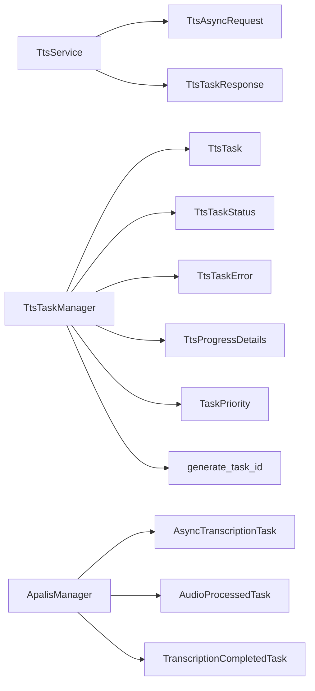

# 任务管理

<cite>
**本文引用的文件列表**
- [tts_task_manager.rs](file://voice-cli/src/services/tts_task_manager.rs)
- [tts.rs](file://voice-cli/src/models/tts.rs)
- [tts_service.rs](file://voice-cli/src/services/tts_service.rs)
- [apalis_manager.rs](file://voice-cli/src/services/apalis_manager.rs)
- [stepped_task.rs](file://voice-cli/src/models/stepped_task.rs)
- [task_id.rs](file://voice-cli/src/utils/task_id.rs)
- [TTS_README.md](file://voice-cli/TTS_README.md)
- [handlers.rs](file://voice-cli/src/server/handlers.rs)
</cite>

## 目录
1. [简介](#简介)
2. [项目结构](#项目结构)
3. [核心组件](#核心组件)
4. [架构总览](#架构总览)
5. [详细组件分析](#详细组件分析)
6. [依赖关系分析](#依赖关系分析)
7. [性能考量](#性能考量)
8. [故障排查指南](#故障排查指南)
9. [结论](#结论)

## 简介
本文件围绕 TTS 任务管理进行深入解析，重点覆盖以下方面：
- TtsTaskManager 的核心职责：任务创建、状态追踪与生命周期管理
- 通过 SteppedTask 结构体实现多阶段 TTS 任务（如文本预处理、模型推理、音频后处理、结果格式化）的分步执行与状态持久化
- 任务元数据（如用户ID、请求时间、优先级）的存储设计
- 任务取消、暂停与查询接口的实现机制
- 结合实际代码示例展示任务提交与状态更新的调用流程
- 高并发下任务去重与资源竞争的解决方案

## 项目结构
与 TTS 任务管理相关的关键模块分布如下：
- 服务层：TtsService、TtsTaskManager、ApalisManager（转录任务的流水线管理）
- 模型层：TtsAsyncRequest、TtsProcessingStage、TtsTaskStatus、TtsTaskError、TtsProgressDetails、TaskPriority 等
- 工具与辅助：任务ID生成、SQLite 存储、状态持久化、统计查询
- 接口层：HTTP 处理器（任务提交、状态查询、统计）

图表来源
- [tts_service.rs](file://voice-cli/src/services/tts_service.rs#L1-L120)
- [tts_task_manager.rs](file://voice-cli/src/services/tts_task_manager.rs#L1-L120)
- [tts.rs](file://voice-cli/src/models/tts.rs#L1-L120)
- [apalis_manager.rs](file://voice-cli/src/services/apalis_manager.rs#L1-L120)
- [task_id.rs](file://voice-cli/src/utils/task_id.rs#L1-L52)

章节来源
- [tts_task_manager.rs](file://voice-cli/src/services/tts_task_manager.rs#L1-L120)
- [tts.rs](file://voice-cli/src/models/tts.rs#L1-L120)
- [tts_service.rs](file://voice-cli/src/services/tts_service.rs#L1-L120)
- [apalis_manager.rs](file://voice-cli/src/services/apalis_manager.rs#L1-L120)
- [task_id.rs](file://voice-cli/src/utils/task_id.rs#L1-L52)

## 核心组件
- TtsTaskManager：负责 TTS 任务的提交、状态查询、状态更新与统计；基于 SQLite 存储任务元数据与状态
- TtsService：封装 TTS 合成流程（同步/异步），异步模式下将任务提交至 TtsTaskManager
- TtsAsyncRequest/TtsProcessingStage/TtsTaskStatus/TtsTaskError/TtsProgressDetails/TaskPriority：定义任务请求、阶段、状态、错误与进度细节
- ApalisManager/LockFreeApalisManager：提供转录任务的多阶段流水线（音频预处理、Whisper 转录、结果格式化），并持久化状态与结果
- SteppedTask 类型族：AsyncTranscriptionTask/AudioProcessedTask/TranscriptionCompletedTask 等，支撑多阶段任务流转
- 任务ID生成：generate_task_id() 统一生成任务标识，避免重复

章节来源
- [tts_task_manager.rs](file://voice-cli/src/services/tts_task_manager.rs#L1-L120)
- [tts.rs](file://voice-cli/src/models/tts.rs#L1-L120)
- [tts_service.rs](file://voice-cli/src/services/tts_service.rs#L1-L120)
- [apalis_manager.rs](file://voice-cli/src/services/apalis_manager.rs#L1-L120)
- [stepped_task.rs](file://voice-cli/src/models/stepped_task.rs#L1-L120)
- [task_id.rs](file://voice-cli/src/utils/task_id.rs#L1-L52)

## 架构总览
TTS 任务管理采用“请求-存储-处理-状态持久化”的闭环架构：
- 客户端提交异步请求（TtsAsyncRequest）
- TtsService 校验参数并生成任务ID，随后委托 TtsTaskManager 提交任务
- TtsTaskManager 将任务写入 SQLite 表，初始状态为 Pending
- 后台 worker（或 Apalis 流水线）按阶段推进任务，状态持久化到数据库
- 客户端通过查询接口获取任务状态与结果

图表来源
- [tts_service.rs](file://voice-cli/src/services/tts_service.rs#L216-L244)
- [tts_task_manager.rs](file://voice-cli/src/services/tts_task_manager.rs#L114-L159)
- [handlers.rs](file://voice-cli/src/server/handlers.rs#L602-L650)

章节来源
- [tts_service.rs](file://voice-cli/src/services/tts_service.rs#L216-L244)
- [tts_task_manager.rs](file://voice-cli/src/services/tts_task_manager.rs#L114-L159)
- [handlers.rs](file://voice-cli/src/server/handlers.rs#L602-L650)

## 详细组件分析

### TtsTaskManager：任务创建、状态追踪与生命周期
- 任务创建
  - 接收 TtsAsyncRequest，生成任务ID（UUID v7 清洗后前缀为 task），填充元数据（文本、模型、速度、音调、音量、格式、创建时间、优先级）
  - 写入 SQLite 表 tts_tasks，初始状态为 pending，updated_at 与 created_at 相同
- 状态查询
  - 根据 task_id 查询 status、updated_at、结果路径、文件大小、时长、错误信息、重试次数
  - 将字符串状态映射为枚举状态（Pending/Processing/Completed/Failed/Cancelled）
- 状态更新
  - 支持更新状态、结果路径、文件大小、时长、错误信息与重试次数
  - 用于在任务处理过程中记录阶段性结果与错误
- 生命周期
  - 通过状态机驱动：Pending -> Processing -> Completed/Failed/Cancelled
  - 统计接口汇总各状态任务数量，便于运维监控
- 并发与去重
  - 任务ID由 generate_task_id() 保证唯一性，避免重复提交
  - SQLite 插入时可利用唯一约束（如 task_id）避免重复记录（建议在表结构中添加唯一索引）

图表来源
- [tts_task_manager.rs](file://voice-cli/src/services/tts_task_manager.rs#L114-L159)
- [tts_task_manager.rs](file://voice-cli/src/services/tts_task_manager.rs#L162-L210)
- [tts_task_manager.rs](file://voice-cli/src/services/tts_task_manager.rs#L281-L296)
- [task_id.rs](file://voice-cli/src/utils/task_id.rs#L1-L52)

章节来源
- [tts_task_manager.rs](file://voice-cli/src/services/tts_task_manager.rs#L114-L159)
- [tts_task_manager.rs](file://voice-cli/src/services/tts_task_manager.rs#L162-L210)
- [tts_task_manager.rs](file://voice-cli/src/services/tts_task_manager.rs#L281-L296)
- [task_id.rs](file://voice-cli/src/utils/task_id.rs#L1-L52)

### SteppedTask：多阶段 TTS 任务的分步执行与状态持久化
- 多阶段定义
  - 文本预处理（TextPreprocessing）
  - 语音合成（VoiceSynthesis）
  - 音频后处理（AudioPostProcessing）
  - 结果格式化（ResultFormatting）
- 状态持久化
  - 每个阶段开始前更新状态为 Processing（含阶段、开始时间、进度详情）
  - 完成后根据结果更新为 Completed（含完成时间、处理时长、音频文件路径、文件大小、时长）
  - 失败时更新为 Failed（含错误、失败时间、重试次数、是否可恢复）
  - 取消时更新为 Cancelled（含取消时间、原因）
- 进度与估算
  - TtsProgressDetails 提供当前阶段进度、剩余时间、文本长度、已处理字符数等

图表来源
- [tts.rs](file://voice-cli/src/models/tts.rs#L50-L120)
- [tts.rs](file://voice-cli/src/models/tts.rs#L100-L149)
- [tts.rs](file://voice-cli/src/models/tts.rs#L110-L149)

章节来源
- [tts.rs](file://voice-cli/src/models/tts.rs#L50-L120)
- [tts.rs](file://voice-cli/src/models/tts.rs#L100-L149)

### 任务元数据与存储设计
- 元数据字段
  - 任务ID、文本、模型、速度、音调、音量、格式、创建时间、优先级
- 存储表结构
  - tts_tasks：包含 task_id、text、model、speed、pitch、volume、format、created_at、priority、status、updated_at、result_path、file_size、duration_seconds、error_message、retry_count
- 优先级映射
  - Low/Normal/High 映射为 1/2/3，便于排序与调度
- 状态持久化
  - 通过 SQL 更新语句维护状态与结果字段，确保幂等更新

章节来源
- [tts_task_manager.rs](file://voice-cli/src/services/tts_task_manager.rs#L114-L159)
- [tts_task_manager.rs](file://voice-cli/src/services/tts_task_manager.rs#L281-L296)

### 任务取消、暂停与查询接口
- 取消接口
  - 通过 HTTP 处理器触发取消操作，校验任务状态是否允许取消（非终态）
  - 更新状态为 Cancelled，并返回操作结果
- 暂停接口
  - 当前实现未提供显式的暂停接口；可通过外部控制（如停止 worker）实现阶段性暂停
- 查询接口
  - 提供按 task_id 查询任务状态与结果的接口
  - 提供任务统计接口（总数、Pending/Processing/Completed/Failed/Cancelled 数量）

章节来源
- [handlers.rs](file://voice-cli/src/server/handlers.rs#L602-L650)
- [tts_task_manager.rs](file://voice-cli/src/services/tts_task_manager.rs#L162-L210)
- [tts_task_manager.rs](file://voice-cli/src/services/tts_task_manager.rs#L308-L337)

### 任务提交与状态更新调用流程（结合代码路径）
- 提交流程
  - TtsService.create_async_task(request) -> 生成任务ID -> 返回 TtsTaskResponse
  - TtsTaskManager.submit_task(request) -> 写入 SQLite -> 返回 task_id
- 状态更新流程
  - TtsTaskManager.get_task_status(task_id) -> 查询状态
  - TtsTaskManager.update_task_status(...) -> 更新状态与结果字段

章节来源
- [tts_service.rs](file://voice-cli/src/services/tts_service.rs#L216-L244)
- [tts_task_manager.rs](file://voice-cli/src/services/tts_task_manager.rs#L114-L159)
- [tts_task_manager.rs](file://voice-cli/src/services/tts_task_manager.rs#L162-L210)
- [tts_task_manager.rs](file://voice-cli/src/services/tts_task_manager.rs#L281-L296)

### 高并发下任务去重与资源竞争解决方案
- 去重策略
  - 任务ID生成：使用 generate_task_id() 保证全局唯一，避免重复提交
  - 数据库约束：建议在 tts_tasks 上为 task_id 建立唯一索引，防止并发插入重复记录
- 资源竞争
  - 读写分离：状态查询与更新使用互斥访问（如 RwLock），减少写冲突
  - 幂等更新：SQL 更新语句对状态与结果字段进行幂等更新，避免竞态条件导致的状态错乱
  - 并发控制：Apalis 管理器通过 WorkerBuilder 控制并发度，避免过度竞争
- 重试与可观测性
  - 失败状态包含 retry_count 与 is_recoverable 字段，便于策略化重试
  - 统计接口提供平均处理时间、失败任务ID等，便于定位瓶颈

章节来源
- [task_id.rs](file://voice-cli/src/utils/task_id.rs#L1-L52)
- [tts_task_manager.rs](file://voice-cli/src/services/tts_task_manager.rs#L1-L120)
- [apalis_manager.rs](file://voice-cli/src/services/apalis_manager.rs#L1-L120)

## 依赖关系分析
- TtsService 依赖 TtsAsyncRequest、TtsTaskResponse
- TtsTaskManager 依赖 TtsTask、TtsTaskStatus、TtsTaskError、TtsProgressDetails、TaskPriority
- ApalisManager/LockFreeApalisManager 依赖 AsyncTranscriptionTask/AudioProcessedTask/TranscriptionCompletedTask 等类型族
- 任务ID生成工具被多处使用，保证全局唯一性

图表来源
- [tts_service.rs](file://voice-cli/src/services/tts_service.rs#L1-L120)
- [tts_task_manager.rs](file://voice-cli/src/services/tts_task_manager.rs#L1-L120)
- [apalis_manager.rs](file://voice-cli/src/services/apalis_manager.rs#L1-L120)
- [stepped_task.rs](file://voice-cli/src/models/stepped_task.rs#L1-L120)
- [task_id.rs](file://voice-cli/src/utils/task_id.rs#L1-L52)

章节来源
- [tts_service.rs](file://voice-cli/src/services/tts_service.rs#L1-L120)
- [tts_task_manager.rs](file://voice-cli/src/services/tts_task_manager.rs#L1-L120)
- [apalis_manager.rs](file://voice-cli/src/services/apalis_manager.rs#L1-L120)
- [stepped_task.rs](file://voice-cli/src/models/stepped_task.rs#L1-L120)
- [task_id.rs](file://voice-cli/src/utils/task_id.rs#L1-L52)

## 性能考量
- 预估处理时间：TtsService 基于文本长度估算时长，有助于前端提示与资源规划
- 并发度控制：Apalis 管理器通过 WorkerBuilder 设置并发度，避免 CPU/IO 抢占
- 存储优化：SQLite 查询与更新尽量使用索引（如 task_id），减少全表扫描
- 状态持久化：分阶段更新状态，避免一次性大事务，降低锁持有时间

章节来源
- [tts_service.rs](file://voice-cli/src/services/tts_service.rs#L246-L255)
- [apalis_manager.rs](file://voice-cli/src/services/apalis_manager.rs#L353-L379)

## 故障排查指南
- 常见错误
  - 输入参数非法：文本为空、参数越界
  - 存储错误：插入/更新失败、连接异常
  - 超时与取消：阶段超时、任务被取消
- 排查步骤
  - 检查任务状态是否为 Failed，查看 error_message 与 retry_count
  - 对比 created_at 与 updated_at，确认任务是否卡住
  - 查看统计接口，定位失败任务ID集合
  - 核对 Apalis worker 是否正常运行，日志中是否有异常

章节来源
- [tts.rs](file://voice-cli/src/models/tts.rs#L110-L149)
- [tts_task_manager.rs](file://voice-cli/src/services/tts_task_manager.rs#L281-L296)
- [handlers.rs](file://voice-cli/src/server/handlers.rs#L602-L650)

## 结论
TtsTaskManager 通过清晰的任务模型、稳定的 SQLite 存储与完善的生命周期管理，实现了 TTS 任务的可靠提交与状态追踪。结合 SteppedTask 的多阶段设计与 Apalis 管理器的流水线能力，系统能够在高并发场景下保持一致性与可观测性。建议进一步完善取消/暂停接口与去重约束，以提升用户体验与系统稳定性。