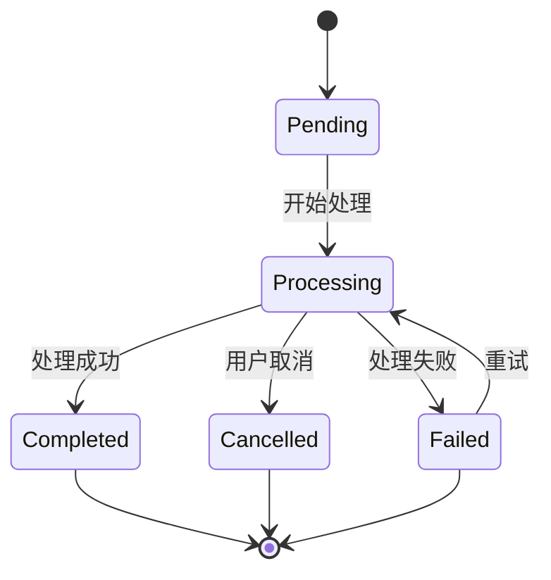
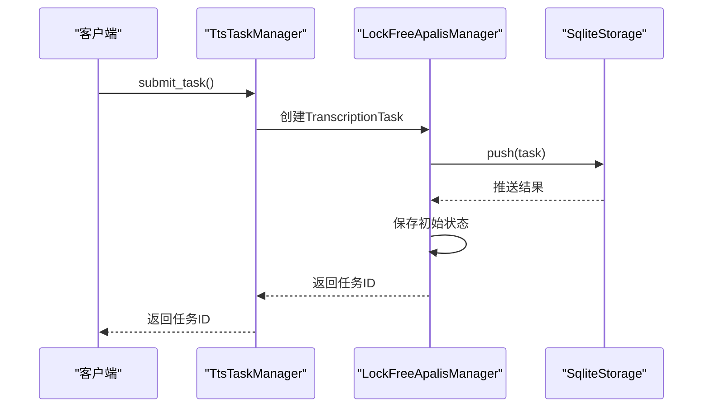
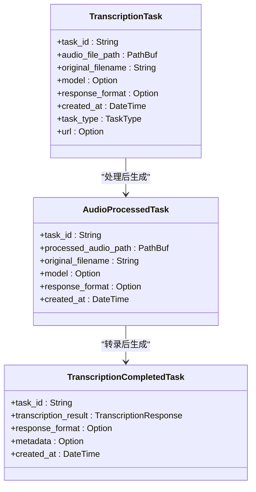
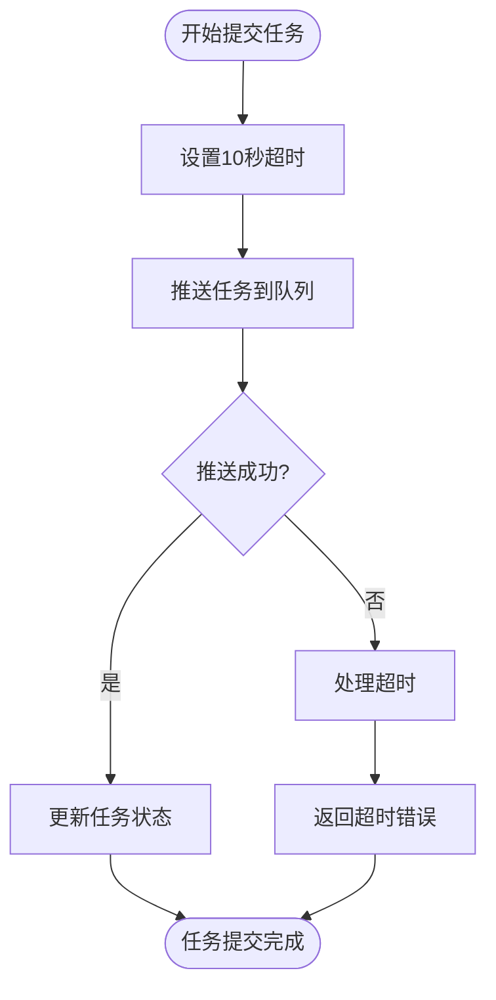
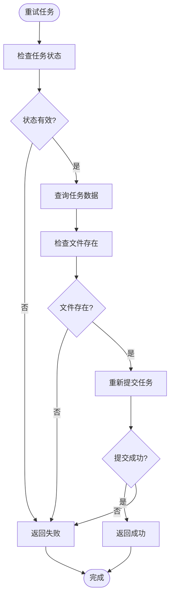
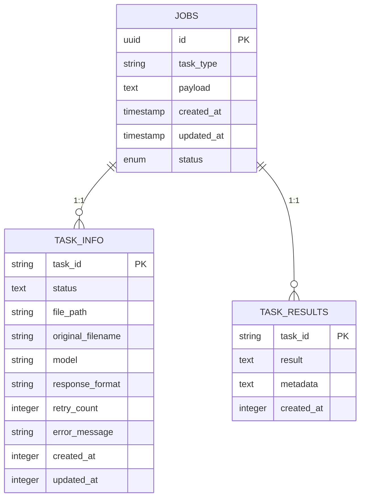

# 任务队列

<cite>
**本文档引用的文件**   
- [apalis_manager.rs](file://voice-cli/src/services/apalis_manager.rs)
- [tts_task_manager.rs](file://voice-cli/src/services/tts_task_manager.rs)
- [task_status.rs](file://document-parser/src/models/task_status.rs)
- [app_state.rs](file://voice-cli/src/server/app_state.rs)
- [tts.rs](file://voice-cli/src/models/tts.rs)
- [request.rs](file://voice-cli/src/models/request.rs)
</cite>

## 目录
1. [引言](#引言)
2. [核心组件](#核心组件)
3. [TtsTaskManager任务状态管理](#ttstaskmanagertask-status-management)
4. [无锁任务分发机制](#lock-free-task-dispatch-mechanism)
5. [TranscriptionTask数据结构设计](#transcriptiontask-data-structure-design)
6. [任务优先级与超时控制](#task-priority-and-timeout-control)
7. [重试机制与错误恢复](#retry-mechanism-and-error-recovery)
8. [任务持久化与跨请求访问](#task-persistence-and-cross-request-access)
9. [高并发性能调优建议](#high-concurrency-performance-tuning-suggestions)
10. [结论](#结论)

## 引言
本文档全面解析基于Apalis框架实现的语音处理服务任务队列系统。该系统采用异步任务调度机制，通过TtsTaskManager管理TTS任务的全生命周期状态（Pending、Processing、Completed等），利用LockFreeApalisManager实现无锁任务分发与执行，并通过TranscriptionTask数据结构设计实现复杂的语音转录流水线。系统结合AppState中的任务存储实例，实现了任务的持久化和跨请求访问，为高并发场景下的语音处理提供了可靠的基础设施。

## 核心组件

语音处理服务的任务队列系统由多个核心组件构成，包括TtsTaskManager用于管理TTS任务，LockFreeApalisManager实现无锁任务分发，以及TranscriptionTask数据结构设计用于复杂的转录流水线。这些组件协同工作，通过Apalis框架实现异步任务调度机制。

**Section sources**
- [apalis_manager.rs](file://voice-cli/src/services/apalis_manager.rs#L1-L1798)
- [tts_task_manager.rs](file://voice-cli/src/services/tts_task_manager.rs#L1-L388)

## TtsTaskManager任务状态管理

TtsTaskManager是TTS任务的核心管理器，负责管理TTS任务的全生命周期状态。该管理器通过SQLite数据库持久化任务状态，支持多种任务状态，包括Pending（待处理）、Processing（处理中）、Completed（已完成）、Failed（失败）和Cancelled（已取消）。

TtsTaskManager通过`submit_task`方法提交新任务，将任务信息存储到`tts_tasks`表中，初始状态设置为"pending"。任务状态的转换通过`update_task_status`方法实现，该方法会更新数据库中的状态字段和更新时间。`get_task_status`方法用于查询任务的当前状态，返回详细的TtsTaskStatus枚举值。

任务状态的管理遵循严格的生命周期：任务从Pending状态开始，进入Processing状态进行语音合成，最终转换为Completed或Failed状态。对于失败的任务，系统支持重试机制，通过`retry_count`字段跟踪重试次数。

**Diagram sources **
- [tts_task_manager.rs](file://voice-cli/src/services/tts_task_manager.rs#L45-L296)
- [tts.rs](file://voice-cli/src/models/tts.rs#L71-L98)

## 无锁任务分发机制

LockFreeApalisManager实现了无锁任务分发与执行机制，通过全局静态OnceLock和Arc智能指针确保线程安全。该管理器采用无锁设计模式，避免了传统锁机制可能带来的性能瓶颈和死锁风险。

无锁设计的核心在于`LockFreeApalisManager`结构体的`monitor_handle`字段使用`Arc<tokio::sync::Mutex<Option<tokio::task::JoinHandle<()>>>>`类型，允许多个线程安全地共享和修改监控器句柄。同时，`worker_running`字段使用`AtomicBool`实现原子操作，确保worker状态的读写是线程安全的。

任务分发流程如下：当调用`submit_task`方法时，系统首先创建AsyncTranscriptionTask，然后将其转换为TranscriptionTask并推送到Apalis队列。整个过程通过`tokio::time::timeout`包装，防止推送操作无限期阻塞。任务提交成功后，系统会立即保存初始任务状态到自定义的`task_info`表中，确保状态信息的持久化。

**Diagram sources **
- [apalis_manager.rs](file://voice-cli/src/services/apalis_manager.rs#L166-L185)
- [apalis_manager.rs](file://voice-cli/src/services/apalis_manager.rs#L382-L452)

## TranscriptionTask数据结构设计

TranscriptionTask数据结构设计用于实现复杂的语音转录流水线，采用多阶段处理模式。该设计包含三个主要任务类型：TranscriptionTask（初始转录任务）、AudioProcessedTask（音频预处理完成任务）和TranscriptionCompletedTask（转录完成任务）。

TranscriptionTask作为流水线的起点，包含任务ID、音频文件路径、原始文件名、模型选择、响应格式等基本信息。任务类型通过TaskType枚举区分文件上传和URL下载两种场景。对于URL下载任务，还包含URL地址字段。

流水线的第二步是AudioProcessedTask，表示音频预处理已完成，包含处理后的音频路径。第三步是TranscriptionCompletedTask，包含最终的转录结果、响应格式、元数据和创建时间。

这种分阶段设计的优势在于：
1. 支持复杂的多步骤处理流程
2. 每个步骤可以独立失败和重试
3. 状态转换清晰明确
4. 支持中间结果的持久化

**Diagram sources **
- [apalis_manager.rs](file://voice-cli/src/services/apalis_manager.rs#L41-L73)
- [request.rs](file://voice-cli/src/models/request.rs#L5-L63)

## 任务优先级与超时控制

系统实现了完善的任务优先级处理和超时控制机制。任务优先级通过TaskPriority枚举实现，包含Low、Normal和High三个级别，分别对应优先级数值1、2和3。在TtsTaskManager中，任务的priority字段存储这些数值，为未来的优先级调度提供基础。

超时控制主要体现在两个层面：任务处理超时和数据库操作超时。在`submit_task`方法中，系统使用`tokio::time::timeout`包装storage.push操作，设置10秒的超时限制，防止任务提交过程无限期阻塞。对于转录任务的实际处理，TranscriptionEngine通过`worker_timeout`配置项设置处理超时，确保长时间运行的任务不会占用资源。

任务优先级的实现方式是在TtsAsyncRequest中包含priority字段，TtsTaskManager根据此字段设置任务的优先级数值。虽然当前实现中优先级尚未直接影响调度顺序，但数据结构已为优先级调度功能预留了扩展空间。

**Diagram sources **
- [tts_task_manager.rs](file://voice-cli/src/services/tts_task_manager.rs#L408-L412)
- [tts.rs](file://voice-cli/src/models/tts.rs#L184-L190)

## 重试机制与错误恢复

系统实现了健壮的重试机制与错误恢复策略。重试功能通过`retry_task`方法实现，该方法首先检查任务的当前状态，仅允许对Failed或Cancelled状态的任务进行重试。

重试流程如下：系统查询`task_info`表获取原始任务数据，包括文件路径、原始文件名、模型和响应格式等信息。然后检查音频文件是否仍然存在，如果存在则重新提交任务到Apalis队列。重试过程中，系统会保留原始任务的大部分参数，确保重试行为的一致性。

错误恢复策略体现在多个方面：
1. 任务状态持久化：所有状态变更都写入数据库，确保服务重启后能恢复任务状态
2. 可恢复错误标记：TtsTaskError枚举包含is_recoverable字段，区分可恢复和不可恢复错误
3. 重试次数限制：通过retry_count字段限制重试次数，防止无限重试
4. 文件存在性检查：重试前检查音频文件是否存在，避免对已删除文件的无效重试

**Diagram sources **
- [apalis_manager.rs](file://voice-cli/src/services/apalis_manager.rs#L717-L796)
- [tts.rs](file://voice-cli/src/models/tts.rs#L110-L147)

## 任务持久化与跨请求访问

任务持久化和跨请求访问通过AppState中的任务存储实例实现。AppState结构体包含`apalis_storage`字段，该字段是`Option<SqliteStorage<TranscriptionTask>>`类型，为整个应用提供共享的任务存储访问。

在应用启动时，`AppState::new`方法初始化无锁Apalis管理器，创建数据库连接池和任务存储实例，并启动worker监控器。这个过程确保了任务队列系统的早期初始化和持久化配置。

任务持久化采用双层存储策略：
1. Apalis框架的jobs表：存储任务的基本信息和调度状态
2. 自定义的task_info和task_results表：存储详细的任务状态、元数据和结果

这种设计的优势在于既利用了Apalis框架的可靠调度能力，又通过自定义表实现了更丰富的状态管理和查询功能。跨请求访问通过Arc智能指针和全局静态变量实现，确保多个请求能安全地访问同一个任务管理器实例。

**Diagram sources **
- [app_state.rs](file://voice-cli/src/server/app_state.rs#L12-L52)
- [apalis_manager.rs](file://voice-cli/src/services/apalis_manager.rs#L277-L315)

## 高并发性能调优建议

针对高并发场景，系统提供了多项性能调优建议：

1. **连接池配置**：合理设置SQLite连接池大小，避免过多连接导致的性能下降。在`LockFreeApalisManager::new`中，连接池最大连接数设置为10，可根据实际负载调整。

2. **并发任务限制**：通过`max_concurrent_tasks`配置项控制同时处理的任务数量，防止资源耗尽。建议根据CPU核心数和内存容量设置合理的并发数。

3. **超时设置**：为所有异步操作设置合理的超时，防止个别任务阻塞整个系统。特别是网络请求和文件操作，应设置较短的超时时间。

4. **批量操作**：对于状态查询等操作，考虑实现批量查询接口，减少数据库交互次数。

5. **缓存策略**：对于频繁访问但不常变更的数据，如任务元数据，可考虑引入内存缓存层。

6. **监控与告警**：实现任务队列长度、处理延迟等关键指标的监控，设置阈值告警，及时发现性能瓶颈。

7. **资源清理**：定期清理已完成或失败的任务数据，避免数据库膨胀影响性能。

8. **异步处理**：确保所有I/O操作都在异步上下文中执行，避免阻塞事件循环。

## 结论

本文档全面解析了基于Apalis框架的语音处理服务任务队列系统。系统通过TtsTaskManager实现了TTS任务的全生命周期管理，利用LockFreeApalisManager的无锁设计确保了高并发下的性能和可靠性。TranscriptionTask的数据结构设计支持复杂的多阶段处理流水线，而任务优先级、超时控制、重试机制和错误恢复策略共同构成了健壮的任务处理框架。通过AppState中的任务存储实例，系统实现了任务的持久化和跨请求访问，为高并发场景下的语音处理提供了可靠的基础设施。未来可进一步优化任务优先级调度算法和引入更智能的资源管理策略，以应对更大规模的并发需求。