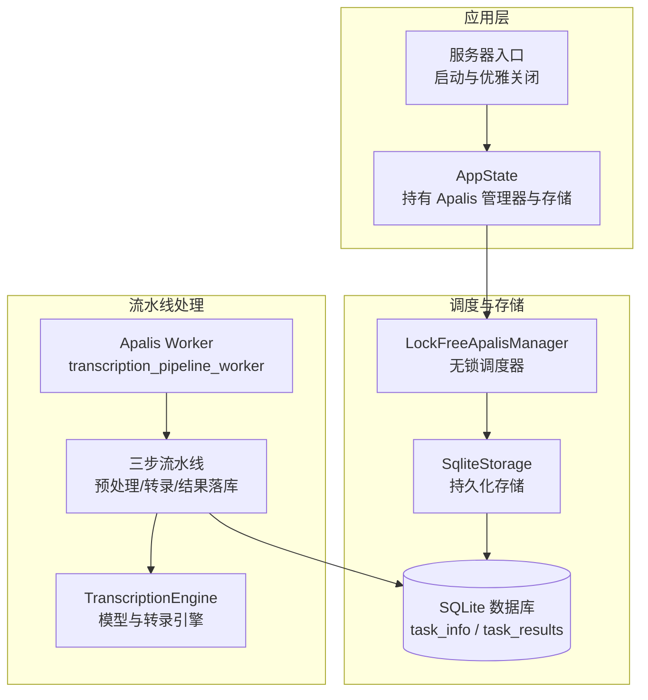
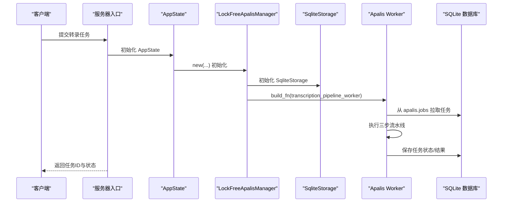
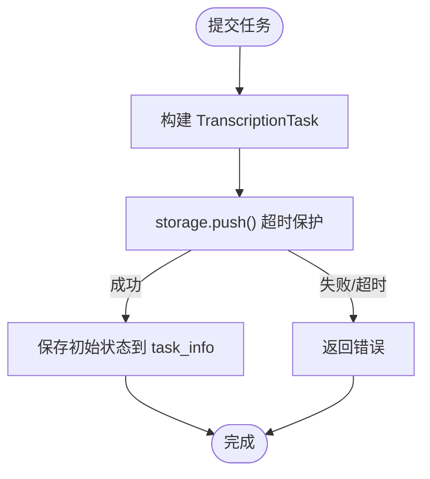
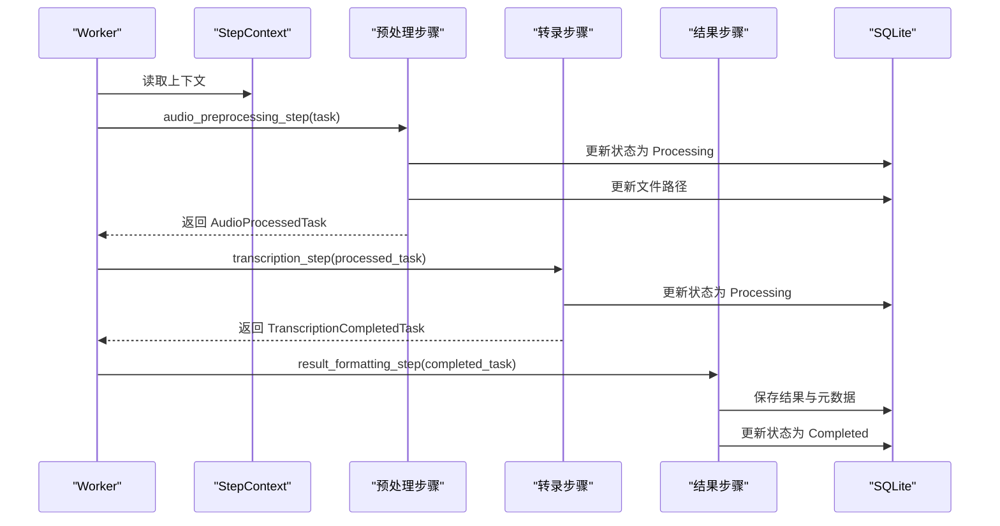
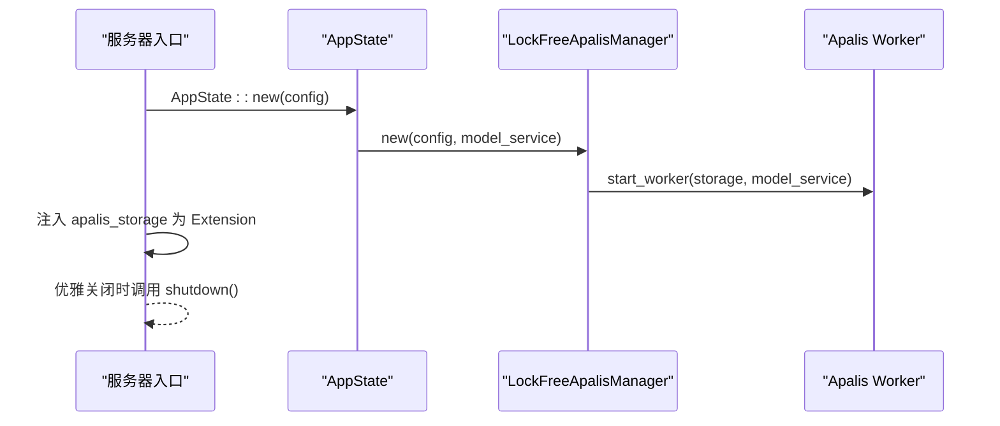
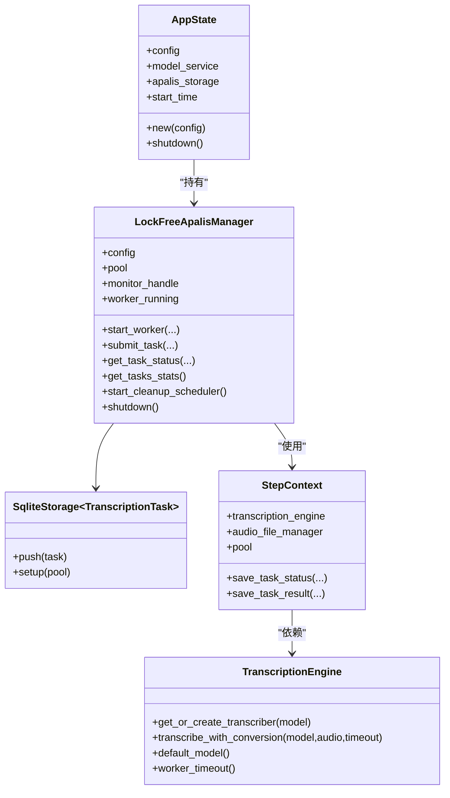

# 调度器机制

<cite>
**本文引用的文件**
- [apalis_manager.rs](file://voice-cli/src/services/apalis_manager.rs)
- [app_state.rs](file://voice-cli/src/server/app_state.rs)
- [mod.rs（服务器入口）](file://voice-cli/src/server/mod.rs)
- [task_id.rs](file://voice-cli/src/utils/task_id.rs)
- [transcription_engine.rs](file://voice-cli/src/services/transcription_engine.rs)
- [tts_task_manager.rs](file://voice-cli/src/services/tts_task_manager.rs)
- [models/mod.rs](file://voice-cli/src/models/mod.rs)
</cite>

## 目录
1. [引言](#引言)
2. [项目结构](#项目结构)
3. [核心组件](#核心组件)
4. [架构总览](#架构总览)
5. [详细组件分析](#详细组件分析)
6. [依赖关系分析](#依赖关系分析)
7. [性能考量](#性能考量)
8. [故障排查指南](#故障排查指南)
9. [结论](#结论)
10. [附录](#附录)

## 引言
本文件系统性解析基于 Apalis 框架构建的 LockFreeApalisManager 调度器实现，重点阐述其如何通过内存安全的异步任务队列实现“无锁”任务分发，支持动态 Worker 扩展与负载均衡；同时说明调度器与 AppState 的集成方式，确保任务上下文在全局状态中的可访问性与一致性；覆盖任务优先级队列、定时调度、失败重试策略及背压控制机制，并给出性能监控指标采集与告警配置建议。

## 项目结构
- 语音转录任务由 Apalis 管理器驱动，采用 SQLite 作为持久化存储，结合多阶段流水线（预处理、转录、结果格式化与落库）完成端到端处理。
- 服务器启动时初始化 AppState，其中包含 LockFreeApalisManager 与 SqliteStorage，随后启动 Apalis worker。
- 任务 ID 生成采用 UUID v7 清洗策略，保证全局唯一且便于检索。
- 任务状态与结果分别存储于 task_info 与 task_results 两张表，便于查询与清理。

图表来源
- [apalis_manager.rs](file://voice-cli/src/services/apalis_manager.rs#L197-L380)
- [app_state.rs](file://voice-cli/src/server/app_state.rs#L10-L43)
- [mod.rs（服务器入口）](file://voice-cli/src/server/mod.rs#L300-L366)

章节来源
- [apalis_manager.rs](file://voice-cli/src/services/apalis_manager.rs#L197-L380)
- [app_state.rs](file://voice-cli/src/server/app_state.rs#L10-L43)
- [mod.rs（服务器入口）](file://voice-cli/src/server/mod.rs#L300-L366)

## 核心组件
- LockFreeApalisManager：无锁调度器，负责初始化数据库、创建 SqliteStorage、启动 Apalis 监控器与 worker、提交任务、查询/更新状态、清理过期任务、优雅关闭等。
- SqliteStorage<TranscriptionTask>：Apalis 的 SQLite 存储，承载任务持久化与队列。
- StepContext：流水线步骤共享上下文，封装模型服务、文件管理器与数据库连接池。
- transcription_pipeline_worker：Apalis worker，按三步流水线顺序执行：音频预处理（含 URL 下载）、Whisper 转录、结果格式化与存储。
- AppState：服务器应用状态，持有 Config、ModelService、SqliteStorage 与启动时间，并在启动时初始化 LockFreeApalisManager 与 worker。
- TranscriptionEngine：模型与转录引擎，缓存不同模型的 WhisperTranscriber，避免重复加载，支持超时与阻塞线程池隔离。

章节来源
- [apalis_manager.rs](file://voice-cli/src/services/apalis_manager.rs#L165-L210)
- [apalis_manager.rs](file://voice-cli/src/services/apalis_manager.rs#L318-L380)
- [apalis_manager.rs](file://voice-cli/src/services/apalis_manager.rs#L1200-L1603)
- [app_state.rs](file://voice-cli/src/server/app_state.rs#L10-L43)
- [transcription_engine.rs](file://voice-cli/src/services/transcription_engine.rs#L1-L158)

## 架构总览
Apalis 以 SqliteStorage 为后端，WorkerBuilder 构建的 worker 从存储中拉取任务，执行三步流水线。调度器通过 Monitor 注册 worker，后台运行监控器，实现任务生命周期管理与可观测性。

图表来源
- [apalis_manager.rs](file://voice-cli/src/services/apalis_manager.rs#L318-L380)
- [app_state.rs](file://voice-cli/src/server/app_state.rs#L10-L43)
- [mod.rs（服务器入口）](file://voice-cli/src/server/mod.rs#L300-L366)

## 详细组件分析

### 无锁调度器与任务分发
- 初始化与存储：创建数据库目录与文件，建立连接池，执行 SqliteStorage::setup，创建自定义表 task_info 与 task_results。
- 启动 worker：使用 WorkerBuilder.new("transcription-pipeline")，设置并发度、重试策略、后端存储与数据上下文，注册到 Monitor 并在后台运行。
- 提交任务：将任务对象转换为 TranscriptionTask，调用 storage.push，超时保护与错误处理，随后保存初始状态至 task_info。
- 查询/更新状态：直接从 task_info 查询状态 JSON，保存状态时序列化 TaskStatus 并写回。
- 清理过期任务：定期扫描 task_info 中超过保留时间的任务，删除对应文件与数据库记录。

图表来源
- [apalis_manager.rs](file://voice-cli/src/services/apalis_manager.rs#L383-L452)
- [apalis_manager.rs](file://voice-cli/src/services/apalis_manager.rs#L544-L663)

章节来源
- [apalis_manager.rs](file://voice-cli/src/services/apalis_manager.rs#L248-L315)
- [apalis_manager.rs](file://voice-cli/src/services/apalis_manager.rs#L318-L380)
- [apalis_manager.rs](file://voice-cli/src/services/apalis_manager.rs#L383-L452)
- [apalis_manager.rs](file://voice-cli/src/services/apalis_manager.rs#L544-L663)

### 三步流水线与任务上下文
- StepContext：封装 TranscriptionEngine、AudioFileManager 与数据库连接池，供各步骤共享。
- 预处理步骤：根据任务类型决定是下载 URL 音频还是使用本地文件；下载后检测真实格式并重命名，必要时更新数据库文件路径；更新状态为 Processing。
- 转录步骤：提取音视频元数据，检查是否存在音频流，调用 TranscriptionEngine 执行转录，支持超时与阻塞线程池隔离。
- 结果步骤：保存结果到 task_results，计算处理时长，更新状态为 Completed。

图表来源
- [apalis_manager.rs](file://voice-cli/src/services/apalis_manager.rs#L1200-L1603)
- [transcription_engine.rs](file://voice-cli/src/services/transcription_engine.rs#L1-L158)

章节来源
- [apalis_manager.rs](file://voice-cli/src/services/apalis_manager.rs#L1200-L1603)
- [transcription_engine.rs](file://voice-cli/src/services/transcription_engine.rs#L1-L158)

### 与 AppState 的集成与全局状态一致性
- AppState 在 new 时创建 ModelService，初始化 LockFreeApalisManager，并启动 worker，同时持有 SqliteStorage 以便路由层注入。
- 服务器入口 handle_server_run 中，将 app_state.apalis_storage 作为 axum::Extension 注入，便于处理器获取存储实例。
- 优雅关闭：监听信号后，调用 app_state_for_monitor.lock_free_apalis_manager.shutdown()，停止监控器后台任务。

图表来源
- [app_state.rs](file://voice-cli/src/server/app_state.rs#L10-L43)
- [mod.rs（服务器入口）](file://voice-cli/src/server/mod.rs#L300-L366)

章节来源
- [app_state.rs](file://voice-cli/src/server/app_state.rs#L10-L43)
- [mod.rs（服务器入口）](file://voice-cli/src/server/mod.rs#L300-L366)

### 动态 Worker 扩展与负载均衡
- 并发度控制：WorkerBuilder.concurrency 设置最大并发任务数，受配置项 max_concurrent_tasks 控制。
- 负载均衡：文档解析模块提供了通用的并发优化与负载均衡策略（轮询、最少连接、加权轮询），可借鉴到 Apalis 场景中，例如通过多个 worker 实例或外部队列实现多实例均衡。
- 动态扩容：可通过增加 worker 数量与并发度参数实现横向扩展；注意数据库连接池大小与磁盘 IO 限制。

章节来源
- [apalis_manager.rs](file://voice-cli/src/services/apalis_manager.rs#L340-L352)
- [document-parser/src/performance/concurrency_optimizer.rs](file://document-parser/src/performance/concurrency_optimizer.rs#L86-L182)

### 任务优先级队列与背压控制
- 任务优先级：文档解析模块实现了优先级队列 enqueue_priority 与出队策略（优先处理高优先级），可作为 Apalis 任务优先级设计参考。
- 背压控制：文档解析模块在 TaskQueueService 中通过 mpsc::try_send 触发背压，记录 overflow 事件，可用于 Apalis 场景的入队限流与告警。
- Apalis 侧：通过 WorkerBuilder.concurrency 限制并发，配合数据库连接池上限与磁盘 IO，形成天然背压；可结合业务侧在提交阶段增加限流与排队。

章节来源
- [document-parser/src/performance/concurrency_optimizer.rs](file://document-parser/src/performance/concurrency_optimizer.rs#L200-L269)
- [document-parser/src/services/task_queue_service.rs](file://document-parser/src/services/task_queue_service.rs#L591-L616)

### 失败重试策略
- Apalis 层：WorkerBuilder.retry(RetryPolicy::retries(n)) 设置重试次数，结合数据库状态更新，实现幂等与可恢复。
- 业务层：支持任务重试接口，查询 task_info 中原始任务数据，校验文件存在后重新提交；失败状态与错误消息持久化，便于诊断与恢复。

章节来源
- [apalis_manager.rs](file://voice-cli/src/services/apalis_manager.rs#L340-L352)
- [apalis_manager.rs](file://voice-cli/src/services/apalis_manager.rs#L717-L796)

### 定时调度与清理
- 定时清理：启动定时任务，按配置的保留分钟数扫描过期任务，删除文件与数据库记录，降低存储压力。
- 统计与可观测性：提供 get_tasks_stats，聚合任务状态与平均处理时间，便于监控面板展示。

章节来源
- [apalis_manager.rs](file://voice-cli/src/services/apalis_manager.rs#L919-L1083)
- [apalis_manager.rs](file://voice-cli/src/services/apalis_manager.rs#L841-L917)

### 任务 ID 生成与全局唯一性
- 使用 UUID v7 清洗策略，移除连字符与下划线，统一前缀与长度，确保任务 ID 全局唯一且便于检索。

章节来源
- [task_id.rs](file://voice-cli/src/utils/task_id.rs#L1-L53)

## 依赖关系分析

图表来源
- [apalis_manager.rs](file://voice-cli/src/services/apalis_manager.rs#L165-L210)
- [apalis_manager.rs](file://voice-cli/src/services/apalis_manager.rs#L318-L380)
- [app_state.rs](file://voice-cli/src/server/app_state.rs#L10-L43)
- [transcription_engine.rs](file://voice-cli/src/services/transcription_engine.rs#L1-L158)

章节来源
- [apalis_manager.rs](file://voice-cli/src/services/apalis_manager.rs#L165-L210)
- [apalis_manager.rs](file://voice-cli/src/services/apalis_manager.rs#L318-L380)
- [app_state.rs](file://voice-cli/src/server/app_state.rs#L10-L43)
- [transcription_engine.rs](file://voice-cli/src/services/transcription_engine.rs#L1-L158)

## 性能考量
- 并发与资源：通过 WorkerBuilder.concurrency 控制并发，结合数据库连接池上限与磁盘 IO，避免资源争用。
- 模型复用：TranscriptionEngine 使用 DashMap 缓存不同模型的 WhisperTranscriber，减少模型加载开销。
- 超时与隔离：转录与格式转换在阻塞线程池执行，配合超时控制，防止长时间阻塞影响吞吐。
- 统计与观测：get_tasks_stats 提供任务总量、处理中/完成/失败/取消数量与平均处理时间，用于性能评估与告警阈值设定。

章节来源
- [apalis_manager.rs](file://voice-cli/src/services/apalis_manager.rs#L340-L352)
- [transcription_engine.rs](file://voice-cli/src/services/transcription_engine.rs#L1-L158)
- [apalis_manager.rs](file://voice-cli/src/services/apalis_manager.rs#L841-L917)

## 故障排查指南
- 任务提交失败：检查 storage.push 超时与数据库连接池配置；确认数据库文件可写与目录存在。
- 任务状态异常：核对 task_info 表状态 JSON 序列化/反序列化；查看 Failed 状态的错误消息与重试计数。
- 转录失败：检查音频文件是否存在音频流、模型路径是否正确、超时时间是否合理；关注阻塞线程池与转录引擎日志。
- 清理无效：确认 task_retention_minutes 配置；检查过期任务扫描逻辑与文件删除权限。
- 优雅关闭：确保 Monitor 后台任务被正确 abort，避免资源泄漏。

章节来源
- [apalis_manager.rs](file://voice-cli/src/services/apalis_manager.rs#L248-L315)
- [apalis_manager.rs](file://voice-cli/src/services/apalis_manager.rs#L544-L663)
- [apalis_manager.rs](file://voice-cli/src/services/apalis_manager.rs#L919-L1083)
- [mod.rs（服务器入口）](file://voice-cli/src/server/mod.rs#L342-L366)

## 结论
LockFreeApalisManager 通过 Apalis 的 SqliteStorage 实现内存安全的异步任务队列，结合三步流水线与全局状态 AppState 的集成，提供了稳定、可观测的任务分发与执行能力。通过并发控制、重试策略、定时清理与统计接口，系统具备良好的可扩展性与运维友好性。建议在生产环境中结合业务侧的优先级与背压策略，进一步完善任务治理与性能监控体系。

## 附录

### 性能监控指标与告警建议
- 队列延迟：基于任务提交时间与开始处理时间差计算；可结合 get_tasks_stats 的平均处理时间与 pending/processing 数量。
- 处理吞吐量：单位时间内完成任务数，可从 completed_tasks 增量计算。
- 资源利用率：CPU/内存/磁盘 IO 与数据库连接池使用率；结合 WorkerBuilder.concurrency 与阻塞线程池使用情况。
- 告警阈值：
  - 队列延迟持续高于阈值（如 5s）且 pending 增长
  - 处理吞吐量显著下降且 failed_rate 上升
  - 数据库连接池耗尽或超时增多
  - 清理任务失败率上升

章节来源
- [apalis_manager.rs](file://voice-cli/src/services/apalis_manager.rs#L841-L917)
- [document-parser/src/services/task_queue_service.rs](file://document-parser/src/services/task_queue_service.rs#L591-L616)