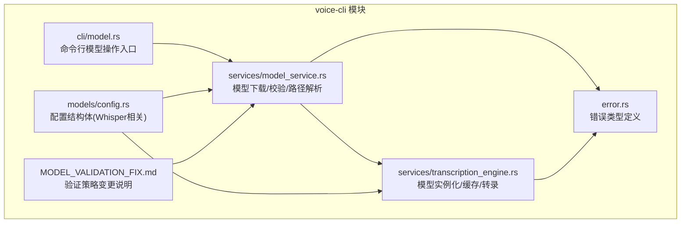
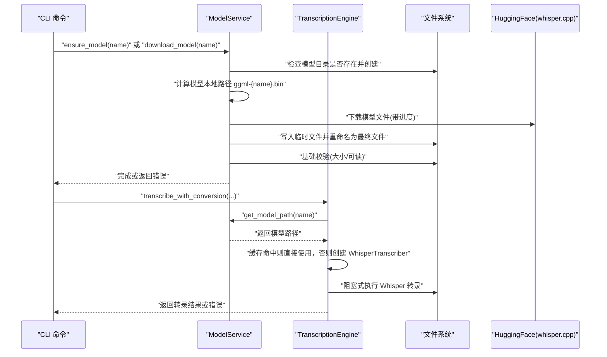
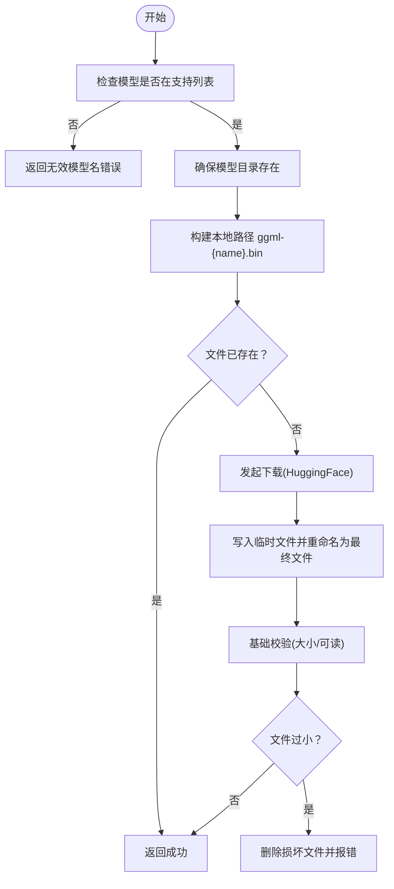
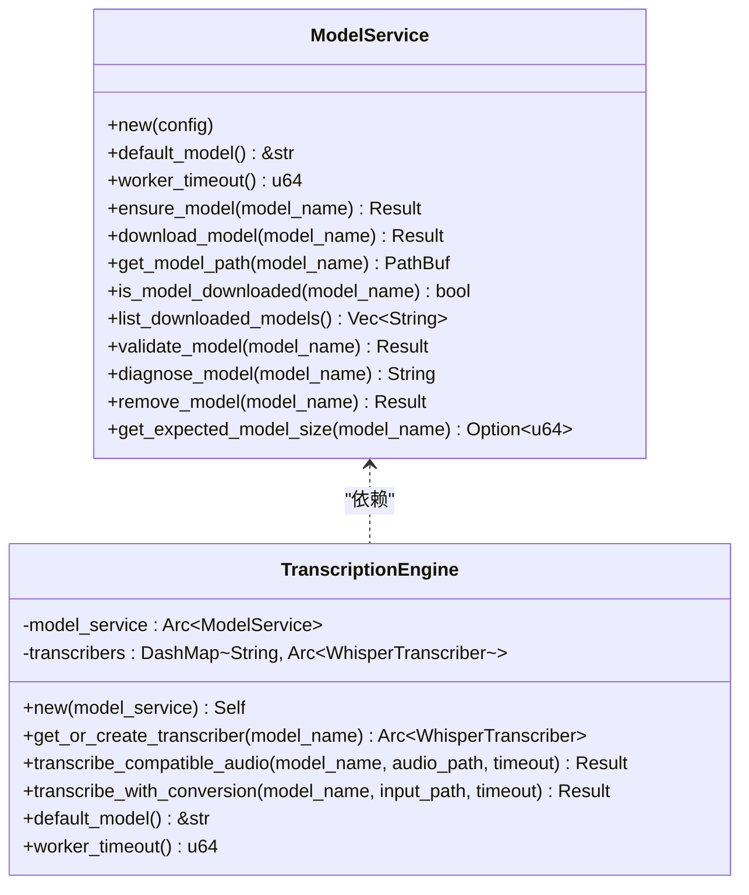
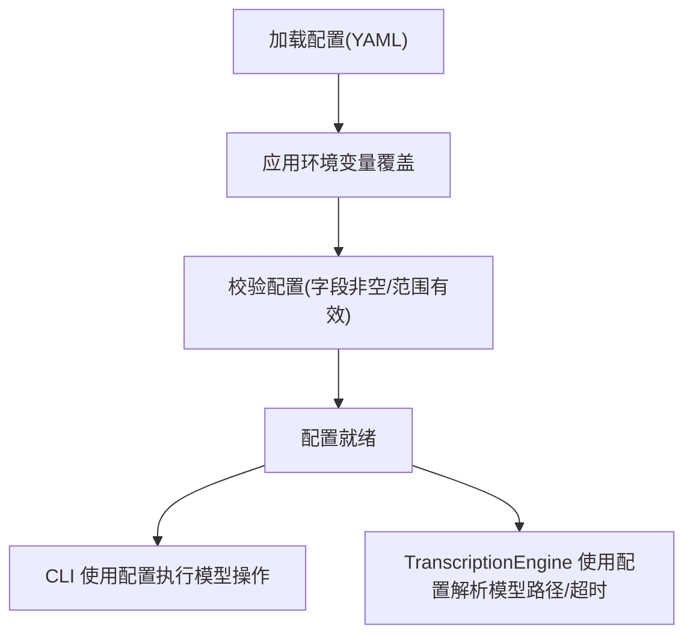
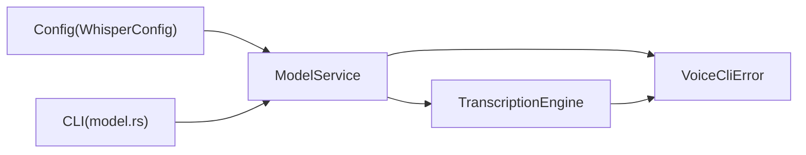

# 模型加载机制

<cite>
**本文引用的文件**
- [voice-cli/src/services/model_service.rs](file://voice-cli/src/services/model_service.rs)
- [voice-cli/src/services/transcription_engine.rs](file://voice-cli/src/services/transcription_engine.rs)
- [voice-cli/src/models/config.rs](file://voice-cli/src/models/config.rs)
- [voice-cli/src/cli/model.rs](file://voice-cli/src/cli/model.rs)
- [voice-cli/src/error.rs](file://voice-cli/src/error.rs)
- [voice-cli/MODEL_VALIDATION_FIX.md](file://voice-cli/MODEL_VALIDATION_FIX.md)
</cite>

## 目录
1. [简介](#简介)
2. [项目结构](#项目结构)
3. [核心组件](#核心组件)
4. [架构总览](#架构总览)
5. [详细组件分析](#详细组件分析)
6. [依赖关系分析](#依赖关系分析)
7. [性能考量](#性能考量)
8. [故障排查指南](#故障排查指南)
9. [结论](#结论)

## 简介
本文件聚焦于 voice-cli 子模块中 ModelService 的模型加载实现机制，围绕 Whisper 系列模型的配置解析、模型路径与名称解析、下载与校验、以及在 TranscriptionEngine 中的实例化与缓存策略进行深入说明。同时结合配置结构体 Config，梳理从配置读取到模型实例化的参数解析流程，并给出常见加载失败场景的诊断与恢复策略。

## 项目结构
voice-cli 子模块包含以下与模型加载直接相关的文件：
- services/model_service.rs：负责模型下载、校验、路径解析、大小估算与诊断
- services/transcription_engine.rs：负责模型实例化、缓存复用、阻塞式转录执行
- models/config.rs：定义配置结构体，包含 Whisper 模型相关字段
- cli/model.rs：命令行入口，封装模型下载、列出、校验、删除、诊断等操作
- error.rs：统一错误类型定义
- MODEL_VALIDATION_FIX.md：模型验证策略变更说明

图表来源
- [voice-cli/src/services/model_service.rs](file://voice-cli/src/services/model_service.rs#L1-L174)
- [voice-cli/src/services/transcription_engine.rs](file://voice-cli/src/services/transcription_engine.rs#L1-L158)
- [voice-cli/src/models/config.rs](file://voice-cli/src/models/config.rs#L1-L213)
- [voice-cli/src/cli/model.rs](file://voice-cli/src/cli/model.rs#L1-L243)
- [voice-cli/src/error.rs](file://voice-cli/src/error.rs#L1-L167)
- [voice-cli/MODEL_VALIDATION_FIX.md](file://voice-cli/MODEL_VALIDATION_FIX.md#L1-L85)

章节来源
- [voice-cli/src/services/model_service.rs](file://voice-cli/src/services/model_service.rs#L1-L174)
- [voice-cli/src/services/transcription_engine.rs](file://voice-cli/src/services/transcription_engine.rs#L1-L158)
- [voice-cli/src/models/config.rs](file://voice-cli/src/models/config.rs#L1-L213)
- [voice-cli/src/cli/model.rs](file://voice-cli/src/cli/model.rs#L1-L243)
- [voice-cli/src/error.rs](file://voice-cli/src/error.rs#L1-L167)
- [voice-cli/MODEL_VALIDATION_FIX.md](file://voice-cli/MODEL_VALIDATION_FIX.md#L1-L85)

## 核心组件
- ModelService：负责模型下载、本地路径解析、文件存在性与基本有效性校验、大小估算、诊断与删除等。
- TranscriptionEngine：负责模型实例化（WhisperTranscriber）、缓存复用、阻塞式转录执行、超时与错误处理。
- Config（models/config.rs）：定义 WhisperConfig、WorkersConfig、LoggingConfig 等，其中 WhisperConfig 包含默认模型、模型目录、是否自动下载、支持的模型列表等关键字段。
- CLI 命令：提供模型下载、列出、校验、删除、诊断等命令入口，内部委托 ModelService 执行。

章节来源
- [voice-cli/src/services/model_service.rs](file://voice-cli/src/services/model_service.rs#L1-L174)
- [voice-cli/src/services/transcription_engine.rs](file://voice-cli/src/services/transcription_engine.rs#L1-L158)
- [voice-cli/src/models/config.rs](file://voice-cli/src/models/config.rs#L1-L213)
- [voice-cli/src/cli/model.rs](file://voice-cli/src/cli/model.rs#L1-L243)

## 架构总览
Whisper 模型加载的关键流程如下：
- 配置解析：从 YAML 加载 Config，支持环境变量覆盖与校验。
- 模型路径解析：根据 WhisperConfig.models_dir 与模型名称拼接为 ggml-{name}.bin 的本地路径。
- 下载与校验：若未找到模型，按需自动下载；下载完成后进行基础校验（文件存在、大小合理、可读）。
- 实例化与缓存：TranscriptionEngine 通过 ModelService 提供的路径创建 WhisperTranscriber，并以模型名为键缓存，避免重复加载。
- 转录执行：在阻塞线程池中执行 Whisper 转录，支持超时控制与错误归类。

图表来源
- [voice-cli/src/cli/model.rs](file://voice-cli/src/cli/model.rs#L1-L243)
- [voice-cli/src/services/model_service.rs](file://voice-cli/src/services/model_service.rs#L35-L174)
- [voice-cli/src/services/transcription_engine.rs](file://voice-cli/src/services/transcription_engine.rs#L36-L158)

## 详细组件分析

### ModelService：模型下载与校验
- 模型路径解析
  - 通过 WhisperConfig.models_dir 与模型名称拼接为本地路径，文件命名规范为 ggml-{name}.bin。
  - 参考路径生成逻辑：[get_model_path](file://voice-cli/src/services/model_service.rs#L184-L188)。
- 自动下载
  - 若配置允许自动下载且模型不存在，则发起下载请求，目标地址来自 whisper.cpp 官方仓库（HuggingFace）。
  - 下载流程包含进度记录、临时文件写入与最终重命名、基础校验（文件大小阈值）。
  - 参考下载流程：[download_model](file://voice-cli/src/services/model_service.rs#L56-L174)。
- 基础校验与诊断
  - 校验规则：文件存在、大小合理（大于阈值）、可读。
  - 诊断功能：输出文件大小、期望大小、差异百分比、可读性与合理性提示。
  - 参考校验与诊断：[validate_model](file://voice-cli/src/services/model_service.rs#L263-L283)、[diagnose_model](file://voice-cli/src/services/model_service.rs#L401-L471)。
- 支持的模型列表与默认模型
  - WhisperConfig.supported_models 与 default_model 决定可用模型集合与默认模型。
  - 参考配置结构：[WhisperConfig](file://voice-cli/src/models/config.rs#L36-L50)、[默认值](file://voice-cli/src/models/config.rs#L162-L184)。
- 验证策略变更
  - 移除严格的 GGML/GGUF 魔数验证，改为仅检查存在性、大小与可读性，将复杂格式验证交由 whisper.cpp 引擎处理。
  - 参考变更说明：[MODEL_VALIDATION_FIX.md](file://voice-cli/MODEL_VALIDATION_FIX.md#L1-L85)。

图表来源
- [voice-cli/src/services/model_service.rs](file://voice-cli/src/services/model_service.rs#L56-L174)
- [voice-cli/MODEL_VALIDATION_FIX.md](file://voice-cli/MODEL_VALIDATION_FIX.md#L1-L85)

章节来源
- [voice-cli/src/services/model_service.rs](file://voice-cli/src/services/model_service.rs#L35-L174)
- [voice-cli/src/models/config.rs](file://voice-cli/src/models/config.rs#L36-L50)
- [voice-cli/MODEL_VALIDATION_FIX.md](file://voice-cli/MODEL_VALIDATION_FIX.md#L1-L85)

### TranscriptionEngine：模型实例化与缓存
- 实例化流程
  - 通过 ModelService.get_model_path 获取模型路径，若不存在则返回“模型未找到”错误。
  - 在阻塞线程池中创建 WhisperTranscriber，避免阻塞异步运行时。
  - 参考实例化与缓存：[get_or_create_transcriber](file://voice-cli/src/services/transcription_engine.rs#L36-L75)。
- 缓存策略
  - 使用 DashMap 以模型名为键缓存 WhisperTranscriber，避免重复加载模型与占用 VRAM。
  - 使用 entry API 处理并发插入的竞争条件。
  - 参考缓存实现：[transcribers 字段与 entry 使用](file://voice-cli/src/services/transcription_engine.rs#L1-L75)。
- 转录执行
  - 支持两种模式：直接对已兼容音频进行转录；或先转换为 Whisper 兼容格式再转录。
  - 转录在阻塞线程池中执行，并支持超时控制与错误分类。
  - 参考执行流程：[transcribe_compatible_audio](file://voice-cli/src/services/transcription_engine.rs#L77-L126)、[transcribe_with_conversion](file://voice-cli/src/services/transcription_engine.rs#L138-L158)。

图表来源
- [voice-cli/src/services/model_service.rs](file://voice-cli/src/services/model_service.rs#L1-L174)
- [voice-cli/src/services/transcription_engine.rs](file://voice-cli/src/services/transcription_engine.rs#L1-L158)

章节来源
- [voice-cli/src/services/transcription_engine.rs](file://voice-cli/src/services/transcription_engine.rs#L1-L158)

### 配置解析流程（基于 config.rs）
- 配置结构
  - WhisperConfig.default_model：默认模型名称
  - WhisperConfig.models_dir：模型文件存储目录
  - WhisperConfig.auto_download：是否自动下载
  - WhisperConfig.supported_models：支持的模型列表
  - WhisperConfig.workers：转录工作线程数、通道缓冲区大小、worker 超时
  - 参考结构体定义：[Config/WhisperConfig](file://voice-cli/src/models/config.rs#L1-L213)。
- 配置加载与覆盖
  - 从 YAML 文件加载，支持环境变量覆盖（如 VOICE_CLI_DEFAULT_MODEL、VOICE_CLI_MODELS_DIR、VOICE_CLI_AUTO_DOWNLOAD 等），并进行校验。
  - 参考加载与覆盖：[load_with_env_overrides](file://voice-cli/src/models/config.rs#L287-L588)、[apply_env_overrides](file://voice-cli/src/models/config.rs#L329-L588)、[validate](file://voice-cli/src/models/config.rs#L607-L707)。
- CLI 交互
  - CLI 层调用 ModelService 执行下载、列出、校验、删除、诊断等操作，并打印状态与建议。
  - 参考 CLI 命令：[handle_model_download](file://voice-cli/src/cli/model.rs#L1-L41)、[handle_model_list](file://voice-cli/src/cli/model.rs#L43-L92)、[handle_model_validate](file://voice-cli/src/cli/model.rs#L94-L127)、[handle_model_remove](file://voice-cli/src/cli/model.rs#L129-L156)、[ensure_default_model](file://voice-cli/src/cli/model.rs#L158-L191)、[handle_model_diagnose](file://voice-cli/src/cli/model.rs#L193-L243)。

图表来源
- [voice-cli/src/models/config.rs](file://voice-cli/src/models/config.rs#L287-L707)
- [voice-cli/src/cli/model.rs](file://voice-cli/src/cli/model.rs#L1-L243)
- [voice-cli/src/services/transcription_engine.rs](file://voice-cli/src/services/transcription_engine.rs#L1-L158)

章节来源
- [voice-cli/src/models/config.rs](file://voice-cli/src/models/config.rs#L1-L213)
- [voice-cli/src/cli/model.rs](file://voice-cli/src/cli/model.rs#L1-L243)

### 资源分配与加载策略
- 模型权重加载
  - ModelService 不直接加载模型权重，而是通过 whisper.cpp 引擎在 TranscriptionEngine 中创建 WhisperTranscriber 时完成加载。
  - 参考实例化：[WhisperTranscriber::new(cfg)](file://voice-cli/src/services/transcription_engine.rs#L51-L56)。
- 内存映射与显存占用
  - 代码中未见显式内存映射或显存参数设置逻辑；模型加载与显存占用由 whisper.cpp 引擎负责。
  - 缓存策略通过 DashMap 以模型名为键缓存 Transcriber，避免重复加载与 VRAM 占用。
  - 参考缓存：[transcribers 字段](file://voice-cli/src/services/transcription_engine.rs#L1-L25)。
- GPU 加速支持
  - 代码中未发现直接设置 GPU 设备或显存限制的逻辑；GPU 加速能力取决于 whisper.cpp 引擎与底层运行环境。
  - 参考验证策略变更：[MODEL_VALIDATION_FIX.md](file://voice-cli/MODEL_VALIDATION_FIX.md#L1-L85)。

章节来源
- [voice-cli/src/services/transcription_engine.rs](file://voice-cli/src/services/transcription_engine.rs#L1-L158)
- [voice-cli/MODEL_VALIDATION_FIX.md](file://voice-cli/MODEL_VALIDATION_FIX.md#L1-L85)

## 依赖关系分析
- 组件耦合
  - TranscriptionEngine 依赖 ModelService 提供模型路径与存在性判断。
  - ModelService 依赖 Config 结构体提供的模型目录、默认模型与支持列表。
  - CLI 命令层依赖 ModelService 执行具体模型操作。
- 错误类型
  - VoiceCliError 统一承载配置、模型、转录、网络、存储等错误，便于上层处理。
  - 参考错误类型：[VoiceCliError](file://voice-cli/src/error.rs#L1-L167)。

图表来源
- [voice-cli/src/models/config.rs](file://voice-cli/src/models/config.rs#L1-L213)
- [voice-cli/src/services/model_service.rs](file://voice-cli/src/services/model_service.rs#L1-L174)
- [voice-cli/src/services/transcription_engine.rs](file://voice-cli/src/services/transcription_engine.rs#L1-L158)
- [voice-cli/src/cli/model.rs](file://voice-cli/src/cli/model.rs#L1-L243)
- [voice-cli/src/error.rs](file://voice-cli/src/error.rs#L1-L167)

章节来源
- [voice-cli/src/error.rs](file://voice-cli/src/error.rs#L1-L167)

## 性能考量
- 缓存复用：TranscriptionEngine 使用 DashMap 缓存 WhisperTranscriber，避免重复加载模型，降低 VRAM 占用与启动开销。
- 阻塞式执行：转录在阻塞线程池中执行，避免阻塞异步运行时；同时支持超时控制，防止长时间占用。
- 下载优化：下载采用流式写入与临时文件重命名，减少中断风险；基础校验快速剔除明显损坏文件。
- 并发安全：缓存插入使用 entry API，避免竞态条件，提升并发稳定性。

章节来源
- [voice-cli/src/services/transcription_engine.rs](file://voice-cli/src/services/transcription_engine.rs#L1-L158)
- [voice-cli/src/services/model_service.rs](file://voice-cli/src/services/model_service.rs#L56-L174)

## 故障排查指南
- 常见失败原因
  - 路径错误：models_dir 配置不正确或无权限写入。
  - 权限不足：下载或读取模型文件失败。
  - 模型文件损坏：文件过小、可读性差或大小与期望差异过大。
  - 验证失败：早期严格验证导致的误判（现已调整策略）。
- 排查步骤
  - 使用 CLI 列出模型与状态：[handle_model_list](file://voice-cli/src/cli/model.rs#L43-L92)。
  - 诊断模型：[handle_model_diagnose](file://voice-cli/src/cli/model.rs#L193-L243)、[diagnose_model](file://voice-cli/src/services/model_service.rs#L401-L471)。
  - 校验模型：[validate_model](file://voice-cli/src/services/model_service.rs#L263-L283)。
  - 删除并重新下载：[handle_model_remove](file://voice-cli/src/cli/model.rs#L129-L156)、[handle_model_download](file://voice-cli/src/cli/model.rs#L1-L41)。
- 恢复策略
  - 若文件过小或不可读：删除后重新下载。
  - 若大小差异较大：确认是否为不同版本或变体，必要时更换模型版本。
  - 若网络异常：检查代理与可达性，重试下载。
  - 若权限问题：修正目录权限或切换到有权限的目录。

章节来源
- [voice-cli/src/cli/model.rs](file://voice-cli/src/cli/model.rs#L1-L243)
- [voice-cli/src/services/model_service.rs](file://voice-cli/src/services/model_service.rs#L263-L471)
- [voice-cli/MODEL_VALIDATION_FIX.md](file://voice-cli/MODEL_VALIDATION_FIX.md#L1-L85)

## 结论
ModelService 与 TranscriptionEngine 协同实现了 Whisper 模型的可靠加载与高效复用。通过配置驱动的路径解析、自动下载与基础校验、以及引擎侧的缓存与阻塞式执行，系统在保证易用性的同时兼顾了性能与稳定性。验证策略的简化使得模型加载更具容错性，将复杂格式校验留给 whisper.cpp 引擎处理。对于加载失败场景，CLI 提供了完善的诊断与恢复手段，便于快速定位与修复问题。