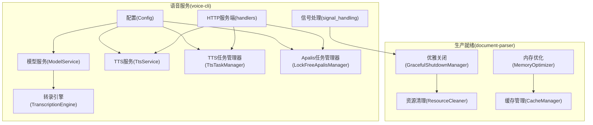
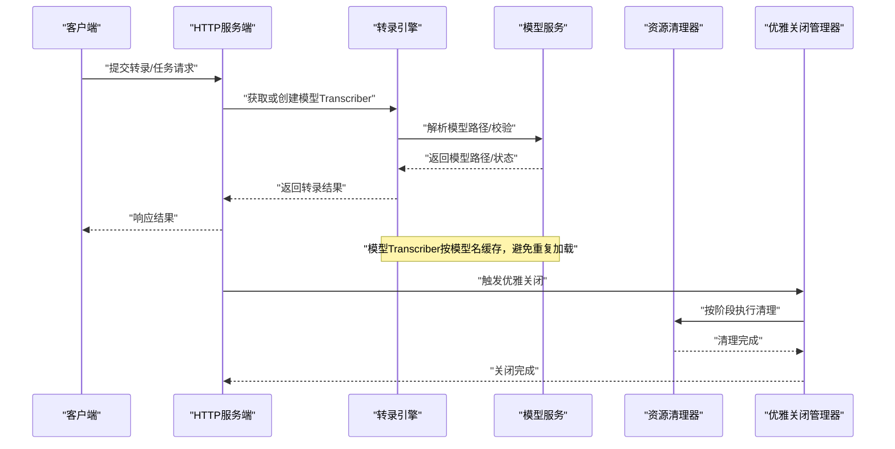
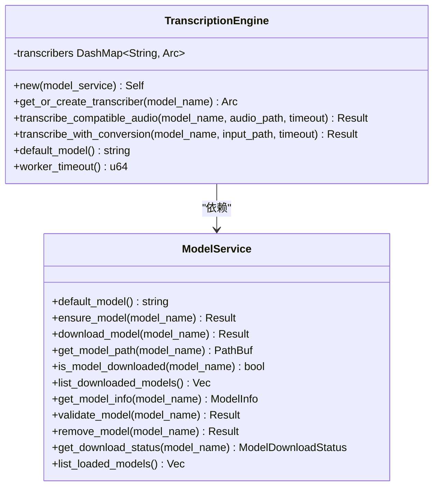
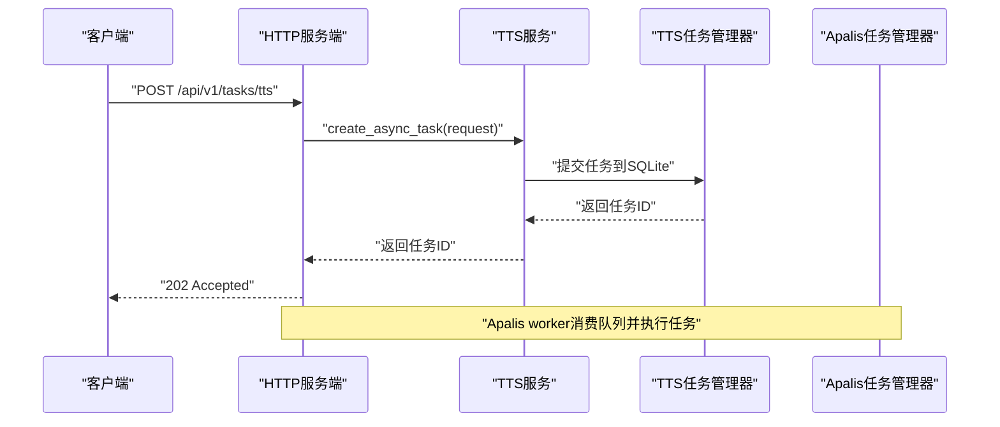
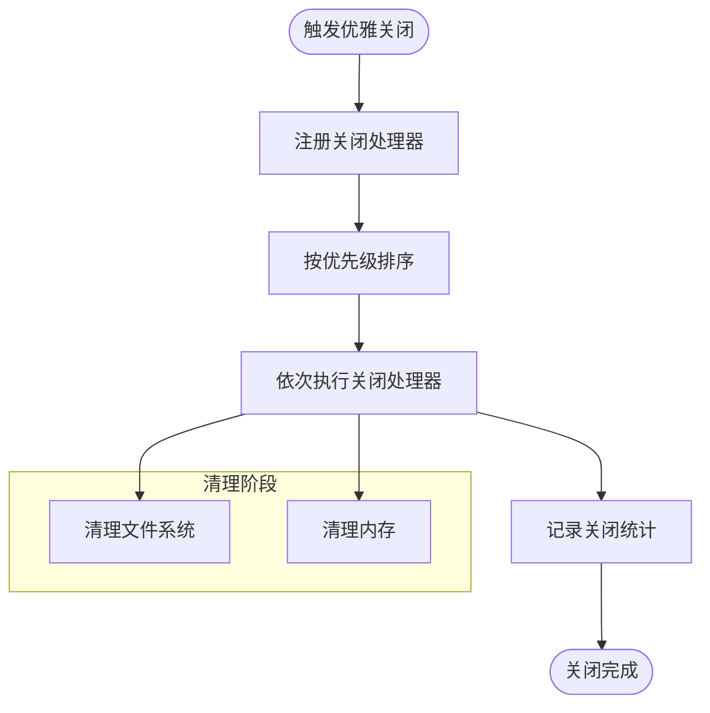
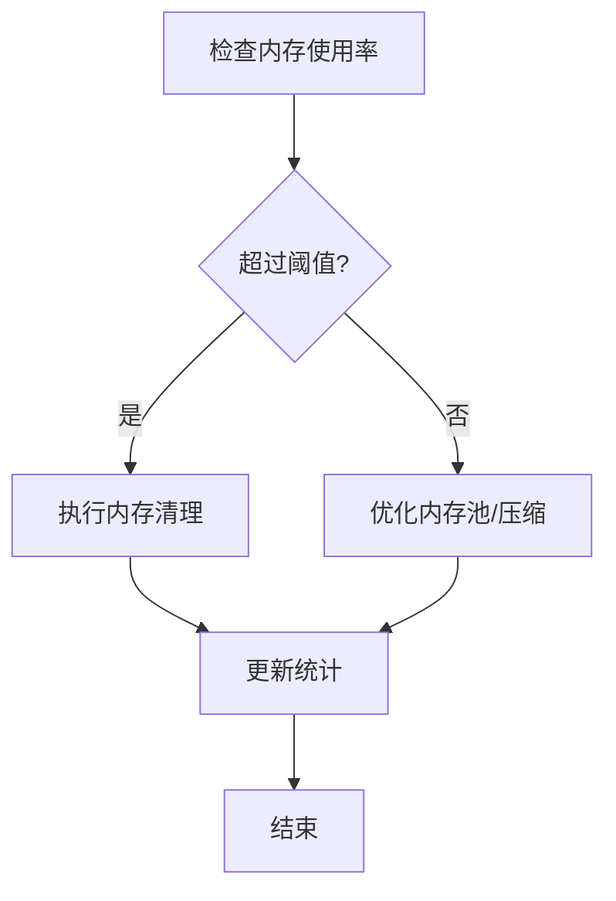
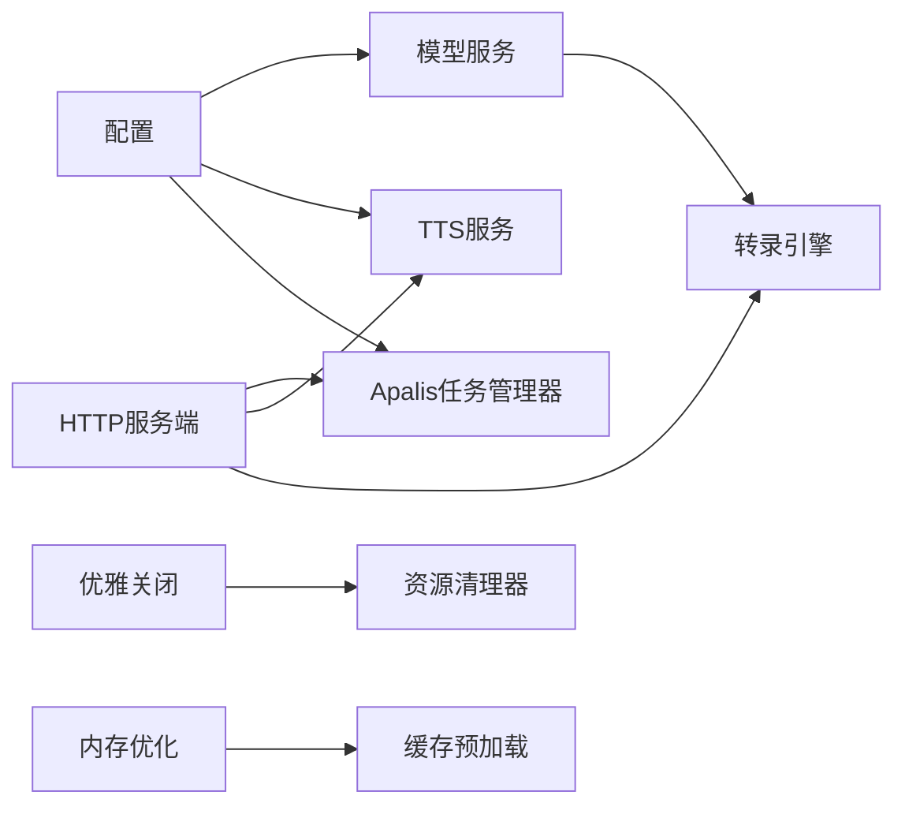

# 模型生命周期管理

<cite>
**本文引用的文件**
- [graceful_shutdown.rs](file://document-parser/src/production/graceful_shutdown.rs)
- [resource_cleanup.rs](file://document-parser/src/production/resource_cleanup.rs)
- [apalis_manager.rs](file://voice-cli/src/services/apalis_manager.rs)
- [transcription_engine.rs](file://voice-cli/src/services/transcription_engine.rs)
- [model_service.rs](file://voice-cli/src/services/model_service.rs)
- [tts_service.rs](file://voice-cli/src/services/tts_service.rs)
- [tts_task_manager.rs](file://voice-cli/src/services/tts_task_manager.rs)
- [handlers.rs](file://voice-cli/src/server/handlers.rs)
- [signal_handling.rs](file://voice-cli/src/utils/signal_handling.rs)
- [config.rs](file://voice-cli/src/models/config.rs)
- [memory_optimizer.rs](file://document-parser/src/performance/memory_optimizer.rs)
- [cache_manager.rs](file://document-parser/src/performance/cache_manager.rs)
- [DAEMON_BEST_PRACTICES.md](file://voice-cli/DAEMON_BEST_PRACTICES.md)
</cite>

## 目录
1. [引言](#引言)
2. [项目结构](#项目结构)
3. [核心组件](#核心组件)
4. [架构总览](#架构总览)
5. [详细组件分析](#详细组件分析)
6. [依赖关系分析](#依赖关系分析)
7. [性能考量](#性能考量)
8. [故障排查指南](#故障排查指南)
9. [结论](#结论)

## 引言
本文件围绕“模型生命周期管理”主题，系统阐述在本仓库中与TTS与转录模型相关的启动预加载、运行时热更新、空闲时自动卸载以及服务关闭时的优雅释放流程；同时说明如何通过任务管理器监控模型使用状态，并基于使用频率动态调整加载策略；结合资源清理机制，描述在内存紧张或长时间未使用情况下的模型卸载逻辑；最后给出日志追踪建议，帮助开发者监控模型状态变化并进行问题排查。

## 项目结构
- 语音服务模块位于 voice-cli，包含模型服务、转录引擎、TTS服务、任务管理器、HTTP服务端与信号处理等。
- 生产就绪与资源清理位于 document-parser，提供优雅关闭、资源清理、内存优化与缓存预加载等能力。
- 配置集中于 voice-cli 的配置模型，贯穿服务启动、任务并发、超时与清理策略。

图表来源
- [apalis_manager.rs](file://voice-cli/src/services/apalis_manager.rs#L196-L380)
- [transcription_engine.rs](file://voice-cli/src/services/transcription_engine.rs#L1-L158)
- [model_service.rs](file://voice-cli/src/services/model_service.rs#L1-L174)
- [tts_service.rs](file://voice-cli/src/services/tts_service.rs#L1-L120)
- [tts_task_manager.rs](file://voice-cli/src/services/tts_task_manager.rs#L1-L120)
- [handlers.rs](file://voice-cli/src/server/handlers.rs#L39-L82)
- [graceful_shutdown.rs](file://document-parser/src/production/graceful_shutdown.rs#L1-L120)
- [resource_cleanup.rs](file://document-parser/src/production/resource_cleanup.rs#L588-L785)
- [memory_optimizer.rs](file://document-parser/src/performance/memory_optimizer.rs#L1-L176)
- [cache_manager.rs](file://document-parser/src/performance/cache_manager.rs#L758-L820)

章节来源
- [config.rs](file://voice-cli/src/models/config.rs#L1-L136)
- [handlers.rs](file://voice-cli/src/server/handlers.rs#L39-L82)

## 核心组件
- 模型服务(ModelService)：负责模型下载、校验、路径解析与模型信息查询，为转录引擎提供模型基础能力。
- 转录引擎(TranscriptionEngine)：以模型为粒度缓存Transcriber实例，避免重复加载，提升并发性能。
- TTS服务(TtsService)：封装外部Python脚本进行TTS合成，支持同步与异步任务接口。
- Apalis任务管理器(LockFreeApalisManager)：基于Apalis+SQLite的任务队列与状态持久化，支撑转录流水线。
- TTS任务管理器(TtsTaskManager)：基于SQLite的任务持久化与状态查询，支撑TTS异步任务。
- 优雅关闭(GracefulShutdownManager)：统一注册关闭处理器，按优先级有序执行，保障资源清理与服务平滑下线。
- 资源清理(ResourceCleaner)：分阶段清理文件系统、内存、网络等资源，支持强制清理与超时控制。
- 内存优化(MemoryOptimizer)：内存池、压缩、监控与清理，用于内存紧张场景的主动回收。
- 缓存预加载(CachePreloader)：文档解析场景的缓存预加载，体现“基于使用频率”的动态加载策略思想。

章节来源
- [model_service.rs](file://voice-cli/src/services/model_service.rs#L1-L174)
- [transcription_engine.rs](file://voice-cli/src/services/transcription_engine.rs#L1-L158)
- [tts_service.rs](file://voice-cli/src/services/tts_service.rs#L1-L120)
- [apalis_manager.rs](file://voice-cli/src/services/apalis_manager.rs#L196-L380)
- [tts_task_manager.rs](file://voice-cli/src/services/tts_task_manager.rs#L1-L120)
- [graceful_shutdown.rs](file://document-parser/src/production/graceful_shutdown.rs#L1-L120)
- [resource_cleanup.rs](file://document-parser/src/production/resource_cleanup.rs#L588-L785)
- [memory_optimizer.rs](file://document-parser/src/performance/memory_optimizer.rs#L1-L176)
- [cache_manager.rs](file://document-parser/src/performance/cache_manager.rs#L758-L820)

## 架构总览
模型生命周期管理贯穿“启动—运行—空闲—关闭”全链路：
- 启动时预加载：模型服务确保模型存在，转录引擎按需创建并缓存Transcriber；TTS服务初始化Python脚本路径。
- 运行时热更新：转录引擎通过DashMap缓存模型对应的Transcriber，避免重复加载；TTS服务通过外部脚本执行，不涉及模型热替换。
- 空闲时自动卸载：内存优化器在内存压力阈值触发清理；缓存预加载器记录预加载统计，体现“智能预加载”思路；模型服务提供“列出已加载模型”的占位接口，便于后续扩展。
- 服务关闭时优雅释放：优雅关闭管理器按优先级依次执行关闭处理器，资源清理器统一清理文件系统与内存资源。

图表来源
- [handlers.rs](file://voice-cli/src/server/handlers.rs#L39-L82)
- [transcription_engine.rs](file://voice-cli/src/services/transcription_engine.rs#L1-L158)
- [model_service.rs](file://voice-cli/src/services/model_service.rs#L1-L174)
- [graceful_shutdown.rs](file://document-parser/src/production/graceful_shutdown.rs#L1-L120)
- [resource_cleanup.rs](file://document-parser/src/production/resource_cleanup.rs#L588-L785)

## 详细组件分析

### 模型服务与转录引擎：预加载与缓存
- 模型服务负责模型下载、校验与路径解析；转录引擎以模型名为键缓存Transcriber实例，避免重复构造与加载。
- 该缓存策略实现了“启动时预加载”的效果：首次请求某模型时创建并缓存，后续请求直接命中，显著降低延迟与CPU开销。

图表来源
- [model_service.rs](file://voice-cli/src/services/model_service.rs#L1-L174)
- [transcription_engine.rs](file://voice-cli/src/services/transcription_engine.rs#L1-L158)

章节来源
- [model_service.rs](file://voice-cli/src/services/model_service.rs#L1-L174)
- [transcription_engine.rs](file://voice-cli/src/services/transcription_engine.rs#L1-L158)

### TTS服务与任务管理：异步调度与状态持久化
- TTS服务封装外部Python脚本执行，支持同步与异步任务；异步任务通过TTS任务管理器持久化到SQLite，支持状态查询与统计。
- Apalis任务管理器提供基于Apalis+SQLite的任务队列与状态持久化，支撑转录流水线的可靠执行。

图表来源
- [handlers.rs](file://voice-cli/src/server/handlers.rs#L959-L972)
- [tts_service.rs](file://voice-cli/src/services/tts_service.rs#L216-L244)
- [tts_task_manager.rs](file://voice-cli/src/services/tts_task_manager.rs#L110-L159)
- [apalis_manager.rs](file://voice-cli/src/services/apalis_manager.rs#L317-L380)

章节来源
- [tts_service.rs](file://voice-cli/src/services/tts_service.rs#L216-L244)
- [tts_task_manager.rs](file://voice-cli/src/services/tts_task_manager.rs#L110-L159)
- [apalis_manager.rs](file://voice-cli/src/services/apalis_manager.rs#L317-L380)

### 优雅关闭与资源清理：分阶段释放
- 优雅关闭管理器按优先级注册处理器（应用状态、资源清理、数据库、HTTP服务器），统一执行关闭流程并记录统计。
- 资源清理器按阶段清理文件系统、内存、网络等资源，支持强制清理与超时控制，确保服务平滑下线。

图表来源
- [graceful_shutdown.rs](file://document-parser/src/production/graceful_shutdown.rs#L1-L120)
- [graceful_shutdown.rs](file://document-parser/src/production/graceful_shutdown.rs#L283-L317)
- [resource_cleanup.rs](file://document-parser/src/production/resource_cleanup.rs#L588-L785)

章节来源
- [graceful_shutdown.rs](file://document-parser/src/production/graceful_shutdown.rs#L1-L120)
- [graceful_shutdown.rs](file://document-parser/src/production/graceful_shutdown.rs#L283-L317)
- [resource_cleanup.rs](file://document-parser/src/production/resource_cleanup.rs#L588-L785)

### 内存优化与缓存预加载：动态卸载与智能预加载
- 内存优化器在内存使用超过阈值时主动清理，包括内存池清理与可选的垃圾回收触发；提供内存使用统计与压缩比率。
- 缓存预加载器记录预加载与智能预加载次数，体现“基于使用频率”的动态加载策略思想，可用于指导模型缓存策略。

图表来源
- [memory_optimizer.rs](file://document-parser/src/performance/memory_optimizer.rs#L1-L176)
- [cache_manager.rs](file://document-parser/src/performance/cache_manager.rs#L758-L820)

章节来源
- [memory_optimizer.rs](file://document-parser/src/performance/memory_optimizer.rs#L1-L176)
- [cache_manager.rs](file://document-parser/src/performance/cache_manager.rs#L758-L820)

### 信号处理与守护模式最佳实践
- 信号处理模块提供统一的Ctrl+C与SIGTERM处理入口，支持超时与组合信号处理，便于在守护模式下优雅接收停止信号。
- 守护模式最佳实践文档提供了现代、安全的守护实现建议，强调无unsafe代码、Tokio任务管理与优雅生命周期。

章节来源
- [signal_handling.rs](file://voice-cli/src/utils/signal_handling.rs#L146-L198)
- [DAEMON_BEST_PRACTICES.md](file://voice-cli/DAEMON_BEST_PRACTICES.md#L45-L97)

## 依赖关系分析
- 服务端初始化时创建模型服务、TTS服务、Apalis任务管理器与音频文件管理器，并注入到应用状态。
- 转录引擎依赖模型服务解析模型路径；TTS服务依赖配置中的Python路径与脚本路径。
- 优雅关闭管理器依赖资源清理器；内存优化器与缓存预加载器作为独立组件参与运行期资源治理。

图表来源
- [handlers.rs](file://voice-cli/src/server/handlers.rs#L39-L82)
- [config.rs](file://voice-cli/src/models/config.rs#L116-L136)
- [graceful_shutdown.rs](file://document-parser/src/production/graceful_shutdown.rs#L1-L120)
- [memory_optimizer.rs](file://document-parser/src/performance/memory_optimizer.rs#L1-L176)
- [cache_manager.rs](file://document-parser/src/performance/cache_manager.rs#L758-L820)

章节来源
- [handlers.rs](file://voice-cli/src/server/handlers.rs#L39-L82)
- [config.rs](file://voice-cli/src/models/config.rs#L116-L136)

## 性能考量
- 模型缓存：转录引擎以模型名缓存Transcriber，避免重复加载，显著降低CPU与I/O开销。
- 并发与超时：配置中提供任务并发数、超时时间与重试次数，避免资源争用与阻塞。
- 内存压力应对：内存优化器在阈值触发清理，必要时可强制GC；缓存预加载器记录预加载统计，辅助决策是否继续预热。
- I/O与磁盘：资源清理器支持清理临时文件与未使用资源，减少磁盘占用。

章节来源
- [transcription_engine.rs](file://voice-cli/src/services/transcription_engine.rs#L1-L158)
- [config.rs](file://voice-cli/src/models/config.rs#L236-L247)
- [memory_optimizer.rs](file://document-parser/src/performance/memory_optimizer.rs#L1-L176)
- [resource_cleanup.rs](file://document-parser/src/production/resource_cleanup.rs#L588-L785)

## 故障排查指南
- 模型下载与校验
  - 使用模型服务的下载与校验接口，确认模型文件存在且大小合理；若文件过小或损坏，可诊断并移除后重新下载。
- 转录引擎缓存
  - 若出现模型加载缓慢，检查是否存在大量并发请求导致缓存未命中；可通过增加并发或优化预热策略缓解。
- 任务状态与统计
  - 通过TTS任务管理器查询任务状态与统计，定位积压、失败或超时任务；Apalis任务管理器提供任务信息与结果的持久化查询。
- 优雅关闭与资源清理
  - 若关闭卡顿，检查优雅关闭处理器执行顺序与耗时；确认资源清理阶段是否成功完成；必要时启用强制清理与超时控制。
- 日志追踪
  - 关注服务启动、模型下载、任务提交、任务处理、关闭流程等关键节点的日志；结合信号处理日志判断是否正确接收停止信号。

章节来源
- [model_service.rs](file://voice-cli/src/services/model_service.rs#L227-L326)
- [tts_task_manager.rs](file://voice-cli/src/services/tts_task_manager.rs#L161-L248)
- [apalis_manager.rs](file://voice-cli/src/services/apalis_manager.rs#L544-L663)
- [graceful_shutdown.rs](file://document-parser/src/production/graceful_shutdown.rs#L1-L120)
- [signal_handling.rs](file://voice-cli/src/utils/signal_handling.rs#L146-L198)

## 结论
本仓库在模型生命周期管理方面形成了较为完善的闭环：启动时通过模型服务与转录引擎的缓存机制实现“预加载”，运行时以任务管理器与信号处理保障稳定与可控，空闲时通过内存优化与资源清理主动回收，服务关闭时通过优雅关闭管理器与资源清理器实现平滑释放。未来可在“模型热更新”与“基于使用频率的动态卸载”方面进一步完善，例如在转录引擎中引入模型LRU淘汰策略与动态卸载阈值，以适配更复杂的模型管理需求。