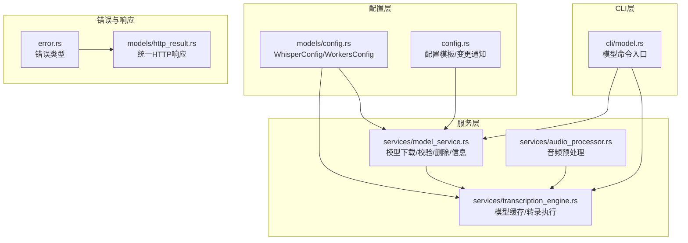
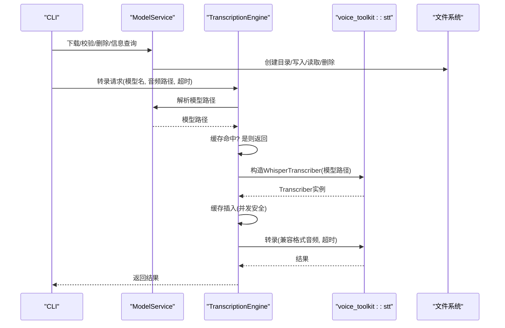
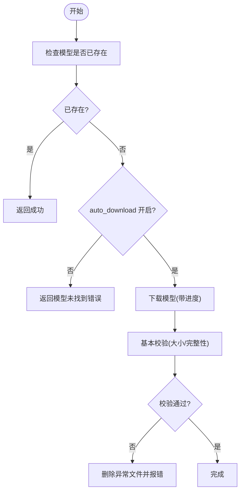
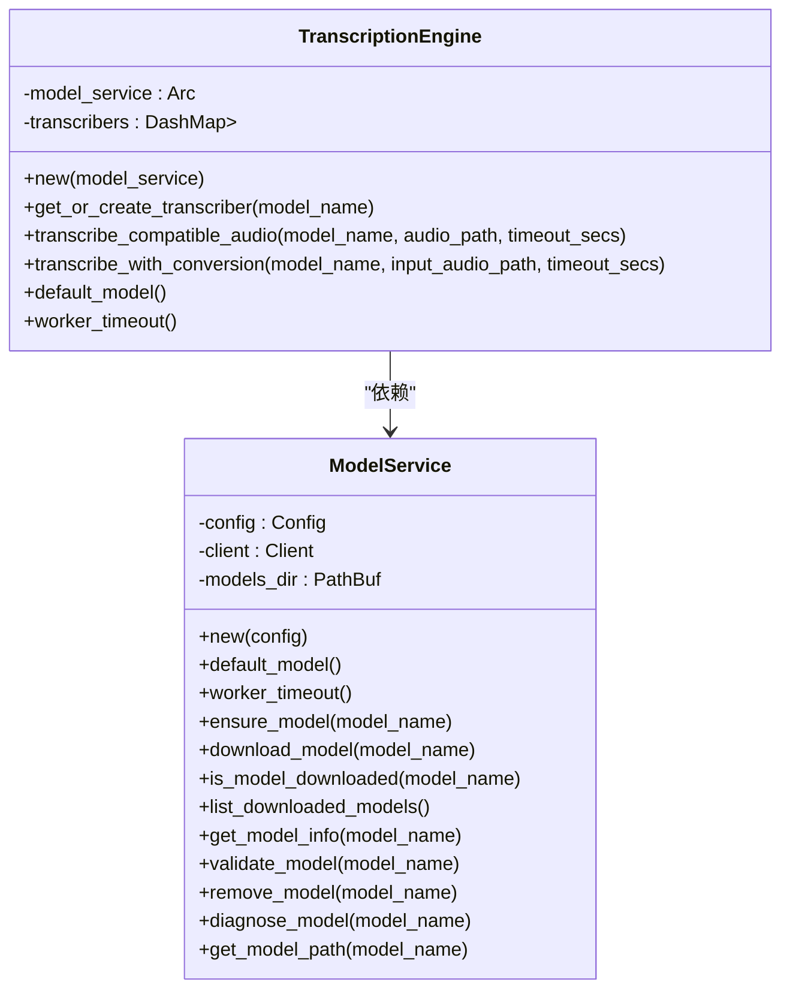
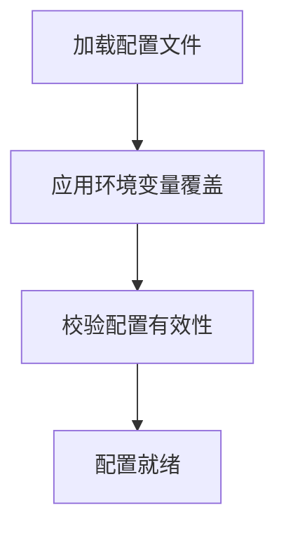
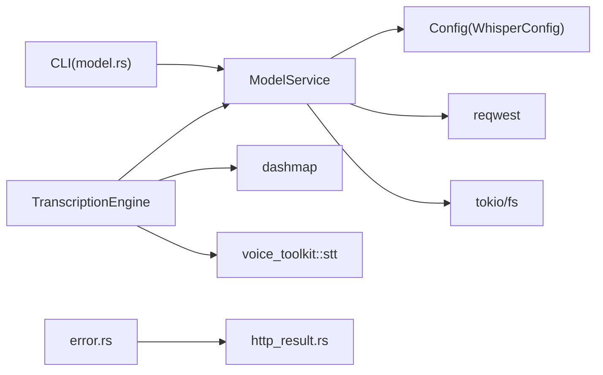

# 模型管理

<cite>
**本文引用的文件**
- [voice-cli/src/services/model_service.rs](file://voice-cli/src/services/model_service.rs)
- [voice-cli/src/services/transcription_engine.rs](file://voice-cli/src/services/transcription_engine.rs)
- [voice-cli/src/models/config.rs](file://voice-cli/src/models/config.rs)
- [voice-cli/src/config.rs](file://voice-cli/src/config.rs)
- [voice-cli/src/cli/model.rs](file://voice-cli/src/cli/model.rs)
- [voice-cli/src/error.rs](file://voice-cli/src/error.rs)
- [voice-cli/src/models/http_result.rs](file://voice-cli/src/models/http_result.rs)
- [voice-cli/src/services/audio_processor.rs](file://voice-cli/src/services/audio_processor.rs)
</cite>

## 目录
1. [简介](#简介)
2. [项目结构](#项目结构)
3. [核心组件](#核心组件)
4. [架构总览](#架构总览)
5. [详细组件分析](#详细组件分析)
6. [依赖关系分析](#依赖关系分析)
7. [性能考量](#性能考量)
8. [故障排查指南](#故障排查指南)
9. [结论](#结论)
10. [附录](#附录)

## 简介
本章节聚焦于语音处理服务中的模型管理机制，系统性阐述 ModelService 如何加载、缓存与管理 Whisper 系列语音识别模型；如何通过配置参数控制模型路径、默认模型名称、自动下载开关与工作线程等；以及 TranscriptionEngine 的模型缓存复用、并发安全与超时控制。同时结合 config.rs 中的配置结构体，解释模型资源的初始化流程与生命周期管理，并给出多模型并发使用的最佳实践与低内存环境下的优化策略。最后通过序列图与流程图直观展示模型调用过程与下载诊断流程。

## 项目结构
围绕模型管理的关键文件组织如下：
- 配置层：models/config.rs 定义 WhisperConfig、WorkersConfig 等结构体；config.rs 提供配置模板与变更通知。
- 服务层：model_service.rs 实现模型下载、校验、删除与信息查询；transcription_engine.rs 提供模型缓存复用与转录执行。
- CLI 层：cli/model.rs 提供模型命令入口，包括下载、列出、验证、移除与诊断。
- 错误与统一响应：error.rs 定义错误类型；models/http_result.rs 将错误映射为统一 HTTP 响应。

图表来源
- [voice-cli/src/models/config.rs](file://voice-cli/src/models/config.rs#L36-L74)
- [voice-cli/src/config.rs](file://voice-cli/src/config.rs#L1-L93)
- [voice-cli/src/services/model_service.rs](file://voice-cli/src/services/model_service.rs#L1-L174)
- [voice-cli/src/services/transcription_engine.rs](file://voice-cli/src/services/transcription_engine.rs#L1-L158)
- [voice-cli/src/services/audio_processor.rs](file://voice-cli/src/services/audio_processor.rs#L1-L200)
- [voice-cli/src/cli/model.rs](file://voice-cli/src/cli/model.rs#L1-L243)
- [voice-cli/src/error.rs](file://voice-cli/src/error.rs#L1-L167)
- [voice-cli/src/models/http_result.rs](file://voice-cli/src/models/http_result.rs#L1-L169)

章节来源
- [voice-cli/src/models/config.rs](file://voice-cli/src/models/config.rs#L36-L74)
- [voice-cli/src/services/model_service.rs](file://voice-cli/src/services/model_service.rs#L1-L174)
- [voice-cli/src/services/transcription_engine.rs](file://voice-cli/src/services/transcription_engine.rs#L1-L158)
- [voice-cli/src/cli/model.rs](file://voice-cli/src/cli/model.rs#L1-L243)
- [voice-cli/src/error.rs](file://voice-cli/src/error.rs#L1-L167)
- [voice-cli/src/models/http_result.rs](file://voice-cli/src/models/http_result.rs#L1-L169)

## 核心组件
- ModelService：负责模型下载、存在性检查、文件校验、删除与信息查询；提供模型路径解析与预期大小估算；支持诊断模型问题。
- TranscriptionEngine：基于 ModelService 解析模型路径，缓存 WhisperTranscriber 实例以避免重复加载；提供兼容格式的转录与超时控制；支持自动音频格式转换。
- WhisperConfig/WorkersConfig：定义默认模型、模型目录、自动下载、支持模型列表、音频处理与工作线程等配置项。
- CLI 模型命令：封装下载、列出、验证、移除与诊断模型的用户交互逻辑。
- 错误与响应：统一错误类型与 HTTP 响应格式，便于上层调用方处理。

章节来源
- [voice-cli/src/services/model_service.rs](file://voice-cli/src/services/model_service.rs#L1-L174)
- [voice-cli/src/services/transcription_engine.rs](file://voice-cli/src/services/transcription_engine.rs#L1-L158)
- [voice-cli/src/models/config.rs](file://voice-cli/src/models/config.rs#L36-L74)
- [voice-cli/src/cli/model.rs](file://voice-cli/src/cli/model.rs#L1-L243)
- [voice-cli/src/error.rs](file://voice-cli/src/error.rs#L1-L167)
- [voice-cli/src/models/http_result.rs](file://voice-cli/src/models/http_result.rs#L1-L169)

## 架构总览
模型管理的整体流程由“配置驱动 + 服务编排 + 缓存复用 + 超时控制”构成。配置层决定模型路径、默认模型与并发参数；ModelService 负责模型文件的生命周期管理；TranscriptionEngine 在保证并发安全的前提下复用模型实例，避免重复加载带来的 CPU/显存开销；CLI 层提供用户友好的模型管理命令；错误与响应层统一错误语义与 HTTP 输出。

图表来源
- [voice-cli/src/cli/model.rs](file://voice-cli/src/cli/model.rs#L1-L243)
- [voice-cli/src/services/model_service.rs](file://voice-cli/src/services/model_service.rs#L1-L174)
- [voice-cli/src/services/transcription_engine.rs](file://voice-cli/src/services/transcription_engine.rs#L1-L158)

## 详细组件分析

### ModelService：模型下载、校验与生命周期
- 模型路径解析：根据配置的 models_dir 与模型名生成本地文件路径，文件命名规范为 ggml-{model_name}.bin。
- 自动下载：当 auto_download 为真且模型未存在时，从 Hugging Face ggerganov 组织的 whisper.cpp 仓库下载对应模型文件，支持进度跟踪与最终校验。
- 存在性检查与列表：判断模型是否存在；扫描 models_dir 下符合命名规范的模型文件并过滤出受支持的模型列表。
- 校验与诊断：基本校验包括文件大小合理性与预期大小差异不超过 20%；诊断输出包含文件大小、可读性与建议修复步骤。
- 删除与信息：删除模型文件；查询模型信息（大小、状态占位、内存使用占位）。

图表来源
- [voice-cli/src/services/model_service.rs](file://voice-cli/src/services/model_service.rs#L35-L174)

章节来源
- [voice-cli/src/services/model_service.rs](file://voice-cli/src/services/model_service.rs#L1-L174)

### TranscriptionEngine：模型缓存复用与并发安全
- 缓存策略：以模型名为键，缓存 Arc<WhisperTranscriber> 实例，避免重复构造与加载；使用 DashMap 提供并发安全的插入与查询。
- 构造与超时：在阻塞线程池中创建 Transcriber，避免阻塞事件循环；对转录操作设置超时，超时或错误进行统一映射。
- 音频预处理：若输入非 Whisper 兼容格式，先在阻塞线程中转换为兼容格式（16kHz、单声道、16-bit PCM WAV），再进行转录。
- 默认模型与超时：从 ModelService 读取默认模型与 worker 超时配置，作为转录执行的默认参数。

图表来源
- [voice-cli/src/services/transcription_engine.rs](file://voice-cli/src/services/transcription_engine.rs#L1-L158)
- [voice-cli/src/services/model_service.rs](file://voice-cli/src/services/model_service.rs#L1-L174)

章节来源
- [voice-cli/src/services/transcription_engine.rs](file://voice-cli/src/services/transcription_engine.rs#L1-L158)

### 配置参数与初始化流程（config.rs）
- WhisperConfig：包含 default_model、models_dir、auto_download、supported_models、audio_processing、workers 等字段，默认值覆盖了常见 Whisper 模型族与工作线程数。
- WorkersConfig：包含 transcription_workers、channel_buffer_size、worker_timeout，用于控制并发与超时。
- 配置加载与环境变量覆盖：支持从文件加载配置并在运行时应用环境变量覆盖；提供保存、路径解析与校验。
- 初始化流程：应用加载 -> 环境变量覆盖 -> 校验 -> 使用。

图表来源
- [voice-cli/src/models/config.rs](file://voice-cli/src/models/config.rs#L270-L326)
- [voice-cli/src/models/config.rs](file://voice-cli/src/models/config.rs#L329-L588)
- [voice-cli/src/models/config.rs](file://voice-cli/src/models/config.rs#L607-L706)

章节来源
- [voice-cli/src/models/config.rs](file://voice-cli/src/models/config.rs#L36-L74)
- [voice-cli/src/models/config.rs](file://voice-cli/src/models/config.rs#L162-L183)
- [voice-cli/src/models/config.rs](file://voice-cli/src/models/config.rs#L205-L212)
- [voice-cli/src/models/config.rs](file://voice-cli/src/models/config.rs#L270-L326)
- [voice-cli/src/models/config.rs](file://voice-cli/src/models/config.rs#L329-L588)
- [voice-cli/src/models/config.rs](file://voice-cli/src/models/config.rs#L607-L706)

### CLI 模型管理命令
- 下载：校验模型名是否受支持，若不存在则触发下载。
- 列表：打印受支持模型与已下载模型信息。
- 校验：遍历已下载模型进行基本校验。
- 移除：删除指定模型文件。
- 诊断：输出模型诊断报告与修复建议。

章节来源
- [voice-cli/src/cli/model.rs](file://voice-cli/src/cli/model.rs#L1-L243)

### 错误处理与统一响应
- 错误类型：涵盖配置、模型、转录、音频处理、网络、存储、任务管理等场景。
- 统一响应：将错误映射为标准 HTTP 响应体，包含状态码与错误信息，便于前端或客户端处理。

章节来源
- [voice-cli/src/error.rs](file://voice-cli/src/error.rs#L1-L167)
- [voice-cli/src/models/http_result.rs](file://voice-cli/src/models/http_result.rs#L1-L169)

## 依赖关系分析
- ModelService 依赖 Config（whisper 配置）、reqwest（下载）、tokio/fs（异步文件操作）、tracing（日志）。
- TranscriptionEngine 依赖 ModelService（模型路径解析）、dashmap（并发缓存）、voice_toolkit::stt（转录引擎）、tokio（超时与阻塞线程池）。
- CLI 模型命令依赖 ModelService 与 Config。
- 错误与响应层被 CLI 与服务层广泛使用。

图表来源
- [voice-cli/src/services/model_service.rs](file://voice-cli/src/services/model_service.rs#L1-L174)
- [voice-cli/src/services/transcription_engine.rs](file://voice-cli/src/services/transcription_engine.rs#L1-L158)
- [voice-cli/src/cli/model.rs](file://voice-cli/src/cli/model.rs#L1-L243)
- [voice-cli/src/error.rs](file://voice-cli/src/error.rs#L1-L167)
- [voice-cli/src/models/http_result.rs](file://voice-cli/src/models/http_result.rs#L1-L169)

## 性能考量
- 模型缓存复用：TranscriptionEngine 使用 DashMap 缓存 WhisperTranscriber，避免重复加载，降低 CPU 与显存开销。
- 并发与超时：通过 WorkersConfig 控制并发工作线程数与超时时间；转录过程在阻塞线程池中执行并设置超时，防止长时间阻塞。
- 音频预处理：在阻塞线程中进行格式转换，避免阻塞事件循环；AudioProcessor 对转换失败提供回退提示。
- 低内存优化建议：
  - 选择较小模型（如 tiny/base）以减少加载与推理开销。
  - 控制并发数与通道缓冲区大小，避免过多并发导致内存峰值过高。
  - 合理设置 worker_timeout，及时回收长时间占用的资源。
  - 定期清理不再使用的模型文件，释放磁盘空间。
  - 在容器或受限环境中，限制最大并发与任务队列长度，配合健康检查与资源监控。

章节来源
- [voice-cli/src/services/transcription_engine.rs](file://voice-cli/src/services/transcription_engine.rs#L1-L158)
- [voice-cli/src/models/config.rs](file://voice-cli/src/models/config.rs#L66-L74)
- [voice-cli/src/services/audio_processor.rs](file://voice-cli/src/services/audio_processor.rs#L1-L200)

## 故障排查指南
- 模型未找到：确认 models_dir 是否正确、模型名是否在 supported_models 中、auto_download 是否开启。
- 下载失败：检查网络连通性、HTTP 状态码与下载进度；查看日志中的错误信息。
- 校验失败：使用 diagnose_model 输出诊断报告，按建议删除后重新下载。
- 转录超时：增大 worker_timeout 或减少并发；检查模型大小与硬件性能。
- 音频格式问题：确保输入格式受支持或启用自动转换；检查转换日志与临时文件清理策略。

章节来源
- [voice-cli/src/services/model_service.rs](file://voice-cli/src/services/model_service.rs#L175-L266)
- [voice-cli/src/services/transcription_engine.rs](file://voice-cli/src/services/transcription_engine.rs#L77-L158)
- [voice-cli/src/cli/model.rs](file://voice-cli/src/cli/model.rs#L193-L243)
- [voice-cli/src/error.rs](file://voice-cli/src/error.rs#L1-L167)

## 结论
本项目通过清晰的配置驱动与服务分层，实现了 Whisper 模型的可靠管理与高效复用。ModelService 负责模型文件的生命周期管理，TranscriptionEngine 在并发安全前提下复用模型实例并提供超时控制，CLI 提供完善的用户交互。结合合理的并发与内存策略，可在多模型并发使用与低内存环境下稳定运行。

## 附录
- 实际代码片段路径示例（不直接展示代码内容）：
  - 模型下载流程：[voice-cli/src/services/model_service.rs](file://voice-cli/src/services/model_service.rs#L56-L174)
  - 模型缓存与转录：[voice-cli/src/services/transcription_engine.rs](file://voice-cli/src/services/transcription_engine.rs#L36-L126)
  - 配置加载与环境变量覆盖：[voice-cli/src/models/config.rs](file://voice-cli/src/models/config.rs#L270-L588)
  - CLI 模型命令入口：[voice-cli/src/cli/model.rs](file://voice-cli/src/cli/model.rs#L1-L243)
  - 错误与统一响应映射：[voice-cli/src/error.rs](file://voice-cli/src/error.rs#L1-L167), [voice-cli/src/models/http_result.rs](file://voice-cli/src/models/http_result.rs#L93-L169)