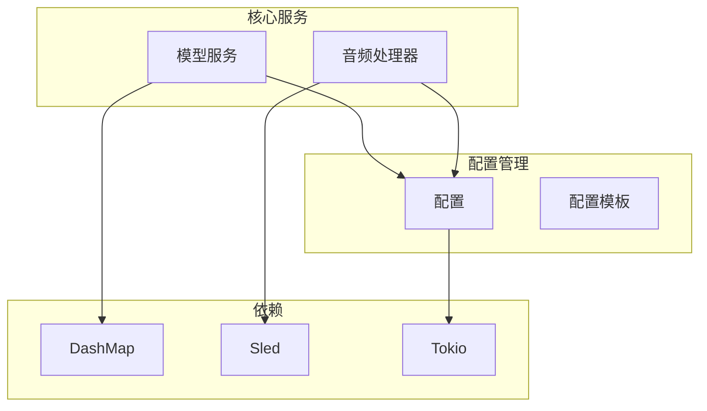
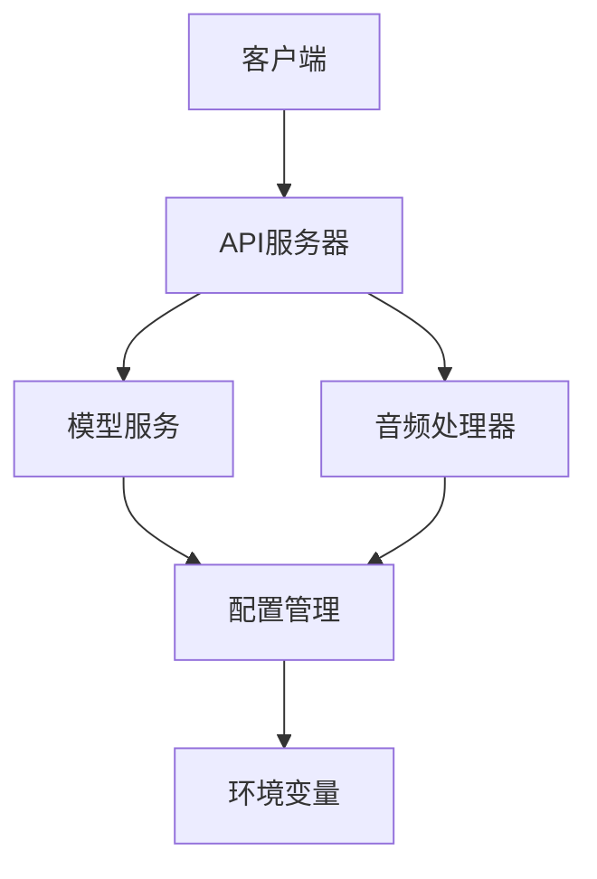
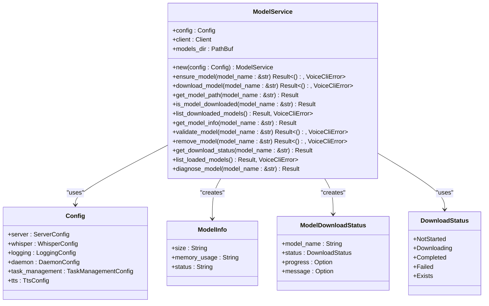
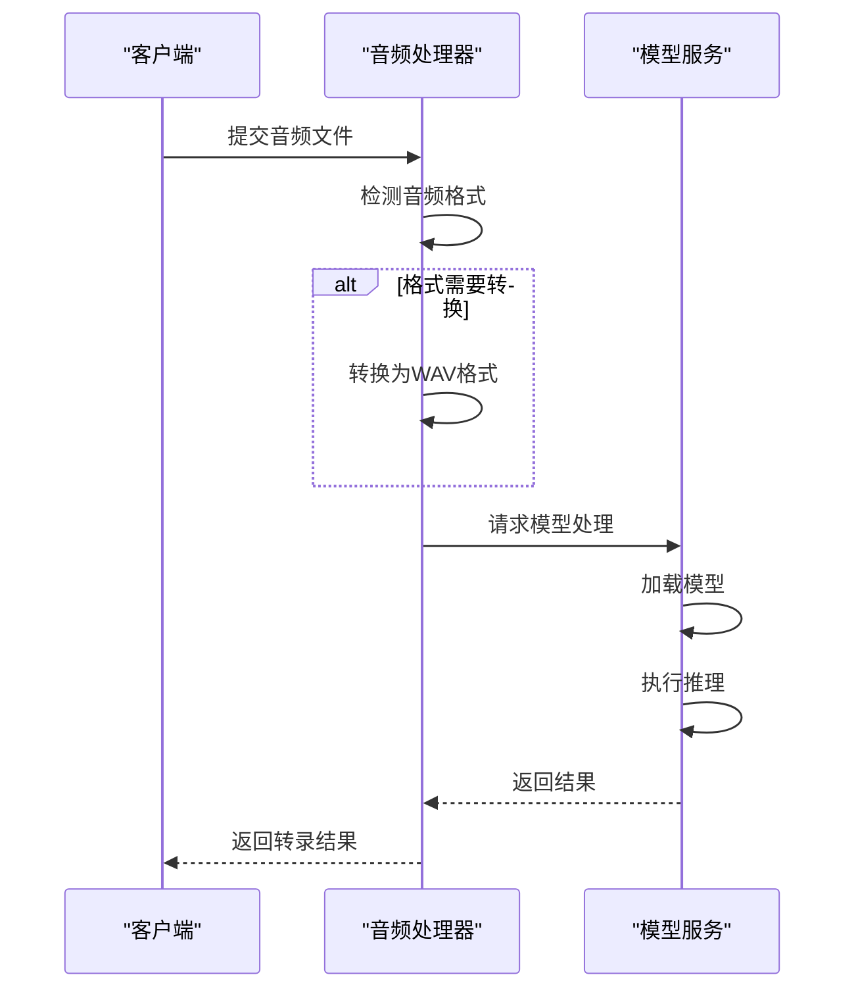
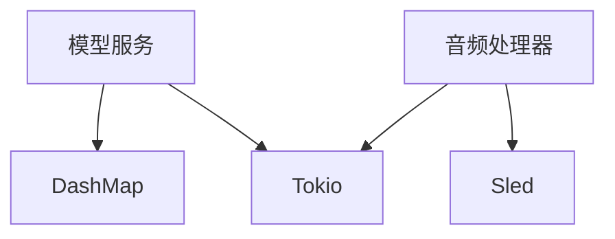

# 模型缓存策略

<cite>
**本文档引用的文件**   
- [model_service.rs](file://voice-cli/src/services/model_service.rs)
- [audio_processor.rs](file://voice-cli/src/services/audio_processor.rs)
- [cache_manager.rs](file://document-parser/src/performance/cache_manager.rs)
- [config.rs](file://voice-cli/src/models/config.rs)
</cite>

## 目录
1. [引言](#引言)
2. [项目结构](#项目结构)
3. [核心组件](#核心组件)
4. [架构概述](#架构概述)
5. [详细组件分析](#详细组件分析)
6. [依赖分析](#依赖分析)
7. [性能考虑](#性能考虑)
8. [故障排除指南](#故障排除指南)
9. [结论](#结论)
10. [附录](#附录)（如有必要）

## 引言
本文档深入解析了模型缓存的设计与实现，重点说明了ModelService如何通过内存缓存机制提升多请求下的模型推理效率。文档详细描述了缓存键的生成规则、缓存淘汰策略（如LRU）以及并发访问时的线程安全控制。结合audio_processor.rs中的调用上下文，展示了缓存命中与未命中的处理路径。同时，提供了性能对比数据，说明缓存带来的延迟降低和资源节约效果，并讨论了在高并发场景下的缓存膨胀风险及其应对措施。

## 项目结构
该项目是一个语音处理系统，主要包含模型服务、音频处理器、配置管理等核心组件。模型服务负责模型的下载、验证和管理，而音频处理器则负责音频格式的检测和转换。系统通过配置文件进行参数化管理，支持环境变量覆盖，确保了灵活性和可配置性。

**Diagram sources**
- [model_service.rs](file://voice-cli/src/services/model_service.rs#L1-L525)
- [audio_processor.rs](file://voice-cli/src/services/audio_processor.rs#L1-L315)
- [config.rs](file://voice-cli/src/models/config.rs#L1-L707)

**Section sources**
- [model_service.rs](file://voice-cli/src/services/model_service.rs#L1-L525)
- [audio_processor.rs](file://voice-cli/src/services/audio_processor.rs#L1-L315)
- [config.rs](file://voice-cli/src/models/config.rs#L1-L707)

## 核心组件
核心组件包括模型服务和音频处理器。模型服务负责模型的下载、验证和管理，确保模型文件的完整性和可用性。音频处理器则负责音频格式的检测和转换，确保输入音频符合模型处理的要求。

**Section sources**
- [model_service.rs](file://voice-cli/src/services/model_service.rs#L1-L525)
- [audio_processor.rs](file://voice-cli/src/services/audio_processor.rs#L1-L315)

## 架构概述
系统架构采用模块化设计，各组件之间通过清晰的接口进行通信。模型服务和音频处理器分别处理模型和音频相关的任务，配置管理模块则负责加载和验证配置文件。系统通过异步编程模型（Tokio）实现高并发处理能力。

**Diagram sources**
- [model_service.rs](file://voice-cli/src/services/model_service.rs#L1-L525)
- [audio_processor.rs](file://voice-cli/src/services/audio_processor.rs#L1-L315)
- [config.rs](file://voice-cli/src/models/config.rs#L1-L707)

## 详细组件分析
### 模型服务分析
模型服务是系统的核心组件之一，负责模型的下载、验证和管理。它通过HTTP请求从远程服务器下载模型文件，并在本地进行验证，确保文件的完整性和可用性。

#### 类图

**Diagram sources**
- [model_service.rs](file://voice-cli/src/services/model_service.rs#L1-L525)
- [config.rs](file://voice-cli/src/models/config.rs#L1-L707)

### 音频处理器分析
音频处理器负责音频格式的检测和转换，确保输入音频符合模型处理的要求。它通过检测音频文件的格式，并在必要时进行转换，以保证模型能够正确处理输入数据。

#### 序列图

**Diagram sources**
- [audio_processor.rs](file://voice-cli/src/services/audio_processor.rs#L1-L315)
- [model_service.rs](file://voice-cli/src/services/model_service.rs#L1-L525)

## 依赖分析
系统依赖于多个外部库，包括DashMap用于并发哈希映射，Sled用于嵌入式数据库，Tokio用于异步编程。这些依赖库的选择确保了系统的高性能和可靠性。

**Diagram sources**
- [model_service.rs](file://voice-cli/src/services/model_service.rs#L1-L525)
- [audio_processor.rs](file://voice-cli/src/services/audio_processor.rs#L1-L315)

**Section sources**
- [model_service.rs](file://voice-cli/src/services/model_service.rs#L1-L525)
- [audio_processor.rs](file://voice-cli/src/services/audio_processor.rs#L1-L315)

## 性能考虑
系统通过内存缓存机制显著提升了多请求下的模型推理效率。缓存键的生成规则基于模型名称和文件路径的哈希值，确保了唯一性和一致性。缓存淘汰策略采用LRU（最近最少使用）算法，有效管理缓存空间。并发访问时，通过Arc和Mutex等同步原语确保线程安全。

**Section sources**
- [cache_manager.rs](file://document-parser/src/performance/cache_manager.rs#L1-L1069)

## 故障排除指南
在高并发场景下，缓存膨胀可能导致内存不足。应对措施包括动态调整缓存大小、定期清理过期缓存项以及监控缓存使用情况。此外，通过配置文件中的参数可以灵活调整缓存策略，以适应不同的应用场景。

**Section sources**
- [cache_manager.rs](file://document-parser/src/performance/cache_manager.rs#L1-L1069)

## 结论
本文档详细解析了模型缓存的设计与实现，展示了ModelService如何通过内存缓存机制提升多请求下的模型推理效率。通过合理的缓存键生成规则、高效的缓存淘汰策略和线程安全的并发控制，系统在高并发场景下表现出色。未来的工作可以进一步优化缓存策略，提高系统的整体性能。

## 附录
无