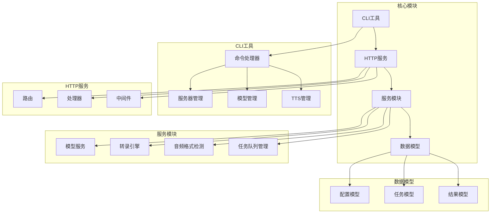
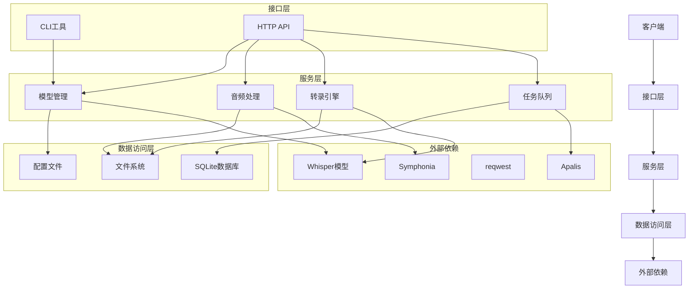
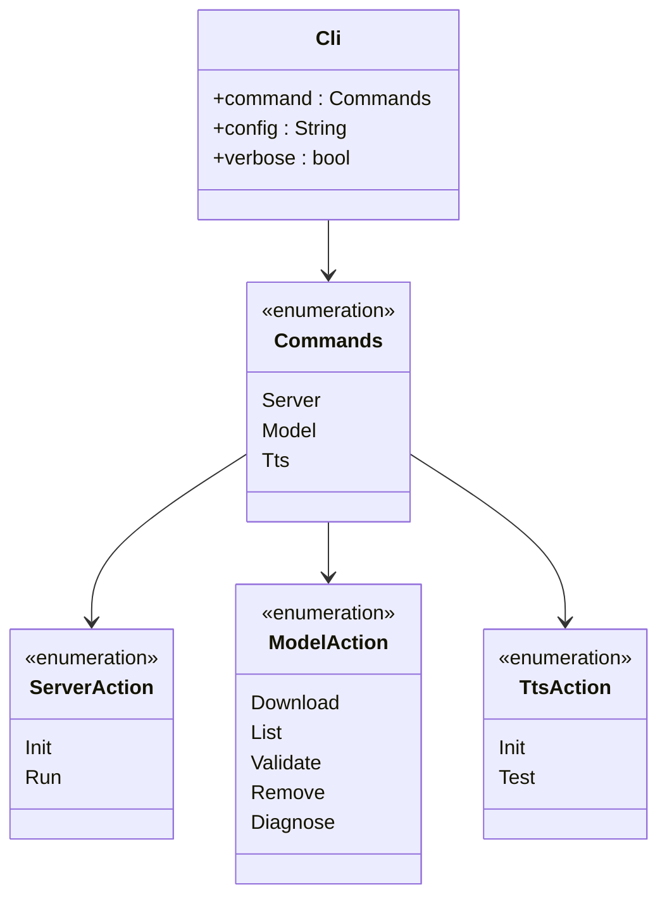
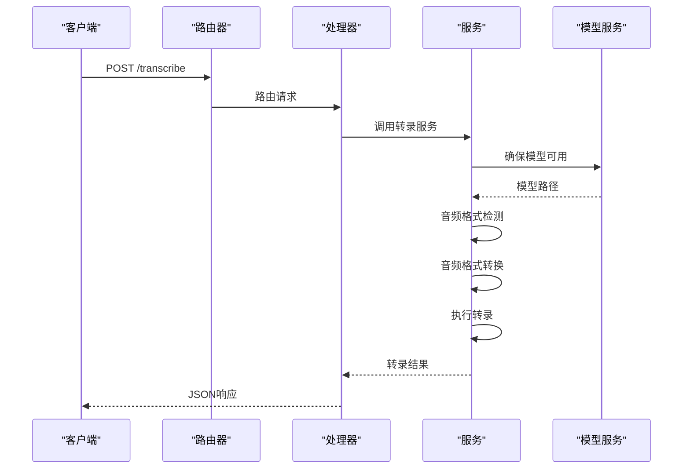
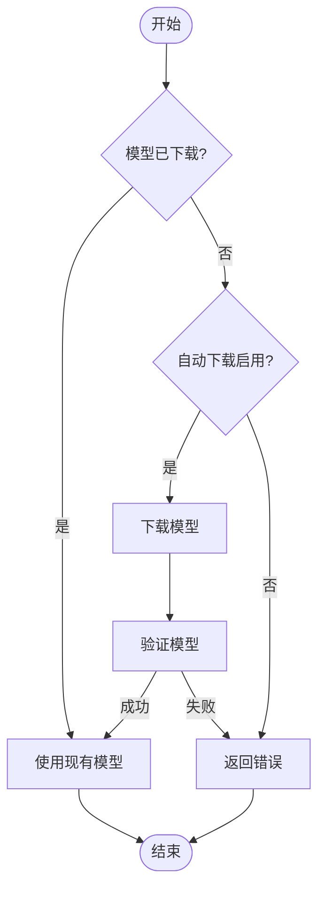
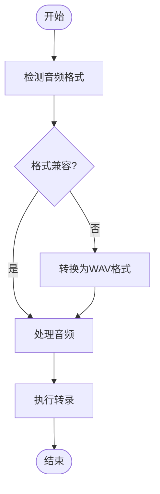
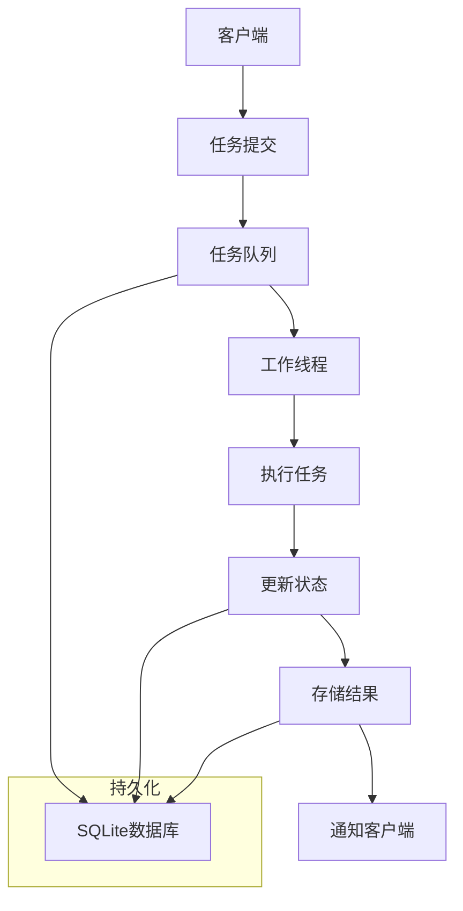
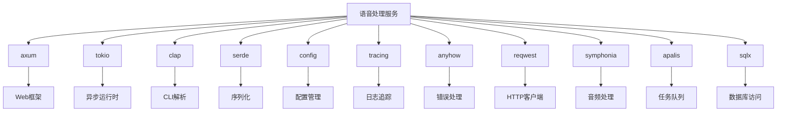

# 语音处理服务

<cite>
**本文档引用的文件**   
- [main.rs](file://voice-cli/src/main.rs)
- [mod.rs](file://voice-cli/src/cli/mod.rs)
- [server-config.yml.template](file://voice-cli/src/templates/server-config.yml.template)
- [server.rs](file://voice-cli/src/server/mod.rs)
- [routes.rs](file://voice-cli/src/server/routes.rs)
- [handlers.rs](file://voice-cli/src/server/handlers.rs)
- [config.rs](file://voice-cli/src/config.rs)
- [config.rs](file://voice-cli/src/models/config.rs)
- [model_service.rs](file://voice-cli/src/services/model_service.rs)
- [transcription_engine.rs](file://voice-cli/src/services/transcription_engine.rs)
- [audio_format_detector.rs](file://voice-cli/src/services/audio_format_detector.rs)
- [apalis_manager.rs](file://voice-cli/src/services/apalis_manager.rs)
- [API_DOCUMENTATION.md](file://voice-cli/API_DOCUMENTATION.md)
- [README.md](file://voice-cli/README.md)
- [Cargo.toml](file://voice-cli/Cargo.toml)
</cite>

## 目录
1. [简介](#简介)
2. [项目结构](#项目结构)
3. [核心组件](#核心组件)
4. [架构概述](#架构概述)
5. [详细组件分析](#详细组件分析)
6. [依赖分析](#依赖分析)
7. [性能考虑](#性能考虑)
8. [故障排除指南](#故障排除指南)
9. [结论](#结论)

## 简介
语音处理服务是一个基于Rust构建的高性能语音转文字HTTP服务，利用Whisper模型提供准确的语音识别能力。该服务支持多种音频格式，包括MP3、WAV、FLAC、M4A、AAC和OGG等主流格式，并通过智能音频处理技术实现自动格式转换。服务采用模块化设计，包含CLI工具、HTTP API接口和后台守护进程，支持单节点部署模式，适用于小规模使用场景。系统提供RESTful API接口和实时监控功能，确保服务的稳定性和可靠性。

## 项目结构
语音处理服务的项目结构清晰，主要分为以下几个核心模块：



**Diagram sources**
- [main.rs](file://voice-cli/src/main.rs#L1-L220)
- [mod.rs](file://voice-cli/src/cli/mod.rs#L1-L89)
- [server.rs](file://voice-cli/src/server/mod.rs#L1-L367)

**Section sources**
- [main.rs](file://voice-cli/src/main.rs#L1-L220)
- [mod.rs](file://voice-cli/src/cli/mod.rs#L1-L89)

## 核心组件

语音处理服务的核心组件包括CLI工具、HTTP服务器、模型管理服务、音频处理引擎和任务队列系统。CLI工具提供命令行接口，支持服务器管理、模型管理和TTS管理等功能。HTTP服务器基于Axum框架构建，提供RESTful API接口，支持健康检查、模型列表查询和语音转录等功能。模型管理服务负责Whisper模型的下载、验证和管理，支持tiny、base、small、medium和large系列模型。音频处理引擎集成Symphonia库，实现多格式音频检测和转换。任务队列系统基于Apalis构建，支持异步任务处理和持久化存储。

**Section sources**
- [server.rs](file://voice-cli/src/server/mod.rs#L1-L367)
- [routes.rs](file://voice-cli/src/server/routes.rs#L1-L82)
- [model_service.rs](file://voice-cli/src/services/model_service.rs#L1-L525)

## 架构概述

语音处理服务采用分层架构设计，主要包括接口层、服务层、数据访问层和外部依赖层。接口层提供CLI和HTTP两种访问方式，服务层包含核心业务逻辑，数据访问层负责配置文件和数据库操作，外部依赖层集成第三方库和工具。



**Diagram sources**
- [server.rs](file://voice-cli/src/server/mod.rs#L1-L367)
- [routes.rs](file://voice-cli/src/server/routes.rs#L1-L82)
- [model_service.rs](file://voice-cli/src/services/model_service.rs#L1-L525)

## 详细组件分析

### CLI工具分析
CLI工具是语音处理服务的主要交互界面，提供服务器管理、模型管理和TTS管理三大功能模块。服务器管理支持初始化配置和运行服务，模型管理支持下载、列出、验证和删除Whisper模型，TTS管理支持环境初始化和功能测试。

#### CLI工具类图


**Diagram sources**
- [main.rs](file://voice-cli/src/main.rs#L1-L220)
- [mod.rs](file://voice-cli/src/cli/mod.rs#L1-L89)

### 服务器架构分析
服务器架构基于Axum框架构建，采用模块化设计，包含路由、处理器、中间件和应用状态等组件。路由系统定义了健康检查、模型查询和语音转录等API端点，处理器实现具体的业务逻辑，中间件处理跨切面关注点，应用状态管理共享资源。

#### 服务器处理流程序列图


**Diagram sources**
- [server.rs](file://voice-cli/src/server/mod.rs#L1-L367)
- [routes.rs](file://voice-cli/src/server/routes.rs#L1-L82)
- [handlers.rs](file://voice-cli/src/server/handlers.rs)

### 模型管理分析
模型管理服务负责Whisper模型的全生命周期管理，包括下载、验证、列表查询和删除等操作。服务支持自动下载功能，可根据配置自动获取所需的模型文件。模型文件存储在本地文件系统中，路径由配置文件指定。

#### 模型管理流程图


**Diagram sources**
- [model_service.rs](file://voice-cli/src/services/model_service.rs#L1-L525)
- [config.rs](file://voice-cli/src/models/config.rs#L1-L707)

### 音频处理分析
音频处理引擎负责音频格式检测和转换，确保输入音频符合Whisper模型的要求。引擎集成Symphonia库，支持多种音频格式的检测，包括MP3、WAV、FLAC、M4A、AAC和OGG。对于不兼容的格式，引擎会自动转换为WAV格式。

#### 音频处理流程图


**Diagram sources**
- [audio_format_detector.rs](file://voice-cli/src/services/audio_format_detector.rs#L1-L326)
- [transcription_engine.rs](file://voice-cli/src/services/transcription_engine.rs#L1-L158)

### 任务队列分析
任务队列系统基于Apalis构建，支持异步任务处理和持久化存储。系统使用SQLite数据库存储任务状态，确保任务的可靠性和持久性。任务队列支持任务提交、状态查询、结果获取、取消和重试等操作。

#### 任务队列架构图


**Diagram sources**
- [apalis_manager.rs](file://voice-cli/src/services/apalis_manager.rs)
- [task_management_config.rs](file://voice-cli/src/models/config.rs#L98-L114)

## 依赖分析

语音处理服务依赖多个第三方库和工具，主要包括：



**Diagram sources**
- [Cargo.toml](file://voice-cli/Cargo.toml#L1-L108)
- [config.rs](file://voice-cli/src/models/config.rs#L1-L707)

## 性能考虑

语音处理服务在设计时充分考虑了性能优化，主要体现在以下几个方面：

1. **并发处理**：服务支持多工作线程并发处理转录任务，工作线程数可配置。
2. **模型缓存**：转录引擎缓存已加载的模型，避免重复加载和VRAM占用。
3. **异步I/O**：基于Tokio异步运行时，所有I/O操作均为非阻塞。
4. **内存优化**：使用DashMap进行并发哈希映射，提高多线程环境下的性能。
5. **资源管理**：合理管理文件句柄和网络连接，避免资源泄漏。

服务的性能表现受以下因素影响：
- 模型大小：large模型需要更多内存和计算资源
- 音频长度：长音频需要更长的处理时间
- 并发任务数：高并发可能导致资源竞争
- 硬件配置：GPU加速可显著提升处理速度

## 故障排除指南

### 常见问题及解决方案

**Section sources**
- [README.md](file://voice-cli/README.md#L226-L266)
- [API_DOCUMENTATION.md](file://voice-cli/API_DOCUMENTATION.md#L259-L276)

#### 端口被占用
```bash
# 检查端口占用
lsof -i :8080

# 杀死占用进程
kill -9 <PID>

# 或者修改配置端口
VOICE_CLI_PORT=8081 ./voice-cli server run
```

#### 模型下载失败
```bash
# 检查网络连接
curl -I https://huggingface.co

# 手动下载模型
# 模型下载到 ./models/ggml-{model_name}.bin
```

#### 内存不足
```bash
# 使用较小的模型
VOICE_CLI_DEFAULT_MODEL=tiny ./voice-cli server run

# 减少工作线程
VOICE_CLI_TRANSCRIPTION_WORKERS=1 ./voice-cli server run
```

#### 调试模式
```bash
# 启用详细日志
RUST_LOG=debug ./voice-cli server run

# 查看实时日志
tail -f ./logs/server.log
```

## 结论
语音处理服务提供了一个完整、高效的语音转文字解决方案，具有以下优势：
- **高性能**：基于Rust构建，充分利用系统资源
- **易用性**：提供CLI和HTTP API两种访问方式
- **可扩展性**：模块化设计，易于扩展和维护
- **可靠性**：支持任务持久化和错误恢复
- **灵活性**：支持多种模型和音频格式

服务适用于需要语音转文字功能的各种场景，从小型个人项目到企业级应用均可使用。通过合理的配置和优化，可以满足不同规模和性能要求的需求。