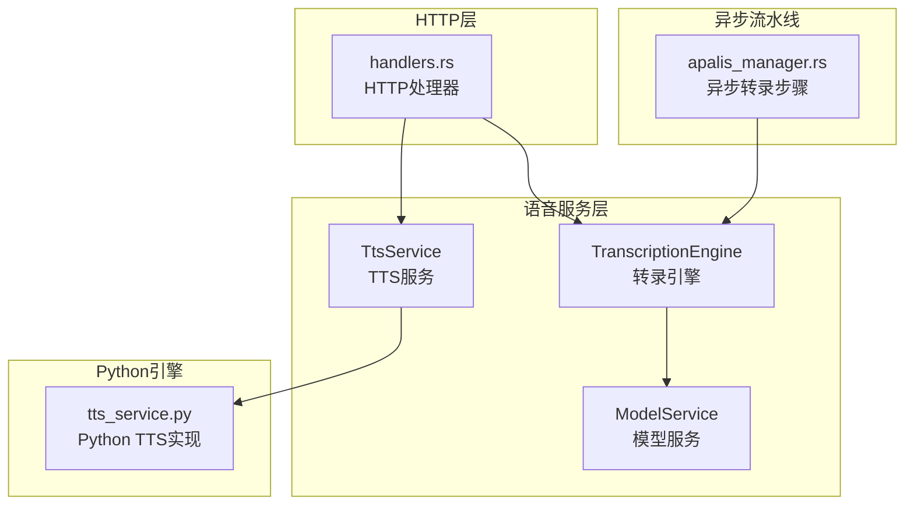
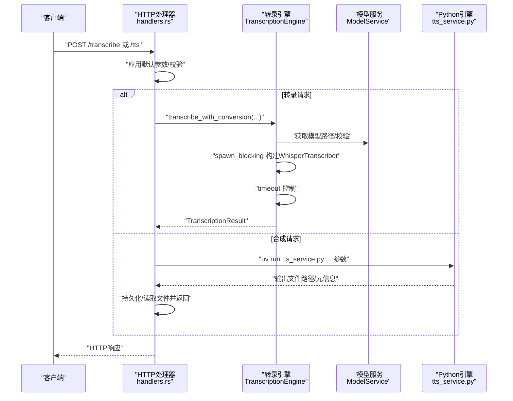
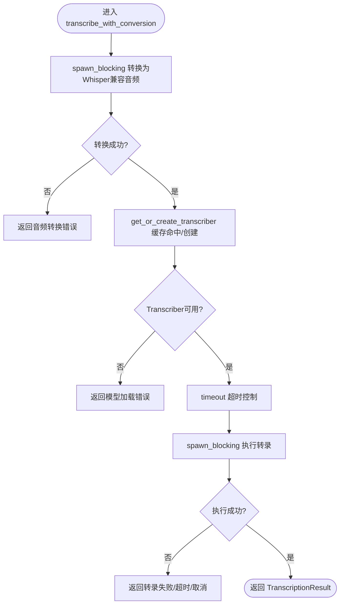
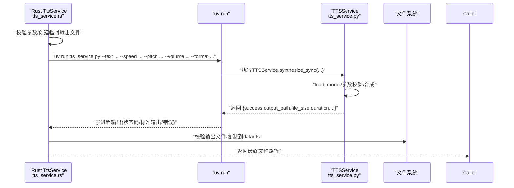
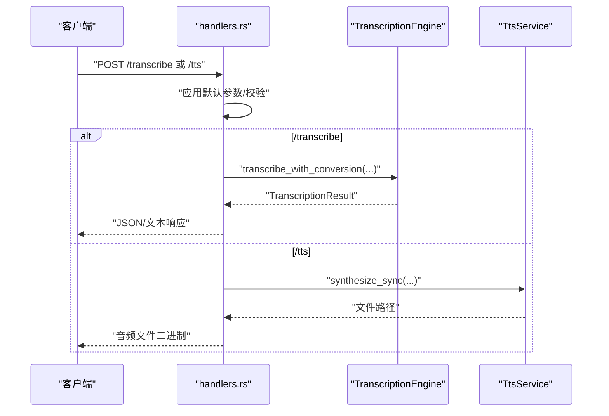
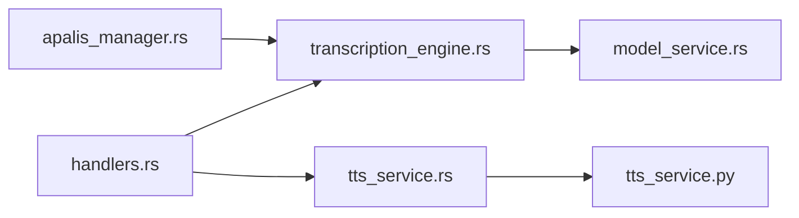

# 同步转录处理

<cite>
**本文引用的文件**
- [transcription_engine.rs](file://voice-cli/src/services/transcription_engine.rs)
- [tts_service.rs](file://voice-cli/src/services/tts_service.rs)
- [tts_service.py](file://voice-cli/tts_service.py)
- [apalis_manager.rs](file://voice-cli/src/services/apalis_manager.rs)
- [handlers.rs](file://voice-cli/src/server/handlers.rs)
- [http_result.rs](file://voice-cli/src/models/http_result.rs)
- [error.rs](file://voice-cli/src/error.rs)
- [model_service.rs](file://voice-cli/src/services/model_service.rs)
- [tts.rs](file://voice-cli/src/models/tts.rs)
- [API文档](file://voice-cli/API_DOCUMENTATION.md)
</cite>

## 目录
1. [简介](#简介)
2. [项目结构](#项目结构)
3. [核心组件](#核心组件)
4. [架构总览](#架构总览)
5. [详细组件分析](#详细组件分析)
6. [依赖关系分析](#依赖关系分析)
7. [性能考量](#性能考量)
8. [故障排查指南](#故障排查指南)
9. [结论](#结论)
10. [附录](#附录)

## 简介
本文聚焦于“同步转录处理”的完整生命周期，围绕 TranscriptionEngine 的音频数据传入、模型加载、推理执行与结果返回进行深入解析；同时说明 TtsService 如何通过底层 Python TTS 引擎执行同步合成并阻塞等待直至完成，覆盖超时控制、线程安全与资源释放机制，并结合实际代码片段路径展示参数传递方式（如采样率、语言模型选择），最后给出高并发场景下的性能优化建议。

## 项目结构
- voice-cli 子模块提供语音相关服务与模型定义：
  - services/transcription_engine.rs：统一的转录引擎，负责模型缓存、音频兼容性转换与转录执行。
  - services/tts_service.rs：TTS服务，封装Python脚本调用，执行同步/异步合成。
  - tts_service.py：Python侧TTS实现，支持IndexTTS与回退Mock方案。
  - services/apalis_manager.rs：异步转录流水线的步骤与上下文，内部调用 TranscriptionEngine。
  - server/handlers.rs：HTTP层入口，将请求映射到服务层并返回结果。
  - models/http_result.rs、error.rs：统一错误与HTTP响应封装。
  - services/model_service.rs：模型下载、校验与路径管理。
  - models/tts.rs：TTS请求/响应与任务状态模型。
  - API文档：对外API说明与最佳实践。

图表来源
- [transcription_engine.rs](file://voice-cli/src/services/transcription_engine.rs#L1-L158)
- [tts_service.rs](file://voice-cli/src/services/tts_service.rs#L1-L333)
- [tts_service.py](file://voice-cli/tts_service.py#L1-L429)
- [apalis_manager.rs](file://voice-cli/src/services/apalis_manager.rs#L1356-L1502)
- [handlers.rs](file://voice-cli/src/server/handlers.rs#L898-L1015)

章节来源
- [transcription_engine.rs](file://voice-cli/src/services/transcription_engine.rs#L1-L158)
- [tts_service.rs](file://voice-cli/src/services/tts_service.rs#L1-L333)
- [tts_service.py](file://voice-cli/tts_service.py#L1-L429)
- [apalis_manager.rs](file://voice-cli/src/services/apalis_manager.rs#L1356-L1502)
- [handlers.rs](file://voice-cli/src/server/handlers.rs#L898-L1015)

## 核心组件
- TranscriptionEngine：缓存WhisperTranscriber实例，避免重复加载模型；提供兼容音频与非兼容音频两种转录入口；内置超时控制与线程池隔离。
- TtsService：封装Python脚本调用，执行同步合成；参数校验与输出文件持久化；异步任务创建占位。
- ModelService：模型下载、校验、路径解析与默认模型/超时配置提供。
- Python TTS实现：TTSService类，支持IndexTTS与多级回退（Mock/简单Mock），并提供CLI入口。
- HTTP处理器：接收请求、应用默认参数、调用服务层并返回响应。
- 异步转录流水线：在apalis_manager.rs中调用TranscriptionEngine执行转录。

章节来源
- [transcription_engine.rs](file://voice-cli/src/services/transcription_engine.rs#L1-L158)
- [tts_service.rs](file://voice-cli/src/services/tts_service.rs#L1-L333)
- [model_service.rs](file://voice-cli/src/services/model_service.rs#L1-L525)
- [tts_service.py](file://voice-cli/tts_service.py#L1-L429)
- [handlers.rs](file://voice-cli/src/server/handlers.rs#L898-L1015)
- [apalis_manager.rs](file://voice-cli/src/services/apalis_manager.rs#L1356-L1502)

## 架构总览
下图展示了从HTTP请求到转录/合成的端到端调用链路与关键组件交互：

图表来源
- [handlers.rs](file://voice-cli/src/server/handlers.rs#L898-L1015)
- [transcription_engine.rs](file://voice-cli/src/services/transcription_engine.rs#L77-L158)
- [model_service.rs](file://voice-cli/src/services/model_service.rs#L176-L205)
- [tts_service.py](file://voice-cli/tts_service.py#L380-L429)

## 详细组件分析

### TranscriptionEngine：同步转录请求处理
- 音频兼容性转换
  - 对输入音频进行Whisper兼容性检查与必要转换，确保采样率、通道等满足Whisper要求。
  - 转换过程在独立线程池中执行，避免阻塞Tokio事件循环。
- 模型加载与缓存
  - 通过ModelService解析模型路径并校验存在性；首次构建WhisperTranscriber后放入DashMap缓存，后续直接复用。
  - 构造过程同样在spawn_blocking中执行，防止CPU密集初始化阻塞异步运行时。
- 推理执行与超时控制
  - 使用tokio::time::timeout对整个转录过程设定超时；超时、取消、恐慌分别映射为统一错误类型。
  - 在阻塞线程内创建当前线程Runtime并执行异步转录，保证与Tokio生态兼容。
- 结果返回
  - 返回标准化的TranscriptionResult，供上层业务使用。

图表来源
- [transcription_engine.rs](file://voice-cli/src/services/transcription_engine.rs#L139-L158)
- [transcription_engine.rs](file://voice-cli/src/services/transcription_engine.rs#L77-L138)

章节来源
- [transcription_engine.rs](file://voice-cli/src/services/transcription_engine.rs#L1-L158)
- [model_service.rs](file://voice-cli/src/services/model_service.rs#L176-L205)

### TtsService：同步TTS合成与阻塞等待
- 参数传递与校验
  - 支持文本、模型、语速、音调、音量、输出格式等参数；对数值范围进行严格校验。
  - 通过uv run在指定虚拟环境中执行Python脚本，确保依赖一致。
- 调用底层Python引擎
  - 通过命令行参数将请求参数传递给tts_service.py；Python侧TTSService根据参数执行合成。
  - Python侧支持IndexTTS与多级回退（真实音频库/简单Mock），并记录输出文件路径与元信息。
- 阻塞等待与结果返回
  - Rust侧使用Command::output阻塞等待子进程完成；校验输出文件存在性与非空。
  - 将临时文件持久化到data/tts目录，返回最终文件路径供HTTP层读取。
- 资源释放
  - 临时文件由NamedTempFile管理生命周期；最终持久化后由上层继续使用。
  - Python进程退出后自动释放其占用的资源。

图表来源
- [tts_service.rs](file://voice-cli/src/services/tts_service.rs#L93-L214)
- [tts_service.py](file://voice-cli/tts_service.py#L91-L194)
- [tts_service.py](file://voice-cli/tts_service.py#L195-L345)

章节来源
- [tts_service.rs](file://voice-cli/src/services/tts_service.rs#L1-L333)
- [tts_service.py](file://voice-cli/tts_service.py#L1-L429)

### HTTP处理器：请求路由与参数应用
- 转录端点
  - 从请求中提取音频文件与可选参数（模型、语言、响应格式），应用默认值后调用TranscriptionEngine。
  - 将TranscriptionResult序列化为JSON或文本返回。
- 合成端点
  - 应用默认参数（速度、音调、音量、格式），调用TtsService.synthesize_sync，读取输出文件并返回二进制音频。
- 错误映射
  - 统一将VoiceCliError映射为HttpResult，便于前端消费。

图表来源
- [handlers.rs](file://voice-cli/src/server/handlers.rs#L898-L1015)
- [http_result.rs](file://voice-cli/src/models/http_result.rs#L93-L120)

章节来源
- [handlers.rs](file://voice-cli/src/server/handlers.rs#L898-L1015)
- [http_result.rs](file://voice-cli/src/models/http_result.rs#L93-L120)

### 异步转录流水线：内部调用TranscriptionEngine
- apalis_manager.rs中定义了异步转录步骤，其中一步会调用TranscriptionEngine.transcribe_with_conversion，并使用配置中的worker_timeout作为超时上限。
- 若音频无有效音频流，直接中止并返回错误；否则执行转录并将结果写入数据库状态表。

章节来源
- [apalis_manager.rs](file://voice-cli/src/services/apalis_manager.rs#L1356-L1502)

## 依赖关系分析
- 组件耦合
  - TranscriptionEngine强依赖ModelService用于模型路径与校验；内部使用DashMap实现高并发缓存。
  - TtsService依赖Python脚本与uv工具，参数通过命令行传递至tts_service.py。
  - HTTP层仅依赖服务层接口，解耦具体实现。
- 外部依赖
  - voice_toolkit::stt 提供WhisperTranscriber与TranscriptionResult。
  - Python侧依赖indextts与音频库（torchaudio等），若不可用则回退Mock。
- 可能的循环依赖
  - 未发现直接循环依赖；各模块职责清晰，通过服务接口交互。

图表来源
- [handlers.rs](file://voice-cli/src/server/handlers.rs#L898-L1015)
- [transcription_engine.rs](file://voice-cli/src/services/transcription_engine.rs#L1-L158)
- [tts_service.rs](file://voice-cli/src/services/tts_service.rs#L1-L333)
- [model_service.rs](file://voice-cli/src/services/model_service.rs#L1-L525)
- [apalis_manager.rs](file://voice-cli/src/services/apalis_manager.rs#L1356-L1502)

## 性能考量
- 模型加载与缓存
  - 使用DashMap缓存WhisperTranscriber，避免重复构造；spawn_blocking隔离CPU密集初始化。
- I/O与线程池
  - 音频转换与转录均在spawn_blocking中执行，避免阻塞Tokio主线程。
  - Python合成通过uv run在独立进程中执行，避免阻塞Rust主线程。
- 超时控制
  - 对转录与Python合成均设置超时，防止长时间阻塞导致资源耗尽。
- 并发与限流
  - 在高并发场景下，建议：
    - 合理设置线程池大小与超时阈值；
    - 对模型加载与Python进程数量进行配额限制；
    - 使用连接池与数据库操作异步化，减少阻塞；
    - 对大文件与长文本进行分片或限速策略。
- 资源回收
  - 临时文件及时清理；Python进程结束后释放内存与GPU显存（取决于底层实现）。

[本节为通用性能建议，无需特定文件来源]

## 故障排查指南
- 转录相关错误
  - 模型未找到：检查ModelService是否正确解析模型路径与自动下载配置。
  - 转录超时：增大worker_timeout或降低音频复杂度；确认spawn_blocking线程池充足。
  - 转录失败/取消/恐慌：查看错误映射与日志，定位具体环节。
- 合成相关错误
  - Python脚本缺失：确认脚本路径与uv工具可用；检查虚拟环境。
  - 输出文件为空/不存在：检查Python侧输出逻辑与权限；确认持久化目录存在。
- HTTP层错误
  - 统一错误映射为HttpResult，便于前端识别与展示。

章节来源
- [error.rs](file://voice-cli/src/error.rs#L1-L57)
- [http_result.rs](file://voice-cli/src/models/http_result.rs#L93-L120)
- [model_service.rs](file://voice-cli/src/services/model_service.rs#L176-L205)
- [tts_service.rs](file://voice-cli/src/services/tts_service.rs#L176-L214)

## 结论
- TranscriptionEngine通过模型缓存、spawn_blocking与timeout控制，实现了高性能且稳定的同步转录能力。
- TtsService通过uv run与Python脚本，提供了可靠的同步TTS合成路径，并具备完善的参数校验与资源释放机制。
- 在高并发场景下，建议结合线程池、超时与限流策略，配合合理的模型与音频预处理，获得稳定吞吐与低延迟。

[本节为总结，无需特定文件来源]

## 附录
- 参数传递要点
  - 转录：模型名称、音频路径、超时秒数；内部自动转换为Whisper兼容格式后再推理。
  - 合成：文本、模型、语速、音调、音量、格式；通过命令行参数传递至Python脚本。
- 最佳实践
  - 优先使用WAV等高质量格式；合理选择模型大小平衡准确率与速度。
  - 在生产环境启用自动下载与健康检查；对Python依赖与磁盘空间进行监控。

章节来源
- [API文档](file://voice-cli/API_DOCUMENTATION.md#L101-L209)
- [tts.rs](file://voice-cli/src/models/tts.rs#L1-L197)
- [tts_service.py](file://voice-cli/tts_service.py#L380-L429)