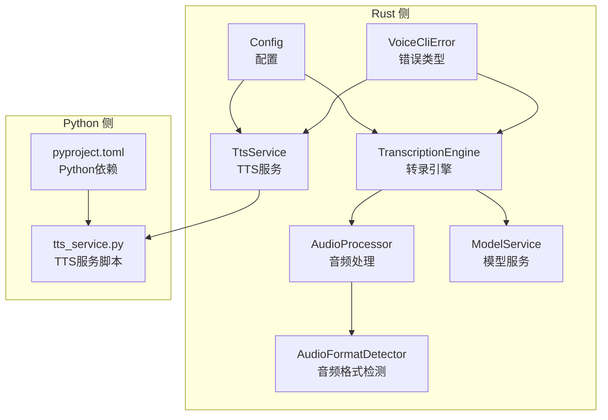
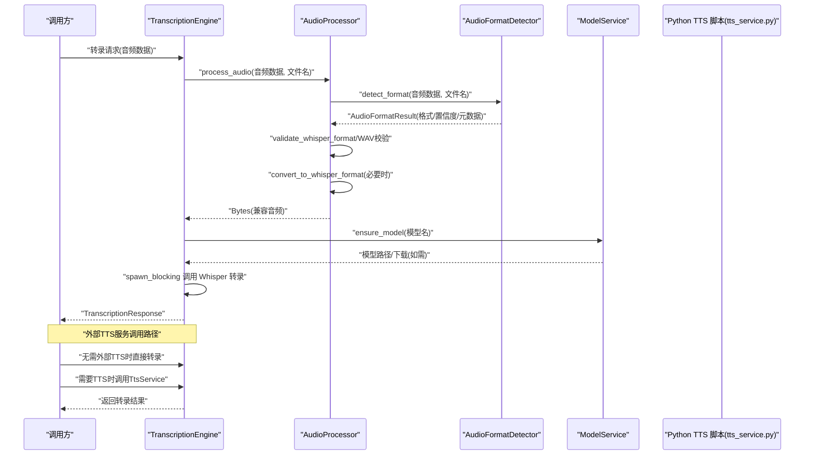
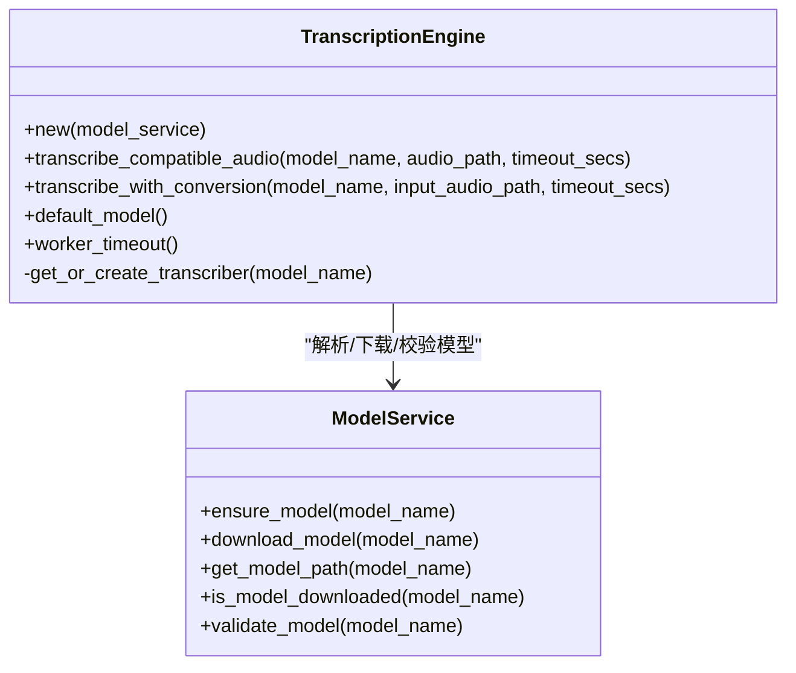
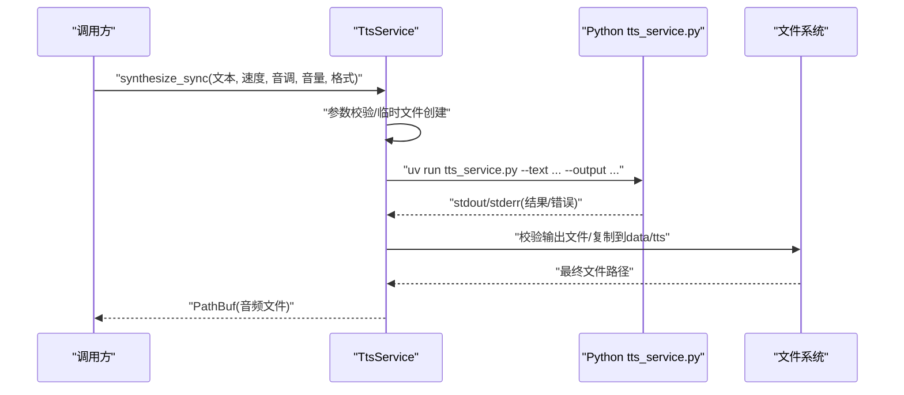
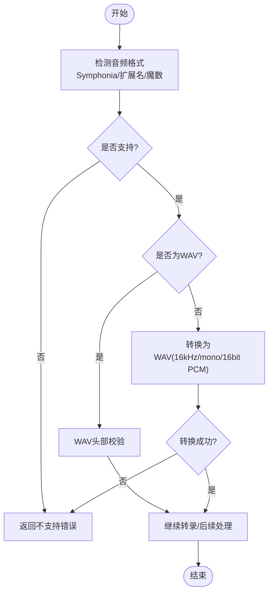
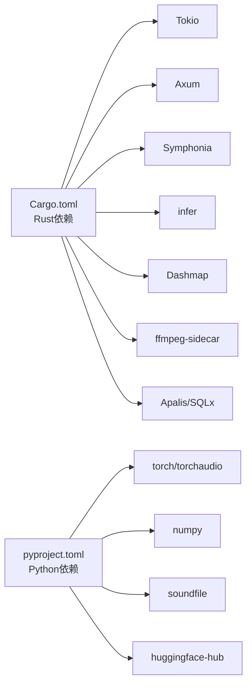

# 外部引擎集成

<cite>
**本文引用的文件**
- [transcription_engine.rs](file://voice-cli/src/services/transcription_engine.rs)
- [tts_service.rs](file://voice-cli/src/services/tts_service.rs)
- [audio_format_detector.rs](file://voice-cli/src/services/audio_format_detector.rs)
- [audio_processor.rs](file://voice-cli/src/services/audio_processor.rs)
- [tts.rs](file://voice-cli/src/models/tts.rs)
- [request.rs](file://voice-cli/src/models/request.rs)
- [model_service.rs](file://voice-cli/src/services/model_service.rs)
- [error.rs](file://voice-cli/src/error.rs)
- [config.rs](file://voice-cli/src/config.rs)
- [Cargo.toml](file://voice-cli/Cargo.toml)
- [pyproject.toml](file://voice-cli/pyproject.toml)
- [tts_service.py](file://voice-cli/tts_service.py)
- [INDEXTTS_SETUP.md](file://voice-cli/INDEXTTS_SETUP.md)
- [TTS_README.md](file://voice-cli/TTS_README.md)
</cite>

## 目录
1. [简介](#简介)
2. [项目结构](#项目结构)
3. [核心组件](#核心组件)
4. [架构总览](#架构总览)
5. [详细组件分析](#详细组件分析)
6. [依赖关系分析](#依赖关系分析)
7. [性能考量](#性能考量)
8. [故障排查指南](#故障排查指南)
9. [结论](#结论)
10. [附录](#附录)

## 简介
本文件聚焦于 voice-cli 项目中 TranscriptionEngine 与外部 Python TTS 服务的集成方式，涵盖进程间通信机制、数据序列化格式、环境隔离策略（虚拟环境/uv包管理）、版本兼容性管理；同时说明音频格式检测与转换流程（AudioFormatDetector 与 AudioProcessor）如何确保输入符合引擎要求，并分析调用失败时的降级策略与日志记录机制。文档面向具备有限技术背景的读者，提供循序渐进的理解路径与可视化图示。

## 项目结构
voice-cli 子工程包含 Rust 侧的服务层（TranscriptionEngine、TTS Service、音频检测与处理）、数据模型（请求/响应、TTS任务模型）、配置与错误处理，以及 Python 侧的 TTS 服务脚本与依赖声明。关键文件如下：
- Rust 服务与模型：transcription_engine.rs、tts_service.rs、audio_format_detector.rs、audio_processor.rs、model_service.rs、request.rs、tts.rs、error.rs、config.rs、Cargo.toml
- Python 服务与依赖：tts_service.py、pyproject.toml
- 文档与安装指南：INDEXTTS_SETUP.md、TTS_README.md

图表来源
- [transcription_engine.rs](file://voice-cli/src/services/transcription_engine.rs#L1-L158)
- [tts_service.rs](file://voice-cli/src/services/tts_service.rs#L1-L333)
- [audio_format_detector.rs](file://voice-cli/src/services/audio_format_detector.rs#L1-L326)
- [audio_processor.rs](file://voice-cli/src/services/audio_processor.rs#L1-L315)
- [model_service.rs](file://voice-cli/src/services/model_service.rs#L1-L525)
- [config.rs](file://voice-cli/src/config.rs#L1-L93)
- [error.rs](file://voice-cli/src/error.rs#L1-L167)
- [tts_service.py](file://voice-cli/tts_service.py#L1-L429)
- [pyproject.toml](file://voice-cli/pyproject.toml#L1-L23)

章节来源
- [Cargo.toml](file://voice-cli/Cargo.toml#L1-L108)

## 核心组件
- TranscriptionEngine：封装 Whisper 模型加载与转录，支持缓存与超时控制，提供“兼容音频直转”和“带转换转录”两种入口。
- TtsService：负责调用 Python TTS 脚本，通过 uv run 在隔离环境中执行，支持同步与异步任务，参数校验与输出文件持久化。
- AudioFormatDetector：多策略音频格式检测（Symphonia 探测 + 文件扩展名 + 魔数），输出格式、置信度与元数据。
- AudioProcessor：将输入音频转换为 Whisper 兼容格式（16kHz、mono、16-bit PCM WAV），提供基础 WAV 校验与临时文件管理。
- ModelService：模型下载、校验与路径管理，支持 Whisper.cpp 模型的自动下载与尺寸校验。
- 数据模型与错误：TTS 请求/响应、任务状态与错误类型统一定义，便于跨语言与跨模块传递。

章节来源
- [transcription_engine.rs](file://voice-cli/src/services/transcription_engine.rs#L1-L158)
- [tts_service.rs](file://voice-cli/src/services/tts_service.rs#L1-L333)
- [audio_format_detector.rs](file://voice-cli/src/services/audio_format_detector.rs#L1-L326)
- [audio_processor.rs](file://voice-cli/src/services/audio_processor.rs#L1-L315)
- [model_service.rs](file://voice-cli/src/services/model_service.rs#L1-L525)
- [tts.rs](file://voice-cli/src/models/tts.rs#L1-L197)
- [request.rs](file://voice-cli/src/models/request.rs#L1-L434)
- [error.rs](file://voice-cli/src/error.rs#L1-L167)

## 架构总览
下图展示 TranscriptionEngine 与外部 Python TTS 服务的集成路径与交互关系。

图表来源
- [transcription_engine.rs](file://voice-cli/src/services/transcription_engine.rs#L1-L158)
- [audio_processor.rs](file://voice-cli/src/services/audio_processor.rs#L1-L315)
- [audio_format_detector.rs](file://voice-cli/src/services/audio_format_detector.rs#L1-L326)
- [model_service.rs](file://voice-cli/src/services/model_service.rs#L1-L525)
- [tts_service.rs](file://voice-cli/src/services/tts_service.rs#L1-L333)
- [tts_service.py](file://voice-cli/tts_service.py#L1-L429)

## 详细组件分析

### TranscriptionEngine 与 Whisper 模型集成
- 模型缓存：使用并发安全的映射缓存已加载的 WhisperTranscriber，避免重复加载模型与显存浪费。
- 超时与阻塞：转录过程在独立线程池中执行，结合 tokio 超时控制，防止长时间阻塞主事件循环。
- 兼容音频与转换：提供“直接转录”和“先转换再转录”两条路径；后者通过 voice-toolkit 的 ensure_whisper_compatible 确保格式合规。
- 模型生命周期：通过 ModelService 确保模型存在、自动下载与基本校验。

图表来源
- [transcription_engine.rs](file://voice-cli/src/services/transcription_engine.rs#L1-L158)
- [model_service.rs](file://voice-cli/src/services/model_service.rs#L1-L525)

章节来源
- [transcription_engine.rs](file://voice-cli/src/services/transcription_engine.rs#L1-L158)
- [model_service.rs](file://voice-cli/src/services/model_service.rs#L1-L525)

### TtsService 与 Python TTS 服务集成
- 进程间通信：通过标准命令行调用 Python 脚本，使用 uv run 确保在正确虚拟环境中执行，避免系统 Python 版本与依赖冲突。
- 参数传递：将文本、速度、音调、音量、输出格式等参数以命令行参数形式传给 Python 脚本。
- 输出处理：脚本输出文件写入临时路径，随后持久化到 data/tts 目录，返回最终文件路径。
- 错误处理：捕获子进程退出码与标准输出/错误，记录详细日志并返回统一错误类型。

图表来源
- [tts_service.rs](file://voice-cli/src/services/tts_service.rs#L1-L333)
- [tts_service.py](file://voice-cli/tts_service.py#L1-L429)

章节来源
- [tts_service.rs](file://voice-cli/src/services/tts_service.rs#L1-L333)
- [tts_service.py](file://voice-cli/tts_service.py#L1-L429)

### 音频格式检测与转换流程
- 检测策略：优先使用 Symphonia 探测容器与编解码器；若失败则回退到文件扩展名；均失败则报错。
- 元数据提取：从轨道参数推导采样率、声道数、位深、时长与比特率等信息。
- 转换策略：当非 WAV 时，使用 voice-toolkit 的 ensure_whisper_compatible 转换为 16kHz、mono、16-bit PCM WAV；若失败则记录告警并返回错误。
- WAV 校验：对 WAV 头部进行基础校验，记录非最优参数的警告（采样率/声道/位深）。

图表来源
- [audio_format_detector.rs](file://voice-cli/src/services/audio_format_detector.rs#L1-L326)
- [audio_processor.rs](file://voice-cli/src/services/audio_processor.rs#L1-L315)
- [request.rs](file://voice-cli/src/models/request.rs#L1-L434)

章节来源
- [audio_format_detector.rs](file://voice-cli/src/services/audio_format_detector.rs#L1-L326)
- [audio_processor.rs](file://voice-cli/src/services/audio_processor.rs#L1-L315)
- [request.rs](file://voice-cli/src/models/request.rs#L1-L434)

### 数据序列化格式
- Rust 侧请求/响应：使用 serde JSON/YAML 进行序列化，OpenAPI 注解用于接口文档生成。
- Python 侧：命令行参数传递，脚本内部返回结构化字典（包含成功标志、文件路径、时长、参数等）。
- 统一模型：TTS 请求/响应、任务状态与错误类型在 Rust 侧集中定义，便于跨语言边界传递与解析。

章节来源
- [tts.rs](file://voice-cli/src/models/tts.rs#L1-L197)
- [request.rs](file://voice-cli/src/models/request.rs#L1-L434)
- [tts_service.py](file://voice-cli/tts_service.py#L1-L429)

### 环境隔离策略与版本兼容性管理
- Python 环境：TtsService 自动查找虚拟环境中的 Python（.venv/bin/python 或 .venv/Scripts/python.exe），若不存在则回退系统 Python；通过 uv run 在隔离环境中执行脚本，避免全局污染。
- 依赖管理：pyproject.toml 明确 Python 版本与依赖范围（torch>=2.8、torchaudio>=2.8、numpy、soundfile、huggingface-hub），配合 uv 同步安装。
- 版本兼容：Python 限定 3.10.x；IndexTTS 安装指南强调 Python 版本与包管理器 uv 的使用；模型文件通过 Hugging Face 下载，尺寸与校验逻辑在 Rust 侧进行。

章节来源
- [tts_service.rs](file://voice-cli/src/services/tts_service.rs#L1-L333)
- [pyproject.toml](file://voice-cli/pyproject.toml#L1-L23)
- [INDEXTTS_SETUP.md](file://voice-cli/INDEXTTS_SETUP.md#L1-L432)

### 调用失败时的降级策略与日志记录机制
- TTS 合成降级：Python 环境中若缺少 IndexTTS 或音频库，脚本会回退到“Mock 合成”或“简单 Mock”，保证功能可用但质量受限；同时记录详细日志。
- Rust 侧错误：统一的 VoiceCliError 类型，按错误类别映射到合适的 HTTP 状态码；日志采用 tracing，关键路径（启动、执行、失败）均有 info/warn/error 级别记录。
- 超时与取消：转录与 TTS 同步调用均设置超时，异常时区分“超时/取消/恐慌”并返回相应错误类型。

章节来源
- [tts_service.py](file://voice-cli/tts_service.py#L1-L429)
- [tts_service.rs](file://voice-cli/src/services/tts_service.rs#L1-L333)
- [error.rs](file://voice-cli/src/error.rs#L1-L167)

## 依赖关系分析
- Rust 依赖：Tokio、Axum、Symphonia、infer、dashmap、ffmpeg-sidecar、apalis/sqlx 等，支撑异步、音频探测、并发缓存与任务队列。
- Python 依赖：torch、torchaudio、numpy、soundfile、huggingface-hub，支撑音频处理与模型下载。
- 特性开关：voice-cli 的 Cargo.toml 提供 cuda/metal/vulkan 等特性，便于在不同硬件上启用加速后端。

图表来源
- [Cargo.toml](file://voice-cli/Cargo.toml#L1-L108)
- [pyproject.toml](file://voice-cli/pyproject.toml#L1-L23)

章节来源
- [Cargo.toml](file://voice-cli/Cargo.toml#L1-L108)
- [pyproject.toml](file://voice-cli/pyproject.toml#L1-L23)

## 性能考量
- 并发与缓存：TranscriptionEngine 对 Transcriber 进行缓存，减少模型加载开销；AudioProcessor 使用临时文件与 voice-toolkit 转换，避免重复编解码。
- I/O 与磁盘：TTS 输出先写临时文件，再复制到 data/tts，降低并发写冲突风险；模型下载采用流式写入与进度日志。
- 超时与资源：转录与 TTS 同步调用均设置超时，防止长时间阻塞；日志记录关键耗时，便于性能分析。

[本节为通用性能讨论，不直接分析具体文件]

## 故障排查指南
- Python 环境问题：确认 Python 3.10.x、uv 安装与 .venv 激活；检查 IndexTTS 与音频库导入日志。
- 依赖缺失：运行 uv sync 安装依赖；若网络受限，参考安装指南中的镜像与手动下载步骤。
- TTS 合成失败：查看 Python 脚本的标准输出/错误；检查输出文件是否存在与大小；根据错误类型（参数、存储、超时、取消）采取对应措施。
- 转录失败：检查模型路径与下载状态；查看转录超时与 Join/Cancel/Panic 错误；核对音频格式与转换链路。
- 日志定位：Rust 侧设置 RUST_LOG=debug；Python 侧脚本内置 INFO 级别日志；结合错误映射的 HTTP 状态码快速定位问题。

章节来源
- [INDEXTTS_SETUP.md](file://voice-cli/INDEXTTS_SETUP.md#L1-L432)
- [TTS_README.md](file://voice-cli/TTS_README.md#L1-L197)
- [tts_service.py](file://voice-cli/tts_service.py#L1-L429)
- [error.rs](file://voice-cli/src/error.rs#L1-L167)

## 结论
TranscriptionEngine 与外部 Python TTS 服务通过清晰的进程间通信与数据模型边界实现了稳定集成：Rust 侧负责音频检测与转换、模型管理与转录调度，Python 侧负责高质量语音合成与降级回退。通过虚拟环境隔离、依赖版本约束与完善的日志与错误处理，系统在复杂环境下仍能保持可靠性与可维护性。

[本节为总结性内容，不直接分析具体文件]

## 附录
- API 与配置参考：TTS 接口、任务状态、配置项与使用示例详见 TTS_README 与配置模板生成器。
- 安装与部署：IndexTTS 安装指南提供了从 Python 3.10 到模型下载的完整流程，建议按步骤执行并定期备份模型与配置。

章节来源
- [TTS_README.md](file://voice-cli/TTS_README.md#L1-L197)
- [config.rs](file://voice-cli/src/config.rs#L1-L93)