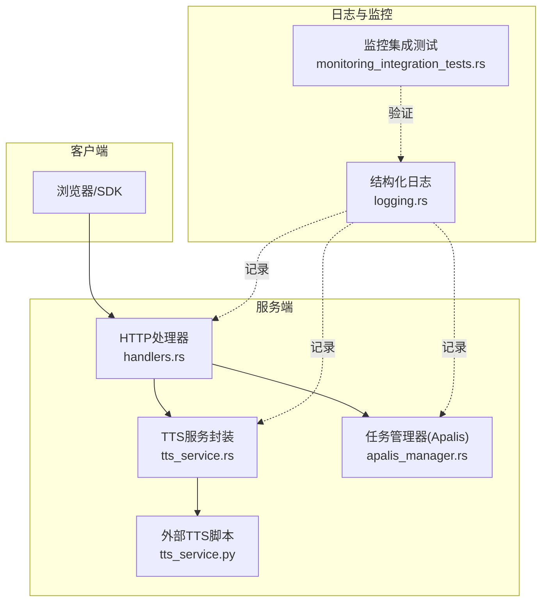
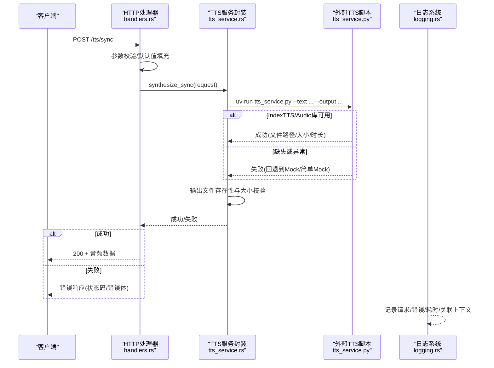
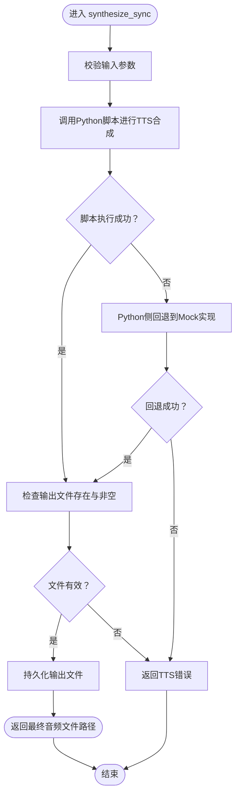
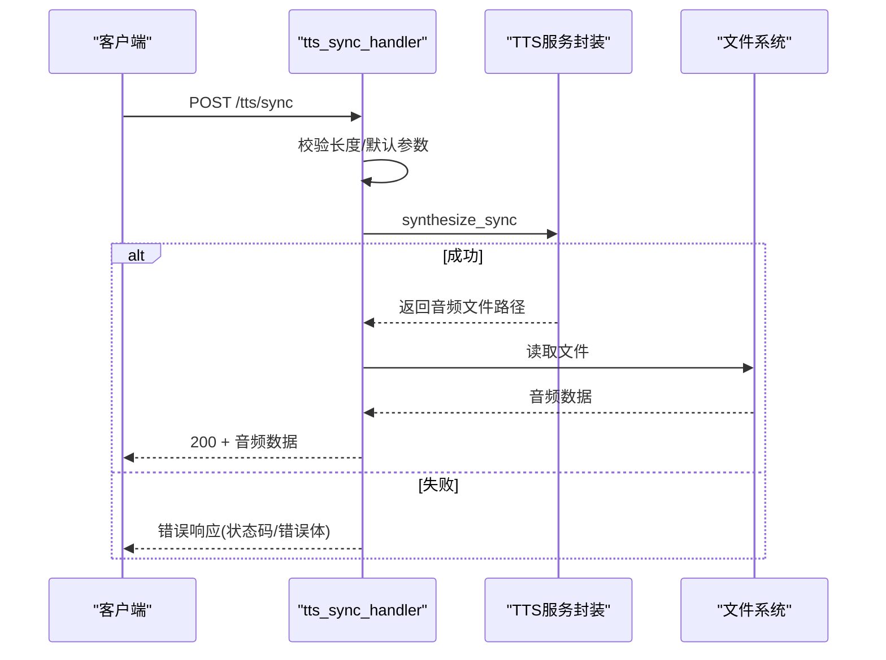
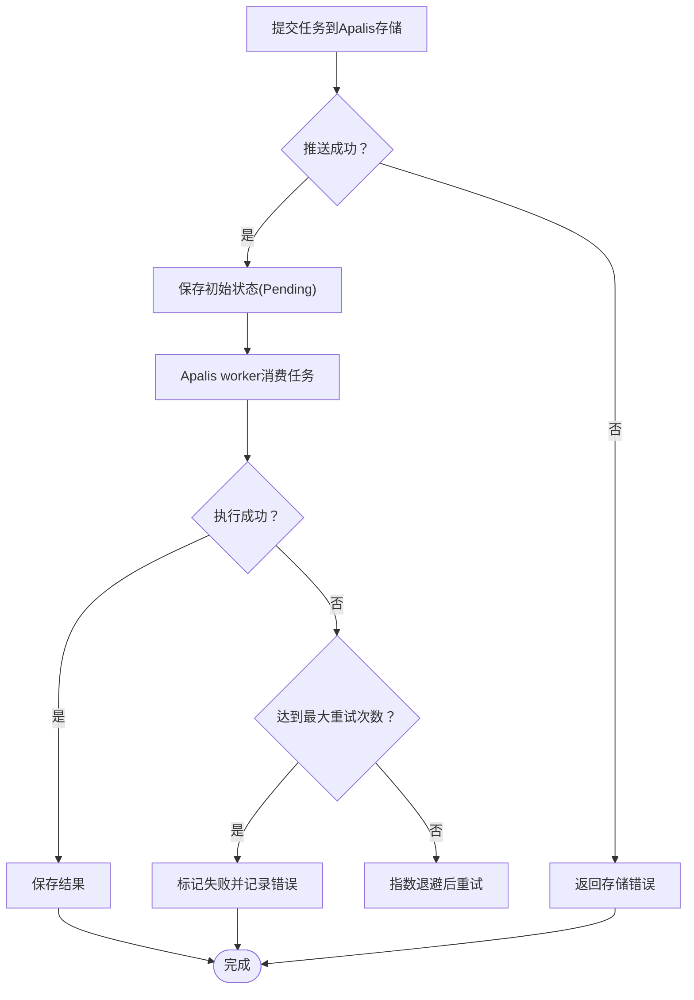
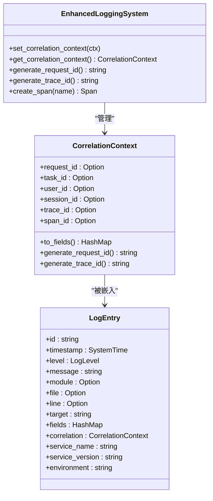
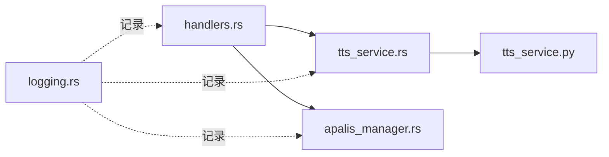

# 故障恢复与日志记录

<cite>
**本文引用的文件**
- [tts_service.rs](file://voice-cli/src/services/tts_service.rs)
- [tts.rs](file://voice-cli/src/cli/tts.rs)
- [handlers.rs](file://voice-cli/src/server/handlers.rs)
- [error.rs](file://voice-cli/src/error.rs)
- [tts_service.py](file://voice-cli/tts_service.py)
- [apalis_manager.rs](file://voice-cli/src/services/apalis_manager.rs)
- [logging.rs](file://document-parser/src/utils/logging.rs)
- [monitoring_integration_tests.rs](file://document-parser/tests/monitoring_integration_tests.rs)
- [environment_manager.rs](file://document-parser/src/utils/environment_manager.rs)
</cite>

## 目录
1. [简介](#简介)
2. [项目结构](#项目结构)
3. [核心组件](#核心组件)
4. [架构总览](#架构总览)
5. [详细组件分析](#详细组件分析)
6. [依赖关系分析](#依赖关系分析)
7. [性能考虑](#性能考虑)
8. [故障排查指南](#故障排查指南)
9. [结论](#结论)

## 简介
本文件聚焦于系统在调用外部TTS服务失败时的故障恢复策略与日志记录实现，覆盖以下主题：
- 失败分类与对应处理逻辑（超时、格式错误、进程崩溃、外部依赖缺失等）
- 重试机制与回退策略（真实引擎与Mock回退）
- 用户反馈生成（错误码、建议、HTTP响应体）
- 日志记录体系（结构化日志、关键事件追踪、错误上下文捕获、关联ID传播）

## 项目结构
围绕TTS服务的关键模块与职责划分如下：
- 服务层：Rust侧TTS服务封装与Python侧TTS脚本
- 控制器层：HTTP端点处理同步/异步TTS请求
- 任务管理：基于Apalis的任务队列与重试策略
- 日志与监控：结构化日志、关联上下文、Tracing集成

图表来源
- [handlers.rs](file://voice-cli/src/server/handlers.rs#L862-L1016)
- [tts_service.rs](file://voice-cli/src/services/tts_service.rs#L1-L214)
- [tts_service.py](file://voice-cli/tts_service.py#L1-L429)
- [apalis_manager.rs](file://voice-cli/src/services/apalis_manager.rs#L317-L380)
- [logging.rs](file://document-parser/src/utils/logging.rs#L45-L127)
- [monitoring_integration_tests.rs](file://document-parser/tests/monitoring_integration_tests.rs#L94-L120)

章节来源
- [handlers.rs](file://voice-cli/src/server/handlers.rs#L862-L1016)
- [tts_service.rs](file://voice-cli/src/services/tts_service.rs#L1-L214)
- [tts_service.py](file://voice-cli/tts_service.py#L1-L429)
- [apalis_manager.rs](file://voice-cli/src/services/apalis_manager.rs#L317-L380)
- [logging.rs](file://document-parser/src/utils/logging.rs#L45-L127)
- [monitoring_integration_tests.rs](file://document-parser/tests/monitoring_integration_tests.rs#L94-L120)

## 核心组件
- Rust TTS服务封装：负责参数校验、调用Python脚本、输出文件验证与持久化、错误映射与HTTP响应。
- Python TTS脚本：提供真实IndexTTS与音频库能力；若不可用则回退到Mock实现；最终生成音频文件。
- HTTP处理器：同步/异步端点，应用默认参数、长度限制、错误处理与响应。
- 任务管理器：基于Apalis的SQLite存储与重试策略，支持取消、重试、删除、清理。
- 日志系统：结构化日志、关联上下文、Tracing集成，便于跨服务链路追踪。

章节来源
- [tts_service.rs](file://voice-cli/src/services/tts_service.rs#L93-L214)
- [tts_service.py](file://voice-cli/tts_service.py#L91-L194)
- [handlers.rs](file://voice-cli/src/server/handlers.rs#L862-L1016)
- [apalis_manager.rs](file://voice-cli/src/services/apalis_manager.rs#L317-L380)
- [logging.rs](file://document-parser/src/utils/logging.rs#L45-L127)

## 架构总览
下图展示一次同步TTS请求的端到端流程，包括错误分类、回退与日志记录。

图表来源
- [handlers.rs](file://voice-cli/src/server/handlers.rs#L877-L956)
- [tts_service.rs](file://voice-cli/src/services/tts_service.rs#L93-L214)
- [tts_service.py](file://voice-cli/tts_service.py#L91-L194)
- [logging.rs](file://document-parser/src/utils/logging.rs#L45-L127)

## 详细组件分析

### 组件A：TTS服务封装与回退策略
- 参数校验与默认值：对文本长度、语速、音调、音量范围进行校验；未提供的参数应用配置默认值。
- 外部脚本调用：通过uv run调用Python脚本，传递文本、速度、音调、音量、格式等参数；必要时设置模型路径环境变量。
- 输出校验：检查临时文件是否存在、大小是否大于0；否则返回TTS错误。
- 回退策略：当Python脚本执行失败或输出异常时，返回TTS错误；在Python侧，若IndexTTS/Audio库不可用，则回退到Mock实现；若Mock也失败，则抛出异常供上层捕获。

图表来源
- [tts_service.rs](file://voice-cli/src/services/tts_service.rs#L93-L214)
- [tts_service.py](file://voice-cli/tts_service.py#L91-L194)

章节来源
- [tts_service.rs](file://voice-cli/src/services/tts_service.rs#L93-L214)
- [tts_service.py](file://voice-cli/tts_service.py#L91-L194)

### 组件B：HTTP端点与用户反馈
- 同步端点：校验文本长度、应用默认参数、调用TTS服务；读取音频文件并以二进制形式返回；失败时返回HTTP错误响应。
- 异步端点：校验文本长度、应用默认参数、创建异步任务（当前返回模拟任务ID，后续可接入任务管理器）。
- 错误映射：将内部错误映射为合适的HTTP状态码与JSON响应体，包含错误信息与状态码。

图表来源
- [handlers.rs](file://voice-cli/src/server/handlers.rs#L877-L956)
- [error.rs](file://voice-cli/src/error.rs#L108-L166)

章节来源
- [handlers.rs](file://voice-cli/src/server/handlers.rs#L877-L956)
- [error.rs](file://voice-cli/src/error.rs#L108-L166)

### 组件C：任务管理与重试机制
- Apalis worker：启用Tracing、并发度与重试策略；任务状态与结果通过SQLite存储。
- 重试策略：基于Apalis的重试策略配置；支持取消、重试、删除、清理过期任务。
- 重试条件：仅对“失败/取消”状态的任务进行重试；若原始音频文件不存在则拒绝重试。

图表来源
- [apalis_manager.rs](file://voice-cli/src/services/apalis_manager.rs#L317-L380)
- [apalis_manager.rs](file://voice-cli/src/services/apalis_manager.rs#L454-L541)
- [apalis_manager.rs](file://voice-cli/src/services/apalis_manager.rs#L718-L795)

章节来源
- [apalis_manager.rs](file://voice-cli/src/services/apalis_manager.rs#L317-L380)
- [apalis_manager.rs](file://voice-cli/src/services/apalis_manager.rs#L454-L541)
- [apalis_manager.rs](file://voice-cli/src/services/apalis_manager.rs#L718-L795)

### 组件D：日志记录与关键事件追踪
- 关联上下文：支持request_id、task_id、user_id、session_id、trace_id、span_id等字段注入。
- 结构化日志：统一的日志条目结构，包含模块、文件、行号、目标、字段、关联上下文、服务名、版本、环境等。
- Tracing集成：通过增强的日志系统创建span，自动携带关联上下文字段，便于跨服务链路追踪。
- 监控集成测试：验证关联上下文字段在日志中的传播与落盘。

图表来源
- [logging.rs](file://document-parser/src/utils/logging.rs#L45-L127)
- [logging.rs](file://document-parser/src/utils/logging.rs#L129-L145)
- [logging.rs](file://document-parser/src/utils/logging.rs#L500-L542)
- [monitoring_integration_tests.rs](file://document-parser/tests/monitoring_integration_tests.rs#L94-L120)

章节来源
- [logging.rs](file://document-parser/src/utils/logging.rs#L45-L127)
- [logging.rs](file://document-parser/src/utils/logging.rs#L129-L145)
- [logging.rs](file://document-parser/src/utils/logging.rs#L500-L542)
- [monitoring_integration_tests.rs](file://document-parser/tests/monitoring_integration_tests.rs#L94-L120)

## 依赖关系分析
- 外部依赖
  - Python脚本依赖IndexTTS与音频库；若缺失则回退到Mock实现。
  - uv run用于在正确虚拟环境中执行Python脚本。
- 内部依赖
  - HTTP处理器依赖TTS服务封装与任务管理器。
  - TTS服务封装依赖Python脚本与文件系统。
  - 日志系统与监控集成测试相互验证。

图表来源
- [handlers.rs](file://voice-cli/src/server/handlers.rs#L862-L1016)
- [tts_service.rs](file://voice-cli/src/services/tts_service.rs#L1-L214)
- [tts_service.py](file://voice-cli/tts_service.py#L1-L429)
- [apalis_manager.rs](file://voice-cli/src/services/apalis_manager.rs#L317-L380)
- [logging.rs](file://document-parser/src/utils/logging.rs#L45-L127)

章节来源
- [handlers.rs](file://voice-cli/src/server/handlers.rs#L862-L1016)
- [tts_service.rs](file://voice-cli/src/services/tts_service.rs#L1-L214)
- [tts_service.py](file://voice-cli/tts_service.py#L1-L429)
- [apalis_manager.rs](file://voice-cli/src/services/apalis_manager.rs#L317-L380)
- [logging.rs](file://document-parser/src/utils/logging.rs#L45-L127)

## 性能考虑
- 同步TTS：适合短文本与低并发场景；长文本可能导致接口超时，建议使用异步任务。
- 异步任务：通过Apalis队列异步处理，避免阻塞HTTP请求；结合重试策略提升稳定性。
- 文件I/O：临时文件与持久化文件分离，减少磁盘竞争；输出文件大小校验避免空文件污染。
- 日志开销：结构化日志与Tracing会带来一定开销，建议在生产环境按需开启详细级别。

[本节为通用指导，无需特定文件引用]

## 故障排查指南

### 错误分类与处理逻辑
- 超时
  - 外部脚本执行超时：Python侧未捕获到输出或进程卡死；应检查IndexTTS/Audio库可用性与系统资源。
  - 任务队列推送超时：Apalis存储推送超时，需检查数据库连接与SQLite写入权限。
- 格式错误
  - 输入参数非法：语速/音调/音量超出范围；文本为空或超长；格式不受支持。
  - 输出文件异常：文件不存在或大小为0；应检查Python脚本执行与音频库依赖。
- 进程崩溃
  - IndexTTS/Audio库导入失败或运行时异常；Python侧回退到Mock实现；若仍失败则抛出异常。
- 外部依赖缺失
  - Python解释器、uv、ffmpeg、IndexTTS、torchaudio等缺失；应先初始化Python环境与依赖。

章节来源
- [tts_service.rs](file://voice-cli/src/services/tts_service.rs#L93-L214)
- [tts_service.py](file://voice-cli/tts_service.py#L1-L429)
- [apalis_manager.rs](file://voice-cli/src/services/apalis_manager.rs#L382-L452)

### 重试机制与回退策略
- 任务重试：仅对“失败/取消”状态的任务重试；若原始音频文件不存在则拒绝重试。
- 指数退避：通用重试机制支持基础延迟、倍增与最大延迟控制，适用于环境检查等场景。
- Python回退：IndexTTS/Audio库不可用时回退到Mock实现；若Mock也失败则向上抛出异常。

章节来源
- [apalis_manager.rs](file://voice-cli/src/services/apalis_manager.rs#L718-L795)
- [environment_manager.rs](file://document-parser/src/utils/environment_manager.rs#L2086-L2166)
- [tts_service.py](file://voice-cli/tts_service.py#L91-L194)

### 用户反馈生成
- HTTP错误响应：根据错误类型映射为合适的HTTP状态码与JSON体，包含错误信息与状态码。
- CLI测试：提供TTS功能测试命令，便于快速验证环境与依赖。

章节来源
- [error.rs](file://voice-cli/src/error.rs#L108-L166)
- [tts.rs](file://voice-cli/src/cli/tts.rs#L53-L122)

### 日志记录与关键事件追踪
- 关联上下文：在请求生命周期内注入request_id、trace_id等字段，便于跨服务链路追踪。
- 结构化日志：统一字段与服务元信息，便于集中采集与检索。
- Tracing集成：创建span并自动携带关联字段，测试用例验证字段传播。

章节来源
- [logging.rs](file://document-parser/src/utils/logging.rs#L45-L127)
- [logging.rs](file://document-parser/src/utils/logging.rs#L500-L542)
- [monitoring_integration_tests.rs](file://document-parser/tests/monitoring_integration_tests.rs#L94-L120)

## 结论
该系统在TTS服务失败时提供了完善的故障恢复与日志记录能力：
- 通过Python侧的多层回退（真实引擎→Mock→简单Mock），确保在外部依赖缺失或异常时仍能生成音频或明确报错。
- HTTP端点与错误映射保证用户获得一致的错误反馈；异步任务与Apalis重试策略提升整体可靠性。
- 结构化日志与Tracing集成使得关键事件可追踪、错误上下文可捕获，有助于运维快速定位问题根因。

[本节为总结，无需特定文件引用]