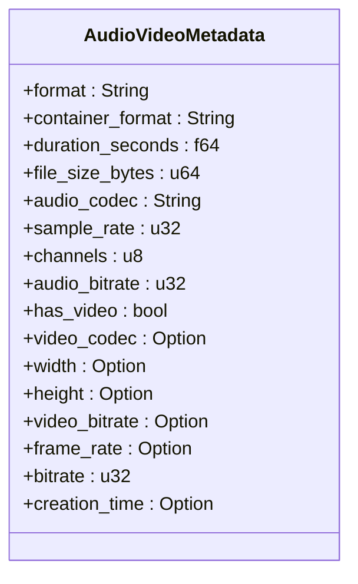
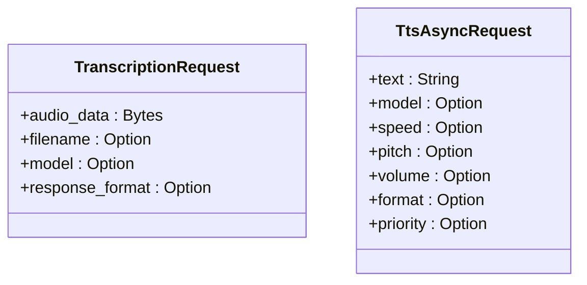
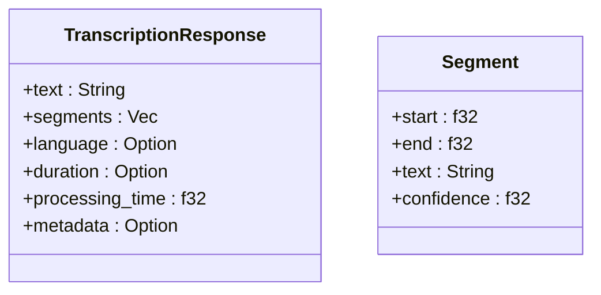
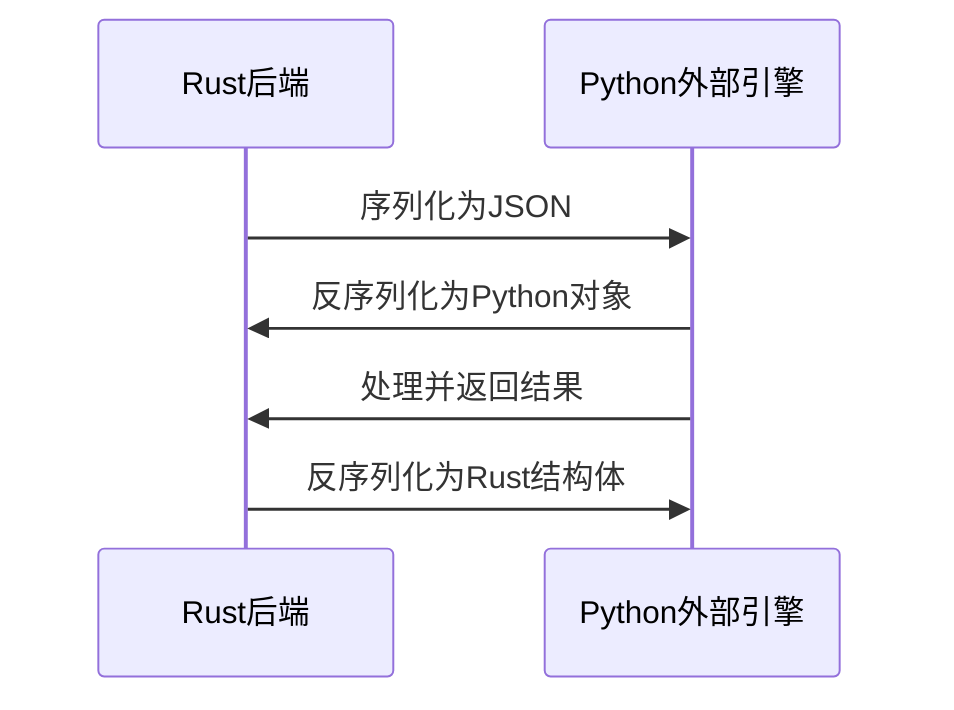
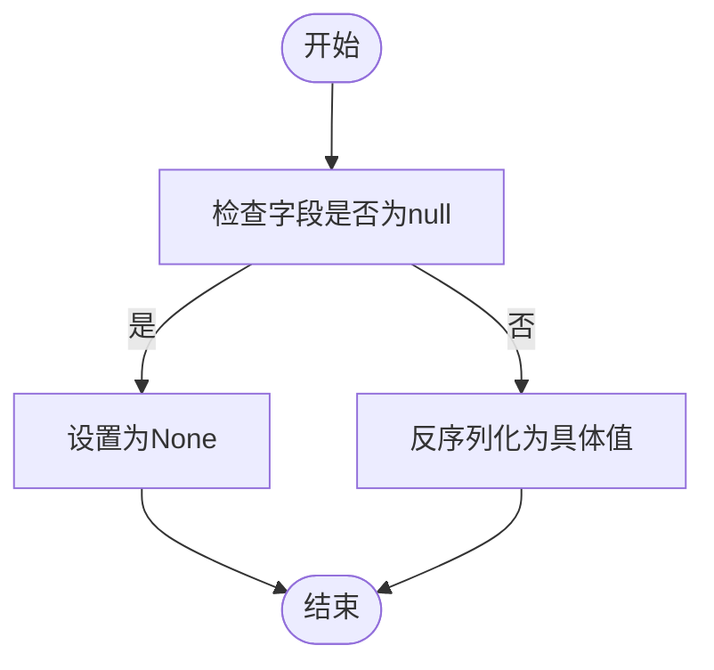

# 数据序列化与消息格式

<cite>
**本文档引用的文件**   
- [request.rs](file://voice-cli/src/models/request.rs)
- [stepped_task.rs](file://voice-cli/src/models/stepped_task.rs)
- [tts_service.rs](file://voice-cli/src/services/tts_service.rs)
- [transcription_engine.rs](file://voice-cli/src/services/transcription_engine.rs)
- [handlers.rs](file://voice-cli/src/server/handlers.rs)
- [test_python_params.py](file://mcp-proxy/fixtures/test_python_params.py)
- [rfunction_test2.py](file://mcp-proxy/fixtures/rfunction_test2.py)
- [test_python_types.py](file://mcp-proxy/fixtures/test_python_types.py)
- [Cargo.toml](file://Cargo.toml)
</cite>

## 目录
1. [引言](#引言)
2. [数据序列化格式](#数据序列化格式)
3. [Rust与Python间的数据一致性](#rust与python间的数据一致性)
4. [边界情况处理](#边界情况处理)
5. [实际请求与响应示例](#实际请求与响应示例)
6. [结论](#结论)

## 引言
本项目中的外部引擎调用过程涉及复杂的音频处理任务，包括音频元数据提取、配置参数传递和转录结果返回。这些数据在Rust后端与Python外部引擎之间通过JSON格式进行序列化和反序列化传输，确保了跨语言的数据一致性。本文档深入描述了这一过程中的数据序列化格式、serde的使用方式以及边界情况的处理机制。

## 数据序列化格式

### 音频元数据结构
音频元数据在系统中通过`AudioVideoMetadata`结构体进行定义，包含了音频文件的详细信息。该结构体使用serde进行JSON序列化和反序列化，确保了数据在不同组件间的正确传输。



**Diagram sources**
- [request.rs](file://voice-cli/src/models/request.rs#L5-L63)

**Section sources**
- [request.rs](file://voice-cli/src/models/request.rs#L5-L63)

### 配置参数结构
配置参数主要通过`TranscriptionRequest`和`TtsAsyncRequest`等结构体进行传递。这些结构体定义了外部引擎调用时所需的参数，包括模型选择、响应格式等。



**Diagram sources**
- [request.rs](file://voice-cli/src/models/request.rs#L65-L72)
- [tts.rs](file://voice-cli/src/models/tts.rs#L23-L40)

**Section sources**
- [request.rs](file://voice-cli/src/models/request.rs#L65-L72)
- [tts.rs](file://voice-cli/src/models/tts.rs#L23-L40)

### 转录结果结构
转录结果通过`TranscriptionResponse`结构体进行封装，包含了完整的转录文本、分段信息、语言检测结果等。该结构体同样使用serde进行序列化，确保结果能够正确返回给客户端。



**Diagram sources**
- [request.rs](file://voice-cli/src/models/request.rs#L74-L97)
- [request.rs](file://voice-cli/src/models/request.rs#L99-L114)

**Section sources**
- [request.rs](file://voice-cli/src/models/request.rs#L74-L114)

## Rust与Python间的数据一致性

### serde的使用
项目中使用serde库进行JSON的序列化和反序列化，确保了Rust与Python间的数据一致性。serde提供了`Serialize`和`Deserialize` trait，使得Rust结构体能够轻松地转换为JSON格式，并从JSON格式反序列化为结构体。



**Diagram sources**
- [request.rs](file://voice-cli/src/models/request.rs)
- [tts_service.rs](file://voice-cli/src/services/tts_service.rs)

**Section sources**
- [request.rs](file://voice-cli/src/models/request.rs)
- [tts_service.rs](file://voice-cli/src/services/tts_service.rs)

### 数据一致性保证
通过使用serde，项目确保了Rust与Python间的数据一致性。Rust结构体的字段与JSON字段一一对应，避免了数据丢失或类型不匹配的问题。

## 边界情况处理

### 空值处理
对于可选字段，项目使用`Option<T>`类型进行处理，确保了空值的正确处理。serde会自动处理`Option<T>`类型的序列化和反序列化，将`None`值序列化为`null`，并将`null`值反序列化为`None`。



**Diagram sources**
- [request.rs](file://voice-cli/src/models/request.rs)
- [stepped_task.rs](file://voice-cli/src/models/stepped_task.rs)

**Section sources**
- [request.rs](file://voice-cli/src/models/request.rs)
- [stepped_task.rs](file://voice-cli/src/models/stepped_task.rs)

### 字符编码兼容性
项目中的字符串字段使用`String`类型，确保了UTF-8编码的兼容性。serde会自动处理UTF-8编码的字符串，避免了字符编码不兼容的问题。

### 浮点精度问题
对于浮点数字段，项目使用`f32`和`f64`类型，serde会自动处理浮点数的序列化和反序列化，确保了浮点精度的正确性。

## 实际请求与响应示例

### 请求体构造
以下是一个实际的请求体构造示例，展示了如何构造一个包含音频数据和配置参数的请求。

```json
{
  "audio_data": "base64_encoded_audio_data",
  "filename": "example.mp3",
  "model": "base",
  "response_format": "json"
}
```

### 响应解析
以下是一个实际的响应解析示例，展示了如何解析一个包含转录结果的响应。

```json
{
  "text": "Hello, this is a test transcription.",
  "segments": [
    {
      "start": 0.0,
      "end": 2.5,
      "text": "Hello world",
      "confidence": 0.95
    }
  ],
  "language": "en",
  "duration": 2.5,
  "processing_time": 0.8,
  "metadata": {
    "format": "mp3",
    "container_format": "mp3",
    "duration_seconds": 180.5,
    "file_size_bytes": 3640010,
    "audio_codec": "mp3",
    "sample_rate": 44100,
    "channels": 2,
    "audio_bitrate": 128,
    "has_video": false,
    "bitrate": 160
  }
}
```

**Section sources**
- [request.rs](file://voice-cli/src/models/request.rs)
- [handlers.rs](file://voice-cli/src/server/handlers.rs)

## 结论
本项目通过使用serde库进行JSON的序列化和反序列化，确保了Rust与Python间的数据一致性。音频元数据、配置参数和转录结果的结构定义清晰，边界情况如空值处理、字符编码兼容性和浮点精度问题都得到了妥善处理。实际请求与响应报文示例展示了请求体构造与解析逻辑，为开发者提供了清晰的参考。