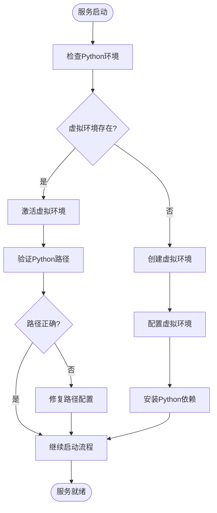
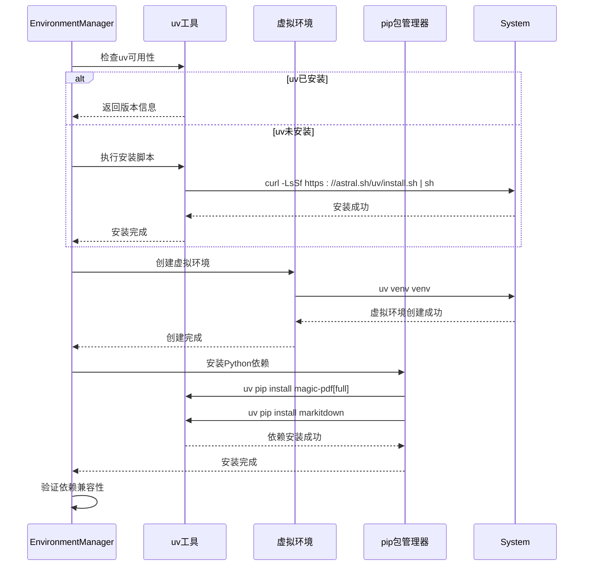
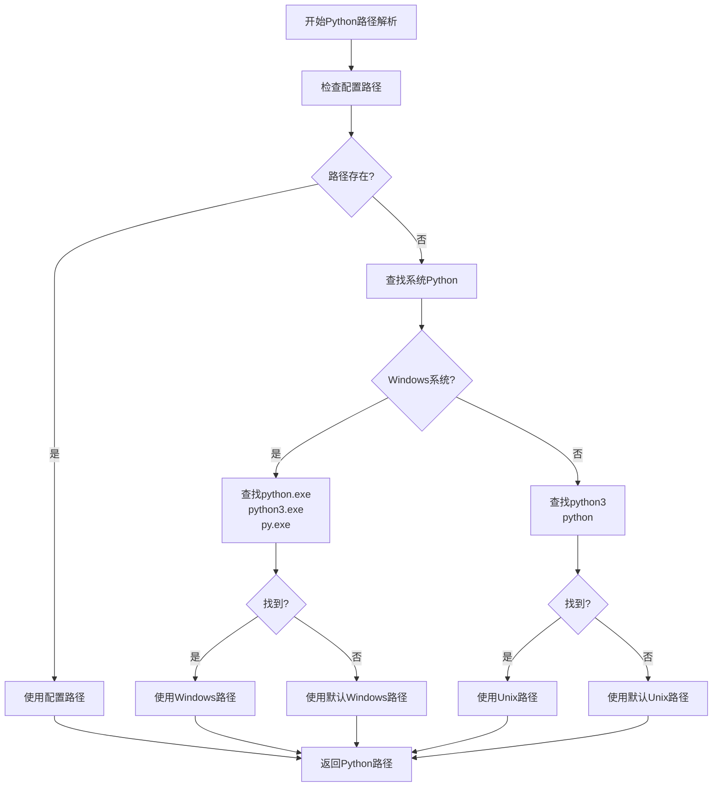
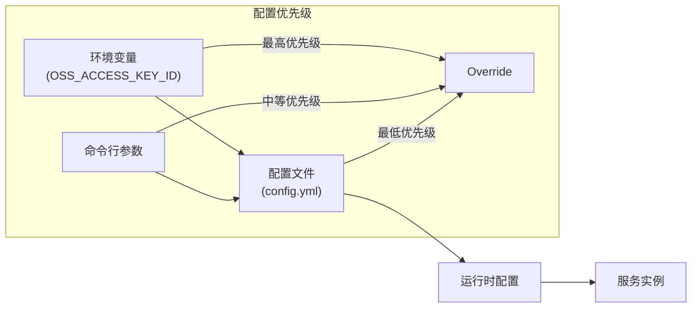
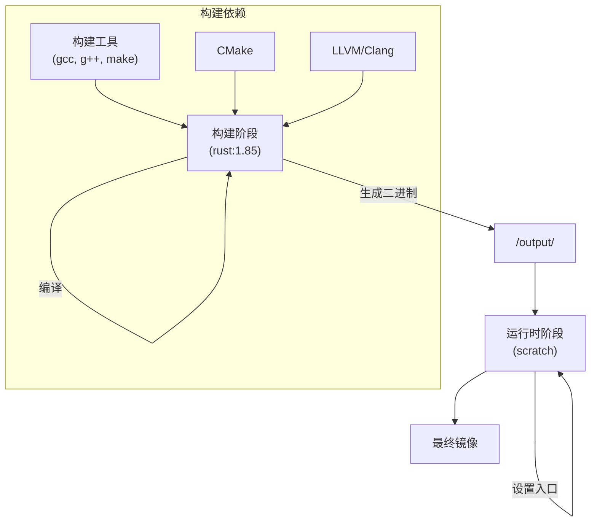

# 环境隔离与依赖管理

<cite>
**本文档引用文件**   
- [environment_manager.rs](file://document-parser/src/utils/environment_manager.rs)
- [main.rs](file://document-parser/src/main.rs)
- [config.yml](file://document-parser/config.yml)
- [Dockerfile](file://Dockerfile)
</cite>

## 目录
1. [引言](#引言)
2. [虚拟环境隔离策略](#虚拟环境隔离策略)
3. [依赖包版本锁定](#依赖包版本锁定)
4. [可执行文件路径配置](#可执行文件路径配置)
5. [命令行参数与环境变量](#命令行参数与环境变量)
6. [Docker容器化部署](#docker容器化部署)
7. [结论](#结论)

## 引言
本文档详细阐述了外部Python服务运行时的环境隔离策略，包括virtualenv激活流程、依赖包版本锁定（requirements.txt）以及可执行文件路径配置。同时说明了如何通过命令行参数或环境变量指定Python解释器和脚本位置，确保多版本共存下的正确调用，并讨论了Docker容器化部署时的集成方式。

**Section sources**
- [main.rs](file://document-parser/src/main.rs#L290-L317)

## 虚拟环境隔离策略
系统通过`EnvironmentManager`实现Python虚拟环境的自动化管理。在服务启动时，系统会自动检查并激活位于项目根目录下的`./venv`虚拟环境。如果虚拟环境不存在，系统会自动创建并配置。虚拟环境的激活命令根据操作系统平台自动适配：在Windows系统中使用`.\venv\Scripts\activate.bat`，在Unix-like系统中使用`source ./venv/bin/activate`。

环境管理器会验证虚拟环境的正确配置，确保Python解释器指向虚拟环境中的可执行文件。如果检测到虚拟环境未激活或配置不正确，系统会提供详细的修复建议和操作步骤。

**Diagram sources **
- [environment_manager.rs](file://document-parser/src/utils/environment_manager.rs#L1123-L1297)
- [main.rs](file://document-parser/src/main.rs#L294-L307)

**Section sources**
- [environment_manager.rs](file://document-parser/src/utils/environment_manager.rs#L1123-L1297)
- [main.rs](file://document-parser/src/main.rs#L294-L307)

## 依赖包版本锁定
系统使用`uv`工具进行Python包管理，通过`setup_python_environment`方法实现依赖的自动化安装和版本控制。`uv`作为现代Python包管理器，提供了比传统`pip`更快的依赖解析和安装速度。

依赖安装流程包括：首先检查并安装`uv`工具，然后创建Python虚拟环境，最后使用`uv pip install`命令安装项目所需的Python包。系统会验证关键依赖如`MinerU`和`MarkItDown`的可用性和版本兼容性，确保功能正常。

**Diagram sources **
- [environment_manager.rs](file://document-parser/src/utils/environment_manager.rs#L2614-L2633)
- [environment_manager.rs](file://document-parser/src/utils/environment_manager.rs#L3047-L3067)

**Section sources**
- [environment_manager.rs](file://document-parser/src/utils/environment_manager.rs#L2614-L2633)

## 可执行文件路径配置
系统通过配置文件和环境变量灵活管理Python解释器的路径。在`config.yml`配置文件中，`mineru`和`markitdown`组件的`python_path`字段默认指向虚拟环境中的Python解释器（`./venv/bin/python`）。系统会自动检测虚拟环境是否存在，如果不存在则回退到系统Python。

环境管理器实现了智能路径解析逻辑：首先检查配置的Python路径是否存在，如果不存在则尝试查找系统Python。查找过程考虑了不同操作系统的可执行文件命名差异，Windows系统查找`python.exe`、`python3.exe`和`py.exe`，而Unix-like系统查找`python3`和`python`。

**Diagram sources **
- [config.yml](file://document-parser/config.yml#L26-L27)
- [environment_manager.rs](file://document-parser/src/utils/environment_manager.rs#L2168-L2182)

**Section sources**
- [config.yml](file://document-parser/config.yml#L26-L27)
- [environment_manager.rs](file://document-parser/src/utils/environment_manager.rs#L2168-L2182)

## 命令行参数与环境变量
系统支持通过环境变量覆盖配置文件中的设置，实现了灵活的运行时配置。在`config.yml`中，OSS访问密钥通过环境变量`${OSS_ACCESS_KEY_ID}`和`${OSS_ACCESS_KEY_SECRET}`注入，避免了敏感信息的硬编码。

对于Python解释器的选择，系统优先使用配置文件中指定的路径，但会自动检测和适配实际环境。如果配置的虚拟环境Python不存在，系统会自动回退到系统Python，确保服务的可用性。这种设计支持多版本Python共存环境下的正确调用。

**Diagram sources **
- [config.yml](file://document-parser/config.yml#L63-L64)

**Section sources**
- [config.yml](file://document-parser/config.yml#L63-L64)

## Docker容器化部署
Docker部署采用多阶段构建策略，确保编译环境和运行时环境的分离。构建阶段基于`rust:1.85`镜像，安装了必要的构建依赖，包括`pkg-config`、`libssl-dev`、`build-essential`、`libclang-dev`、`cmake`等，为Rust和Python组件的编译提供完整环境。

最终运行时镜像采用`scratch`基础镜像，仅包含编译好的二进制文件，实现了最小化的镜像体积。构建过程支持跨平台编译，可根据目标架构自动选择相应的编译工具链。

**Diagram sources **
- [Dockerfile](file://Dockerfile#L2-L64)

**Section sources**
- [Dockerfile](file://Dockerfile#L2-L64)

## 结论
本系统通过`EnvironmentManager`实现了完善的Python环境隔离和依赖管理机制。虚拟环境的自动化创建和激活确保了依赖的隔离性，`uv`工具的使用提高了依赖管理的效率和可靠性。灵活的路径配置和环境变量支持使得系统能够在多版本共存环境下正确运行。Docker多阶段构建策略则确保了部署环境的一致性和安全性。