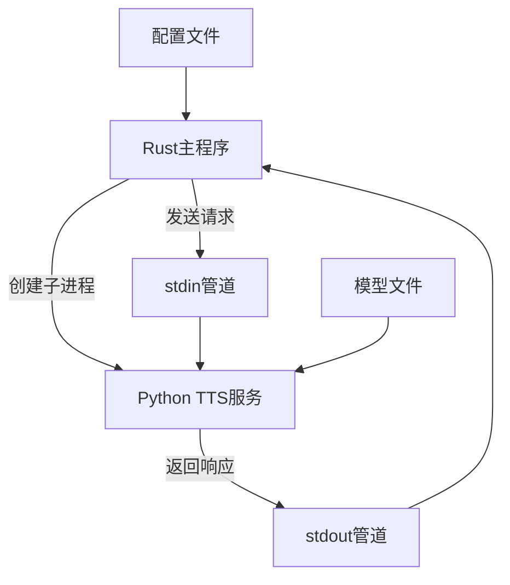
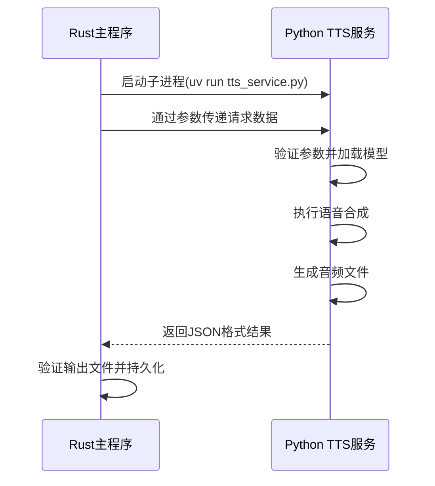
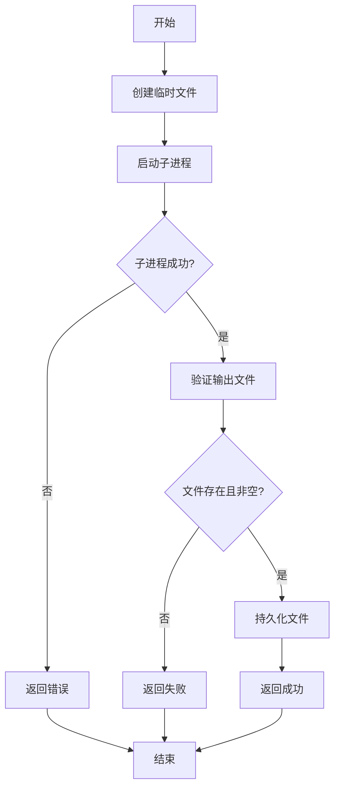
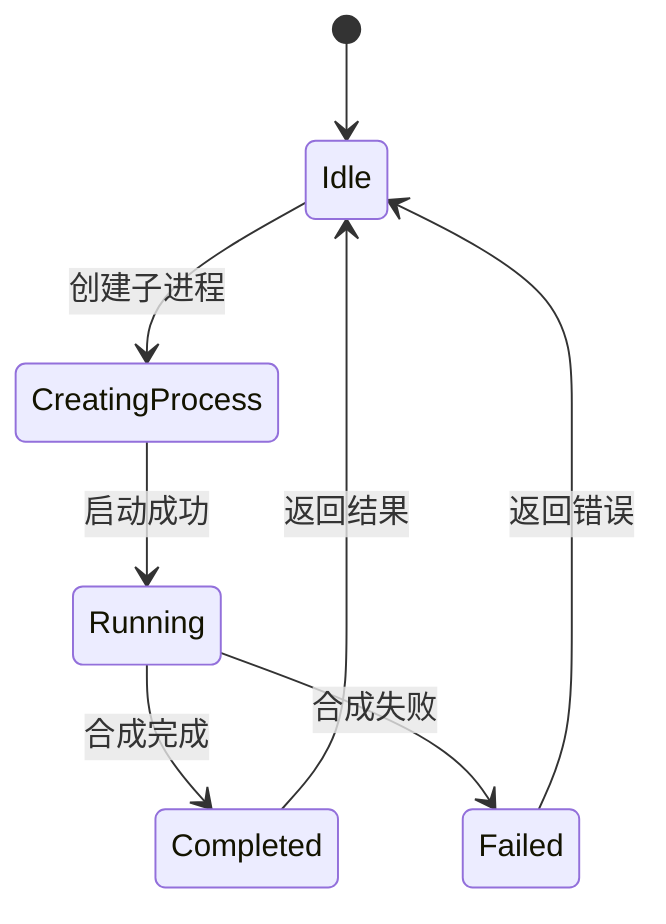
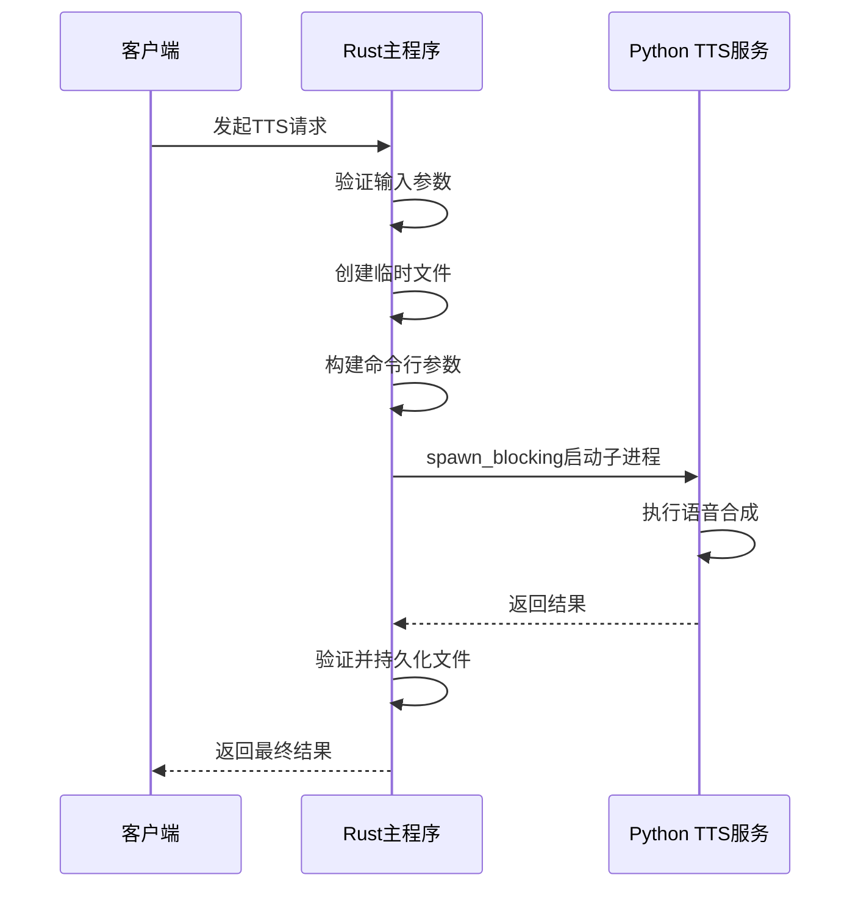

# 进程间通信机制

<cite>
**本文档引用的文件**  
- [transcription_engine.rs](file://voice-cli/src/services/transcription_engine.rs)
- [tts_service.rs](file://voice-cli/src/services/tts_service.rs)
- [tts.rs](file://voice-cli/src/cli/tts.rs)
- [tts.py](file://voice-cli/tts_service.py)
- [sse_server.rs](file://mcp-proxy/src/server/handlers/sse_server.rs)
</cite>

## 目录
1. [引言](#引言)
2. [进程间通信架构](#进程间通信架构)
3. [消息协议与数据交换](#消息协议与数据交换)
4. [流式传输控制与超时处理](#流式传输控制与超时处理)
5. [连接保持与生命周期管理](#连接保持与生命周期管理)
6. [异步非阻塞调用实现](#异步非阻塞调用实现)
7. [异常处理与中断恢复](#异常处理与中断恢复)
8. [性能优化与最佳实践](#性能优化与最佳实践)

## 引言
本项目中的TranscriptionEngine与外部Python TTS服务之间的进程间通信（IPC）采用标准输入输出（stdio）方式进行数据交换。这种设计允许Rust主程序与Python TTS服务在独立进程中运行，同时通过结构化消息协议进行高效通信。系统利用Tokio异步运行时实现非阻塞调用，确保高并发场景下的性能和响应性。

**Section sources**
- [tts_service.rs](file://voice-cli/src/services/tts_service.rs#L1-L333)
- [tts.py](file://voice-cli/tts_service.py#L1-L429)

## 进程间通信架构
系统采用主从架构，其中Rust程序作为主控进程，Python TTS服务作为子进程。通信通过`std::process::Command`创建子进程并建立stdio管道实现。主进程通过`uv run`命令启动Python脚本，确保在正确的虚拟环境中运行。

**Diagram sources**
- [tts_service.rs](file://voice-cli/src/services/tts_service.rs#L19-L91)
- [tts.py](file://voice-cli/tts_service.py#L38-L59)

**Section sources**
- [tts_service.rs](file://voice-cli/src/services/tts_service.rs#L1-L333)
- [tts.py](file://voice-cli/tts_service.py#L1-L429)

## 消息协议与数据交换
通信采用JSON格式的消息协议，通过命令行参数传递请求数据。请求参数包括文本内容、输出路径、语音模型、语速、音调、音量和音频格式等。响应通过标准输出返回JSON格式的结果，包含成功状态、输出路径、文件大小和持续时间等信息。

**Diagram sources**
- [tts_service.rs](file://voice-cli/src/services/tts_service.rs#L143-L172)
- [tts.py](file://voice-cli/tts_service.py#L380-L429)

**Section sources**
- [tts_service.rs](file://voice-cli/src/services/tts_service.rs#L94-L214)
- [tts.py](file://voice-cli/tts_service.py#L91-L185)

## 流式传输控制与超时处理
系统通过临时文件实现流式传输控制。主进程创建临时文件作为输出目标，子进程完成合成后主进程验证文件存在性和完整性。超时处理由主进程在Rust侧实现，使用`tokio::time::timeout`包装子进程执行，设置合理的超时阈值。

**Diagram sources**
- [tts_service.rs](file://voice-cli/src/services/tts_service.rs#L127-L214)
- [tts.py](file://voice-cli/tts_service.py#L134-L170)

**Section sources**
- [tts_service.rs](file://voice-cli/src/services/tts_service.rs#L94-L214)
- [tts.py](file://voice-cli/tts_service.py#L91-L185)

## 连接保持与生命周期管理
每个TTS请求创建独立的子进程，实现连接的按需创建和自动释放。进程生命周期由主进程完全控制，通过`Command::output()`同步等待子进程完成。系统通过环境变量和路径配置确保子进程在正确的上下文中运行。

**Diagram sources**
- [tts_service.rs](file://voice-cli/src/services/tts_service.rs#L143-L172)
- [tts.py](file://voice-cli/tts_service.py#L380-L429)

**Section sources**
- [tts_service.rs](file://voice-cli/src/services/tts_service.rs#L1-L333)
- [tts.py](file://voice-cli/tts_service.py#L1-L429)

## 异步非阻塞调用实现
系统使用`tokio::process::Command`实现异步非阻塞调用。主进程通过`spawn_blocking`将阻塞的进程创建操作移到专用线程池，避免阻塞异步运行时。`uv run`命令确保在虚拟环境中正确执行Python脚本。

**Diagram sources**
- [tts_service.rs](file://voice-cli/src/services/tts_service.rs#L143-L172)
- [tts.py](file://voice-cli/tts_service.py#L380-L429)

**Section sources**
- [tts_service.rs](file://voice-cli/src/services/tts_service.rs#L94-L214)
- [tts.py](file://voice-cli/tts_service.py#L91-L185)

## 异常处理与中断恢复
系统实现了全面的异常处理机制。主进程捕获子进程的退出状态、标准错误输出和超时异常。错误信息被结构化为`VoiceCliError`枚举类型，包含配置错误、输入验证错误、IO错误和TTS特定错误。临时文件机制确保部分写入的文件不会污染输出目录。

**Section sources**
- [tts_service.rs](file://voice-cli/src/services/tts_service.rs#L176-L200)
- [tts.py](file://voice-cli/tts_service.py#L186-L193)

## 性能优化与最佳实践
系统通过缓存模型加载、复用虚拟环境和优化进程创建来提高性能。使用`uv run`而非直接调用Python解释器确保环境一致性。临时文件和原子性文件操作保证了写入的可靠性。异步非阻塞设计支持高并发TTS请求处理。

**Section sources**
- [tts_service.rs](file://voice-cli/src/services/tts_service.rs#L23-L55)
- [tts.py](file://voice-cli/tts_service.py#L16-L37)