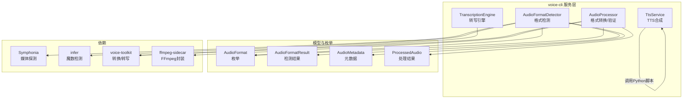
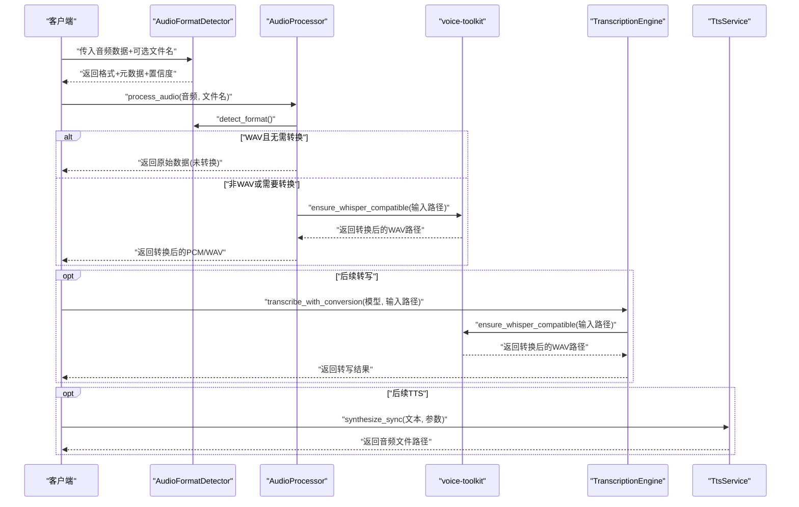
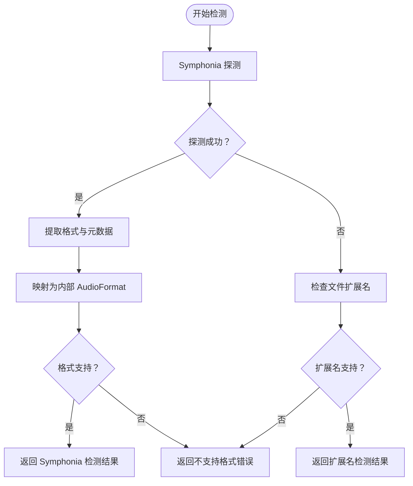
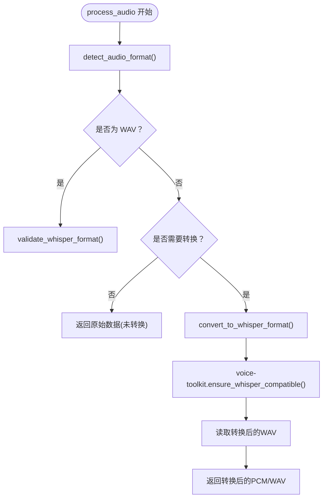
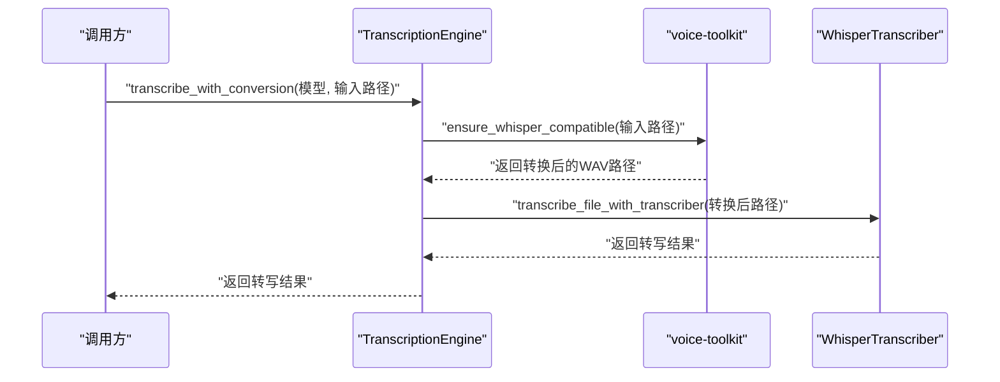
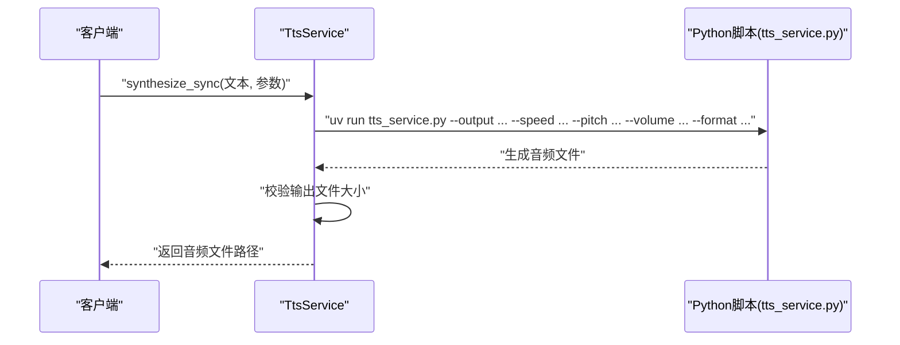
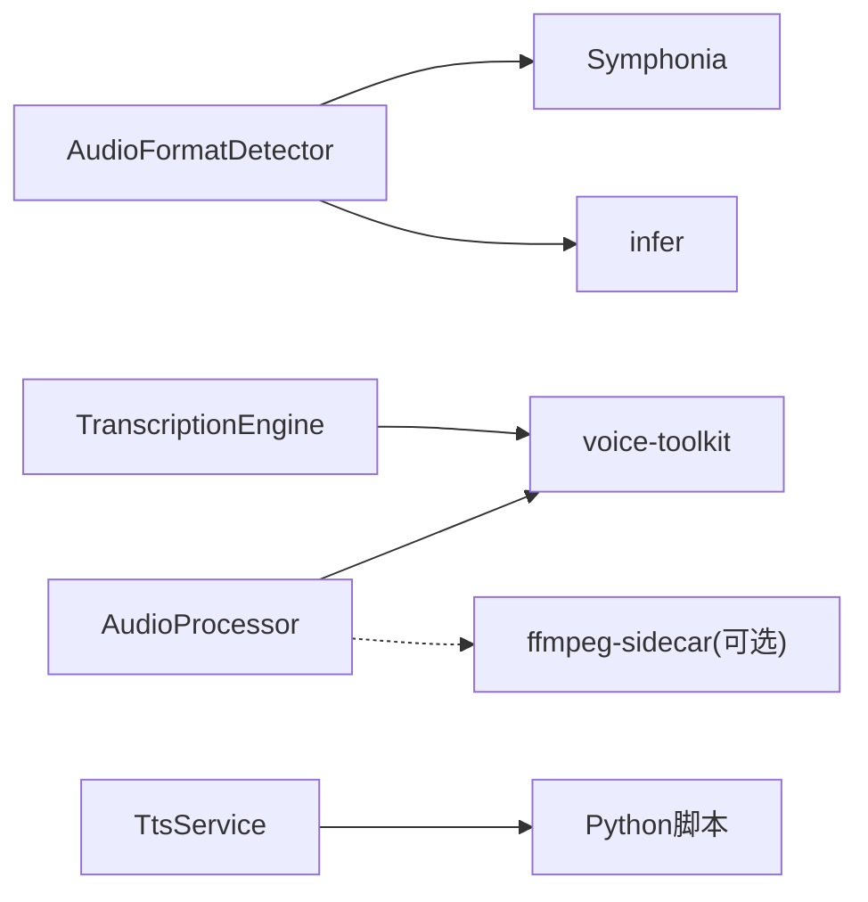

# 音频格式检测与预处理

<cite>
**本文引用的文件**
- [audio_format_detector.rs](file://voice-cli/src/services/audio_format_detector.rs)
- [audio_processor.rs](file://voice-cli/src/services/audio_processor.rs)
- [request.rs](file://voice-cli/src/models/request.rs)
- [transcription_engine.rs](file://voice-cli/src/services/transcription_engine.rs)
- [tts_service.rs](file://voice-cli/src/services/tts_service.rs)
- [Cargo.toml](file://voice-cli/Cargo.toml)
- [audio_pipeline_business_logic_tests.rs](file://voice-cli/tests/audio_pipeline_business_logic_tests.rs)
</cite>

## 目录
1. [简介](#简介)
2. [项目结构](#项目结构)
3. [核心组件](#核心组件)
4. [架构总览](#架构总览)
5. [详细组件分析](#详细组件分析)
6. [依赖关系分析](#依赖关系分析)
7. [性能考量](#性能考量)
8. [故障排查指南](#故障排查指南)
9. [结论](#结论)
10. [附录](#附录)

## 简介
本文件围绕“音频格式检测与预处理”主题，系统阐述以下内容：
- AudioFormatDetector 如何通过文件头（magic number）与媒体探测（Symphonia）识别输入音频格式，并提取元数据。
- AudioProcessor 如何在必要时对音频进行格式转换（如采样率、声道、位深规范化），并产出 Whisper 兼容的 PCM/WAV 数据。
- FFmpeg 或其他后端工具的调用方式与集成点（如 voice-toolkit 的封装）。
- 如何将处理后的 PCM/WAV 数据传递给外部 TTS 引擎（Python 脚本）。
- 典型转换流程的代码路径分析与性能优化建议。

## 项目结构
与音频格式检测与预处理直接相关的模块位于 voice-cli 子工程中，关键文件如下：
- 服务层：AudioFormatDetector、AudioProcessor、TranscriptionEngine、TtsService
- 模型与枚举：AudioFormat、AudioFormatResult、AudioMetadata、ProcessedAudio 等
- 依赖声明：Cargo.toml 中包含 Symphonia、infer、ffmpeg-sidecar、voice-toolkit 等

图表来源
- [audio_format_detector.rs](file://voice-cli/src/services/audio_format_detector.rs#L1-L210)
- [audio_processor.rs](file://voice-cli/src/services/audio_processor.rs#L1-L180)
- [request.rs](file://voice-cli/src/models/request.rs#L160-L405)
- [transcription_engine.rs](file://voice-cli/src/services/transcription_engine.rs#L1-L158)
- [Cargo.toml](file://voice-cli/Cargo.toml#L70-L108)

章节来源
- [audio_format_detector.rs](file://voice-cli/src/services/audio_format_detector.rs#L1-L210)
- [audio_processor.rs](file://voice-cli/src/services/audio_processor.rs#L1-L180)
- [request.rs](file://voice-cli/src/models/request.rs#L160-L405)
- [Cargo.toml](file://voice-cli/Cargo.toml#L70-L108)

## 核心组件
- AudioFormatDetector：优先使用 Symphonia 探测，回退到 infer 魔数与文件扩展名；提取采样率、声道、位深、时长、比特率等元数据；校验格式是否支持。
- AudioProcessor：检测格式、验证 WAV、按需转换为 Whisper 兼容格式（16kHz、单声道、16bit PCM WAV），并通过 voice-toolkit 提供的 ensure_whisper_compatible 完成转换。
- TranscriptionEngine：复用已加载的 WhisperTranscriber，避免重复加载模型；提供带转换的转写接口，内部同样调用 voice-toolkit 的 ensure_whisper_compatible。
- TtsService：以子进程方式调用 Python 脚本进行 TTS 合成，接收文本与参数，输出音频文件；支持同步与异步任务。

章节来源
- [audio_format_detector.rs](file://voice-cli/src/services/audio_format_detector.rs#L1-L210)
- [audio_processor.rs](file://voice-cli/src/services/audio_processor.rs#L1-L180)
- [transcription_engine.rs](file://voice-cli/src/services/transcription_engine.rs#L1-L158)
- [tts_service.rs](file://voice-cli/src/services/tts_service.rs#L1-L214)

## 架构总览
整体流程：输入音频数据 → AudioFormatDetector 检测与元数据提取 → AudioProcessor 判断是否需要转换 → 若需要则转换为 Whisper 兼容的 WAV → 可选：交给 TranscriptionEngine 进行转写；或交给 TtsService 进行 TTS 合成。

图表来源
- [audio_format_detector.rs](file://voice-cli/src/services/audio_format_detector.rs#L27-L110)
- [audio_processor.rs](file://voice-cli/src/services/audio_processor.rs#L27-L120)
- [transcription_engine.rs](file://voice-cli/src/services/transcription_engine.rs#L138-L157)
- [tts_service.rs](file://voice-cli/src/services/tts_service.rs#L93-L214)

## 详细组件分析

### AudioFormatDetector 组件分析
职责与流程：
- 优先使用 Symphonia 探测媒体容器与编解码器，提取首个有效音频轨的编解码器类型，映射为内部 AudioFormat 枚举。
- 若 Symphonia 失败，则回退到文件扩展名检测；若仍失败，抛出不支持格式错误。
- 从轨道参数提取元数据（采样率、声道数、位深、时长、比特率、编解码器信息）。
- 提供格式支持校验与低置信度警告。

关键实现要点：
- 使用 MediaSourceStream + Hint（基于扩展名）进行 Symphonia 探测。
- 通过 AudioFormat::from_symphonia_codec 将 Symphonia 编解码器类型映射为内部枚举。
- 通过 AudioFormat::from_filename 与扩展名映射，作为回退策略。
- 通过 AudioFormat::is_supported 与 validate_format_support 进行支持性校验。

图表来源
- [audio_format_detector.rs](file://voice-cli/src/services/audio_format_detector.rs#L27-L149)
- [request.rs](file://voice-cli/src/models/request.rs#L230-L405)

章节来源
- [audio_format_detector.rs](file://voice-cli/src/services/audio_format_detector.rs#L1-L210)
- [request.rs](file://voice-cli/src/models/request.rs#L160-L405)

### AudioProcessor 组件分析
职责与流程：
- process_audio：检测格式、对 WAV 进行基础头部校验、判断是否需要转换。
- convert_to_whisper_format：将输入音频转换为 Whisper 兼容的 WAV（16kHz、单声道、16bit PCM）。
- convert_with_rs_voice_toolkit：调用 voice-toolkit::audio::ensure_whisper_compatible 完成转换。
- validate_whisper_format：对 WAV 头部进行基本校验（RIFF/WAVE/fmt/data 等），并给出非最优参数的告警。

关键实现要点：
- 通过 create_temp_file 将 Bytes 写入临时文件，供外部工具处理。
- 对转换失败进行降级处理（记录错误并返回）。
- 对 WAV 进行基础校验，非最优参数仅告警而非强制报错。

图表来源
- [audio_processor.rs](file://voice-cli/src/services/audio_processor.rs#L27-L180)
- [audio_processor.rs](file://voice-cli/src/services/audio_processor.rs#L180-L276)

章节来源
- [audio_processor.rs](file://voice-cli/src/services/audio_processor.rs#L1-L276)
- [audio_pipeline_business_logic_tests.rs](file://voice-cli/tests/audio_pipeline_business_logic_tests.rs#L1-L120)

### TranscriptionEngine 组件分析
职责与流程：
- 复用已加载的 WhisperTranscriber，避免重复加载模型。
- 提供 transcribe_with_conversion：先确保输入为 Whisper 兼容格式，再进行转写。
- 使用 spawn_blocking 在阻塞线程池中执行 CPU 密集型转写操作，并设置超时。

关键实现要点：
- DashMap 缓存 Transcriber，避免并发竞争导致的重复创建。
- 通过 voice-toolkit::audio::ensure_whisper_compatible 实现转换。
- 超时控制与错误分类（panic、取消、join 错误）。

图表来源
- [transcription_engine.rs](file://voice-cli/src/services/transcription_engine.rs#L138-L157)

章节来源
- [transcription_engine.rs](file://voice-cli/src/services/transcription_engine.rs#L1-L158)

### TTS 服务与外部引擎集成
职责与流程：
- TtsService 通过子进程调用 Python 脚本进行 TTS 合成，支持同步与异步任务。
- 同步模式：创建临时文件，执行 uv run 调用 tts_service.py，校验输出文件有效性后持久化。
- 异步模式：估算处理时间并返回任务标识（占位实现，后续可接入任务队列）。

关键实现要点：
- 通过 uv run 确保在正确虚拟环境中运行 Python 脚本。
- 支持传入模型路径、速度、音调、音量、输出格式等参数。
- 输出文件持久化到 data/tts 目录，使用 UUID 生成唯一文件名。

图表来源
- [tts_service.rs](file://voice-cli/src/services/tts_service.rs#L93-L214)

章节来源
- [tts_service.rs](file://voice-cli/src/services/tts_service.rs#L1-L214)

## 依赖关系分析
- Symphonia：用于媒体探测与编解码器识别，是 AudioFormatDetector 的核心依赖。
- infer：用于魔数检测，作为 Symphonia 的补充与回退手段。
- ffmpeg-sidecar：声明在 Cargo.toml 中，但当前 AudioProcessor 主要通过 voice-toolkit 的 ensure_whisper_compatible 完成转换；若未来需要直接调用 FFmpeg，可在此处扩展。
- voice-toolkit：统一的音频处理后端，提供 ensure_whisper_compatible、WhisperTranscriber 等能力，是转换与转写的中枢。

图表来源
- [audio_format_detector.rs](file://voice-cli/src/services/audio_format_detector.rs#L1-L210)
- [audio_processor.rs](file://voice-cli/src/services/audio_processor.rs#L1-L180)
- [transcription_engine.rs](file://voice-cli/src/services/transcription_engine.rs#L1-L158)
- [Cargo.toml](file://voice-cli/Cargo.toml#L70-L108)

章节来源
- [Cargo.toml](file://voice-cli/Cargo.toml#L70-L108)

## 性能考量
- 并发与缓存
  - TranscriptionEngine 使用 DashMap 缓存 Transcriber，避免重复加载模型，降低 VRAM 与启动开销。
  - 建议：对 AudioProcessor 的临时文件操作进行批量清理，避免磁盘碎片与 IO 压力。
- I/O 与内存
  - AudioProcessor 将 Bytes 写入临时文件再交由 voice-toolkit 处理，适合大文件场景；小文件可考虑内存直通以减少磁盘 IO。
  - 建议：对超大音频采用流式处理或分块转换，避免一次性占用过多内存。
- 转换策略
  - 对于 WAV 已满足 Whisper 参数的情况，直接返回原始数据，避免不必要的转换。
  - 对非 WAV 音频，尽量使用 voice-toolkit 的 ensure_whisper_compatible，减少自定义 FFmpeg 参数复杂度。
- 超时与稳定性
  - TranscriptionEngine 对转写过程设置超时，防止长时间阻塞；建议对外暴露可配置的超时参数。
- 日志与可观测性
  - 关键路径均添加日志，便于定位问题；建议增加指标采集（转换耗时、成功率、失败原因分布）。

[本节为通用性能建议，不直接分析具体文件]

## 故障排查指南
常见问题与定位思路：
- 格式检测失败
  - Symphonia 探测失败：检查输入数据是否完整、扩展名是否匹配；回退到 infer 与扩展名检测。
  - 无音频轨：确认容器内是否存在有效音频轨。
- 转换失败
  - voice-toolkit 转换失败：检查输入文件完整性与权限；查看日志中的错误信息；必要时降级到其他转换方案。
  - 临时文件写入失败：检查临时目录权限与磁盘空间。
- WAV 校验失败
  - RIFF/WAVE/fmt/data 头部缺失或损坏：确认输入为合法 WAV；对非最优参数仅告警，不影响后续处理。
- TTS 合成失败
  - Python 脚本执行失败：检查 uv、脚本路径与虚拟环境；查看标准输出/错误日志；确认输出文件存在且非空。
  - 参数越界：语速、音调、音量超出范围会触发输入校验错误。

章节来源
- [audio_format_detector.rs](file://voice-cli/src/services/audio_format_detector.rs#L1-L210)
- [audio_processor.rs](file://voice-cli/src/services/audio_processor.rs#L1-L276)
- [tts_service.rs](file://voice-cli/src/services/tts_service.rs#L93-L214)
- [audio_pipeline_business_logic_tests.rs](file://voice-cli/tests/audio_pipeline_business_logic_tests.rs#L1-L120)

## 结论
该系统通过 AudioFormatDetector 的多策略检测与 AudioProcessor 的按需转换，实现了对多种音频格式的稳健支持，并将处理结果标准化为 Whisper 兼容的 PCM/WAV。借助 voice-toolkit 的统一后端，既简化了 FFmpeg 的使用复杂度，又保证了转换与转写的稳定性。对于 TTS 合成，通过 TtsService 将 Rust 侧与 Python 侧无缝衔接，形成完整的音频处理链路。建议在生产环境中进一步完善超时与监控、优化大文件处理策略，并保持对 FFmpeg 的可插拔扩展能力。

[本节为总结性内容，不直接分析具体文件]

## 附录

### 典型转换流程的代码路径
- 音频格式检测
  - [detect_format](file://voice-cli/src/services/audio_format_detector.rs#L27-L110)
  - [symphonia_probe](file://voice-cli/src/services/audio_format_detector.rs#L67-L110)
  - [extract_format_info](file://voice-cli/src/services/audio_format_detector.rs#L110-L149)
- 音频预处理与转换
  - [process_audio](file://voice-cli/src/services/audio_processor.rs#L27-L67)
  - [convert_to_whisper_format](file://voice-cli/src/services/audio_processor.rs#L88-L132)
  - [convert_with_rs_voice_toolkit](file://voice-cli/src/services/audio_processor.rs#L134-L184)
  - [validate_whisper_format](file://voice-cli/src/services/audio_processor.rs#L209-L276)
- 转写与 TTS
  - [transcribe_with_conversion](file://voice-cli/src/services/transcription_engine.rs#L138-L157)
  - [synthesize_sync](file://voice-cli/src/services/tts_service.rs#L93-L214)

章节来源
- [audio_format_detector.rs](file://voice-cli/src/services/audio_format_detector.rs#L27-L149)
- [audio_processor.rs](file://voice-cli/src/services/audio_processor.rs#L27-L184)
- [transcription_engine.rs](file://voice-cli/src/services/transcription_engine.rs#L138-L157)
- [tts_service.rs](file://voice-cli/src/services/tts_service.rs#L93-L214)