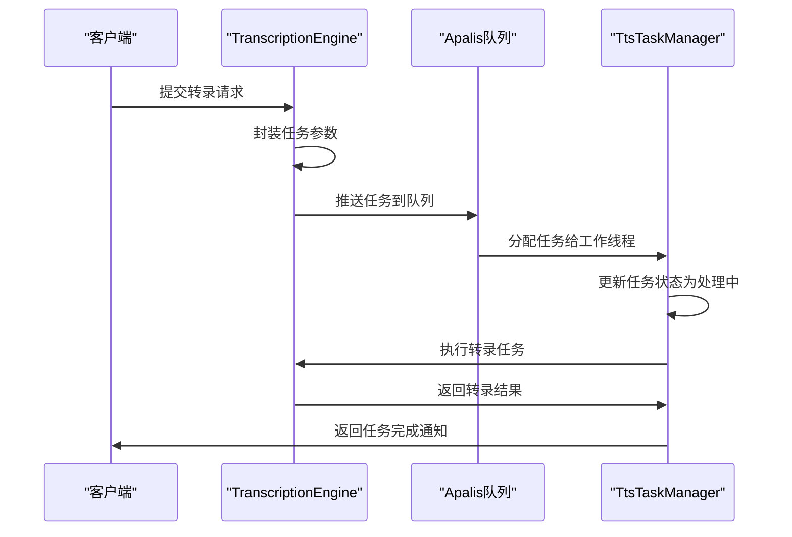
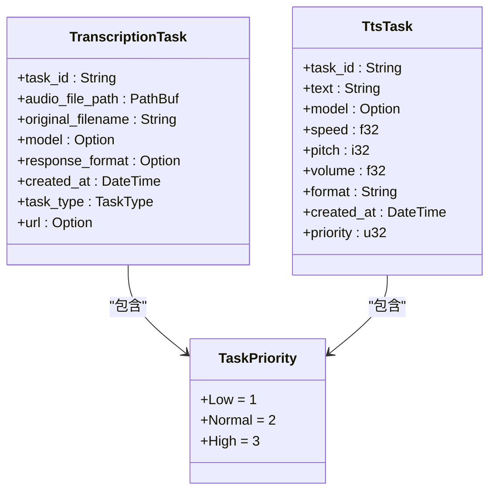
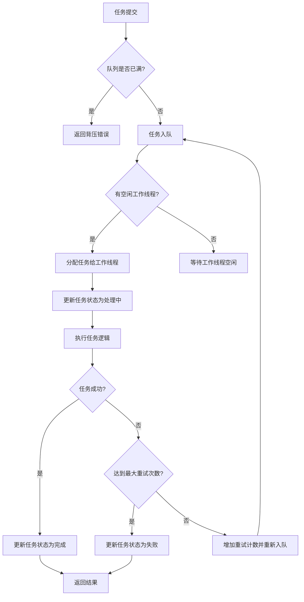
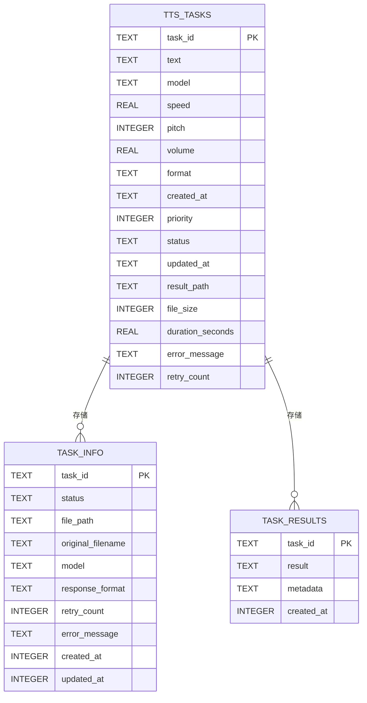
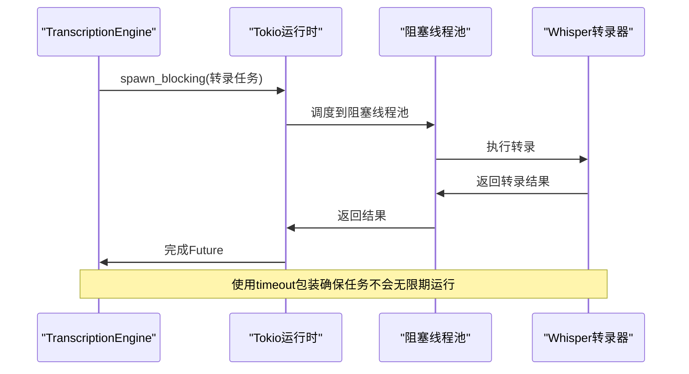
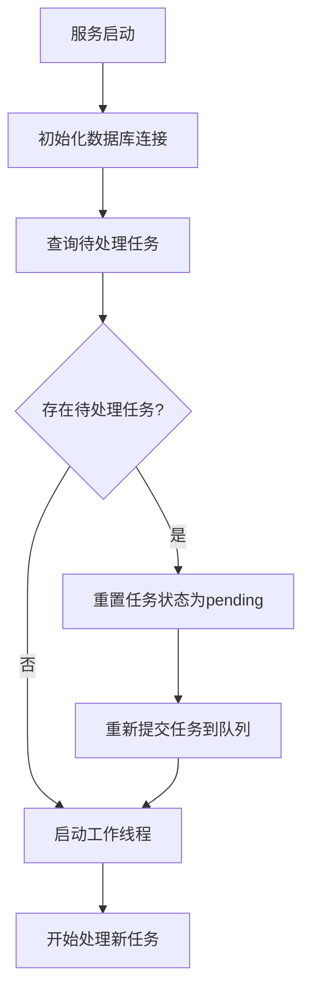

# 任务调度机制

<cite>
**本文档引用的文件**   
- [transcription_engine.rs](file://voice-cli/src/services/transcription_engine.rs)
- [tts_task_manager.rs](file://voice-cli/src/services/tts_task_manager.rs)
- [apalis_manager.rs](file://voice-cli/src/services/apalis_manager.rs)
- [task_queue_service.rs](file://document-parser/src/services/task_queue_service.rs)
- [task_service.rs](file://document-parser/src/services/task_service.rs)
- [tts.rs](file://voice-cli/src/models/tts.rs)
- [request.rs](file://voice-cli/src/models/request.rs)
- [audio_file_manager.rs](file://voice-cli/src/services/audio_file_manager.rs)
- [model_service.rs](file://voice-cli/src/services/model_service.rs)
</cite>

## 目录
1. [任务创建与提交流程](#任务创建与提交流程)
2. [任务参数封装与优先级设置](#任务参数封装与优先级设置)
3. [任务调度器实现原理](#任务调度器实现原理)
4. [Apalis集成与RocksDB持久化](#apalis集成与rocksdb持久化)
5. [异步流程与超时控制](#异步流程与超时控制)
6. [资源预分配机制](#资源预分配机制)
7. [服务重启后任务恢复](#服务重启后任务恢复)

## 任务创建与提交流程

TranscriptionEngine通过Apalis任务调度框架将转录任务提交到TtsTaskManager。整个流程始于TranscriptionEngine接收到音频文件和转录请求，然后创建任务并将其推送到Apalis队列中。TtsTaskManager负责管理任务的生命周期，包括任务的创建、状态更新和结果存储。

任务提交流程首先由TranscriptionEngine调用`submit_task`方法，该方法接收音频文件路径、原始文件名、模型名称等参数。随后，TranscriptionEngine将这些参数封装成一个`TranscriptionTask`对象，并通过Apalis的`push`方法将其推送到任务队列中。在任务提交过程中，TranscriptionEngine还会初始化任务状态为"pending"，并将其保存到数据库中，以便后续查询和管理。



**Diagram sources**
- [transcription_engine.rs](file://voice-cli/src/services/transcription_engine.rs#L382-L452)
- [tts_task_manager.rs](file://voice-cli/src/services/tts_task_manager.rs#L109-L159)
- [apalis_manager.rs](file://voice-cli/src/services/apalis_manager.rs#L382-L452)

**Section sources**
- [transcription_engine.rs](file://voice-cli/src/services/transcription_engine.rs#L382-L452)
- [tts_task_manager.rs](file://voice-cli/src/services/tts_task_manager.rs#L109-L159)

## 任务参数封装与优先级设置

任务参数的封装是通过`TranscriptionTask`结构体完成的，该结构体包含了任务ID、音频文件路径、原始文件名、模型名称、响应格式、创建时间等关键信息。在任务提交时，TranscriptionEngine会根据请求参数创建`TranscriptionTask`实例，并将其序列化后存储到数据库中。

优先级设置是通过`TaskPriority`枚举实现的，该枚举定义了三种优先级：Low(1)、Normal(2)和High(3)。当提交任务时，可以通过`priority`参数指定任务的优先级。TtsTaskManager在处理任务时会根据优先级值进行排序，确保高优先级任务能够优先得到处理。如果没有指定优先级，则默认使用Normal优先级。



**Diagram sources**
- [apalis_manager.rs](file://voice-cli/src/services/apalis_manager.rs#L41-L53)
- [tts.rs](file://voice-cli/src/models/tts.rs#L184-L190)
- [tts_task_manager.rs](file://voice-cli/src/services/tts_task_manager.rs#L19-L29)

**Section sources**
- [apalis_manager.rs](file://voice-cli/src/services/apalis_manager.rs#L41-L53)
- [tts.rs](file://voice-cli/src/models/tts.rs#L184-L190)

## 任务调度器实现原理

任务调度器的核心实现基于Apalis框架，它提供了一个分布式任务队列系统，能够可靠地处理后台任务。TtsTaskManager作为任务调度器的主要组件，负责管理任务的整个生命周期，包括任务的创建、执行、状态更新和结果存储。

调度器的工作原理是基于工作线程池模式，其中多个工作线程从任务队列中获取任务并执行。当任务被提交到队列后，调度器会根据配置的最大并发任务数来决定同时处理的任务数量。每个工作线程在执行任务时会更新任务状态为"processing"，并在任务完成后更新为"completed"或"failed"。

调度器还实现了任务重试机制，当任务执行失败时，可以根据配置的重试次数进行重试。此外，调度器支持任务取消功能，允许在任务执行过程中取消任务。这些功能通过监听任务状态变化和外部信号来实现。



**Diagram sources**
- [tts_task_manager.rs](file://voice-cli/src/services/tts_task_manager.rs#L298-L306)
- [task_queue_service.rs](file://document-parser/src/services/task_queue_service.rs#L184-L208)
- [task_service.rs](file://document-parser/src/services/task_service.rs#L26-L56)

**Section sources**
- [tts_task_manager.rs](file://voice-cli/src/services/tts_task_manager.rs#L298-L306)
- [task_queue_service.rs](file://document-parser/src/services/task_queue_service.rs#L184-L208)

## Apalis集成与RocksDB持久化

Apalis框架通过集成SQLite存储实现了任务的持久化，确保在服务重启后任务不会丢失。TtsTaskManager在初始化时会创建一个SQLite数据库连接，并设置Apalis的存储后端。所有任务数据都会被序列化后存储到SQLite数据库中，包括任务参数、状态和执行结果。

持久化机制的关键在于Apalis的`SqliteStorage`组件，它负责将任务对象持久化到数据库。当任务被提交到队列时，Apalis会自动将其存储到数据库中。工作线程从数据库中读取任务并执行，执行完成后更新数据库中的任务状态。这种设计确保了即使服务意外终止，未完成的任务也能在服务重启后继续处理。



**Diagram sources**
- [tts_task_manager.rs](file://voice-cli/src/services/tts_task_manager.rs#L72-L107)
- [apalis_manager.rs](file://voice-cli/src/services/apalis_manager.rs#L277-L315)
- [task_service.rs](file://document-parser/src/services/task_service.rs#L19-L24)

**Section sources**
- [tts_task_manager.rs](file://voice-cli/src/services/tts_task_manager.rs#L72-L107)
- [apalis_manager.rs](file://voice-cli/src/services/apalis_manager.rs#L277-L315)

## 异步流程与超时控制

任务的异步处理流程通过Tokio运行时实现，确保了高并发性能和资源利用率。TranscriptionEngine使用`tokio::task::spawn_blocking`来执行CPU密集型的转录操作，避免阻塞异步运行时。这种设计允许系统同时处理多个任务，而不会因为单个任务的长时间运行而影响整体性能。

超时控制是通过`tokio::time::timeout`函数实现的，它为任务执行设置了最大时间限制。如果任务在指定时间内没有完成，就会被自动取消并标记为超时失败。这种机制防止了任务无限期挂起，确保了系统的稳定性和响应性。



**Diagram sources**
- [transcription_engine.rs](file://voice-cli/src/services/transcription_engine.rs#L87-L110)
- [tts_task_manager.rs](file://voice-cli/src/services/tts_task_manager.rs#L134-L154)
- [task_queue_service.rs](file://document-parser/src/services/task_queue_service.rs#L356-L359)

**Section sources**
- [transcription_engine.rs](file://voice-cli/src/services/transcription_engine.rs#L87-L110)
- [tts_task_manager.rs](file://voice-cli/src/services/tts_task_manager.rs#L134-L154)

## 资源预分配机制

资源预分配机制主要体现在模型缓存和音频文件管理两个方面。TranscriptionEngine使用`DashMap`来缓存已加载的WhisperTranscriber实例，避免重复加载模型和占用额外的VRAM。当需要处理新任务时，TranscriptionEngine会首先检查缓存中是否存在对应的模型实例，如果存在则直接复用，否则才创建新的实例。

音频文件管理通过`AudioFileManager`组件实现，它负责管理音频文件的存储和清理。当接收到新的音频文件时，AudioFileManager会将其保存到指定的存储目录，并生成唯一的文件名。系统还实现了定期清理过期文件的机制，避免存储空间被耗尽。

```mermaid
classDiagram
class TranscriptionEngine {
-model_service : Arc<ModelService>
-transcribers : DashMap<String, Arc<WhisperTranscriber>>
}
class AudioFileManager {
-storage_dir : PathBuf
}
class ModelService {
-config : Config
-client : Client
-models_dir : PathBuf
}
TranscriptionEngine --> AudioFileManager : "使用"
TranscriptionEngine --> ModelService : "使用"
ModelService --> "SQLite数据库" : "存储"
AudioFileManager --> "文件系统" : "存储"
```

**Diagram sources**
- [transcription_engine.rs](file://voice-cli/src/services/transcription_engine.rs#L11-L16)
- [audio_file_manager.rs](file://voice-cli/src/services/audio_file_manager.rs#L12-L14)
- [model_service.rs](file://voice-cli/src/services/model_service.rs#L10-L14)

**Section sources**
- [transcription_engine.rs](file://voice-cli/src/services/transcription_engine.rs#L11-L16)
- [audio_file_manager.rs](file://voice-cli/src/services/audio_file_manager.rs#L12-L14)

## 服务重启后任务恢复

服务重启后的任务恢复机制通过数据库持久化和启动时的状态恢复实现。当服务启动时，TtsTaskManager会查询数据库中所有状态为"pending"或"processing"的任务，并将它们重新加入到任务队列中。这样可以确保在服务重启前未完成的任务能够继续执行。

恢复过程首先由`restore_pending_tasks`方法执行，该方法会查询数据库中的待处理和进行中任务列表。然后，它会将所有进行中任务的状态重置为"pending"，并重新提交到队列中。这种设计确保了任务状态的一致性，避免了任务状态混乱的问题。



**Diagram sources**
- [task_queue_service.rs](file://document-parser/src/services/task_queue_service.rs#L210-L258)
- [tts_task_manager.rs](file://voice-cli/src/services/tts_task_manager.rs#L62-L68)
- [apalis_manager.rs](file://voice-cli/src/services/apalis_manager.rs#L276-L271)

**Section sources**
- [task_queue_service.rs](file://document-parser/src/services/task_queue_service.rs#L210-L258)
- [tts_task_manager.rs](file://voice-cli/src/services/tts_task_manager.rs#L62-L68)