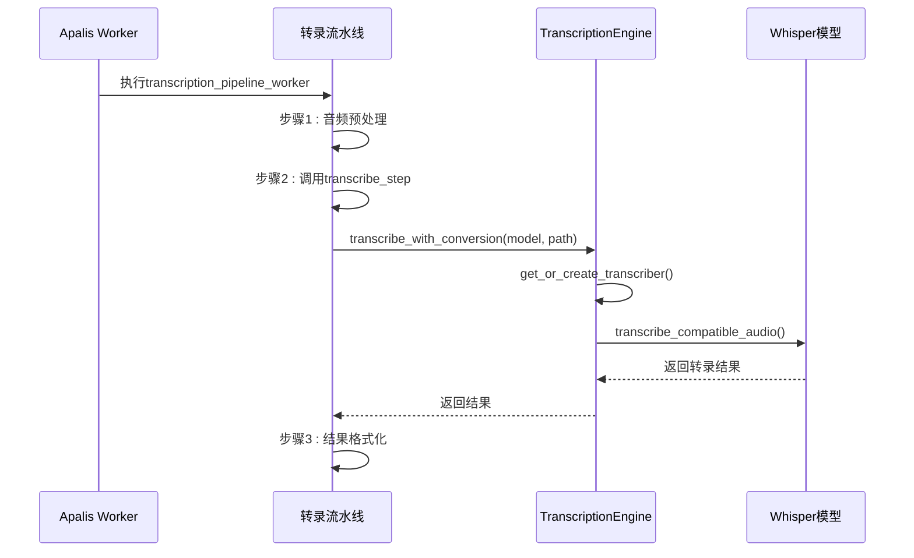
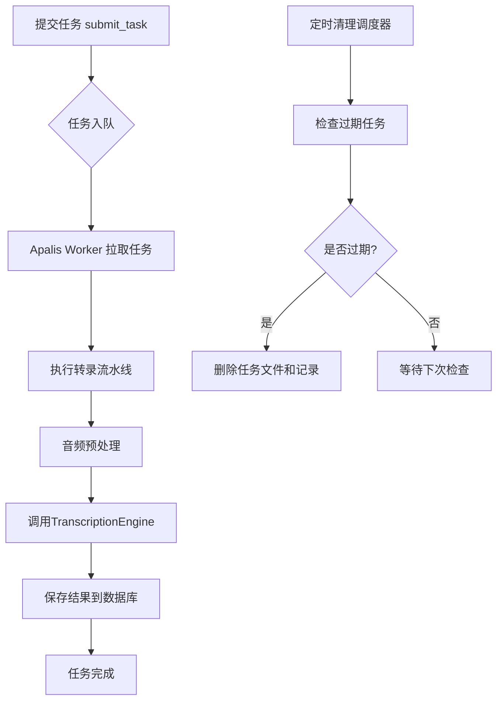

# 后台队列集成

<cite>
**本文档引用的文件**   
- [apalis_manager.rs](file://voice-cli/src/services/apalis_manager.rs)
- [transcription_engine.rs](file://voice-cli/src/services/transcription_engine.rs)
- [config.rs](file://voice-cli/src/models/config.rs)
- [stepped_task.rs](file://voice-cli/src/models/stepped_task.rs)
</cite>

## 目录
1. [初始化过程](#初始化过程)
2. [工作线程池配置](#工作线程池配置)
3. [与TranscriptionEngine的集成](#与transcriptionengine的集成)
4. [消息序列化格式](#消息序列化格式)
5. [任务拉取与并发控制](#任务拉取与并发控制)
6. [队列监控与动态优化](#队列监控与动态优化)

## 初始化过程

Apalis任务队列的初始化由`LockFreeApalisManager`类负责。该过程首先根据配置创建SQLite数据库连接池，并确保数据库文件和目录存在且可写。随后，系统调用`SqliteStorage::setup()`初始化Apalis的存储表结构，并创建自定义的任务状态表（`task_info`）和结果表（`task_results`）用于持久化任务元数据。初始化完成后，系统返回一个包含管理器实例和存储实例的元组，为后续的worker启动做好准备。

**Section sources**
- [apalis_manager.rs](file://voice-cli/src/services/apalis_manager.rs#L196-L274)

## 工作线程池配置

工作线程池的配置主要通过`TaskManagementConfig`中的`max_concurrent_tasks`参数控制，该参数定义了同时处理任务的最大数量。在`apalis_manager.rs`中，worker的并发度通过`concurrency()`方法设置，其值直接来源于配置。此外，系统还配置了任务重试策略，由`retry_attempts`参数决定失败任务的重试次数。默认配置下，最大并发任务数为4，重试次数为2次。

**Section sources**
- [apalis_manager.rs](file://voice-cli/src/services/apalis_manager.rs#L348-L349)
- [config.rs](file://voice-cli/src/models/config.rs#L236-L247)

## 与TranscriptionEngine的集成

Apalis队列与`TranscriptionEngine`的集成通过一个步骤化的流水线实现。当任务被提交到队列后，Apalis的worker会调用`transcription_pipeline_worker`函数。该函数接收一个`StepContext`上下文，其中包含了`TranscriptionEngine`的共享实例（`Arc<TranscriptionEngine>`）。在流水线的第二步（`transcribe_step`）中，代码通过`ctx.transcription_engine.transcribe_with_conversion()`方法调用转录引擎，传入模型名称和音频文件路径，从而完成语音转录的核心处理。

**Diagram sources**
- [apalis_manager.rs](file://voice-cli/src/services/apalis_manager.rs#L1504-L1577)
- [transcription_engine.rs](file://voice-cli/src/services/transcription_engine.rs#L77-L156)

## 消息序列化格式

任务队列中的消息（即任务数据）采用Rust的`serde`库进行序列化，最终以JSON格式存储在SQLite数据库中。核心任务结构体为`TranscriptionTask`，其序列化字段包括：
- `task_id`: 任务唯一标识符
- `audio_file_path`: 音频文件在磁盘上的路径
- `original_filename`: 上传时的原始文件名
- `model`: 指定的转录模型（可选）
- `response_format`: 响应格式（可选）
- `created_at`: 任务创建时间
- `task_type`: 任务类型（文件上传或URL下载）
- `url`: 下载URL（仅对URL任务有效）

这些字段通过`#[derive(Serialize, Deserialize)]`宏自动生成序列化代码。

**Section sources**
- [stepped_task.rs](file://voice-cli/src/models/stepped_task.rs#L40-L52)
- [apalis_manager.rs](file://voice-cli/src/services/apalis_manager.rs#L39-L52)

## 任务拉取与并发控制

Apalis库内部处理任务的拉取逻辑，worker会持续从SQLite数据库中轮询待处理的任务。拉取频率由Apalis的内部调度机制决定，无需手动配置。并发执行由`WorkerBuilder`的`concurrency()`方法严格控制，确保同时运行的任务数不会超过`max_concurrent_tasks`的限制。系统通过`AtomicBool`类型的`worker_running`标志来管理worker的生命周期，防止重复启动。

**Section sources**
- [apalis_manager.rs](file://voice-cli/src/services/apalis_manager.rs#L348-L349)
- [apalis_manager.rs](file://voice-cli/src/services/apalis_manager.rs#L171-L172)

## 队列监控与动态优化

系统通过`get_tasks_stats()`方法监控队列积压情况，该方法查询`task_info`表，统计各类任务（待处理、处理中、已完成、失败等）的数量，并计算平均处理时间。为了优化吞吐量和确保高负载下的稳定性，系统实现了以下机制：
1.  **定时清理**: 通过`start_cleanup_scheduler()`启动一个后台任务，定期清理过期的任务文件和数据库记录，释放磁盘空间。
2.  **动态调整**: 当前实现中，worker数量由配置文件静态定义，不支持运行时动态调整。但系统设计为无锁（`LockFreeApalisManager`），为未来的动态扩展提供了基础。
3.  **资源监控**: 系统通过`get_task_status()`和`get_task_result()`等方法提供细粒度的任务状态查询，便于外部监控系统集成。

**Diagram sources**
- [apalis_manager.rs](file://voice-cli/src/services/apalis_manager.rs#L841-L917)
- [apalis_manager.rs](file://voice-cli/src/services/apalis_manager.rs#L1046-L1083)