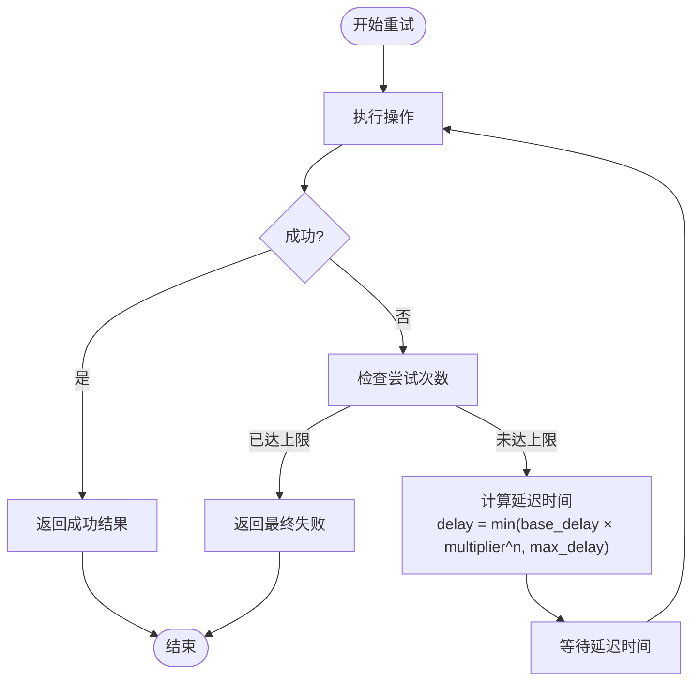
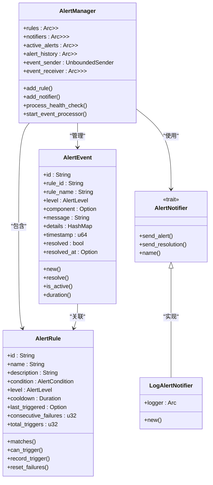

# 失败重试与容错

<cite>
**本文档引用文件**   
- [environment_manager.rs](file://document-parser/src/utils/environment_manager.rs)
- [alerting.rs](file://document-parser/src/utils/alerting.rs)
- [error.rs](file://document-parser/src/error.rs)
- [task_status.rs](file://document-parser/src/models/task_status.rs)
- [logging.rs](file://document-parser/src/utils/logging.rs)
- [config.yml](file://document-parser/config.yml)
</cite>

## 目录
1. [错误分类机制](#错误分类机制)
2. [基于指数退避的重试策略](#基于指数退避的重试策略)
3. [最大重试次数限制](#最大重试次数限制)
4. [失败任务归档策略](#失败任务归档策略)
5. [告警通知机制](#告警通知机制)
6. [配置示例](#配置示例)
7. [日志追踪方法](#日志追踪方法)

## 错误分类机制

系统实现了精细化的错误分类机制，能够识别和处理多种执行失败场景。根据错误类型和可恢复性，系统将错误分为多个类别：

- **网络超时错误**：当系统在执行网络请求时超过预设时间限制而未能完成操作时触发。这类错误通常由 `AppError::Timeout` 表示，属于可恢复错误，适合通过重试机制解决。

- **模型加载失败**：当系统尝试加载机器学习模型或其他资源文件时，若文件不存在、格式不正确或加载过程中发生异常，则会抛出此类错误。通常由 `AppError::Internal` 或 `VoiceCliError::Model` 表示。

- **音频格式异常**：在处理音频文件时，如果文件格式不被支持或文件损坏，系统会通过 `VoiceCliError::UnsupportedFormat` 或 `AppError::UnsupportedFormat` 进行标识。此类错误通常不可恢复，需要用户更换文件。

系统通过 `AppError` 枚举类型定义了多种错误类别，包括配置错误、文件操作错误、格式不支持、解析错误、OSS操作错误、数据库错误、网络错误、任务错误、内部错误、超时错误、验证错误、环境错误等。每种错误都有对应的错误代码（如 E001、E002 等），便于开发者快速定位问题。

**Section sources**
- [error.rs](file://document-parser/src/error.rs#L3-L81)
- [task_status.rs](file://document-parser/src/models/task_status.rs#L700-L761)

## 基于指数退避的重试策略

系统实现了基于指数退避算法的通用重试机制，用于处理可恢复的临时性错误。该机制在 `environment_manager.rs` 文件中的 `retry_with_backoff` 函数中实现。

重试策略的核心参数包括：
- **基础延迟（base_delay）**：第一次重试前的等待时间
- **退避乘数（backoff_multiplier）**：每次重试后延迟时间的增加倍数
- **最大延迟（max_delay）**：重试延迟的上限
- **最大尝试次数（max_attempts）**：允许的最大重试次数

重试过程遵循以下流程：
1. 首次尝试执行操作
2. 如果失败且未达到最大尝试次数，则等待一个递增的时间间隔后重试
3. 每次重试的等待时间按指数增长（前一次延迟 × 退避乘数），但不超过最大延迟
4. 成功后立即返回结果
5. 达到最大尝试次数后仍失败，则返回最终错误

这种指数退避策略能够有效避免在系统暂时不可用时产生过多的请求压力，给系统恢复提供足够的时间。



**Diagram sources **
- [environment_manager.rs](file://document-parser/src/utils/environment_manager.rs#L2087-L2161)

## 最大重试次数限制

系统通过配置参数严格限制最大重试次数，防止无限重试导致资源浪费。最大重试次数由 `retry_config.max_attempts` 参数控制，该参数在环境管理器配置中定义。

当任务失败后，系统会根据错误类型判断是否可重试：
- 可恢复错误（如网络超时、服务暂时不可用）：允许重试
- 不可恢复错误（如文件格式不支持、配置错误）：不允许重试

每次重试都会记录在任务状态中，包括重试次数和失败原因。当达到最大重试次数后，任务将被标记为最终失败状态，不再进行重试。系统会在日志中记录"在X次尝试后仍然失败"的信息，便于后续分析。

**Section sources**
- [environment_manager.rs](file://document-parser/src/utils/environment_manager.rs#L2099-L2159)
- [task_status.rs](file://document-parser/src/models/task_status.rs#L256-L263)

## 失败任务归档策略

系统实现了完善的失败任务归档和状态管理机制。当任务最终失败后，系统会将其状态更新为"失败"，并记录详细的失败信息。

在 `task_status.rs` 文件中，`TaskStatus::Failed` 结构体包含了以下关键信息：
- **错误详情**：包含错误代码、错误消息和发生错误的处理阶段
- **失败时间**：记录任务失败的具体时间戳
- **重试次数**：记录该任务已经尝试的次数
- **可恢复性标志**：指示该错误是否可恢复，决定是否允许重试

失败任务的相关信息会被持久化存储，包括原始任务参数、处理过程中的日志、错误堆栈等，便于后续分析和问题排查。系统还提供了任务统计功能，可以查询失败任务的汇总信息，包括失败总数、失败详情摘要等。

**Section sources**
- [task_status.rs](file://document-parser/src/models/task_status.rs#L534-L542)
- [task_status.rs](file://document-parser/src/models/task_status.rs#L256-L263)

## 告警通知机制

系统实现了灵活的告警通知机制，基于 `alerting.rs` 文件中的 `AlertManager` 和 `AlertNotifier` 组件构建。

告警系统的主要特点包括：
- **多级告警**：支持不同严重级别的告警，如信息、警告、关键、紧急
- **多种通知渠道**：通过 `AlertNotifier` trait 支持多种通知方式
- **冷却机制**：防止相同告警在短时间内重复触发
- **状态跟踪**：跟踪告警的激活和解决状态

系统内置了日志告警通知器（`LogAlertNotifier`），可以将告警信息输出到日志系统。告警事件包含丰富的上下文信息，如告警ID、规则名称、严重级别、组件名称和详细信息等。

当检测到需要告警的条件时，系统会创建 `AlertEvent` 并通过事件通道发送。告警管理器负责处理这些事件，根据告警规则决定是否触发通知，并记录告警历史。



**Diagram sources **
- [alerting.rs](file://document-parser/src/utils/alerting.rs#L572-L594)

## 配置示例

系统的主要配置参数可以在 `config.yml` 文件中进行设置。以下是一个典型的重试和告警配置示例：

```yaml
# 重试配置
retry:
  # 基础延迟时间（秒）
  base_delay: 1
  # 退避乘数
  backoff_multiplier: 2.0
  # 最大延迟时间（秒）
  max_delay: 30
  # 最大尝试次数
  max_attempts: 5

# 告警配置
alerts:
  # 健康检查失败告警
  - id: "health_check_failed"
    name: "健康检查失败"
    description: "当系统健康检查失败时触发"
    level: "critical"
    condition:
      type: "health_status_equals"
      status: "unhealthy"
    cooldown: 300 # 5分钟冷却时间

  # 高错误率告警
  - id: "high_error_rate"
    name: "高错误率"
    description: "当错误率超过阈值时触发"
    level: "warning"
    condition:
      type: "error_rate_exceeds"
      threshold: 0.1
    cooldown: 600 # 10分钟冷却时间
```

这些配置参数可以通过环境变量或配置文件进行调整，无需修改代码即可适应不同的部署环境和业务需求。

**Section sources**
- [config.yml](file://document-parser/config.yml)
- [environment_manager.rs](file://document-parser/src/utils/environment_manager.rs#L2097-L2150)

## 日志追踪方法

系统提供了全面的日志追踪功能，帮助开发者定位和诊断常见故障。日志系统在 `logging.rs` 文件中实现，具有以下特点：

- **结构化日志**：所有日志都以结构化格式记录，包含时间戳、日志级别、消息、模块、文件位置、关联上下文等信息
- **关联ID**：通过 `CorrelationContext` 实现请求级的关联ID追踪，便于跨组件追踪同一请求的处理流程
- **多级输出**：支持控制台、文件等多种日志输出方式
- **脱敏处理**：自动对日志中的敏感信息（如密码、令牌、信用卡号等）进行脱敏处理

关键的日志追踪点包括：
- 重试操作：记录"第X次尝试失败，Y秒后重试"和"在第X次尝试后成功"等信息
- 任务状态变更：记录任务状态的每次变更，包括失败和重试
- 告警事件：记录所有告警的触发和解决
- 错误详情：记录完整的错误堆栈和上下文信息

开发者可以通过搜索特定的关联ID（request_id、trace_id等）来追踪一个请求的完整处理流程，快速定位问题发生的位置和原因。

**Section sources**
- [logging.rs](file://document-parser/src/utils/logging.rs#L1-L800)
- [environment_manager.rs](file://document-parser/src/utils/environment_manager.rs#L2111-L2116)