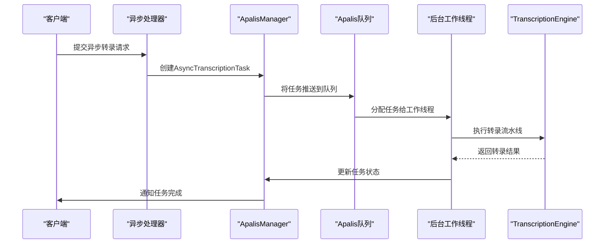
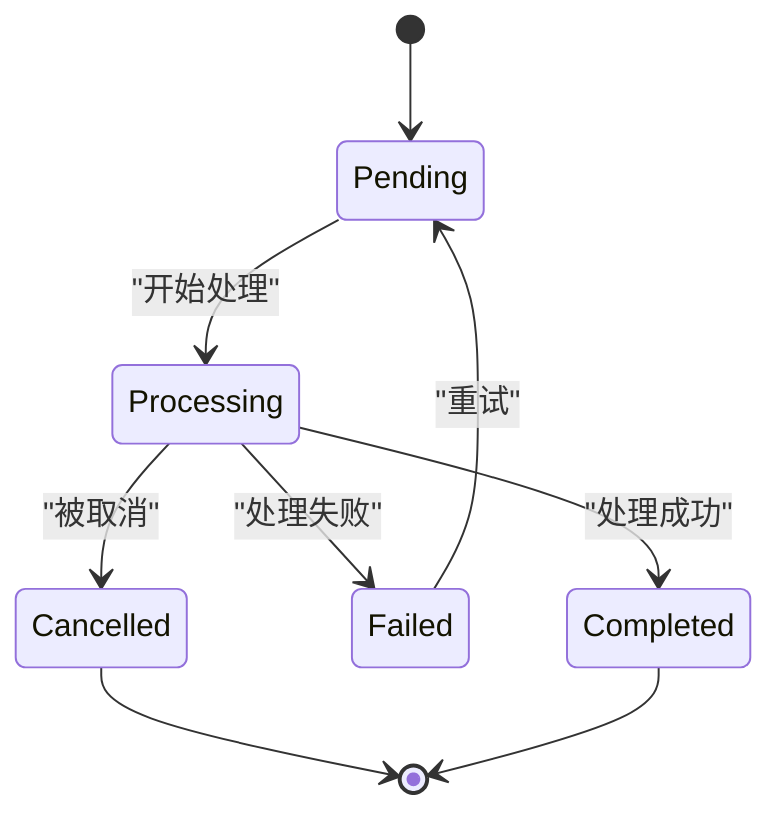
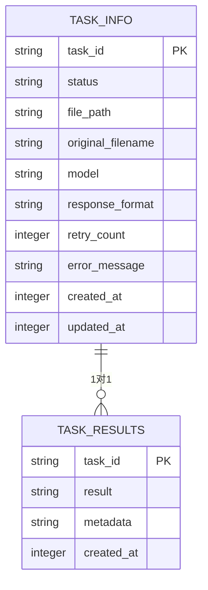
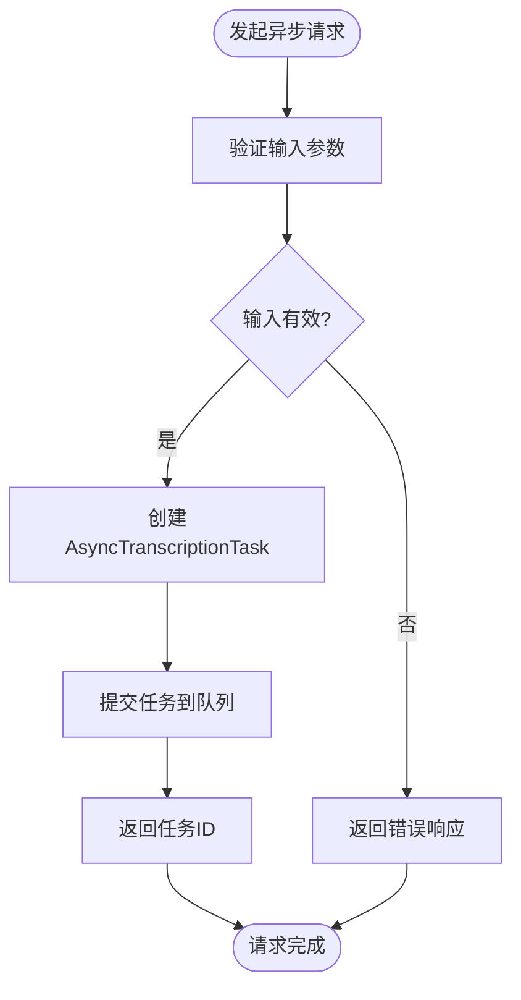
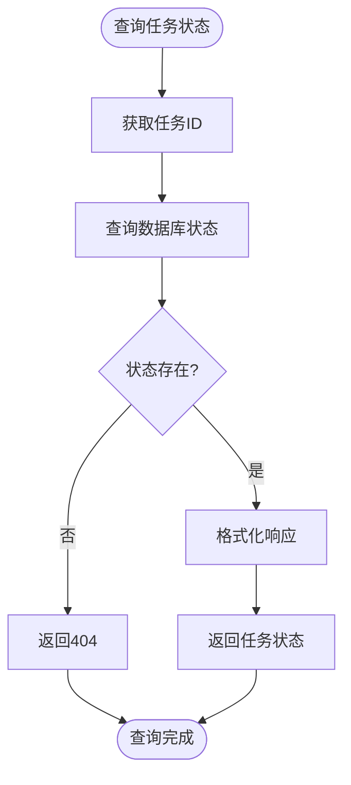
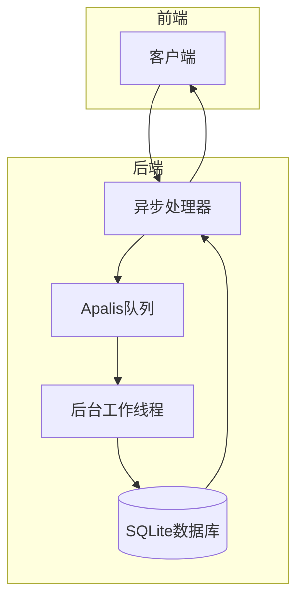
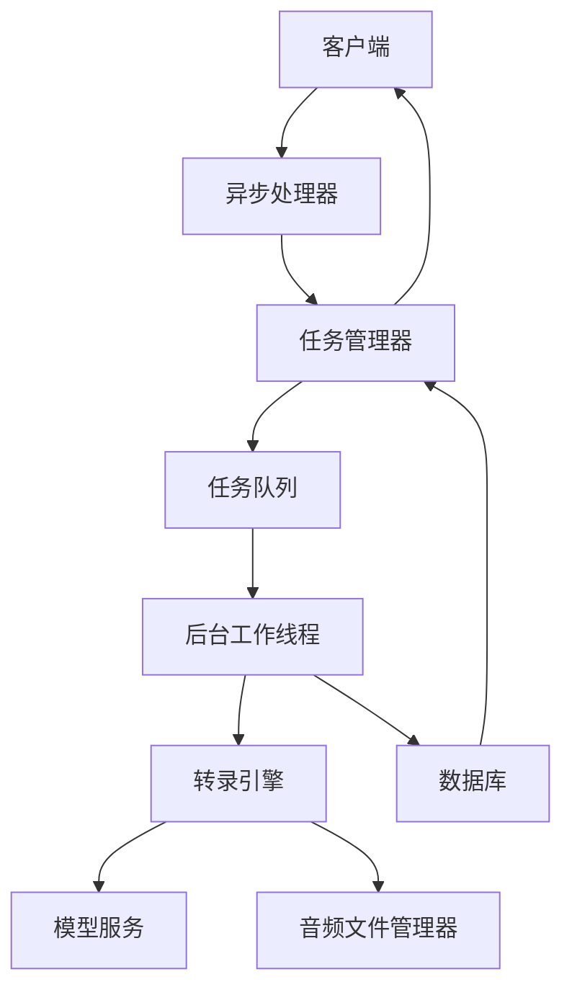

# 异步转录处理

<cite>
**本文档引用的文件**   
- [apalis_manager.rs](file://voice-cli/src/services/apalis_manager.rs)
- [transcription_engine.rs](file://voice-cli/src/services/transcription_engine.rs)
- [tts_task_manager.rs](file://voice-cli/src/services/tts_task_manager.rs)
- [stepped_task.rs](file://voice-cli/src/models/stepped_task.rs)
- [handlers.rs](file://voice-cli/src/server/handlers.rs)
- [routes.rs](file://voice-cli/src/server/routes.rs)
</cite>

## 目录
1. [简介](#简介)
2. [核心组件](#核心组件)
3. [任务调度与执行机制](#任务调度与执行机制)
4. [任务状态跟踪与回调通知](#任务状态跟踪与回调通知)
5. [结果持久化与失败重试策略](#结果持久化与失败重试策略)
6. [API使用示例](#api使用示例)
7. [消息队列与后台工作线程协作模式](#消息队列与后台工作线程协作模式)
8. [架构概览](#架构概览)

## 简介
本文档深入解析异步转录任务的调度与执行机制，重点描述`TranscriptionEngine`如何将任务提交至`TtsTaskManager`并通过`Apalis`任务队列进行管理。文档详细说明了任务状态跟踪、回调通知、结果持久化和失败重试策略的实现细节，并结合代码示例展示如何发起异步请求、查询任务状态及获取最终转录结果，阐述消息队列与后台工作线程的协作模式。

## 核心组件

异步转录处理系统由多个核心组件构成，包括`TranscriptionEngine`、`TtsTaskManager`、`ApalisManager`以及相关的模型和状态定义。这些组件协同工作，实现了从任务提交到结果返回的完整流程。

**Section sources**
- [apalis_manager.rs](file://voice-cli/src/services/apalis_manager.rs#L1-L1798)
- [transcription_engine.rs](file://voice-cli/src/services/transcription_engine.rs#L1-L158)
- [tts_task_manager.rs](file://voice-cli/src/services/tts_task_manager.rs#L1-L388)
- [stepped_task.rs](file://voice-cli/src/models/stepped_task.rs#L1-L430)

## 任务调度与执行机制

异步转录任务的调度与执行机制基于`Apalis`任务队列框架实现。当用户通过API提交异步转录请求时，系统会创建一个`AsyncTranscriptionTask`对象，并将其转换为`TranscriptionTask`提交到`Apalis`队列中。`ApalisManager`负责管理任务队列，启动后台工作线程来处理队列中的任务。

**Diagram sources**
- [apalis_manager.rs](file://voice-cli/src/services/apalis_manager.rs#L382-L452)
- [transcription_engine.rs](file://voice-cli/src/services/transcription_engine.rs#L75-L157)

## 任务状态跟踪与回调通知

系统通过`TaskStatus`枚举定义了任务的多种状态，包括`Pending`（待处理）、`Processing`（处理中）、`Completed`（已完成）、`Failed`（失败）和`Cancelled`（已取消）。每个状态都包含了相应的元数据，如开始时间、完成时间、错误信息等。

**Diagram sources**
- [stepped_task.rs](file://voice-cli/src/models/stepped_task.rs#L117-L141)

## 结果持久化与失败重试策略

系统使用SQLite数据库来持久化任务状态和结果。`LockFreeApalisManager`负责管理数据库连接和表结构，确保任务信息的可靠存储。对于失败的任务，系统提供了重试机制，允许用户重新提交失败的任务。

**Diagram sources**
- [apalis_manager.rs](file://voice-cli/src/services/apalis_manager.rs#L278-L314)

## API使用示例

### 发起异步请求

**Diagram sources**
- [handlers.rs](file://voice-cli/src/server/handlers.rs#L281-L296)
- [routes.rs](file://voice-cli/src/server/routes.rs#L52-L53)

### 查询任务状态

**Diagram sources**
- [apalis_manager.rs](file://voice-cli/src/services/apalis_manager.rs#L544-L567)
- [handlers.rs](file://voice-cli/src/server/handlers.rs#L300-L315)

## 消息队列与后台工作线程协作模式

系统采用消息队列与后台工作线程的协作模式来处理异步任务。`Apalis`框架负责管理消息队列，`LockFreeApalisManager`负责启动和管理后台工作线程。工作线程从队列中获取任务，执行转录流水线，并将结果持久化到数据库中。

**Diagram sources**
- [apalis_manager.rs](file://voice-cli/src/services/apalis_manager.rs#L317-L379)
- [transcription_engine.rs](file://voice-cli/src/services/transcription_engine.rs#L75-L157)

## 架构概览

**Diagram sources**
- [apalis_manager.rs](file://voice-cli/src/services/apalis_manager.rs#L196-L1177)
- [transcription_engine.rs](file://voice-cli/src/services/transcription_engine.rs#L27-L157)
- [tts_task_manager.rs](file://voice-cli/src/services/tts_task_manager.rs#L45-L69)

**Section sources**
- [apalis_manager.rs](file://voice-cli/src/services/apalis_manager.rs#L1-L1798)
- [transcription_engine.rs](file://voice-cli/src/services/transcription_engine.rs#L1-L158)
- [tts_task_manager.rs](file://voice-cli/src/services/tts_task_manager.rs#L1-L388)
- [stepped_task.rs](file://voice-cli/src/models/stepped_task.rs#L1-L430)
- [handlers.rs](file://voice-cli/src/server/handlers.rs#L146-L296)
- [routes.rs](file://voice-cli/src/server/routes.rs#L45-L81)