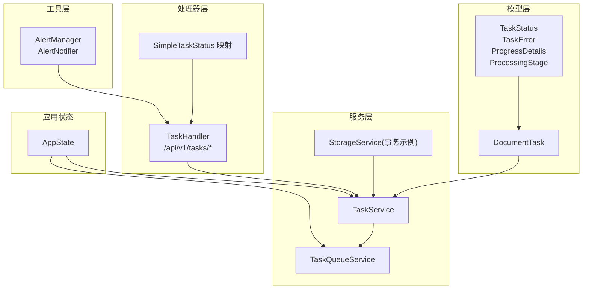
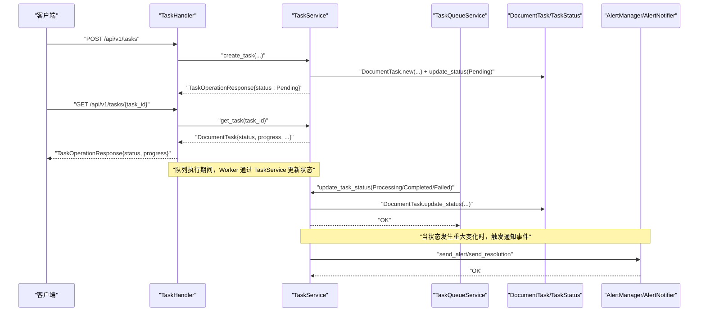
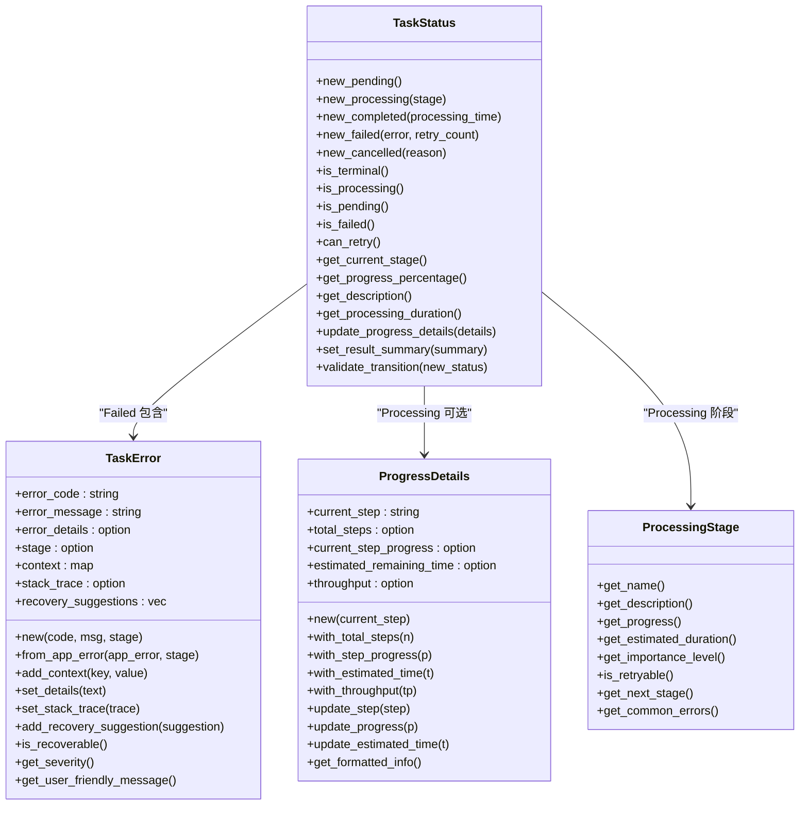
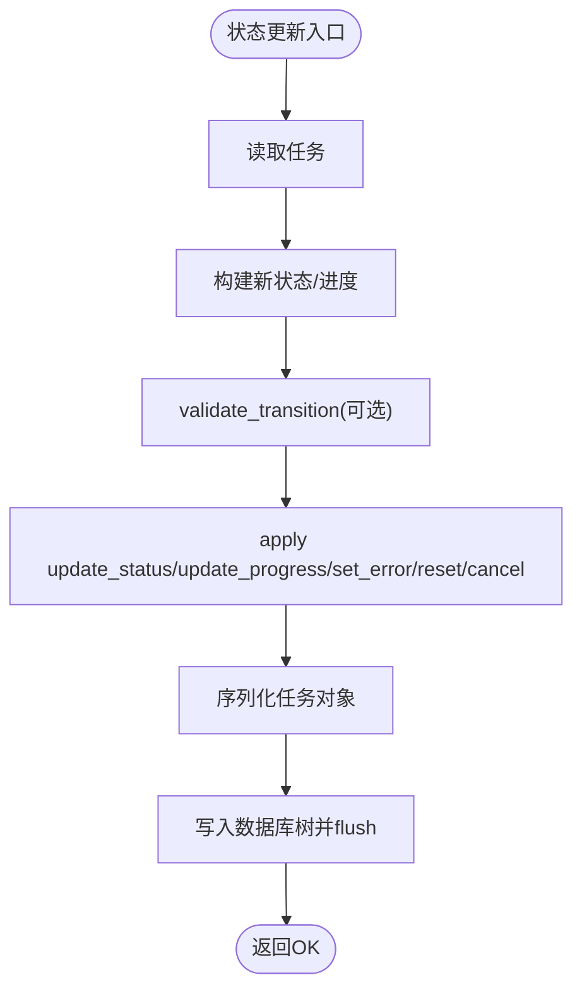
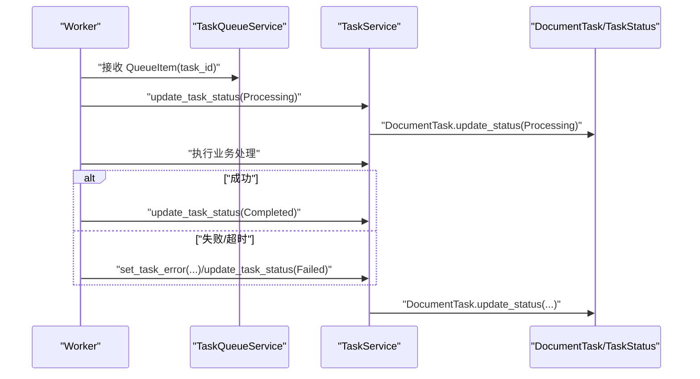
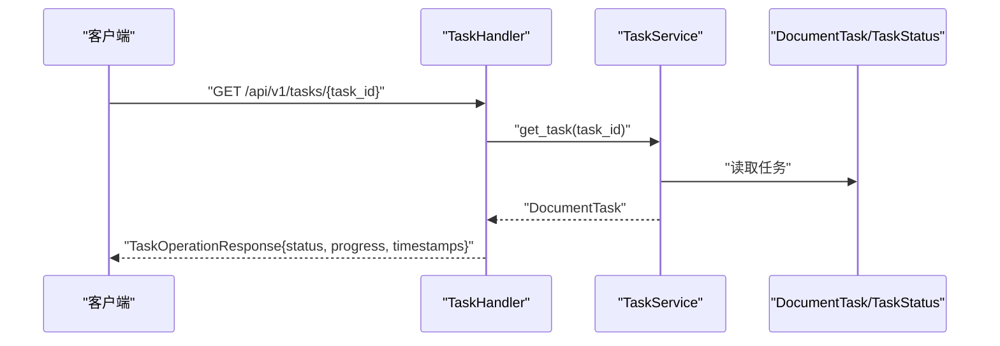
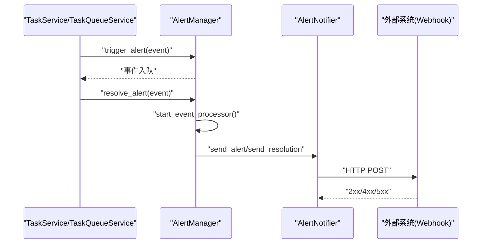
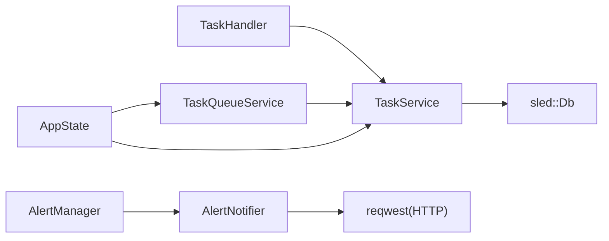

# 状态跟踪与回调

<cite>
**本文引用的文件**
- [task_status.rs](file://document-parser/src/models/task_status.rs)
- [document_task.rs](file://document-parser/src/models/document_task.rs)
- [task_service.rs](file://document-parser/src/services/task_service.rs)
- [task_queue_service.rs](file://document-parser/src/services/task_queue_service.rs)
- [task_handler.rs](file://document-parser/src/handlers/task_handler.rs)
- [response.rs](file://document-parser/src/handlers/response.rs)
- [app_state.rs](file://document-parser/src/app_state.rs)
- [alerting.rs](file://document-parser/src/utils/alerting.rs)
- [apalis_manager.rs](file://voice-cli/src/services/apalis_manager.rs)
- [mod.rs](file://voice-cli/src/models/mod.rs)
</cite>

## 目录
1. [引言](#引言)
2. [项目结构](#项目结构)
3. [核心组件](#核心组件)
4. [架构总览](#架构总览)
5. [详细组件分析](#详细组件分析)
6. [依赖关系分析](#依赖关系分析)
7. [性能考量](#性能考量)
8. [故障排查指南](#故障排查指南)
9. [结论](#结论)

## 引言
本文件围绕“异步转录任务”的全生命周期状态管理展开，重点覆盖以下主题：
- 状态模型与转换条件：Pending、Processing、Completed、Failed、Cancelled 的定义、转换规则与触发逻辑
- 状态更新的原子性保障：基于持久化存储与单条写入的原子更新策略
- 回调与事件通知：如何通过事件处理器与通知器对外部系统或前端组件进行状态变更通知
- 任务状态查询接口设计与实现：支持外部系统实时获取任务进度与状态

## 项目结构
围绕任务状态管理的关键模块分布如下：
- 模型层：定义任务状态、错误、进度细节与处理阶段
- 服务层：封装任务状态更新、队列调度、统计与清理
- 处理器层：HTTP 接口暴露任务查询、进度查询、统计等能力
- 工具层：告警与通知机制，支持日志、控制台与 Webhook 通知
- 应用状态：集中管理数据库、服务实例与队列启动

图表来源
- [task_status.rs](file://document-parser/src/models/task_status.rs#L1-L120)
- [document_task.rs](file://document-parser/src/models/document_task.rs#L1-L120)
- [task_service.rs](file://document-parser/src/services/task_service.rs#L1-L120)
- [task_queue_service.rs](file://document-parser/src/services/task_queue_service.rs#L112-L200)
- [task_handler.rs](file://document-parser/src/handlers/task_handler.rs#L1-L120)
- [response.rs](file://document-parser/src/handlers/response.rs#L214-L246)
- [alerting.rs](file://document-parser/src/utils/alerting.rs#L572-L791)
- [app_state.rs](file://document-parser/src/app_state.rs#L1-L140)

章节来源
- [task_status.rs](file://document-parser/src/models/task_status.rs#L1-L120)
- [document_task.rs](file://document-parser/src/models/document_task.rs#L1-L120)
- [task_service.rs](file://document-parser/src/services/task_service.rs#L1-L120)
- [task_queue_service.rs](file://document-parser/src/services/task_queue_service.rs#L112-L200)
- [task_handler.rs](file://document-parser/src/handlers/task_handler.rs#L1-L120)
- [response.rs](file://document-parser/src/handlers/response.rs#L214-L246)
- [alerting.rs](file://document-parser/src/utils/alerting.rs#L572-L791)
- [app_state.rs](file://document-parser/src/app_state.rs#L1-L140)

## 核心组件
- 任务状态模型：定义 Pending、Processing、Completed、Failed、Cancelled 状态及其行为（如进度、描述、阶段、可重试性）
- 任务实体：封装任务元数据、状态、进度、错误信息与生命周期控制（重试、取消、过期）
- 任务服务：提供任务创建、查询、状态更新、进度更新、错误设置、统计与清理等能力
- 任务队列服务：负责任务入队、并发执行、背压控制、健康检查与统计上报
- HTTP 处理器：提供任务创建、查询、取消、重试、统计与进度查询接口
- 通知与告警：事件驱动的通知器，支持日志、控制台与 Webhook

章节来源
- [task_status.rs](file://document-parser/src/models/task_status.rs#L1-L120)
- [document_task.rs](file://document-parser/src/models/document_task.rs#L208-L251)
- [task_service.rs](file://document-parser/src/services/task_service.rs#L128-L180)
- [task_queue_service.rs](file://document-parser/src/services/task_queue_service.rs#L260-L425)
- [task_handler.rs](file://document-parser/src/handlers/task_handler.rs#L231-L383)
- [alerting.rs](file://document-parser/src/utils/alerting.rs#L572-L791)

## 架构总览
下图展示从 HTTP 请求到状态更新与通知的整体流程。

图表来源
- [task_handler.rs](file://document-parser/src/handlers/task_handler.rs#L165-L293)
- [task_service.rs](file://document-parser/src/services/task_service.rs#L128-L180)
- [task_queue_service.rs](file://document-parser/src/services/task_queue_service.rs#L332-L411)
- [alerting.rs](file://document-parser/src/utils/alerting.rs#L765-L791)

## 详细组件分析

### 状态模型与转换规则
- 状态枚举与构造
  - Pending：记录排队时间，初始进度为 0
  - Processing：记录开始时间与当前阶段，支持细粒度进度详情
  - Completed：记录完成时间与处理时长，并可设置结果摘要
  - Failed：记录错误、失败时间、重试次数与可恢复性
  - Cancelled：记录取消时间与原因
- 状态转换验证
  - 终态（Completed、Failed、Cancelled）不可再转换
  - 提供显式转换验证方法，防止非法状态变更
- 进度与描述
  - 提供基于阶段的进度百分比与动态描述（含运行时长、剩余时间等）
  - 支持设置/更新进度详情，用于细粒度进度展示
- 错误模型
  - TaskError：包含错误码、消息、上下文、阶段、恢复建议与严重程度
  - 可根据错误码与阶段推断可恢复性

图表来源
- [task_status.rs](file://document-parser/src/models/task_status.rs#L1-L120)
- [task_status.rs](file://document-parser/src/models/task_status.rs#L229-L487)
- [task_status.rs](file://document-parser/src/models/task_status.rs#L489-L604)
- [task_status.rs](file://document-parser/src/models/task_status.rs#L606-L680)

章节来源
- [task_status.rs](file://document-parser/src/models/task_status.rs#L1-L120)
- [task_status.rs](file://document-parser/src/models/task_status.rs#L229-L487)
- [task_status.rs](file://document-parser/src/models/task_status.rs#L489-L604)
- [task_status.rs](file://document-parser/src/models/task_status.rs#L606-L680)

### 任务实体与状态更新原子性
- 任务实体 DocumentTask
  - 提供 update_status、update_progress、set_error、reset、cancel 等方法
  - 更新状态时自动更新 updated_at 时间戳
  - 失败时自动增加 retry_count
- 状态更新原子性保障
  - TaskService.save_task 对单条任务进行序列化与持久化写入
  - 写入后 flush 到磁盘，确保落盘一致性
  - 通过单条 insert/update 操作保证状态更新的原子性
- 事务示例（StorageService）
  - 提供 execute_transaction，支持多操作的事务提交/回滚
  - 用于跨树或多键的复合写入场景（如索引与任务数据同步）

图表来源
- [document_task.rs](file://document-parser/src/models/document_task.rs#L208-L251)
- [task_service.rs](file://document-parser/src/services/task_service.rs#L74-L88)
- [storage_service.rs](file://document-parser/src/services/storage_service.rs#L236-L279)

章节来源
- [document_task.rs](file://document-parser/src/models/document_task.rs#L208-L251)
- [task_service.rs](file://document-parser/src/services/task_service.rs#L74-L88)
- [storage_service.rs](file://document-parser/src/services/storage_service.rs#L236-L279)

### 队列调度与状态流转
- 队列服务 TaskQueueService
  - 使用有界 mpsc::channel 实现背压控制
  - 启动多个 worker 并发消费任务，直接从 channel 接收
  - worker 在处理前将任务状态更新为 Processing，完成后更新为 Completed 或 Failed
  - 提供统计更新与健康检查协程，周期性计算吞吐量、利用率与内存占用
- 恢复与重启
  - 服务启动时扫描任务统计，将进行中任务统一重置为 Pending 并重新入队，确保幂等恢复

图表来源
- [task_queue_service.rs](file://document-parser/src/services/task_queue_service.rs#L260-L425)
- [task_service.rs](file://document-parser/src/services/task_service.rs#L128-L180)

章节来源
- [task_queue_service.rs](file://document-parser/src/services/task_queue_service.rs#L260-L425)
- [task_service.rs](file://document-parser/src/services/task_service.rs#L128-L180)

### 任务状态查询接口设计与实现
- 接口清单
  - 创建任务：POST /api/v1/tasks
  - 查询任务详情：GET /api/v1/tasks/{task_id}
  - 查询任务列表：GET /api/v1/tasks
  - 取消任务：POST /api/v1/tasks/{task_id}/cancel
  - 删除任务：DELETE /api/v1/tasks/{task_id}
  - 重试任务：POST /api/v1/tasks/{task_id}/retry
  - 获取任务统计：GET /api/v1/tasks/stats
  - 清理过期任务：POST /api/v1/tasks/cleanup
  - 获取任务进度：GET /api/v1/tasks/{task_id}/progress
- 响应映射
  - SimpleTaskStatus：将内部 TaskStatus 映射为 API 友好枚举
  - TaskOperationResponse：统一返回任务操作结果（包含状态、完成标志等）
- 进度查询现状
  - 当前实现返回任务的基本状态与时间戳，后续可扩展为更详细的进度详情

图表来源
- [task_handler.rs](file://document-parser/src/handlers/task_handler.rs#L231-L383)
- [task_handler.rs](file://document-parser/src/handlers/task_handler.rs#L751-L808)
- [response.rs](file://document-parser/src/handlers/response.rs#L214-L246)

章节来源
- [task_handler.rs](file://document-parser/src/handlers/task_handler.rs#L231-L383)
- [task_handler.rs](file://document-parser/src/handlers/task_handler.rs#L751-L808)
- [response.rs](file://document-parser/src/handlers/response.rs#L214-L246)

### 回调与事件通知机制
- 告警与通知
  - AlertManager：维护规则、通知器、活跃告警与历史，支持冷却时间与分辨率事件
  - AlertNotifier：支持日志、控制台与 Webhook 三种通知方式
  - 事件处理器：异步消费事件通道，按通知器逐个推送
- 与任务状态联动
  - 当任务状态发生重大变化（如失败、超时、健康异常）时，可由服务层触发告警事件
  - 通知器将事件推送到外部系统（如 Webhook），实现前端或第三方系统的实时回调

图表来源
- [alerting.rs](file://document-parser/src/utils/alerting.rs#L572-L791)

章节来源
- [alerting.rs](file://document-parser/src/utils/alerting.rs#L572-L791)

### 外部系统集成与统计
- 语音 CLI 统计
  - 通过 TaskService.get_task_stats 聚合各状态任务数量与平均处理时间
  - 用于前端或监控面板展示任务健康状况与性能指标
- 统一状态映射
  - SimpleTaskStatus 与 TaskStatus 的双向映射，便于 API 层与内部模型解耦

章节来源
- [task_service.rs](file://document-parser/src/services/task_service.rs#L500-L580)
- [apalis_manager.rs](file://voice-cli/src/services/apalis_manager.rs#L868-L909)
- [mod.rs](file://voice-cli/src/models/mod.rs#L46-L93)

## 依赖关系分析
- 组件耦合
  - TaskHandler 依赖 TaskService 提供的 CRUD 与状态更新能力
  - TaskQueueService 依赖 TaskService 进行状态持久化
  - AppState 统一持有 TaskService 与 TaskQueueService，并在启动时初始化
- 外部依赖
  - sled：持久化存储，提供原子写入与 flush 能力
  - tokio：异步运行时，支撑并发 worker、定时器与通道
  - reqwest：Webhook 通知器使用 HTTP 客户端发送事件

图表来源
- [task_handler.rs](file://document-parser/src/handlers/task_handler.rs#L1-L120)
- [task_service.rs](file://document-parser/src/services/task_service.rs#L1-L120)
- [task_queue_service.rs](file://document-parser/src/services/task_queue_service.rs#L112-L200)
- [app_state.rs](file://document-parser/src/app_state.rs#L1-L140)
- [alerting.rs](file://document-parser/src/utils/alerting.rs#L572-L791)

章节来源
- [task_handler.rs](file://document-parser/src/handlers/task_handler.rs#L1-L120)
- [task_service.rs](file://document-parser/src/services/task_service.rs#L1-L120)
- [task_queue_service.rs](file://document-parser/src/services/task_queue_service.rs#L112-L200)
- [app_state.rs](file://document-parser/src/app_state.rs#L1-L140)
- [alerting.rs](file://document-parser/src/utils/alerting.rs#L572-L791)

## 性能考量
- 队列背压与吞吐
  - 通过有界通道与溢出事件统计，避免内存膨胀
  - 统计协程周期性计算吞吐量与利用率，指导扩容与限流
- 状态更新延迟
  - 单条任务写入与 flush，确保一致性的同时增加 I/O 压力
  - 可结合批量写入或后台合并策略优化
- 进度与描述生成
  - 动态描述包含运行时长与剩余时间，建议在高频查询场景下缓存静态描述
- 通知开销
  - Webhook 通知需考虑网络抖动与重试策略，避免阻塞主流程

## 故障排查指南
- 常见错误与定位
  - 队列已满：enqueue_task 返回“队列已满”，检查 max_queue_size 与 backpressure_threshold
  - 任务超时：worker 超时会设置错误并标记失败，检查 task_timeout 与处理链路
  - 状态非法转换：validate_transition 报错，确认状态机约束
- 健康检查
  - TaskQueueService 健康检查会检测长时间未完成的任务，必要时触发告警
- 日志与告警
  - 使用 AlertManager 的日志/控制台/ Webhook 通知器，快速定位问题
- 数据一致性
  - 若出现状态不一致，检查 TaskService.save_task 是否成功 flush

章节来源
- [task_queue_service.rs](file://document-parser/src/services/task_queue_service.rs#L591-L616)
- [task_service.rs](file://document-parser/src/services/task_service.rs#L128-L180)
- [alerting.rs](file://document-parser/src/utils/alerting.rs#L572-L791)

## 结论
本文系统梳理了异步转录任务的全生命周期状态管理，明确了状态模型、转换规则与原子性保障机制，并给出了查询接口设计与通知回调的实现思路。通过队列服务与任务服务的协作，系统实现了高并发下的稳定状态流转与可观测性。建议在生产环境中结合背压策略、健康检查与告警通知，进一步提升系统的可靠性与可运维性。