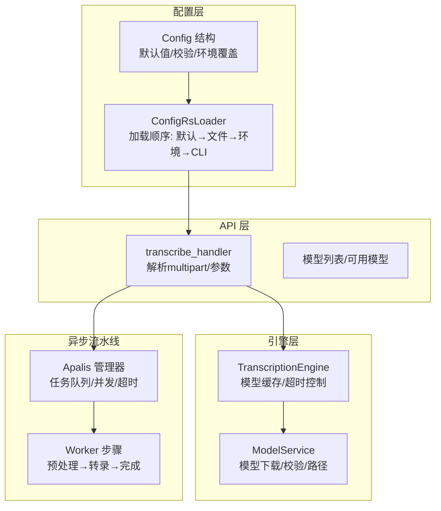
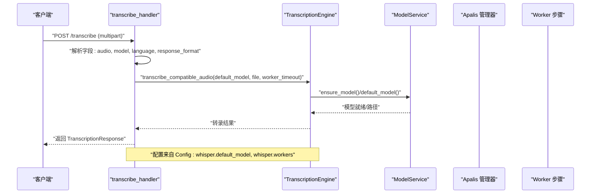
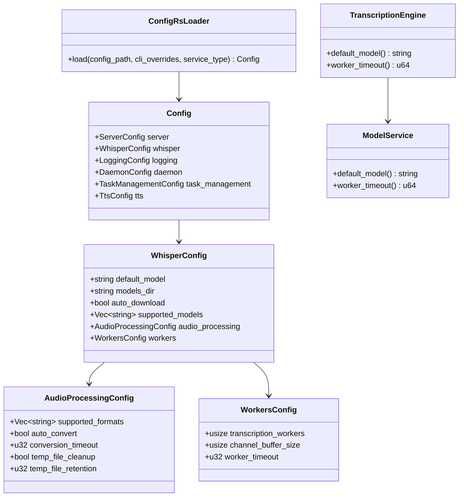

# 转录参数配置

<cite>
**本文引用的文件**
- [config.yml](file://voice-cli/config.yml)
- [config.rs](file://voice-cli/src/models/config.rs)
- [config_rs_integration.rs](file://voice-cli/src/config_rs_integration.rs)
- [API 文档](file://voice-cli/API_DOCUMENTATION.md)
- [handlers.rs](file://voice-cli/src/server/handlers.rs)
- [apalis_manager.rs](file://voice-cli/src/services/apalis_manager.rs)
- [transcription_engine.rs](file://voice-cli/src/services/transcription_engine.rs)
- [model_service.rs](file://voice-cli/src/services/model_service.rs)
- [request.rs](file://voice-cli/src/models/request.rs)
</cite>

## 目录
1. [简介](#简介)
2. [项目结构](#项目结构)
3. [核心组件](#核心组件)
4. [架构总览](#架构总览)
5. [详细组件分析](#详细组件分析)
6. [依赖关系分析](#依赖关系分析)
7. [性能考量](#性能考量)
8. [故障排查指南](#故障排查指南)
9. [结论](#结论)
10. [附录](#附录)

## 简介
本文件系统梳理转录引擎支持的配置参数及其作用范围，覆盖音频预处理选项（如格式支持、自动转换、超时与临时文件策略）、模型参数（如默认模型、模型目录、自动下载、支持模型列表）、性能调优参数（如并发工作线程、通道缓冲区、任务超时）等。同时说明这些参数如何通过 config.yml 文件或环境变量/命令行参数传入，并在 ModelService、TranscriptionEngine、Handlers 与 Apalis 异步流水线中被动态应用；最后给出不同场景下的推荐配置组合（实时转录、高精度模式、低延迟模式）。

## 项目结构
围绕转录功能的关键文件与职责如下：
- 配置模型与加载：定义配置结构、默认值、校验与环境变量覆盖
- 配置加载器：优先级为“默认值 → 配置文件 → 环境变量 → 命令行参数”
- API 层：接收 multipart 请求，解析音频与可选参数，调用转录引擎
- 引擎层：封装 Whisper 转录调用、模型缓存与超时控制
- 异步流水线：将转录任务拆分为多阶段，按配置并发与超时执行

图表来源
- [config.rs](file://voice-cli/src/models/config.rs#L1-L120)
- [config_rs_integration.rs](file://voice-cli/src/config_rs_integration.rs#L53-L110)
- [handlers.rs](file://voice-cli/src/server/handlers.rs#L146-L259)
- [transcription_engine.rs](file://voice-cli/src/services/transcription_engine.rs#L1-L136)
- [apalis_manager.rs](file://voice-cli/src/services/apalis_manager.rs#L1505-L1516)

章节来源
- [config.yml](file://voice-cli/config.yml#L1-L100)
- [config.rs](file://voice-cli/src/models/config.rs#L1-L120)
- [config_rs_integration.rs](file://voice-cli/src/config_rs_integration.rs#L53-L110)

## 核心组件
- 配置模型（Config）：包含 server、whisper、logging、daemon、task_management、tts 等子配置
- Whisper 子配置：default_model、models_dir、auto_download、supported_models、audio_processing、workers
- 加载器（ConfigRsLoader）：构建默认配置源，按优先级加载文件、环境变量与 CLI 参数
- API 处理器（transcribe_handler）：解析 multipart 表单，提取可选参数（model、language、response_format），调用转录引擎
- 引擎（TranscriptionEngine）：复用已加载的 WhisperTranscriber，按配置超时执行转录
- 异步流水线（Apalis）：按 workers 配置并发执行，按 worker_timeout 控制单次任务超时

章节来源
- [config.rs](file://voice-cli/src/models/config.rs#L1-L120)
- [config_rs_integration.rs](file://voice-cli/src/config_rs_integration.rs#L53-L110)
- [handlers.rs](file://voice-cli/src/server/handlers.rs#L146-L259)
- [transcription_engine.rs](file://voice-cli/src/services/transcription_engine.rs#L1-L136)
- [apalis_manager.rs](file://voice-cli/src/services/apalis_manager.rs#L1505-L1516)

## 架构总览
下图展示从请求到转录完成的关键交互流程，以及配置参数在各层的应用点。

图表来源
- [handlers.rs](file://voice-cli/src/server/handlers.rs#L146-L259)
- [transcription_engine.rs](file://voice-cli/src/services/transcription_engine.rs#L1-L136)
- [model_service.rs](file://voice-cli/src/services/model_service.rs#L25-L33)
- [config.rs](file://voice-cli/src/models/config.rs#L36-L74)

## 详细组件分析

### 配置参数总览与作用范围
- 服务器参数（server）
  - host、port、max_file_size、cors_enabled
  - 作用：绑定监听地址、端口、上传大小限制、跨域开关
- Whisper 参数（whisper）
  - default_model：默认使用的 Whisper 模型名称
  - models_dir：模型文件本地目录
  - auto_download：是否允许自动下载缺失模型
  - supported_models：支持的模型清单
  - audio_processing：音频格式支持、自动转换、转换超时、临时文件清理与保留
  - workers：转录工作线程数、通道缓冲区大小、worker 超时
- 日志参数（logging）
  - level、log_dir、max_file_size、max_files
- 守护进程参数（daemon）
  - pid_file、log_file、work_dir
- 任务管理参数（task_management）
  - max_concurrent_tasks、retry_attempts、task_timeout_seconds、catch_panic、task_retention_minutes、sqlite_db_path、sled_db_path
- TTS 参数（tts）
  - python_path、model_path、default_model、supported_formats、max_text_length、default_speed、default_pitch、default_volume、timeout_seconds

章节来源
- [config.yml](file://voice-cli/config.yml#L1-L100)
- [config.rs](file://voice-cli/src/models/config.rs#L1-L120)

### 配置加载与优先级
- 默认值：Config::default() 提供各字段默认值
- 文件加载：读取 config.yml 并反序列化为 Config
- 环境变量覆盖：apply_env_overrides() 将 VOICE_CLI_* 环境变量映射到对应字段
- 校验：validate() 对关键字段进行有效性校验
- CLI 覆盖：ConfigRsLoader.load() 支持 CLI 参数最高优先级覆盖

章节来源
- [config.rs](file://voice-cli/src/models/config.rs#L270-L706)
- [config_rs_integration.rs](file://voice-cli/src/config_rs_integration.rs#L53-L110)

### API 请求参数与动态应用
- 支持的表单字段
  - audio：必填，音频文件
  - model：可选，覆盖默认模型
  - language：可选，语言提示（Whisper 支持）
  - response_format：可选，输出格式（json/text/verbose_json）
- 动态应用点
  - handlers 层：从 multipart 中提取字段，决定使用哪个模型与输出格式
  - 引擎层：使用 default_model（来自配置）作为兜底，若请求未指定则采用
  - 超时控制：engine 的 worker_timeout 来自配置，用于转录调用的超时控制

章节来源
- [API 文档](file://voice-cli/API_DOCUMENTATION.md#L101-L170)
- [handlers.rs](file://voice-cli/src/server/handlers.rs#L146-L259)
- [transcription_engine.rs](file://voice-cli/src/services/transcription_engine.rs#L128-L136)

### 音频预处理选项
- 支持格式：由 whisper.audio_processing.supported_formats 决定
- 自动转换：auto_convert=true 时，非 WAV 格式会尝试转换为 WAV
- 转换超时：conversion_timeout（秒）
- 临时文件：temp_file_cleanup 与 temp_file_retention 控制清理与保留时长
- 实际转换策略：AudioFormat::needs_conversion() 与 FFmpeg 输入格式映射

章节来源
- [config.yml](file://voice-cli/config.yml#L34-L41)
- [config.rs](file://voice-cli/src/models/config.rs#L52-L64)
- [request.rs](file://voice-cli/src/models/request.rs#L230-L377)

### 模型参数
- default_model：默认模型名称
- models_dir：模型文件存放目录
- auto_download：是否允许自动下载
- supported_models：支持的模型清单
- ModelService：负责模型下载、校验、路径解析与预期大小估算

章节来源
- [config.yml](file://voice-cli/config.yml#L13-L33)
- [config.rs](file://voice-cli/src/models/config.rs#L36-L49)
- [model_service.rs](file://voice-cli/src/services/model_service.rs#L25-L33)
- [model_service.rs](file://voice-cli/src/services/model_service.rs#L176-L188)

### 性能调优参数
- 并发工作线程：whisper.workers.transcription_workers
- 通道缓冲区：whisper.workers.channel_buffer_size
- 任务超时：whisper.workers.worker_timeout（秒）
- 任务管理：task_management.max_concurrent_tasks、task_timeout_seconds、retry_attempts、task_retention_minutes
- Apalis 管理器：按配置启动 worker 并执行流水线

章节来源
- [config.yml](file://voice-cli/config.yml#L42-L46)
- [config.rs](file://voice-cli/src/models/config.rs#L66-L74)
- [apalis_manager.rs](file://voice-cli/src/services/apalis_manager.rs#L1505-L1516)

### 配置参数与环境变量映射
- VOICE_CLI_HOST、VOICE_CLI_PORT、VOICE_CLI_MAX_FILE_SIZE、VOICE_CLI_CORS_ENABLED
- VOICE_CLI_LOG_LEVEL、VOICE_CLI_LOG_DIR、VOICE_CLI_LOG_MAX_FILES
- VOICE_CLI_DEFAULT_MODEL、VOICE_CLI_MODELS_DIR、VOICE_CLI_AUTO_DOWNLOAD、VOICE_CLI_TRANSCRIPTION_WORKERS
- VOICE_CLI_WORK_DIR、VOICE_CLI_PID_FILE
- VOICE_CLI_MAX_CONCURRENT_TASKS、VOICE_CLI_SQLITE_DB_PATH、VOICE_CLI_TASK_RETENTION_MINUTES、VOICE_CLI_SLED_DB_PATH

章节来源
- [config.rs](file://voice-cli/src/models/config.rs#L330-L588)
- [config_rs_integration.rs](file://voice-cli/src/config_rs_integration.rs#L53-L110)

### 不同场景下的推荐配置组合
- 实时转录（低延迟）
  - 模型：tiny/base（更快但精度略低）
  - 并发：transcription_workers 可设为较小值（如 2-4），channel_buffer_size 适中
  - 超时：worker_timeout 适当降低，避免长时间阻塞
  - 格式：尽量使用 WAV，减少转换开销
- 高精度模式（高准确率）
  - 模型：small/medium/large-v3（更大模型，更慢但更准）
  - 并发：适度提高 transcription_workers，结合硬件资源
  - 超时：增大 worker_timeout，保证复杂音频充分处理
  - 语言提示：在 API 请求中提供 language 参数以提升准确性
- 低延迟模式（快速响应）
  - 模型：tiny（最快速）
  - 并发：保持较低 worker 数量，避免 CPU/GPU 抢占
  - 超时：worker_timeout 设为较短值，确保及时返回
  - 格式：WAV 优先；必要时允许 auto_convert，但注意 conversion_timeout

说明：以上组合基于仓库提供的配置项与 API 文档中的模型能力描述进行归纳，具体数值需根据实际硬件与业务需求调整。

章节来源
- [API 文档](file://voice-cli/API_DOCUMENTATION.md#L34-L51)
- [config.yml](file://voice-cli/config.yml#L13-L46)
- [config.rs](file://voice-cli/src/models/config.rs#L36-L74)

## 依赖关系分析
- 配置依赖
  - Config 依赖于各子配置结构体（ServerConfig、WhisperConfig、LoggingConfig、DaemonConfig、TaskManagementConfig、TtsConfig）
  - ConfigRsLoader 依赖 config-rs 与 serde_yaml 进行加载与反序列化
- 处理器依赖
  - transcribe_handler 依赖 AppState（包含 Config、ModelService、Apalis 管理器等）
  - 引擎依赖 ModelService 与 voice_toolkit::stt
- 引擎与模型服务
  - ModelService 提供 default_model 与 worker_timeout 的访问
  - TranscriptionEngine 复用已加载的 WhisperTranscriber，避免重复加载

图表来源
- [config.rs](file://voice-cli/src/models/config.rs#L1-L120)
- [config_rs_integration.rs](file://voice-cli/src/config_rs_integration.rs#L53-L110)
- [transcription_engine.rs](file://voice-cli/src/services/transcription_engine.rs#L1-L136)
- [model_service.rs](file://voice-cli/src/services/model_service.rs#L25-L33)

## 性能考量
- 模型选择与吞吐
  - 更大模型带来更高准确率但更低吞吐，应根据业务场景权衡
- 并发与超时
  - transcription_workers 与 channel_buffer_size 影响并发度与队列深度
  - worker_timeout 控制单次转录最长等待时间，避免资源长期占用
- I/O 与临时文件
  - auto_convert 与 conversion_timeout 影响预处理时延
  - temp_file_cleanup 与 temp_file_retention 控制磁盘占用与回收策略
- 任务管理
  - max_concurrent_tasks 与 task_timeout_seconds 影响整体吞吐与稳定性
  - retry_attempts 与 task_retention_minutes 影响可靠性与存储压力

章节来源
- [config.yml](file://voice-cli/config.yml#L34-L46)
- [config.rs](file://voice-cli/src/models/config.rs#L66-L74)
- [apalis_manager.rs](file://voice-cli/src/services/apalis_manager.rs#L1505-L1516)

## 故障排查指南
- 常见问题定位
  - 模型相关：检查 default_model 是否在 supported_models 中，auto_download 是否开启
  - 并发相关：检查 transcription_workers 是否大于 0，channel_buffer_size 是否合理
  - 超时相关：检查 worker_timeout 与 task_timeout_seconds 是否过小
  - 格式相关：确认上传格式是否在 supported_formats 中，必要时启用 auto_convert
- 日志与诊断
  - 使用 logging.level 与 log_dir 查看服务日志
  - 使用 ModelService 的诊断方法（如诊断模型文件大小与可读性）

章节来源
- [config.rs](file://voice-cli/src/models/config.rs#L608-L706)
- [model_service.rs](file://voice-cli/src/services/model_service.rs#L401-L471)

## 结论
本文件梳理了转录引擎的配置参数体系，明确了参数的作用范围与动态应用路径，并给出了不同场景下的推荐组合。通过合理的配置与调优，可在实时性、准确率与稳定性之间取得平衡。建议在生产环境中结合监控指标与压测结果持续优化并发与超时参数。

## 附录
- API 端点与参数
  - POST /transcribe：支持 audio、model、language、response_format
- 相关文件路径
  - 配置文件：voice-cli/config.yml
  - 配置模型与加载：voice-cli/src/models/config.rs、voice-cli/src/config_rs_integration.rs
  - API 处理器：voice-cli/src/server/handlers.rs
  - 引擎与模型服务：voice-cli/src/services/transcription_engine.rs、voice-cli/src/services/model_service.rs
  - 异步流水线：voice-cli/src/services/apalis_manager.rs
  - 请求/响应模型：voice-cli/src/models/request.rs