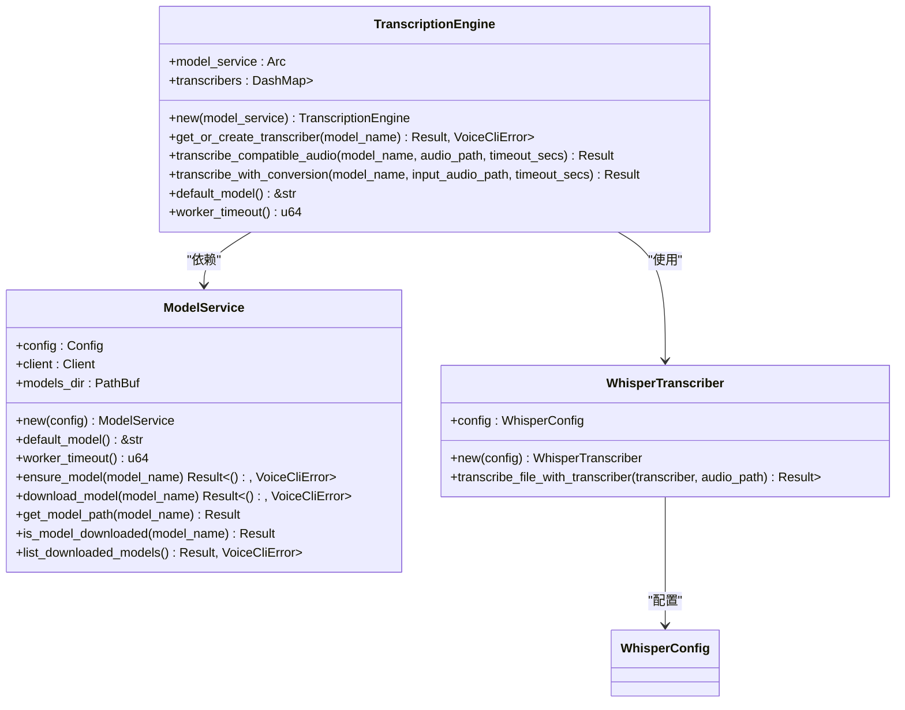
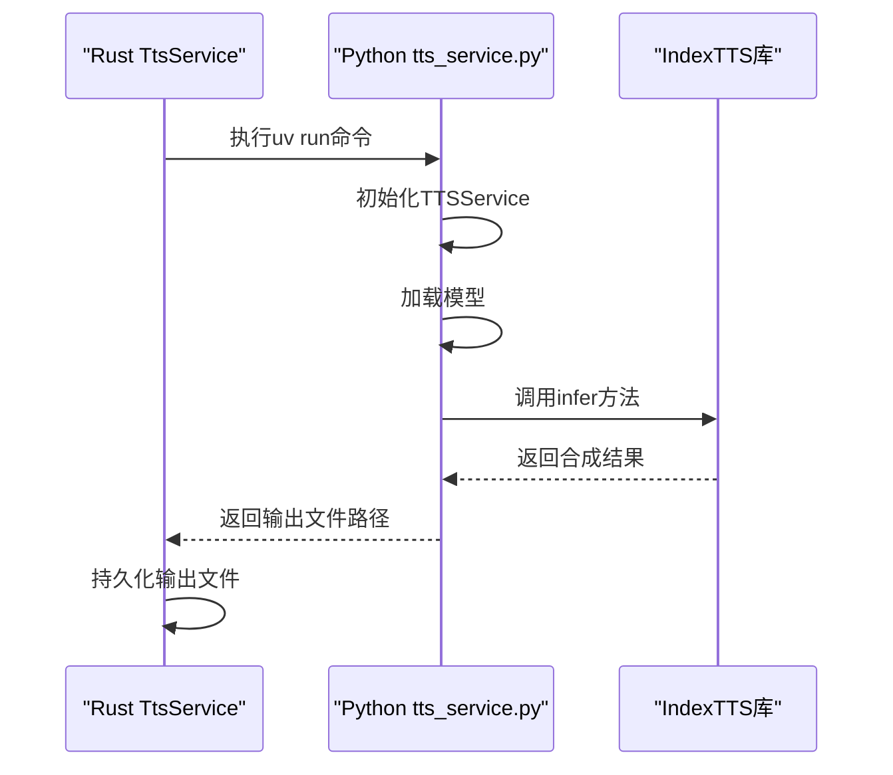

# 转录引擎

<cite>
**本文档引用的文件**   
- [transcription_engine.rs](file://voice-cli/src/services/transcription_engine.rs)
- [tts_service.rs](file://voice-cli/src/services/tts_service.rs)
- [main.rs](file://voice-cli/src/main.rs)
- [lib.rs](file://voice-cli/src/lib.rs)
- [API_DOCUMENTATION.md](file://voice-cli/API_DOCUMENTATION.md)
- [routes.rs](file://voice-cli/src/server/routes.rs)
- [handlers.rs](file://voice-cli/src/server/handlers.rs)
- [model_service.rs](file://voice-cli/src/services/model_service.rs)
- [tts.rs](file://voice-cli/src/models/tts.rs)
- [tts_service.py](file://voice-cli/tts_service.py)
</cite>

## 目录
1. [引言](#引言)
2. [转录引擎核心实现](#转录引擎核心实现)
3. [TTS服务与Python引擎集成](#tts服务与python引擎集成)
4. [API请求处理机制](#api请求处理机制)
5. [转录精度与性能优化](#转录精度与性能优化)
6. [典型使用场景示例](#典型使用场景示例)
7. [结论](#结论)

## 引言
本项目是一个基于Rust的语音转文字（STT）和文本转语音（TTS）服务，核心功能是通过Whisper模型实现高质量的音频转录。系统采用模块化设计，包含转录引擎、模型服务、TTS服务等多个组件，支持同步和异步处理模式。API接口设计遵循REST规范，通过Axum框架提供HTTP服务，并集成了Swagger UI进行接口文档化。系统支持多种音频格式的自动转换，能够处理从MP3到WAV等不同格式的输入文件。

## 转录引擎核心实现

转录引擎是本系统的核心组件，负责协调音频处理、模型推理和结果生成的完整流程。`TranscriptionEngine`结构体通过`ModelService`管理模型生命周期，并使用`DashMap`缓存已加载的转录器实例，避免重复加载模型造成的资源浪费。引擎实现了两个主要的转录方法：`transcribe_compatible_audio`用于处理已经符合Whisper要求的音频文件，而`transcribe_with_conversion`则先将输入音频转换为兼容格式再进行转录。

引擎在处理过程中采用了异步编程模式，使用`tokio::task::spawn_blocking`将CPU密集型的转录操作移至阻塞线程池中执行，避免阻塞异步运行时。同时，通过`tokio::time::timeout`实现了超时控制，确保长时间运行的转录任务不会无限期挂起。错误处理机制完善，能够区分超时、恐慌和取消等不同类型的错误，并返回相应的错误信息。



**图源**
- [transcription_engine.rs](file://voice-cli/src/services/transcription_engine.rs#L11-L157)
- [model_service.rs](file://voice-cli/src/services/model_service.rs#L10-L524)
- [transcription_engine.rs](file://voice-cli/src/services/transcription_engine.rs#L8-L8)

**本节源码**
- [transcription_engine.rs](file://voice-cli/src/services/transcription_engine.rs#L11-L157)

## TTS服务与Python引擎集成

TTS服务通过`TtsService`结构体实现，负责调用底层的Python TTS引擎进行语音合成。服务在初始化时会自动查找Python解释器和TTS脚本文件，支持虚拟环境和系统Python的自动检测。`synthesize_sync`方法实现了同步TTS合成，通过`uv run`命令执行Python脚本，并将参数通过命令行传递。服务对输入参数进行严格验证，确保语速、音调和音量在合理范围内。

Python端的`TTSService`类使用`indextts`库进行语音合成，支持多种音频格式输出。服务实现了环境隔离，通过虚拟环境管理Python依赖，避免版本冲突。错误处理机制完善，能够捕获Python脚本执行过程中的异常，并返回详细的错误信息。服务还实现了资源清理功能，确保临时文件在使用后被及时删除。



**图源**
- [tts_service.rs](file://voice-cli/src/services/tts_service.rs#L11-L287)
- [tts_service.py](file://voice-cli/tts_service.py#L38-L379)

**本节源码**
- [tts_service.rs](file://voice-cli/src/services/tts_service.rs#L11-L287)
- [tts_service.py](file://voice-cli/tts_service.py#L38-L379)

## API请求处理机制

API请求处理机制通过Axum框架实现，支持同步和异步两种处理模式。同步转录通过`/transcribe`端点处理，使用`Multipart`提取音频文件和参数，立即返回转录结果。异步转录通过`/api/v1/tasks/transcribe`端点处理，将任务提交到Apalis任务队列，立即返回任务ID用于后续状态查询。系统使用`AppState`结构体管理应用状态，包含配置、模型服务、任务管理器等共享资源。

服务器启动时会初始化`LockFreeApalisManager`，创建任务队列和工作线程。`transcribe_handler`处理同步请求，使用流式处理避免内存占用，提取音视频元数据后调用转录引擎进行处理。`async_transcribe_handler`处理异步请求，将任务提交到队列后立即返回，由后台工作线程处理实际的转录任务。系统还提供了任务状态查询、结果获取、取消和重试等管理接口。

```mermaid
flowchart TD
A[客户端请求] --> B{请求类型}
B --> |同步| C[/transcribe]
B --> |异步| D[/api/v1/tasks/transcribe]
C --> E[流式处理音频]
E --> F[提取元数据]
F --> G[调用转录引擎]
G --> H[返回转录结果]
D --> I[提交任务到队列]
I --> J[返回任务ID]
J --> K[客户端轮询状态]
K --> L[获取任务结果]
H --> M[客户端]
L --> M
```

**图源**
- [routes.rs](file://voice-cli/src/server/routes.rs#L11-L81)
- [handlers.rs](file://voice-cli/src/server/handlers.rs#L106-L258)
- [handlers.rs](file://voice-cli/src/server/handlers.rs#L281-L332)

**本节源码**
- [routes.rs](file://voice-cli/src/server/routes.rs#L11-L81)
- [handlers.rs](file://voice-cli/src/server/handlers.rs#L106-L332)

## 转录精度与性能优化

转录精度和性能优化是本系统的重要考虑因素。系统支持多种Whisper模型，从`tiny`到`large-v3`，用户可以根据精度和速度需求选择合适的模型。`tiny`和`base`模型适合实时应用，而`large-v3`模型提供最高的转录质量。系统还支持语言提示，当已知音频语言时，提供语言代码可以显著提高转录准确性。

性能方面，系统通过模型缓存避免重复加载，使用`DashMap`实现高效的并发访问。音频处理采用流式处理，避免大文件占用过多内存。异步处理模式允许系统处理大量并发请求，通过任务队列实现负载均衡。批处理功能可以通过脚本批量提交转录任务，提高处理效率。系统还提供了详细的日志记录和监控功能，便于性能分析和问题排查。

**本节源码**
- [API_DOCUMENTATION.md](file://voice-cli/API_DOCUMENTATION.md#L34-L50)
- [transcription_engine.rs](file://voice-cli/src/services/transcription_engine.rs#L15-L157)

## 典型使用场景示例

典型使用场景包括会议记录、语音笔记、视频字幕生成等。对于实时语音转文字，可以使用`tiny`或`base`模型以获得低延迟。对于高质量的音频文件转录，建议使用`small`或`medium`模型。长音频文件可以分割成较短的片段进行处理，以提高准确性和处理速度。

以下是一个使用curl进行同步转录的示例：
```bash
curl -X POST http://localhost:8080/transcribe \
  -F "audio=@example.mp3" \
  -F "model=base" \
  -F "language=en"
```

异步转录示例：
```bash
curl -X POST http://localhost:8080/api/v1/tasks/transcribe \
  -F "audio=@long_audio.mp3" \
  -F "model=large-v3"
```

Python客户端示例：
```python
import requests

with open('audio.mp3', 'rb') as audio_file:
    files = {'audio': audio_file}
    data = {
        'model': 'base',
        'language': 'en',
        'response_format': 'json'
    }
    
    response = requests.post(
        'http://localhost:8080/transcribe',
        files=files,
        data=data
    )
    
    if response.status_code == 200:
        result = response.json()
        print(f"Transcription: {result['text']}")
    else:
        print(f"Error: {response.status_code} - {response.text}")
```

**本节源码**
- [API_DOCUMENTATION.md](file://voice-cli/API_DOCUMENTATION.md#L149-L208)

## 结论
本系统提供了一个完整、高效的语音转文字解决方案，具有良好的模块化设计和可扩展性。转录引擎通过缓存和异步处理实现了高性能，TTS服务通过Python集成提供了灵活的语音合成功能。API设计简洁明了，支持同步和异步两种模式，满足不同应用场景的需求。未来可以考虑增加更多模型支持、改进错误处理机制和增强安全性。