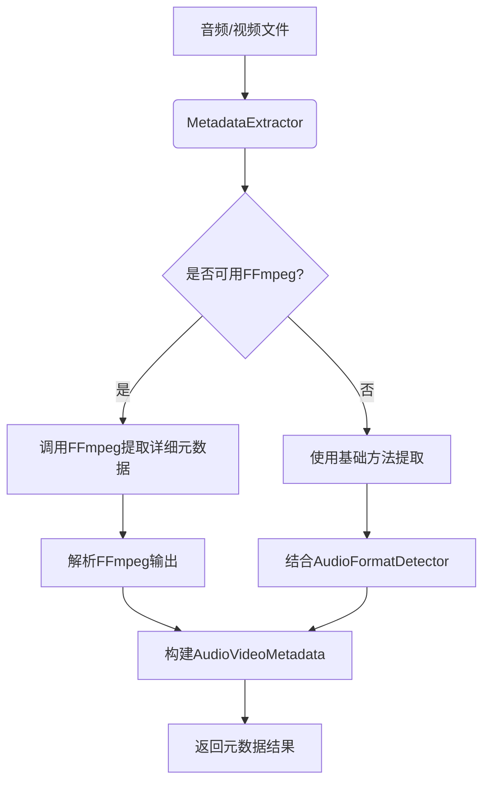
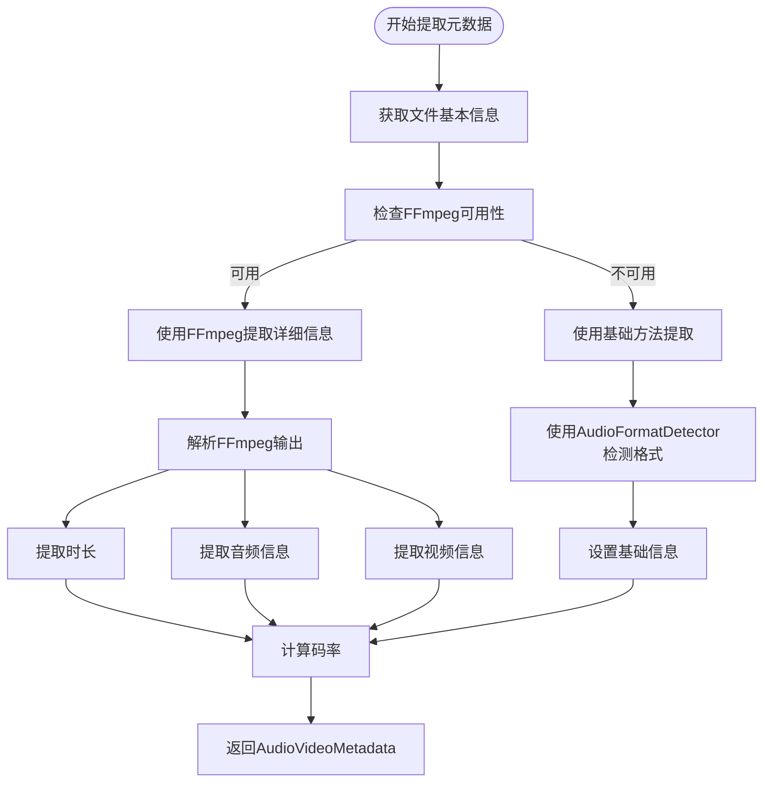
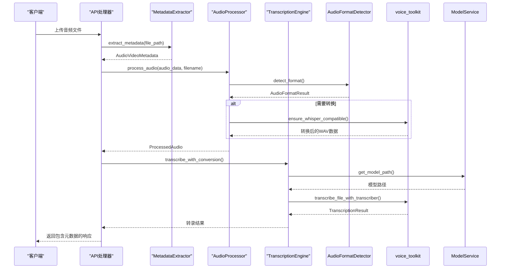

# 元数据提取

<cite>
**本文档引用的文件**  
- [metadata_extractor.rs](file://voice-cli/src/services/metadata_extractor.rs#L1-L368)
- [audio_format_detector.rs](file://voice-cli/src/services/audio_format_detector.rs#L1-L326)
- [audio_processor.rs](file://voice-cli/src/services/audio_processor.rs#L1-L315)
- [transcription_engine.rs](file://voice-cli/src/services/transcription_engine.rs#L1-L158)
- [request.rs](file://voice-cli/src/models/request.rs#L1-L434)
- [Cargo.toml](file://voice-cli/Cargo.toml#L1-L108)
- [error.rs](file://voice-cli/src/error.rs#L1-L167)
</cite>

## 目录
1. [引言](#引言)
2. [核心功能与架构](#核心功能与架构)
3. [元数据提取流程](#元数据提取流程)
4. [支持的元数据字段](#支持的元数据字段)
5. [底层依赖库](#底层依赖库)
6. [错误处理机制](#错误处理机制)
7. [在转录流程中的应用](#在转录流程中的应用)
8. [性能监控建议](#性能监控建议)
9. [结论](#结论)

## 引言
本项目中的元数据提取组件（MetadataExtractor）负责从音频和视频文件中提取关键的元数据信息。这些信息对于后续的音频处理、转录任务以及系统监控至关重要。本文档将全面解析该组件的功能、实现方式及其在整个系统中的作用。

## 核心功能与架构



**Diagram sources**  
- [metadata_extractor.rs](file://voice-cli/src/services/metadata_extractor.rs#L64-L88)

**Section sources**  
- [metadata_extractor.rs](file://voice-cli/src/services/metadata_extractor.rs#L1-L368)

## 元数据提取流程



**Diagram sources**  
- [metadata_extractor.rs](file://voice-cli/src/services/metadata_extractor.rs#L64-L233)

**Section sources**  
- [metadata_extractor.rs](file://voice-cli/src/services/metadata_extractor.rs#L64-L233)

## 支持的元数据字段

| 字段名称 | 数据类型 | 描述 | 示例 |
|--------|--------|------|------|
| format | String | 文件格式 (mp3, wav, mp4等) | "mp3" |
| container_format | String | 容器格式 | "mp3" |
| duration_seconds | f64 | 时长（秒） | 180.5 |
| file_size_bytes | u64 | 文件大小（字节） | 3640010 |
| audio_codec | String | 音频编码器 | "mp3" |
| sample_rate | u32 | 采样率 (Hz) | 44100 |
| channels | u8 | 声道数 | 2 |
| audio_bitrate | u32 | 音频码率 (kbps) | 128 |
| has_video | bool | 是否包含视频 | false |
| video_codec | Option<String> | 视频编码器 | Some("h264") |
| width | Option<u32> | 视频宽度 | Some(1920) |
| height | Option<u32> | 视频高度 | Some(1080) |
| video_bitrate | Option<u32> | 视频码率 (kbps) | Some(1992) |
| frame_rate | Option<f64> | 帧率 | Some(24.0) |
| bitrate | u32 | 总码率 (kbps) | 160 |
| creation_time | Option<String> | 创建时间 | Some("2023-01-01T00:00:00Z") |

**Section sources**  
- [request.rs](file://voice-cli/src/models/request.rs#L5-L63)

## 底层依赖库

```mermaid
classDiagram
class MetadataExtractor {
+extract_metadata(file_path : &Path) Result<AudioVideoMetadata, VoiceCliError>
-extract_with_ffmpeg(file_path : &Path) Result<AudioVideoMetadata, VoiceCliError>
-extract_basic_metadata(file_path : &Path, file_metadata : &Metadata, file_extension : &str) Result<AudioVideoMetadata, VoiceCliError>
-is_video_format(extension : &str) bool
+get_format_description(metadata : &AudioVideoMetadata) String
}
class AudioFormatDetector {
+detect_format_from_path(path : &Path) anyhow : : Result<Option<Type>>
+detect_format(audio_data : &Bytes, filename : Option<&str>) Result<AudioFormatResult, VoiceCliError>
-symphonia_probe(audio_data : &Bytes, filename : Option<&str>) Result<AudioFormatResult, VoiceCliError>
-extract_format_info(probe_result : &ProbeResult) Result<AudioFormatResult, VoiceCliError>
-extract_metadata(track : &Track, _reader : &Box<dyn FormatReader>) AudioMetadata
+validate_format_support(format_result : &AudioFormatResult) Result<(), VoiceCliError>
}
class AudioProcessor {
+process_audio(audio_data : Bytes, filename : Option<&str>) Result<ProcessedAudio, VoiceCliError>
-detect_audio_format(audio_data : &Bytes, filename : Option<&str>) Result<AudioFormat, VoiceCliError>
-convert_to_whisper_format(audio_data : Bytes, source_format : AudioFormat) Result<Bytes, VoiceCliError>
-convert_with_rs_voice_toolkit(input_path : &Path, output_path : &Path) Result<(), VoiceCliError>
-create_temp_file(audio_data : &Bytes, format : &AudioFormat) Result<NamedTempFile, VoiceCliError>
+validate_whisper_format(audio_data : &Bytes) Result<(), VoiceCliError>
}
class TranscriptionEngine {
+new(model_service : Arc<ModelService>) Self
-get_or_create_transcriber(model_name : &str) Result<Arc<WhisperTranscriber>, VoiceCliError>
+transcribe_compatible_audio(model_name : &str, audio_path : &Path, timeout_secs : u64) Result<TranscriptionResult, VoiceCliError>
+default_model() &str
+worker_timeout() u64
+transcribe_with_conversion(model_name : &str, input_audio_path : &Path, timeout_secs : u64) Result<TranscriptionResult, VoiceCliError>
}
MetadataExtractor --> AudioFormatDetector : "使用"
AudioProcessor --> AudioFormatDetector : "使用"
TranscriptionEngine --> ModelService : "依赖"
AudioProcessor --> voice_toolkit : : audio : "调用"
TranscriptionEngine --> voice_toolkit : : stt : "调用"
```

**Diagram sources**  
- [metadata_extractor.rs](file://voice-cli/src/services/metadata_extractor.rs#L60-L301)
- [audio_format_detector.rs](file://voice-cli/src/services/audio_format_detector.rs#L17-L211)
- [audio_processor.rs](file://voice-cli/src/services/audio_processor.rs#L11-L276)
- [transcription_engine.rs](file://voice-cli/src/services/transcription_engine.rs#L11-L157)

**Section sources**  
- [Cargo.toml](file://voice-cli/Cargo.toml#L76-L83)

## 错误处理机制

```mermaid
flowchart TD
Start([extract_metadata]) --> TryFFmpeg["尝试使用FFmpeg"]
TryFFmpeg --> |成功| ReturnSuccess["返回元数据"]
TryFFmpeg --> |失败| WarnFallback["警告并使用基础方法"]
WarnFallback --> TryBasic["尝试基础提取方法"]
TryBasic --> |成功| ReturnBasic["返回基础元数据"]
TryBasic --> |失败| ReturnError["返回VoiceCliError"]
subgraph 错误类型
A[VoiceCliError::Storage] --> "无法访问文件"
B[VoiceCliError::UnsupportedFormat] --> "不支持的格式"
C[VoiceCliError::AudioProcessing] --> "音频处理失败"
D[VoiceCliError::FileIo] --> "文件I/O错误"
end
```

**Diagram sources**  
- [metadata_extractor.rs](file://voice-cli/src/services/metadata_extractor.rs#L64-L88)
- [error.rs](file://voice-cli/src/error.rs#L8-L106)

**Section sources**  
- [metadata_extractor.rs](file://voice-cli/src/services/metadata_extractor.rs#L64-L88)
- [error.rs](file://voice-cli/src/error.rs#L8-L106)

## 在转录流程中的应用



**Diagram sources**  
- [metadata_extractor.rs](file://voice-cli/src/services/metadata_extractor.rs#L64-L88)
- [audio_processor.rs](file://voice-cli/src/services/audio_processor.rs#L28-L67)
- [transcription_engine.rs](file://voice-cli/src/services/transcription_engine.rs#L139-L156)

**Section sources**  
- [metadata_extractor.rs](file://voice-cli/src/services/metadata_extractor.rs#L64-L88)
- [audio_processor.rs](file://voice-cli/src/services/audio_processor.rs#L28-L67)
- [transcription_engine.rs](file://voice-cli/src/services/transcription_engine.rs#L139-L156)

## 性能监控建议

为了有效监控元数据提取过程的性能，建议收集以下指标：

1. **元数据提取耗时**：记录从调用`extract_metadata`到返回结果的总时间。
2. **FFmpeg调用成功率**：统计使用FFmpeg成功提取元数据的比例。
3. **文件格式分布**：记录不同格式文件的处理情况，识别高频格式。
4. **错误类型统计**：分类统计各类错误的发生频率，如文件访问错误、不支持的格式等。
5. **缓存命中率**：如果实现缓存机制，监控缓存的使用效率。

这些指标可以通过集成OpenTelemetry等监控工具来实现，帮助优化系统性能和稳定性。

## 结论
MetadataExtractor组件通过结合FFmpeg和Symphonia等底层库，实现了对音频视频文件元数据的高效提取。它不仅提供了详细的媒体信息，还为后续的音频处理和转录任务提供了必要的数据支持。其灵活的错误处理机制和清晰的架构设计确保了系统的稳定性和可维护性。