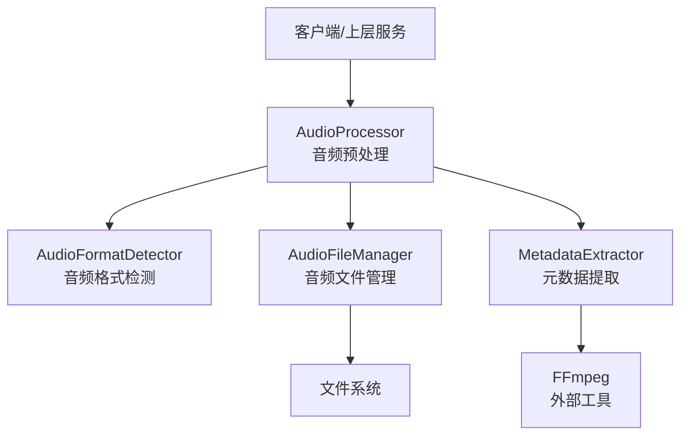
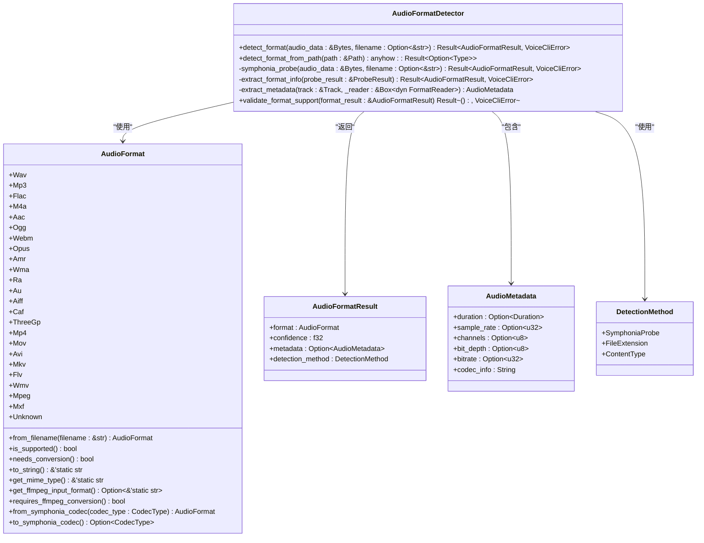
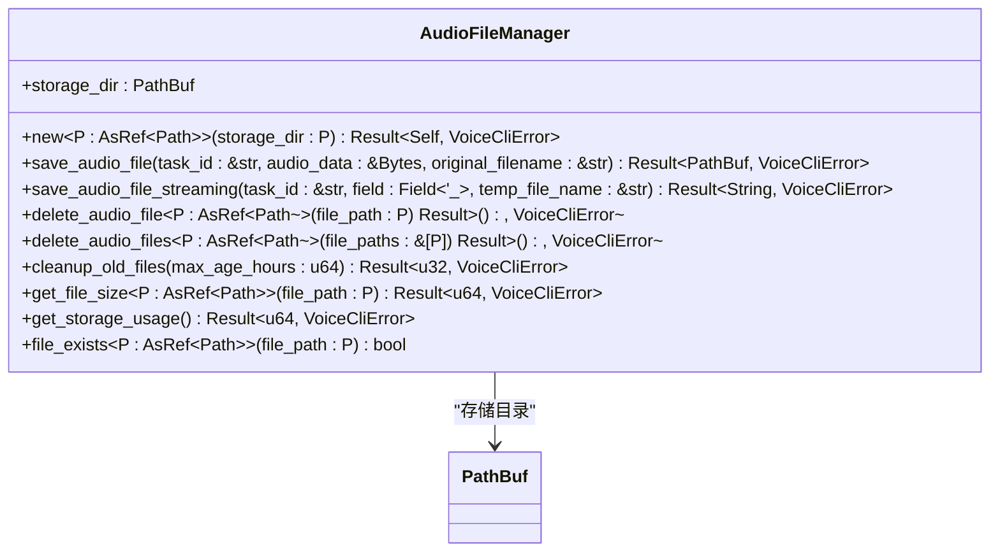
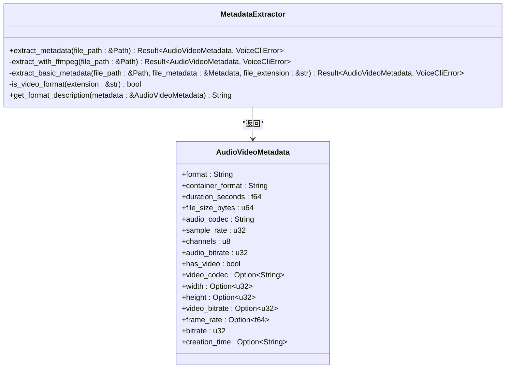
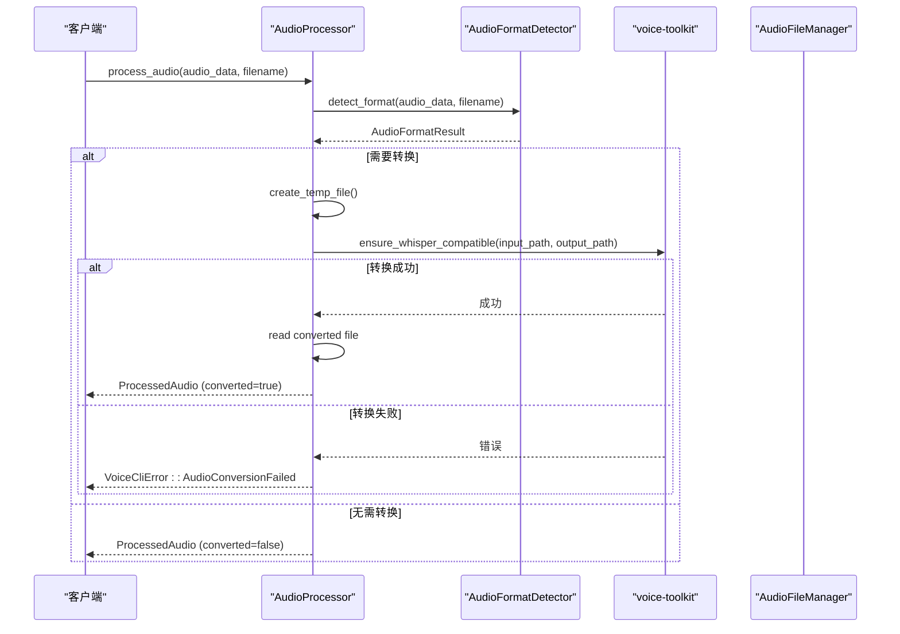
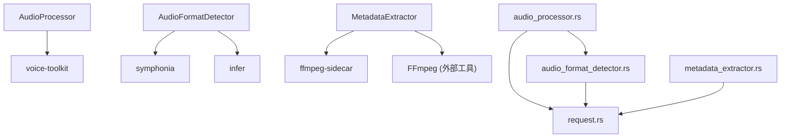

# 音频处理

<cite>
**本文档引用的文件**  
- [audio_format_detector.rs](file://voice-cli/src/services/audio_format_detector.rs)
- [audio_file_manager.rs](file://voice-cli/src/services/audio_file_manager.rs)
- [metadata_extractor.rs](file://voice-cli/src/services/metadata_extractor.rs)
- [audio_processor.rs](file://voice-cli/src/services/audio_processor.rs)
- [request.rs](file://voice-cli/src/models/request.rs)
- [error.rs](file://voice-cli/src/error.rs)
- [mod.rs](file://voice-cli/src/services/mod.rs)
</cite>

## 目录
1. [简介](#简介)
2. [项目结构](#项目结构)
3. [核心组件](#核心组件)
4. [架构概述](#架构概述)
5. [详细组件分析](#详细组件分析)
6. [依赖分析](#依赖分析)
7. [性能考虑](#性能考虑)
8. [故障排除指南](#故障排除指南)
9. [结论](#结论)

## 简介
本文档详细介绍了语音处理服务中的音频处理模块，涵盖音频格式检测、音频文件管理、元数据提取和音频预处理功能。文档解释了 `AudioFormatDetector` 如何识别多种音频格式（如WAV、MP3、FLAC等），`AudioFileManager` 如何管理音频文件的存储与访问，`MetadataExtractor` 如何提取音频的时长、采样率等元数据，以及 `AudioProcessor` 如何进行音频转码和标准化处理。结合代码示例说明各组件的调用流程和集成方式，阐述在转录任务中的实际应用。提供常见音频处理问题的解决方案和性能优化建议。

## 项目结构
音频处理模块位于 `voice-cli` 子项目中，主要功能实现在 `src/services` 目录下。该模块采用模块化设计，将不同的音频处理功能分离到独立的服务组件中，便于维护和扩展。

```mermaid
graph TB
subgraph "voice-cli"
subgraph "services"
AudioFormatDetector["AudioFormatDetector<br/>音频格式检测"]
AudioFileManager["AudioFileManager<br/>音频文件管理"]
MetadataExtractor["MetadataExtractor<br/>元数据提取"]
AudioProcessor["AudioProcessor<br/>音频预处理"]
end
subgraph "models"
request["request.rs<br/>请求模型定义"]
end
subgraph "error"
error["error.rs<br/>错误处理"]
end
end
```

**图表来源**  
- [audio_format_detector.rs](file://voice-cli/src/services/audio_format_detector.rs)
- [audio_file_manager.rs](file://voice-cli/src/services/audio_file_manager.rs)
- [metadata_extractor.rs](file://voice-cli/src/services/metadata_extractor.rs)
- [audio_processor.rs](file://voice-cli/src/services/audio_processor.rs)
- [request.rs](file://voice-cli/src/models/request.rs)
- [error.rs](file://voice-cli/src/error.rs)

**章节来源**  
- [audio_format_detector.rs](file://voice-cli/src/services/audio_format_detector.rs)
- [audio_file_manager.rs](file://voice-cli/src/services/audio_file_manager.rs)
- [metadata_extractor.rs](file://voice-cli/src/services/metadata_extractor.rs)
- [audio_processor.rs](file://voice-cli/src/services/audio_processor.rs)

## 核心组件
音频处理模块由四个核心服务组件构成：`AudioFormatDetector` 负责音频格式的智能检测，`AudioFileManager` 管理音频文件的生命周期，`MetadataExtractor` 提取音频文件的详细元数据，`AudioProcessor` 执行音频的预处理和格式转换。这些组件通过清晰的接口相互协作，为上层的语音转录功能提供支持。

**章节来源**  
- [audio_format_detector.rs](file://voice-cli/src/services/audio_format_detector.rs)
- [audio_file_manager.rs](file://voice-cli/src/services/audio_file_manager.rs)
- [metadata_extractor.rs](file://voice-cli/src/services/metadata_extractor.rs)
- [audio_processor.rs](file://voice-cli/src/services/audio_processor.rs)

## 架构概述
音频处理模块采用分层架构，各组件职责分明。`AudioFormatDetector` 和 `MetadataExtractor` 作为底层检测服务，提供音频文件的基础信息。`AudioFileManager` 作为文件系统交互层，负责文件的持久化存储。`AudioProcessor` 作为核心处理引擎，协调其他组件完成音频预处理任务。所有组件通过定义良好的API进行通信，确保了系统的可维护性和可扩展性。



**图表来源**  
- [audio_format_detector.rs](file://voice-cli/src/services/audio_format_detector.rs)
- [audio_file_manager.rs](file://voice-cli/src/services/audio_file_manager.rs)
- [metadata_extractor.rs](file://voice-cli/src/services/metadata_extractor.rs)
- [audio_processor.rs](file://voice-cli/src/services/audio_processor.rs)

## 详细组件分析
本节将深入分析音频处理模块的各个核心组件，包括其功能、实现细节和调用流程。

### 音频格式检测分析
`AudioFormatDetector` 服务采用多层检测策略来识别音频格式。它首先使用 `symphonia` 库进行深度探针检测，分析音频文件的内部结构和编码信息。如果探针检测失败，则回退到基于文件扩展名的检测方法。该服务还集成了 `infer` 库，通过文件的“魔数”（magic number）进行格式识别，提高了检测的准确性和鲁棒性。



**图表来源**  
- [audio_format_detector.rs](file://voice-cli/src/services/audio_format_detector.rs#L17-L211)
- [request.rs](file://voice-cli/src/models/request.rs#L170-L405)

**章节来源**  
- [audio_format_detector.rs](file://voice-cli/src/services/audio_format_detector.rs#L17-L211)
- [request.rs](file://voice-cli/src/models/request.rs#L170-L405)

### 音频文件管理分析
`AudioFileManager` 服务负责音频文件在磁盘上的存储和管理。它提供异步API来保存和删除音频文件，并支持流式上传，这对于处理大文件至关重要。该服务还实现了文件清理功能，可以定期删除过期的音频文件，以防止存储空间耗尽。



**图表来源**  
- [audio_file_manager.rs](file://voice-cli/src/services/audio_file_manager.rs#L12-L305)

**章节来源**  
- [audio_file_manager.rs](file://voice-cli/src/services/audio_file_manager.rs#L12-L305)

### 元数据提取分析
`MetadataExtractor` 服务用于提取音频和视频文件的详细元数据。它优先使用 `FFmpeg` 命令行工具进行深度分析，以获取精确的时长、采样率、码率等信息。如果 `FFmpeg` 不可用，则回退到基础的元数据提取方法，利用文件大小和扩展名进行估算。



**图表来源**  
- [metadata_extractor.rs](file://voice-cli/src/services/metadata_extractor.rs#L60-L301)
- [request.rs](file://voice-cli/src/models/request.rs#L5-L63)

**章节来源**  
- [metadata_extractor.rs](file://voice-cli/src/services/metadata_extractor.rs#L60-L301)
- [request.rs](file://voice-cli/src/models/request.rs#L5-L63)

### 音频预处理分析
`AudioProcessor` 服务是音频处理的核心，负责将各种格式的音频转换为语音转录引擎（如Whisper）所需的标准化格式。它首先调用 `AudioFormatDetector` 确定输入音频的格式，然后根据需要使用 `voice-toolkit` 或 `FFmpeg` 进行转码，最终输出符合要求的WAV格式音频。



**图表来源**  
- [audio_processor.rs](file://voice-cli/src/services/audio_processor.rs#L11-L275)
- [audio_format_detector.rs](file://voice-cli/src/services/audio_format_detector.rs#L28-L65)
- [request.rs](file://voice-cli/src/models/request.rs#L161-L166)

**章节来源**  
- [audio_processor.rs](file://voice-cli/src/services/audio_processor.rs#L11-L275)

## 依赖分析
音频处理模块依赖于多个外部库和工具来实现其功能。`symphonia` 库用于高效的音频格式探针检测，`infer` 库用于基于“魔数”的格式识别，`ffmpeg-sidecar` 用于调用 `FFmpeg` 进行元数据提取和复杂的音频转换，`voice-toolkit` 用于执行高效的音频重采样和格式转换。



**图表来源**  
- [Cargo.toml](file://voice-cli/Cargo.toml)
- [audio_processor.rs](file://voice-cli/src/services/audio_processor.rs)
- [audio_format_detector.rs](file://voice-cli/src/services/audio_format_detector.rs)
- [metadata_extractor.rs](file://voice-cli/src/services/metadata_extractor.rs)

**章节来源**  
- [Cargo.toml](file://voice-cli/Cargo.toml)
- [audio_processor.rs](file://voice-cli/src/services/audio_processor.rs)
- [audio_format_detector.rs](file://voice-cli/src/services/audio_format_detector.rs)
- [metadata_extractor.rs](file://voice-cli/src/services/metadata_extractor.rs)

## 性能考虑
在处理音频文件时，应考虑以下性能优化建议：
- 使用 `save_audio_file_streaming` 方法处理大文件上传，避免将整个文件加载到内存中。
- 定期调用 `cleanup_old_files` 方法清理过期的临时文件，防止磁盘空间耗尽。
- 对于频繁处理的音频格式，考虑缓存格式检测结果以减少重复计算。
- 确保 `FFmpeg` 和 `voice-toolkit` 等外部工具已正确安装并优化，以获得最佳转换性能。

## 故障排除指南
以下是一些常见的音频处理问题及其解决方案：
- **格式检测失败**：确保输入文件不是损坏的，并检查文件扩展名是否正确。系统会尝试多种检测方法，但损坏的文件可能导致所有方法都失败。
- **音频转换失败**：检查 `voice-toolkit` 或 `FFmpeg` 是否已正确安装。查看日志中的具体错误信息以确定问题根源。
- **文件无法保存**：确认应用程序对存储目录具有写权限，并且磁盘空间充足。
- **元数据提取不完整**：某些文件可能缺少元数据，此时系统会返回估算值。对于精确的元数据，确保使用标准的音频编码格式。

**章节来源**  
- [error.rs](file://voice-cli/src/error.rs#L9-L155)
- [audio_file_manager.rs](file://voice-cli/src/services/audio_file_manager.rs#L40-L76)
- [audio_processor.rs](file://voice-cli/src/services/audio_processor.rs#L96-L131)

## 结论
本文档详细介绍了语音处理服务中的音频处理模块。该模块通过 `AudioFormatDetector`、`AudioFileManager`、`MetadataExtractor` 和 `AudioProcessor` 四个核心组件，实现了从音频文件接收、格式识别、元数据提取到预处理的完整流程。组件之间职责清晰，通过异步和流式处理确保了高性能和高可靠性。该设计为构建健壮的语音转录服务提供了坚实的基础。