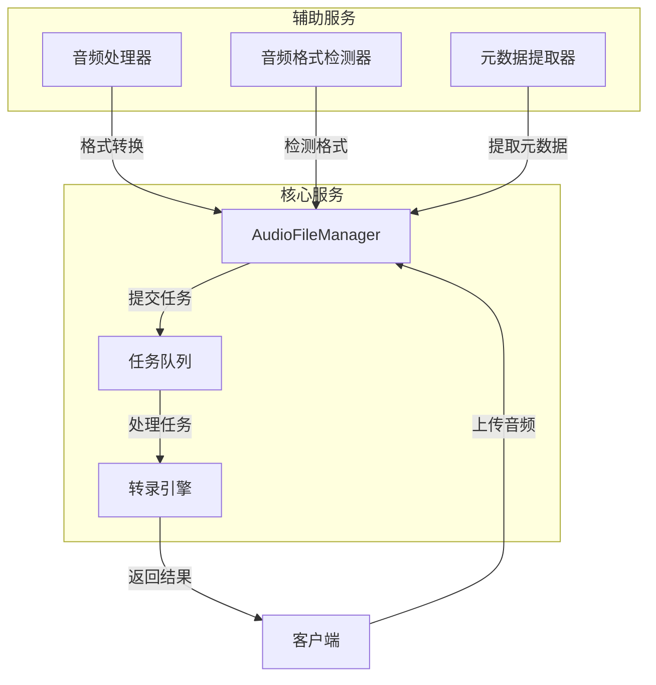
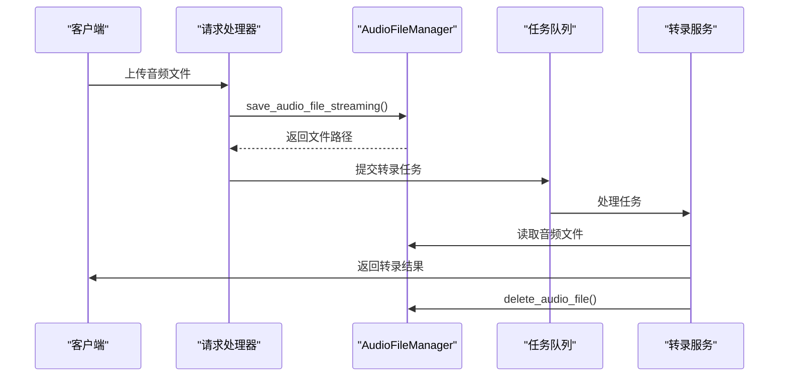
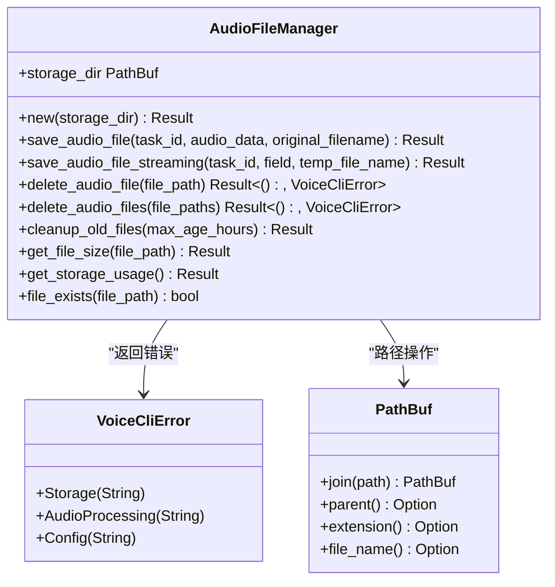
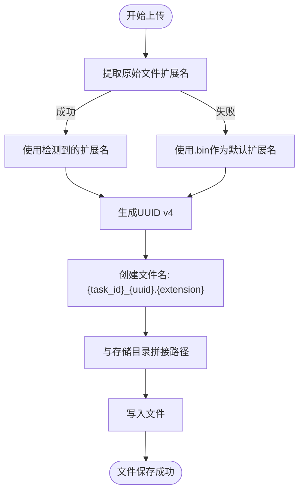
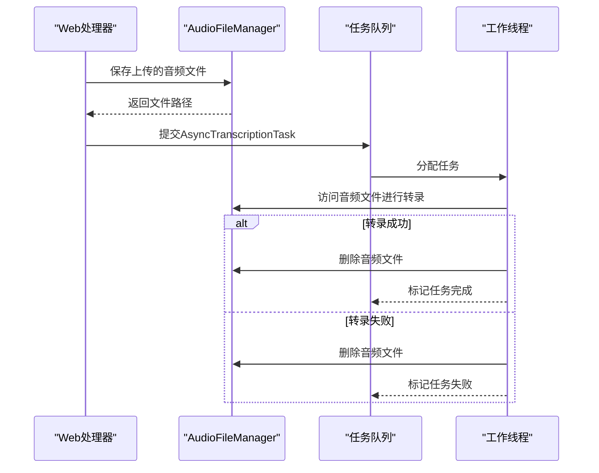
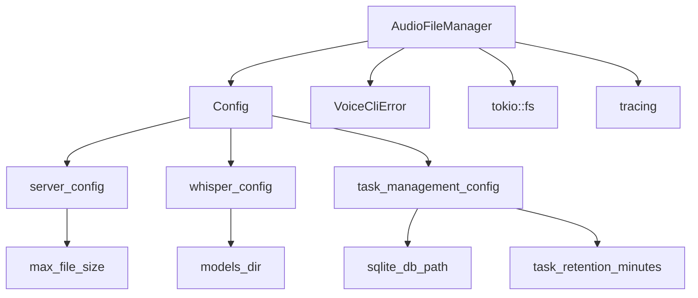

# 音频文件管理

<cite>
**本文档引用的文件**   
- [audio_file_manager.rs](file://voice-cli/src/services/audio_file_manager.rs)
- [config.rs](file://voice-cli/src/models/config.rs)
- [server-config.yml.template](file://voice-cli/templates/server-config.yml.template)
- [apalis_manager.rs](file://voice-cli/src/services/apalis_manager.rs)
- [stepped_task.rs](file://voice-cli/src/models/stepped_task.rs)
</cite>

## 目录
1. [简介](#简介)
2. [项目结构](#项目结构)
3. [核心组件](#核心组件)
4. [架构概述](#架构概述)
5. [详细组件分析](#详细组件分析)
6. [依赖分析](#依赖分析)
7. [性能考虑](#性能考虑)
8. [故障排除指南](#故障排除指南)
9. [结论](#结论)

## 简介
本文档深入介绍AudioFileManager模块的设计与实现，涵盖音频文件的上传、临时存储、路径管理、磁盘清理和生命周期控制。说明其如何与系统临时目录协同工作，确保文件唯一性与安全性，防止路径遍历攻击。结合代码示例展示文件写入、读取流式处理和自动清理机制（如RAII或定时任务）。阐述其与转录任务队列的集成方式，确保任务完成或失败后文件资源及时释放。文档包含文件命名策略、存储路径配置、并发访问控制，并提供在高并发场景下的性能调优建议。

## 项目结构
AudioFileManager模块位于`voice-cli/src/services/`目录下，是语音转录服务的核心组件之一。该模块负责管理音频文件的整个生命周期，从上传到最终清理。其设计遵循清晰的职责分离原则，与其他服务如任务队列、音频处理器和转录引擎紧密协作。

**Diagram sources**
- [audio_file_manager.rs](file://voice-cli/src/services/audio_file_manager.rs#L10-L305)
- [apalis_manager.rs](file://voice-cli/src/services/apalis_manager.rs#L75-L116)

**Section sources**
- [audio_file_manager.rs](file://voice-cli/src/services/audio_file_manager.rs#L1-L392)
- [services/mod.rs](file://voice-cli/src/services/mod.rs#L1-L25)

## 核心组件
AudioFileManager模块的核心是`AudioFileManager`结构体，它封装了所有与音频文件管理相关的功能。该模块提供了异步API，支持流式文件上传、文件删除、存储清理和使用情况统计。通过`storage_dir`字段管理存储路径，确保所有文件操作都在指定的安全目录内进行，有效防止路径遍历攻击。

**Section sources**
- [audio_file_manager.rs](file://voice-cli/src/services/audio_file_manager.rs#L10-L305)

## 架构概述
AudioFileManager模块采用服务模式设计，与系统的任务队列和转录引擎深度集成。当音频文件上传后，系统创建一个异步转录任务，该任务包含音频文件的路径信息。任务完成后，无论成功或失败，系统都会触发文件清理流程，确保临时文件不会无限期占用磁盘空间。

**Diagram sources**
- [audio_file_manager.rs](file://voice-cli/src/services/audio_file_manager.rs#L78-L178)
- [apalis_manager.rs](file://voice-cli/src/services/apalis_manager.rs#L1222-L1697)
- [stepped_task.rs](file://voice-cli/src/models/stepped_task.rs#L11-L38)

## 详细组件分析

### AudioFileManager分析
AudioFileManager模块实现了完整的音频文件生命周期管理，包括上传、存储、访问和清理。

#### 核心类图

**Diagram sources**
- [audio_file_manager.rs](file://voice-cli/src/services/audio_file_manager.rs#L10-L305)

### 文件命名与存储策略
系统采用安全的文件命名策略，结合任务ID和UUID确保文件名的唯一性，防止文件覆盖和冲突。

#### 文件命名流程图

**Diagram sources**
- [audio_file_manager.rs](file://voice-cli/src/services/audio_file_manager.rs#L47-L55)
- [server/handlers.rs](file://voice-cli/src/server/handlers.rs#L786-L823)

**Section sources**
- [audio_file_manager.rs](file://voice-cli/src/services/audio_file_manager.rs#L40-L76)
- [server/handlers.rs](file://voice-cli/src/server/handlers.rs#L786-L823)

### 与转录任务队列的集成
AudioFileManager与基于Apalis的任务队列系统深度集成，确保文件资源在任务完成后及时释放。

#### 任务集成序列图

**Diagram sources**
- [apalis_manager.rs](file://voice-cli/src/services/apalis_manager.rs#L75-L116)
- [stepped_task.rs](file://voice-cli/src/models/stepped_task.rs#L11-L38)
- [audio_file_manager.rs](file://voice-cli/src/services/audio_file_manager.rs#L180-L202)

**Section sources**
- [apalis_manager.rs](file://voice-cli/src/services/apalis_manager.rs#L75-L116)
- [stepped_task.rs](file://voice-cli/src/models/stepped_task.rs#L11-L38)

## 依赖分析
AudioFileManager模块依赖于多个核心组件和配置，形成一个完整的音频处理生态系统。

**Diagram sources**
- [config.rs](file://voice-cli/src/models/config.rs#L4-L706)
- [server-config.yml.template](file://voice-cli/templates/server-config.yml.template#L1-L77)

**Section sources**
- [config.rs](file://voice-cli/src/models/config.rs#L4-L706)
- [audio_file_manager.rs](file://voice-cli/src/services/audio_file_manager.rs#L1-L392)

## 性能考虑
在高并发场景下，AudioFileManager通过异步I/O和流式处理优化性能。对于大文件上传，系统采用流式复制而非一次性加载到内存，减少内存压力。同时，通过配置`max_concurrent_tasks`和`transcription_workers`参数，可以平衡系统资源使用和处理能力。

建议在生产环境中：
1. 将存储目录配置在SSD上以提高I/O性能
2. 适当增加`max_concurrent_tasks`以充分利用多核CPU
3. 定期监控`get_storage_usage()`以防止磁盘空间耗尽
4. 调整`task_retention_minutes`以平衡存储空间和任务追溯需求

## 故障排除指南
常见问题及解决方案：

1. **文件上传失败**
   - 检查存储目录权限和磁盘空间
   - 验证`max_file_size`配置是否足够
   - 查看日志中的具体错误信息

2. **任务处理卡住**
   - 检查`task_timeout_seconds`配置
   - 验证转录工作线程数量是否足够
   - 查看是否有大量并发任务导致资源竞争

3. **磁盘空间快速增长**
   - 检查`cleanup_old_files`定时任务是否正常运行
   - 验证`task_retention_minutes`配置是否合理
   - 监控`get_storage_usage()`指标

**Section sources**
- [audio_file_manager.rs](file://voice-cli/src/services/audio_file_manager.rs#L218-L259)
- [config.rs](file://voice-cli/src/models/config.rs#L98-L114)

## 结论
AudioFileManager模块提供了一个安全、高效且可靠的音频文件管理解决方案。通过与任务队列系统的深度集成，实现了文件资源的自动化生命周期管理。其设计充分考虑了安全性、性能和可维护性，能够满足高并发场景下的音频处理需求。通过合理的配置和监控，可以确保系统稳定运行并有效管理存储资源。