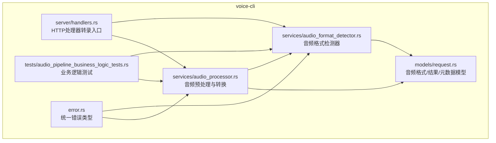
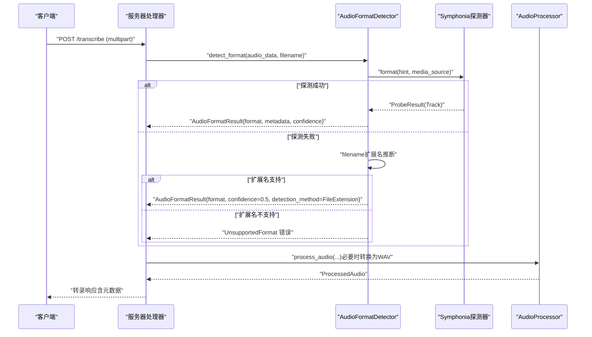
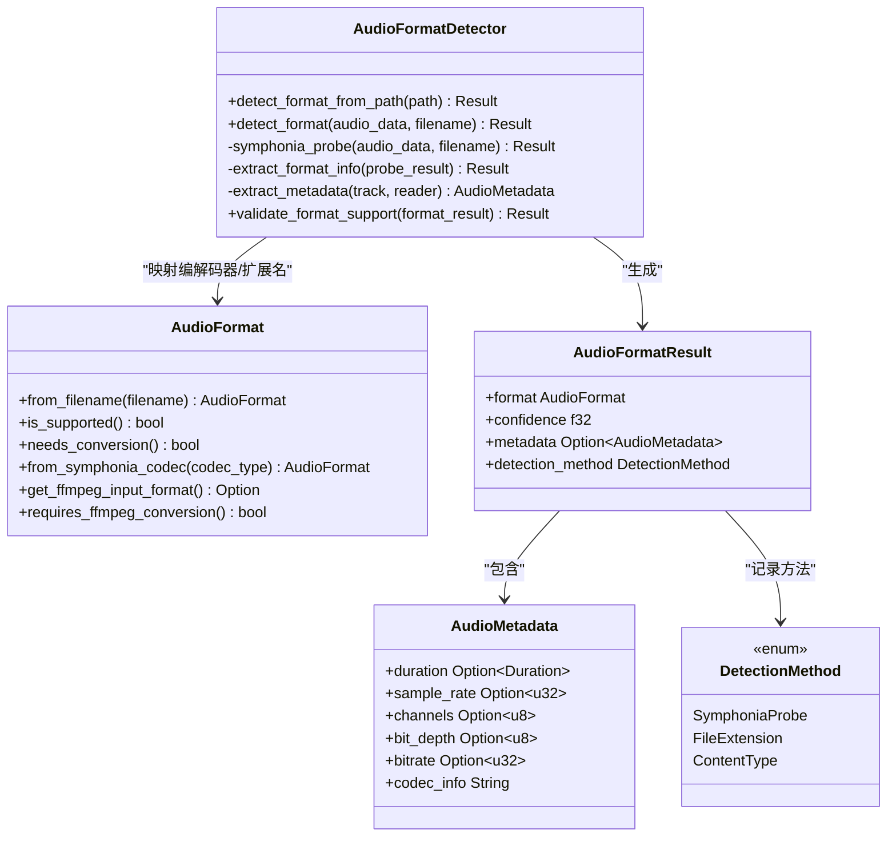
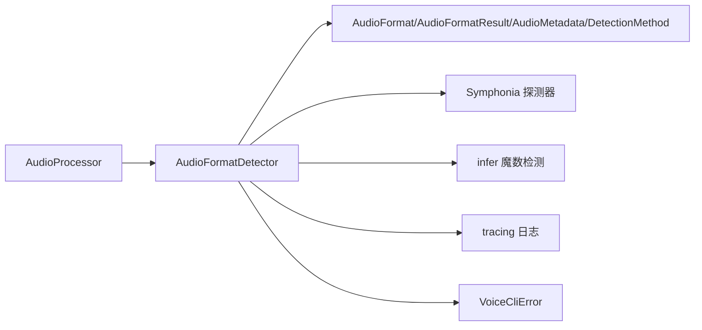

# 音频格式检测

<cite>
**本文引用的文件**
- [audio_format_detector.rs](file://voice-cli/src/services/audio_format_detector.rs)
- [request.rs](file://voice-cli/src/models/request.rs)
- [audio_processor.rs](file://voice-cli/src/services/audio_processor.rs)
- [error.rs](file://voice-cli/src/error.rs)
- [handlers.rs](file://voice-cli/src/server/handlers.rs)
- [audio_pipeline_business_logic_tests.rs](file://voice-cli/tests/audio_pipeline_business_logic_tests.rs)
</cite>

## 目录
1. [简介](#简介)
2. [项目结构](#项目结构)
3. [核心组件](#核心组件)
4. [架构总览](#架构总览)
5. [详细组件分析](#详细组件分析)
6. [依赖关系分析](#依赖关系分析)
7. [性能考量](#性能考量)
8. [故障排查指南](#故障排查指南)
9. [结论](#结论)
10. [附录](#附录)

## 简介
本文件系统性解析 AudioFormatDetector 组件的实现机制，说明其如何通过“文件头签名（魔数）+扩展名”的双重校验策略识别多种音频格式（如 WAV、MP3、FLAC、OGG 等），并阐述在语音转录任务中的前置校验作用。文档覆盖支持格式列表、检测精度说明、边界情况处理（如伪装扩展名）、返回结果处理、自定义格式扩展开发指引、常见检测失败原因与排查方法，以及性能优化建议（如缓存检测结果以减少重复 I/O）。

## 项目结构
AudioFormatDetector 位于 voice-cli 子模块的服务层，与模型定义、处理器、错误类型、服务器处理器以及测试用例共同构成完整的音频格式检测与转录流水线。

图表来源
- [audio_format_detector.rs](file://voice-cli/src/services/audio_format_detector.rs#L1-L211)
- [request.rs](file://voice-cli/src/models/request.rs#L160-L228)
- [audio_processor.rs](file://voice-cli/src/services/audio_processor.rs#L48-L86)
- [error.rs](file://voice-cli/src/error.rs#L1-L167)
- [handlers.rs](file://voice-cli/src/server/handlers.rs#L146-L200)
- [audio_pipeline_business_logic_tests.rs](file://voice-cli/tests/audio_pipeline_business_logic_tests.rs#L1-L263)

章节来源
- [audio_format_detector.rs](file://voice-cli/src/services/audio_format_detector.rs#L1-L211)
- [request.rs](file://voice-cli/src/models/request.rs#L160-L228)

## 核心组件
- AudioFormatDetector：负责格式检测与元数据提取，采用“Symphonia 探测（主）+扩展名回退”的策略。
- AudioFormat/AudioFormatResult/AudioMetadata/DetectionMethod：定义支持的音频格式、检测结果与元数据结构。
- AudioProcessor：在转录前对音频进行格式验证与必要转换（如转为 Whisper 兼容的 WAV）。
- 错误类型 VoiceCliError：统一承载“不支持格式”“探测失败”“文件过大”等错误。
- 服务器处理器：接收上传音频，触发格式检测与后续处理。

章节来源
- [audio_format_detector.rs](file://voice-cli/src/services/audio_format_detector.rs#L1-L211)
- [request.rs](file://voice-cli/src/models/request.rs#L160-L228)
- [audio_processor.rs](file://voice-cli/src/services/audio_processor.rs#L48-L86)
- [error.rs](file://voice-cli/src/error.rs#L1-L167)

## 架构总览
AudioFormatDetector 的检测流程如下：
- 主路径：使用 Symphonia 对音频数据进行探测，提取首个有效音频轨的编解码器类型，映射为内部 AudioFormat，并计算高置信度。
- 回退路径：若 Symphonia 探测失败且提供了文件名，则按扩展名推断格式；若仍不可用则判定为不支持格式。
- 返回值：包含格式、置信度、元数据（采样率、声道、位深、时长、比特率等）与检测方法标识。

图表来源
- [audio_format_detector.rs](file://voice-cli/src/services/audio_format_detector.rs#L27-L108)
- [audio_processor.rs](file://voice-cli/src/services/audio_processor.rs#L48-L86)
- [handlers.rs](file://voice-cli/src/server/handlers.rs#L146-L200)

## 详细组件分析

### AudioFormatDetector 组件
- 双重校验策略
  - 魔数检测：通过 Symphonia 探测音频容器与编解码器，得到高置信度结果。
  - 扩展名回退：当 Symphonia 探测失败或未提供文件名时，依据扩展名推断格式，置信度较低。
- 关键方法
  - detect_format：主入口，按上述顺序执行。
  - symphonia_probe：基于 Symphonia 的探测实现，支持从文件名 hint 中提取扩展名。
  - extract_format_info：从 ProbeResult 中提取首个有效音频轨的编解码器类型，映射为 AudioFormat，并计算置信度。
  - extract_metadata：提取采样率、声道、位深、时长、比特率等元数据。
  - validate_format_support：校验检测结果是否可用于转录（支持且置信度不低于阈值）。
- 返回结果
  - AudioFormatResult：包含 format、confidence、metadata、detection_method。
  - DetectionMethod：SymphoniaProbe、FileExtension、ContentType（测试中用于标识魔数检测）。

图表来源
- [audio_format_detector.rs](file://voice-cli/src/services/audio_format_detector.rs#L1-L211)
- [request.rs](file://voice-cli/src/models/request.rs#L160-L228)

章节来源
- [audio_format_detector.rs](file://voice-cli/src/services/audio_format_detector.rs#L1-L211)
- [request.rs](file://voice-cli/src/models/request.rs#L160-L228)

### 支持格式列表与映射规则
- 核心音频格式（常见于 Symphonia）：WAV、MP3、FLAC、AAC、OGG、M4A、WEBM、OPUS。
- 扩展音频格式（FFmpeg 支持）：AMR、WMA、RA/RAM、AU/SND、AIFF/AIF、CAF。
- 视频容器（音频提取 via FFmpeg）：3GP/3G2、MP4、MOV、AVI、MKV/MKA、FLV、WMV、MPEG/MPG、MXF。
- 映射逻辑
  - Symphonia 编解码器类型字符串匹配（如包含 pcm/wav、mp3/mpeg、flac、aac、vorbis、opus）映射到对应 AudioFormat。
  - 扩展名映射（from_filename）覆盖上述全部类别，Unknown 表示不支持。

章节来源
- [request.rs](file://voice-cli/src/models/request.rs#L168-L200)
- [request.rs](file://voice-cli/src/models/request.rs#L230-L271)
- [request.rs](file://voice-cli/src/models/request.rs#L378-L398)

### 检测精度与置信度
- Symphonia 探测：置信度 0.95，基于实际容器与编解码器解析。
- 扩展名回退：置信度 0.5，仅在提供文件名且扩展名被识别为支持格式时生效。
- 低置信度警告：validate_format_support 对低于 0.3 的置信度发出告警，提示潜在误判风险。

章节来源
- [audio_format_detector.rs](file://voice-cli/src/services/audio_format_detector.rs#L109-L149)
- [audio_format_detector.rs](file://voice-cli/src/services/audio_format_detector.rs#L192-L211)

### 边界情况处理（伪装扩展名、空数据、损坏文件）
- 伪装扩展名：当文件头与扩展名不一致时，Symphonia 探测优先，能正确识别真实格式（测试覆盖了 MP3 魔数但扩展名为 flac 的场景）。
- 空数据/过短数据：Symphonia 探测会失败，扩展名回退可能返回 Unknown，最终抛出“不支持格式”错误。
- 损坏文件：Symphonia 探测失败或无音频轨时，返回 UnsupportedFormat。
- 服务器侧前置校验：handlers 中对文件大小进行限制，避免超大文件进入后续处理。

章节来源
- [audio_format_detector.rs](file://voice-cli/src/services/audio_format_detector.rs#L37-L65)
- [audio_pipeline_business_logic_tests.rs](file://voice-cli/tests/audio_pipeline_business_logic_tests.rs#L170-L205)

### 返回结果处理与在转录中的作用
- detect_format 返回 AudioFormatResult，其中包含 format、confidence、metadata 与 detection_method。
- 在转录流程中，服务器处理器先调用 detect_format 进行前置校验，再由 AudioProcessor 将非 WAV 格式转换为 Whisper 兼容的 WAV，确保后续转录引擎稳定工作。
- 元数据可用于前端展示与质量评估（如采样率、声道、时长、比特率）。

章节来源
- [handlers.rs](file://voice-cli/src/server/handlers.rs#L146-L200)
- [audio_processor.rs](file://voice-cli/src/services/audio_processor.rs#L48-L86)

### 自定义格式扩展开发指引
- 新增扩展名映射：在 AudioFormat::from_filename 中添加新的扩展名分支，映射到对应 AudioFormat。
- 新增编解码器映射：在 AudioFormat::from_symphonia_codec 中增加对新编解码器类型的字符串匹配。
- 单元测试：参考现有测试用例，新增魔数字节序列与扩展名回退的测试，确保检测路径覆盖完善。
- 注意事项：确保扩展名映射与编解码器映射保持一致，避免出现“扩展名识别为支持但编解码器未知”的情况。

章节来源
- [request.rs](file://voice-cli/src/models/request.rs#L230-L271)
- [request.rs](file://voice-cli/src/models/request.rs#L378-L398)
- [audio_format_detector.rs](file://voice-cli/src/services/audio_format_detector.rs#L216-L325)

## 依赖关系分析
- 内部依赖
  - AudioFormatDetector 依赖 AudioFormat/AudioFormatResult/AudioMetadata/DetectionMethod。
  - AudioProcessor 依赖 AudioFormatDetector 进行格式检测与校验。
- 外部依赖
  - Symphonia：用于容器与编解码器探测。
  - infer：用于魔数检测（测试中演示了 MP3/WAV 魔数识别）。
  - tracing：日志记录（info/warn/error）。
  - 错误类型 VoiceCliError：统一错误传播。

图表来源
- [audio_format_detector.rs](file://voice-cli/src/services/audio_format_detector.rs#L1-L211)
- [request.rs](file://voice-cli/src/models/request.rs#L160-L228)
- [audio_processor.rs](file://voice-cli/src/services/audio_processor.rs#L48-L86)
- [error.rs](file://voice-cli/src/error.rs#L1-L167)

章节来源
- [audio_format_detector.rs](file://voice-cli/src/services/audio_format_detector.rs#L1-L211)
- [request.rs](file://voice-cli/src/models/request.rs#L160-L228)
- [audio_processor.rs](file://voice-cli/src/services/audio_processor.rs#L48-L86)
- [error.rs](file://voice-cli/src/error.rs#L1-L167)

## 性能考量
- Symphonia 探测成本较高，建议在高频场景下引入缓存策略：
  - 以“文件哈希/指纹 + 文件名扩展名”作为缓存键，存储 AudioFormatResult，避免重复探测。
  - 对于流式上传，可在内存中维护 LRU 缓存，结合访问计数与淘汰策略控制容量。
- I/O 优化：
  - 对于大文件，优先使用流式读取与最小化拷贝（当前实现已将 Bytes 转为 Vec 并通过 Cursor 包装，避免生命周期问题）。
  - 控制探测深度：仅读取必要的头部字节即可完成魔数与基本容器识别。
- 并发与超时：
  - 在多请求并发场景下，为探测设置合理超时，防止阻塞。
  - 对于磁盘 I/O 密集型场景，可考虑预热常用格式的探测结果。

[本节为通用性能建议，不直接分析具体文件，故无章节来源]

## 故障排查指南
- 常见检测失败原因
  - 文件损坏或不完整：Symphonia 探测失败，返回 UnsupportedFormat。
  - 伪装扩展名：扩展名与真实格式不一致，需依赖魔数检测；若魔数也无法识别，将返回不支持。
  - 不受支持的格式：扩展名不在支持列表或编解码器未知。
  - 文件过大：服务器前置校验拒绝超限文件。
- 排查步骤
  - 检查文件头魔数是否符合预期（MP3/WAV 等）。
  - 确认扩展名是否在支持列表中。
  - 查看日志中的 detection_method 与 confidence，判断是魔数检测还是扩展名回退。
  - 若置信度过低，考虑重新上传或修正文件。
- 错误类型与状态码
  - UnsupportedFormat：返回 400。
  - FileTooLarge：返回 413。
  - 其他处理/转换错误：返回 400 或 500，具体取决于错误类型。

章节来源
- [audio_format_detector.rs](file://voice-cli/src/services/audio_format_detector.rs#L37-L65)
- [error.rs](file://voice-cli/src/error.rs#L108-L167)
- [audio_pipeline_business_logic_tests.rs](file://voice-cli/tests/audio_pipeline_business_logic_tests.rs#L170-L205)

## 结论
AudioFormatDetector 通过“魔数 + 扩展名”的双重校验策略，在保证高置信度的同时兼顾了边界情况的鲁棒性。其返回的 AudioFormatResult 为后续的音频预处理与转录提供了关键输入，配合服务器端的前置校验与错误处理，能够有效提升整体系统的稳定性与用户体验。对于需要扩展支持新格式的场景，只需在扩展名与编解码器映射处补充相应规则，并配套单元测试即可快速上线。

[本节为总结性内容，不直接分析具体文件，故无章节来源]

## 附录

### 支持格式与映射速查
- 核心音频：WAV、MP3、FLAC、AAC、OGG、M4A、WEBM、OPUS
- 扩展音频：AMR、WMA、RA/RAM、AU/SND、AIFF/AIF、CAF
- 视频容器（音频提取）：3GP/3G2、MP4、MOV、AVI、MKV/MKA、FLV、WMV、MPEG/MPG、MXF

章节来源
- [request.rs](file://voice-cli/src/models/request.rs#L168-L200)
- [request.rs](file://voice-cli/src/models/request.rs#L230-L271)
- [request.rs](file://voice-cli/src/models/request.rs#L378-L398)