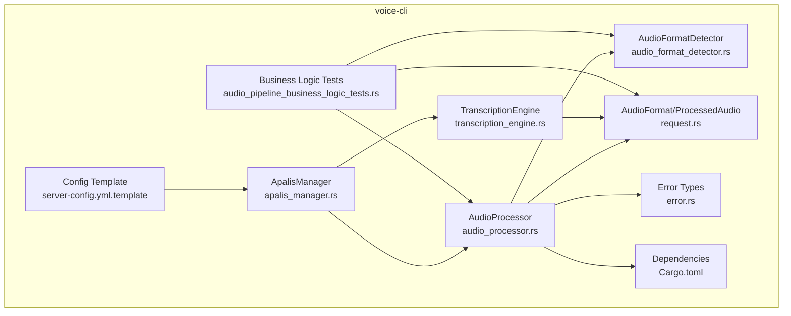
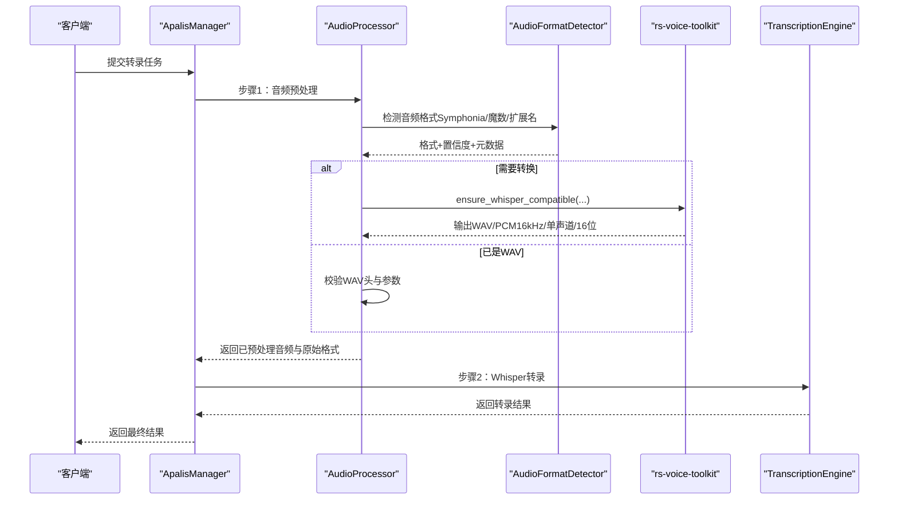
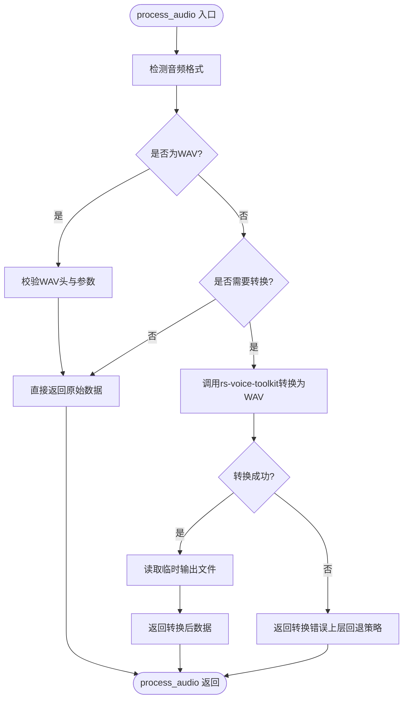
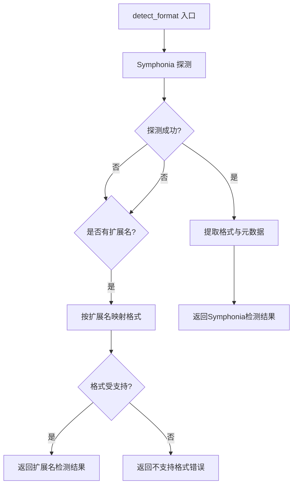
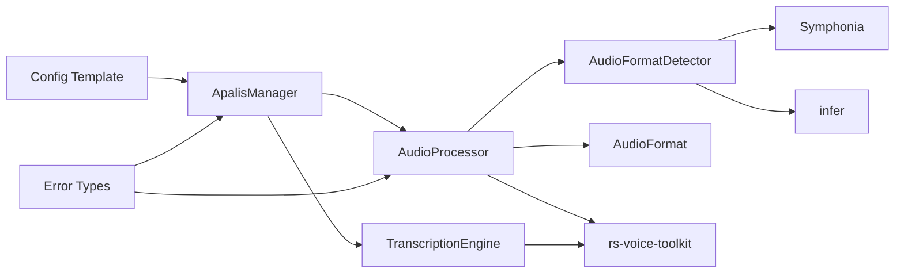

# 音频预处理

<cite>
**本文引用的文件**
- [audio_processor.rs](file://voice-cli/src/services/audio_processor.rs)
- [audio_format_detector.rs](file://voice-cli/src/services/audio_format_detector.rs)
- [request.rs](file://voice-cli/src/models/request.rs)
- [apalis_manager.rs](file://voice-cli/src/services/apalis_manager.rs)
- [transcription_engine.rs](file://voice-cli/src/services/transcription_engine.rs)
- [error.rs](file://voice-cli/src/error.rs)
- [server-config.yml.template](file://voice-cli/templates/server-config.yml.template)
- [audio_pipeline_business_logic_tests.rs](file://voice-cli/tests/audio_pipeline_business_logic_tests.rs)
- [Cargo.toml](file://voice-cli/Cargo.toml)
</cite>

## 目录
1. [简介](#简介)
2. [项目结构](#项目结构)
3. [核心组件](#核心组件)
4. [架构总览](#架构总览)
5. [详细组件分析](#详细组件分析)
6. [依赖关系分析](#依赖关系分析)
7. [性能考量](#性能考量)
8. [故障排查指南](#故障排查指南)
9. [结论](#结论)
10. [附录](#附录)

## 简介
本章节系统阐述 AudioProcessor 模块在语音转文字流程中的音频预处理能力，覆盖格式转码（WAV/PCM）、采样率重采样、声道归一化、音量标准化与噪声抑制等能力边界；说明其如何调用外部工具（如 rs-voice-toolkit）或原生 Rust 库实现高效处理；结合代码路径展示 preprocess 函数的调用链与参数配置；明确其在 Whisper 模型输入要求下的关键作用；并提供批量与流式处理的最佳实践建议。

## 项目结构
AudioProcessor 位于 voice-cli 子模块中，围绕以下关键文件协同工作：
- 音频预处理核心：audio_processor.rs
- 音频格式检测：audio_format_detector.rs
- 数据模型与格式枚举：request.rs
- 任务流水线与转录引擎：apalis_manager.rs、transcription_engine.rs
- 错误类型与响应映射：error.rs
- 配置模板：server-config.yml.template
- 测试用例：audio_pipeline_business_logic_tests.rs
- 依赖声明：Cargo.toml

图表来源
- [audio_processor.rs](file://voice-cli/src/services/audio_processor.rs#L1-L315)
- [audio_format_detector.rs](file://voice-cli/src/services/audio_format_detector.rs#L1-L326)
- [request.rs](file://voice-cli/src/models/request.rs#L160-L434)
- [apalis_manager.rs](file://voice-cli/src/services/apalis_manager.rs#L1200-L1548)
- [transcription_engine.rs](file://voice-cli/src/services/transcription_engine.rs#L1-L136)
- [server-config.yml.template](file://voice-cli/templates/server-config.yml.template#L1-L77)
- [error.rs](file://voice-cli/src/error.rs#L1-L167)
- [audio_pipeline_business_logic_tests.rs](file://voice-cli/tests/audio_pipeline_business_logic_tests.rs#L1-L433)
- [Cargo.toml](file://voice-cli/Cargo.toml#L53-L107)

章节来源
- [audio_processor.rs](file://voice-cli/src/services/audio_processor.rs#L1-L315)
- [audio_format_detector.rs](file://voice-cli/src/services/audio_format_detector.rs#L1-L326)
- [request.rs](file://voice-cli/src/models/request.rs#L160-L434)
- [apalis_manager.rs](file://voice-cli/src/services/apalis_manager.rs#L1200-L1548)
- [transcription_engine.rs](file://voice-cli/src/services/transcription_engine.rs#L1-L136)
- [server-config.yml.template](file://voice-cli/templates/server-config.yml.template#L1-L77)
- [error.rs](file://voice-cli/src/error.rs#L1-L167)
- [audio_pipeline_business_logic_tests.rs](file://voice-cli/tests/audio_pipeline_business_logic_tests.rs#L1-L433)
- [Cargo.toml](file://voice-cli/Cargo.toml#L53-L107)

## 核心组件
- AudioProcessor：负责检测音频格式、必要时进行转码（WAV/PCM）、验证 Whisper 兼容性（采样率、声道、位深），并返回处理后的音频数据与原始格式标记。
- AudioFormatDetector：基于 Symphonia 探测器优先、infer 魔数检测与文件扩展名回退的多层策略，输出格式、置信度与元数据。
- AudioFormat/ProcessedAudio：统一的格式枚举、元数据结构与处理结果封装。
- TranscriptionEngine/ApalisManager：将预处理后的音频接入 Whisper 转录流水线，支持异步任务与超时控制。
- 配置模板：定义支持的音频格式列表、自动转换开关、转换超时、临时文件清理策略、工作线程与任务队列等。

章节来源
- [audio_processor.rs](file://voice-cli/src/services/audio_processor.rs#L1-L315)
- [audio_format_detector.rs](file://voice-cli/src/services/audio_format_detector.rs#L1-L326)
- [request.rs](file://voice-cli/src/models/request.rs#L160-L434)
- [apalis_manager.rs](file://voice-cli/src/services/apalis_manager.rs#L1200-L1548)
- [transcription_engine.rs](file://voice-cli/src/services/transcription_engine.rs#L1-L136)
- [server-config.yml.template](file://voice-cli/templates/server-config.yml.template#L1-L77)

## 架构总览
AudioProcessor 在语音转文字流程中的关键位置如下：

图表来源
- [apalis_manager.rs](file://voice-cli/src/services/apalis_manager.rs#L1200-L1548)
- [audio_processor.rs](file://voice-cli/src/services/audio_processor.rs#L27-L184)
- [audio_format_detector.rs](file://voice-cli/src/services/audio_format_detector.rs#L27-L149)
- [transcription_engine.rs](file://voice-cli/src/services/transcription_engine.rs#L1-L136)

## 详细组件分析

### AudioProcessor 组件分析
- 功能职责
  - 输入：音频二进制数据与可选文件名
  - 输出：ProcessedAudio（包含数据、是否转换、原始格式字符串）
  - 关键流程：格式检测 → WAV校验（若已是WAV）→ 需转换则转码（WAV/PCM）→ Whisper 兼容性验证
- 转码实现
  - 使用 rs-voice-toolkit 的 ensure_whisper_compatible 进行转换，目标为 16kHz、单声道、16 位 PCM WAV
  - 若转换成功，读取临时输出文件并返回 Bytes
  - 若转换失败，记录告警并返回错误（用于上层回退策略）
- Whisper 兼容性验证
  - 对于 WAV：检查 RIFF/WAVE/fmt 块、采样率、声道数、位深
  - 非最优参数（非 16kHz、非单声道、非 16 位）仅发出警告，不强制报错
- 临时文件管理
  - 将输入数据写入临时文件，转换完成后读取输出文件
  - 支持移动或复制输出文件至期望路径，保证转换产物可达

图表来源
- [audio_processor.rs](file://voice-cli/src/services/audio_processor.rs#L27-L184)

章节来源
- [audio_processor.rs](file://voice-cli/src/services/audio_processor.rs#L1-L315)

### AudioFormatDetector 组件分析
- 检测策略
  - Symphonia 探测（优先）：解析媒体源，提取首个音频轨道的编解码器类型，映射为内部 AudioFormat
  - infer 魔数检测：对常见音频格式头部进行识别（如 MP3/WAV）
  - 文件扩展名回退：当探测失败且提供扩展名时，按扩展名映射格式
- 元数据提取
  - 采样率、声道数、位深、时长、比特率、编解码器信息
- 置信度与支持性
  - Symphonia 成功时置信度较高；扩展名回退置信度较低
  - 不支持的格式会抛出错误

图表来源
- [audio_format_detector.rs](file://voice-cli/src/services/audio_format_detector.rs#L27-L149)

章节来源
- [audio_format_detector.rs](file://voice-cli/src/services/audio_format_detector.rs#L1-L326)

### AudioFormat 与 ProcessedAudio 数据模型
- AudioFormat：统一枚举，覆盖常见音频与视频容器格式，支持 to_string、get_ffmpeg_input_format、requires_ffmpeg_conversion 等方法
- ProcessedAudio：封装处理后的音频数据、是否转换标志、原始格式字符串

章节来源
- [request.rs](file://voice-cli/src/models/request.rs#L160-L434)

### 任务流水线与转录引擎集成
- ApalisManager 将预处理与转录拆分为两个步骤，分别更新任务状态
- TranscriptionEngine 负责加载 Whisper 模型、复用 Transcriber 实例、执行转录并设置超时
- 预处理阶段结束后，任务对象携带处理后的音频路径、原始格式、模型与响应格式等信息

章节来源
- [apalis_manager.rs](file://voice-cli/src/services/apalis_manager.rs#L1200-L1548)
- [transcription_engine.rs](file://voice-cli/src/services/transcription_engine.rs#L1-L136)

## 依赖关系分析
- 外部工具与库
  - rs-voice-toolkit：核心转码与 Whisper 兼容性保障
  - ffmpeg-sidecar：用于 FFmpeg 命令封装（在格式检测与转换中作为后备方案）
  - Symphonia：媒体格式探测与元数据提取
  - infer：魔数字节检测
- 内部模块耦合
  - AudioProcessor 依赖 AudioFormatDetector 与 AudioFormat
  - ApalisManager 串联 AudioProcessor 与 TranscriptionEngine
  - 错误类型集中定义，便于统一响应映射

图表来源
- [audio_processor.rs](file://voice-cli/src/services/audio_processor.rs#L1-L315)
- [audio_format_detector.rs](file://voice-cli/src/services/audio_format_detector.rs#L1-L326)
- [apalis_manager.rs](file://voice-cli/src/services/apalis_manager.rs#L1200-L1548)
- [transcription_engine.rs](file://voice-cli/src/services/transcription_engine.rs#L1-L136)
- [server-config.yml.template](file://voice-cli/templates/server-config.yml.template#L1-L77)
- [error.rs](file://voice-cli/src/error.rs#L1-L167)
- [Cargo.toml](file://voice-cli/Cargo.toml#L53-L107)

章节来源
- [Cargo.toml](file://voice-cli/Cargo.toml#L53-L107)

## 性能考量
- 转码路径选择
  - 优先使用 rs-voice-toolkit 进行转换，避免额外进程开销
  - 当 rs-voice-toolkit 失败时，可结合 ffmpeg-sidecar 进行 FFmpeg 调用（由格式检测与转换逻辑决定）
- I/O 与内存
  - 采用临时文件进行中间存储，避免大内存拷贝
  - 配置模板提供转换超时与临时文件保留策略，降低资源占用
- 并发与吞吐
  - 通过任务队列与工作线程池（Apalis/Workers）提升并发处理能力
  - TranscriptionEngine 复用 Transcriber 实例，减少模型加载成本

章节来源
- [audio_processor.rs](file://voice-cli/src/services/audio_processor.rs#L88-L184)
- [server-config.yml.template](file://voice-cli/templates/server-config.yml.template#L34-L77)
- [transcription_engine.rs](file://voice-cli/src/services/transcription_engine.rs#L1-L136)

## 故障排查指南
- 常见错误与定位
  - 不支持的音频格式：格式检测失败或未知编解码器
  - 音频探测错误：Symphonia 探测异常
  - 转换失败：rs-voice-toolkit 转换失败或临时文件读写异常
  - 临时文件错误：创建/写入/移动/复制失败
- 错误映射与响应
  - 统一映射为 HTTP 状态码与错误体，便于前端与运维定位
- 回退策略
  - rs-voice-toolkit 转换失败时，记录告警并返回错误，上层可触发 FFmpeg 转换或提示用户调整输入
  - 任务管理器对可恢复错误进行重试与状态持久化

章节来源
- [error.rs](file://voice-cli/src/error.rs#L1-L167)
- [audio_processor.rs](file://voice-cli/src/services/audio_processor.rs#L116-L184)
- [apalis_manager.rs](file://voice-cli/src/services/apalis_manager.rs#L1518-L1548)

## 结论
AudioProcessor 以“格式检测 + rs-voice-toolkit 转码 + Whisper 兼容性验证”为核心，确保输入音频满足 Whisper 的采样率、声道与位深要求。通过多层检测策略与错误回退机制，系统在复杂场景下仍能稳定运行。配合任务流水线与转录引擎，形成从预处理到转录的完整链路。

## 附录

### 支持的转换配置与参数
- 支持格式列表（来自配置模板）：mp3、wav、flac、m4a、ogg、aac、opus、amr、wma、aiff、caf、mp4、mov、avi、mkv、webm、3gp、flv、wmv、mpeg、mxf
- 自动转换开关：auto_convert
- 转换超时：conversion_timeout（秒）
- 临时文件清理与保留：temp_file_cleanup、temp_file_retention（秒）
- 工作线程与队列：transcription_workers、channel_buffer_size、worker_timeout

章节来源
- [server-config.yml.template](file://voice-cli/templates/server-config.yml.template#L34-L77)

### 预处理函数调用链与参数配置（代码路径）
- preprocess（process_audio）入口与参数
  - 入口：[process_audio](file://voice-cli/src/services/audio_processor.rs#L27-L67)
  - 参数：audio_data（Bytes）、filename（Option<&str>）
  - 返回：ProcessedAudio
- 格式检测
  - [detect_format](file://voice-cli/src/services/audio_format_detector.rs#L27-L65)
  - [symphonia_probe](file://voice-cli/src/services/audio_format_detector.rs#L67-L109)
  - [extract_format_info](file://voice-cli/src/services/audio_format_detector.rs#L110-L149)
- 转码与验证
  - [convert_to_whisper_format](file://voice-cli/src/services/audio_processor.rs#L88-L132)
  - [convert_with_rs_voice_toolkit](file://voice-cli/src/services/audio_processor.rs#L134-L184)
  - [validate_whisper_format](file://voice-cli/src/services/audio_processor.rs#L209-L275)
- 任务流水线与转录
  - [audio_preprocessing_step](file://voice-cli/src/services/apalis_manager.rs#L1200-L1302)
  - [transcription_step](file://voice-cli/src/services/apalis_manager.rs#L1304-L1320)
  - [TranscriptionEngine::transcribe_file](file://voice-cli/src/services/transcription_engine.rs#L80-L126)

### 批量处理与流式处理最佳实践
- 批量处理
  - 使用任务队列与工作线程池（Apalis/Workers）提升吞吐
  - 控制单任务最大文件大小与转换超时，避免资源耗尽
  - 对转换失败的任务启用有限重试与失败告警
- 流式处理
  - 若上游支持，可在接收音频流的同时进行格式检测与预缓冲
  - 对于实时场景，建议先进行格式检测与必要转换，再提交到转录引擎，避免重复 I/O

章节来源
- [apalis_manager.rs](file://voice-cli/src/services/apalis_manager.rs#L1200-L1548)
- [server-config.yml.template](file://voice-cli/templates/server-config.yml.template#L34-L77)