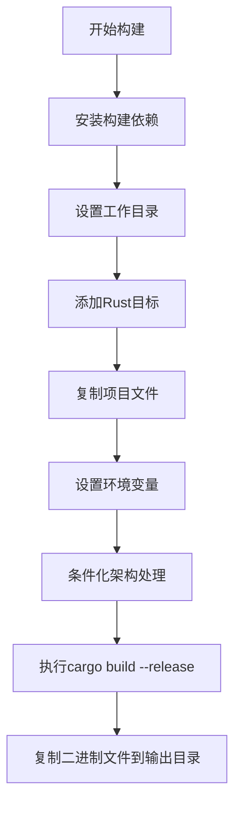
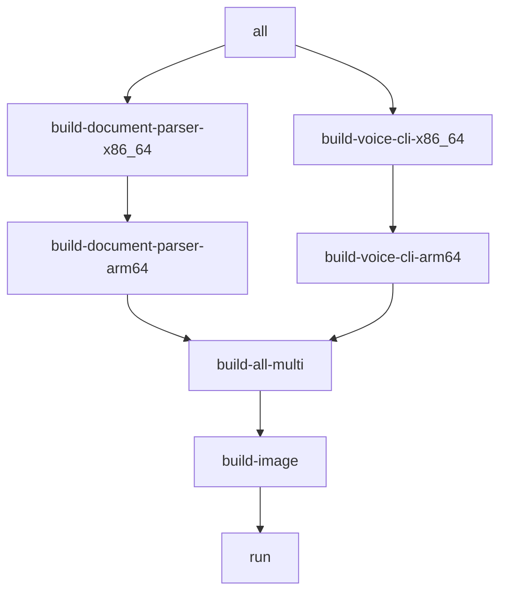

# Docker部署

<cite>
**本文档引用的文件**
- [Dockerfile](file://Dockerfile)
- [Makefile](file://Makefile)
- [document-parser/Cargo.toml](file://document-parser/Cargo.toml)
- [mcp-proxy/Cargo.toml](file://mcp-proxy/Cargo.toml)
- [document-parser/fixtures/test_config.yml](file://document-parser/fixtures/test_config.yml)
</cite>

## 目录
1. [简介](#简介)
2. [项目结构](#项目结构)
3. [Docker镜像构建](#docker镜像构建)
4. [多阶段构建详解](#多阶段构建详解)
5. [Makefile构建系统](#makefile构建系统)
6. [跨平台构建策略](#跨平台构建策略)
7. [镜像优化建议](#镜像优化建议)
8. [构建故障排查](#构建故障排查)

## 简介
本指南详细说明了如何使用Docker和Makefile系统构建和部署mcp-proxy项目。项目包含两个核心服务：document-parser（文档解析服务）和voice-cli（语音CLI工具），均通过Rust编写并使用多阶段Docker构建实现高效部署。

**Section sources**
- [README.md](file://README.md#L0-L41)

## 项目结构
项目采用模块化设计，主要包含以下组件：
- **document-parser**: 高性能文档解析服务，支持多种格式转换为结构化Markdown
- **mcp-proxy**: MCP代理服务，支持通过SSE协议与客户端通信
- **oss-client**: 对象存储客户端，支持阿里云OSS集成
- **voice-cli**: 语音处理CLI工具
- **scripts**: 服务管理脚本

构建系统通过Dockerfile和Makefile协同工作，实现跨平台编译和部署。

**Section sources**
- [Dockerfile](file://Dockerfile#L0-L78)
- [Makefile](file://Makefile#L0-L175)

## Docker镜像构建
项目使用多阶段Docker构建策略，确保构建环境完整且运行时镜像最小化。

### 构建阶段（builder）
构建阶段基于`rust:1.85`基础镜像，安装了完整的构建工具链：
- Rust工具链（包括bindgen所需的libclang）
- C/C++开发环境（gcc, g++, make）
- 构建工具（cmake, pkg-config）
- SSL支持库



**Diagram sources**
- [Dockerfile](file://Dockerfile#L1-L50)

### 运行阶段（runtime）
运行阶段使用`scratch`基础镜像，仅包含编译好的二进制文件，实现最小化部署：
- `runtime`阶段：包含document-parser服务
- `runtime-voice-cli`阶段：包含voice-cli工具
- `export`阶段：用于提取所有二进制文件

**Section sources**
- [Dockerfile](file://Dockerfile#L52-L78)

## 多阶段构建详解
Dockerfile采用多阶段构建优化策略，分离构建环境和运行环境。

### 构建依赖管理
构建阶段通过以下方式优化依赖缓存：
```dockerfile
# 安装系统级依赖
RUN apt-get update && apt-get install -y \
    pkg-config \
    libssl-dev \
    build-essential \
    cmake \
    libclang-dev \
    clang \
    && rm -rf /var/lib/apt/lists/*
```
这种模式确保系统依赖在Docker层缓存中独立，避免因代码变更导致依赖重新安装。

### 架构适配
构建过程支持x86_64和ARM64双架构：
```dockerfile
ARG TARGETARCH
RUN if [ "$TARGETARCH" = "arm64" ]; then \
        apt-get update && apt-get install -y gcc-aarch64-linux-gnu g++-aarch64-linux-gnu && \
    else \
        echo "Building for x86_64 architecture..." && \
    fi
```
根据`TARGETARCH`参数动态调整编译工具链。

### 二进制文件复制
构建完成后，根据目标架构复制相应的二进制文件：
```dockerfile
RUN mkdir -p /output && \
    if [ "$TARGETARCH" = "arm64" ]; then \
        cp target/aarch64-unknown-linux-gnu/release/document-parser /output/ && \
        cp target/aarch64-unknown-linux-gnu/release/voice-cli /output/; \
    else \
        cp target/x86_64-unknown-linux-gnu/release/document-parser /output/ && \
        cp target/x86_64-unknown-linux-gnu/release/voice-cli /output/; \
    fi
```

**Section sources**
- [Dockerfile](file://Dockerfile#L1-L78)

## Makefile构建系统
Makefile提供了高级构建接口，封装了复杂的Docker Buildx命令。

### 核心构建目标
Makefile定义了多层次的构建目标：



### 构建函数
使用通用构建函数实现代码复用：
```makefile
define build_target
	@echo "🚀 构建 $(1) $(2) 版本..."
	@git pull
	@mkdir -p $(3)
	docker buildx build --platform $(4) --target export --output type=local,dest=$(3) .
	@echo "✅ $(1) $(2) 版本构建完成"
endef
```

### CI/CD集成
Makefile目标在CI/CD流程中的作用：
- `check-buildx`: 验证构建环境
- `setup-buildx`: 配置跨平台构建器
- `build-image`: 构建运行时镜像
- `run`: 本地运行服务
- `clean`: 清理构建产物

**Section sources**
- [Makefile](file://Makefile#L0-L175)

## 跨平台构建策略
项目支持x86_64和ARM64架构的跨平台构建。

### 构建目标分类
| 目标 | 描述 | 输出目录 |
|------|------|----------|
| build-document-parser-x86_64 | 构建document-parser x86_64版本 | ./dist/document-parser-x86_64 |
| build-document-parser-arm64 | 构建document-parser ARM64版本 | ./dist/document-parser-arm64 |
| build-voice-cli-x86_64 | 构建voice-cli x86_64版本 | ./dist/voice-cli-x86_64 |
| build-voice-cli-arm64 | 构建voice-cli ARM64版本 | ./dist/voice-cli-arm64 |

### 构建流程
1. 拉取最新代码
2. 创建输出目录
3. 使用Docker Buildx进行跨平台构建
4. 输出二进制文件到指定目录

**Section sources**
- [Makefile](file://Makefile#L0-L175)

## 镜像优化建议
### Rust优化级别自定义
可通过修改Dockerfile中的cargo命令来自定义优化级别：
```dockerfile
# 使用LTO优化
RUN cargo build --release --config 'profile.release.lto = "fat"'
```

### 镜像轻量化
1. **使用Alpine基础镜像**：可进一步减小构建镜像大小
2. **二进制strip**：移除调试符号
3. **多阶段精简**：仅复制必要文件

### 构建缓存优化
- 将依赖安装与代码复制分离
- 使用.dockerignore排除不必要的文件
- 利用Buildx缓存机制

**Section sources**
- [Dockerfile](file://Dockerfile#L1-L78)
- [Makefile](file://Makefile#L0-L175)

## 构建故障排查
### 常见问题及解决方案
| 问题 | 可能原因 | 解决方案 |
|------|----------|----------|
| 构建依赖安装失败 | 网络问题或包名错误 | 检查apt源配置，更新包列表 |
| Cargo构建失败 | 依赖解析问题 | 运行`cargo clean`后重试 |
| 跨平台构建失败 | Buildx配置问题 | 运行`make check-buildx`和`make setup-buildx` |
| 二进制文件缺失 | 架构匹配错误 | 确认TARGETARCH参数正确 |

### 调试技巧
1. **分阶段调试**：使用`docker build --target builder`单独构建构建阶段
2. **交互式调试**：进入构建容器排查问题
   ```bash
   docker run -it --entrypoint /bin/bash <builder-image>
   ```
3. **日志分析**：关注Makefile中的详细输出信息

### 环境验证
使用以下命令验证构建环境：
```bash
make check-buildx
make setup-buildx
```

**Section sources**
- [Makefile](file://Makefile#L0-L175)
- [Dockerfile](file://Dockerfile#L1-L78)