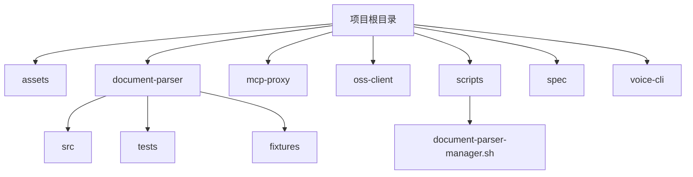
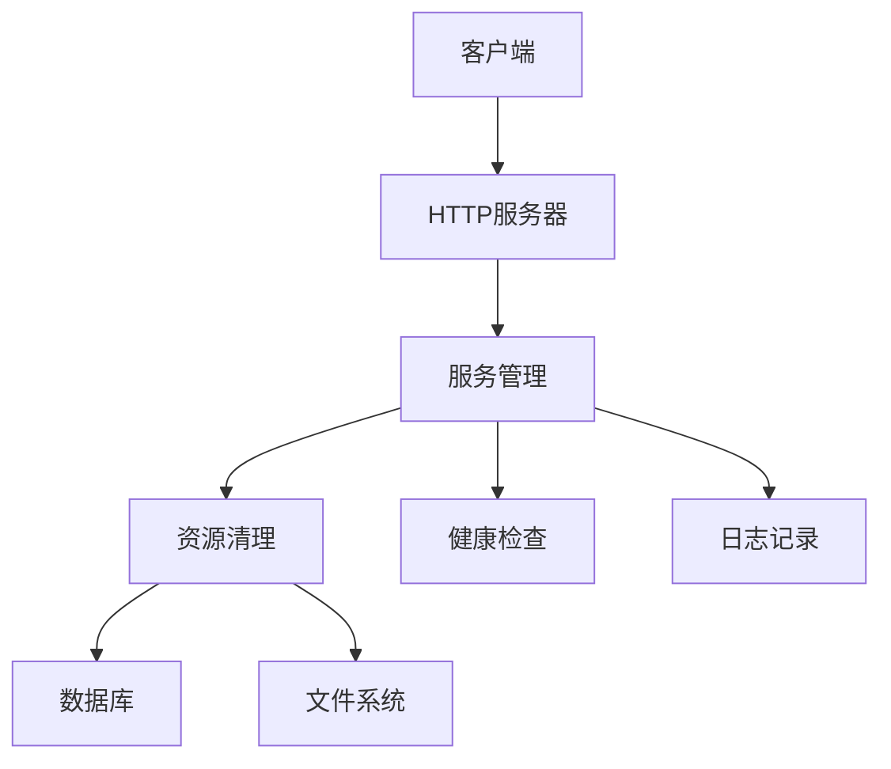
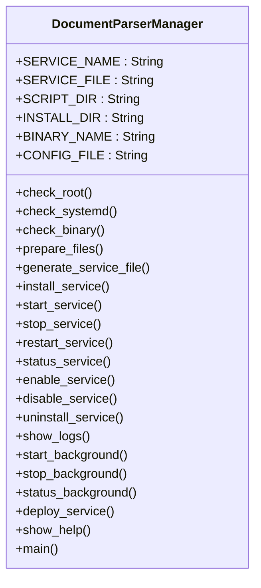
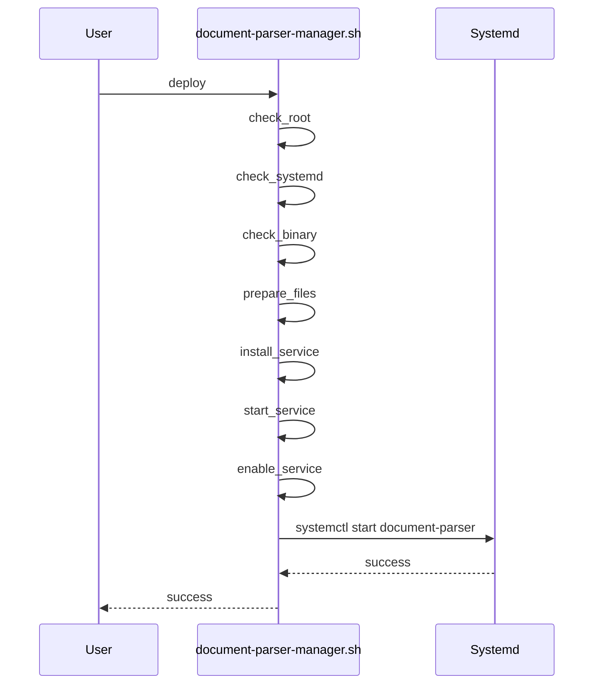
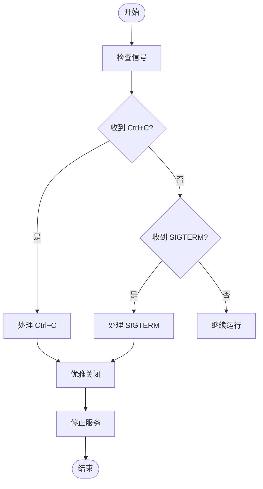
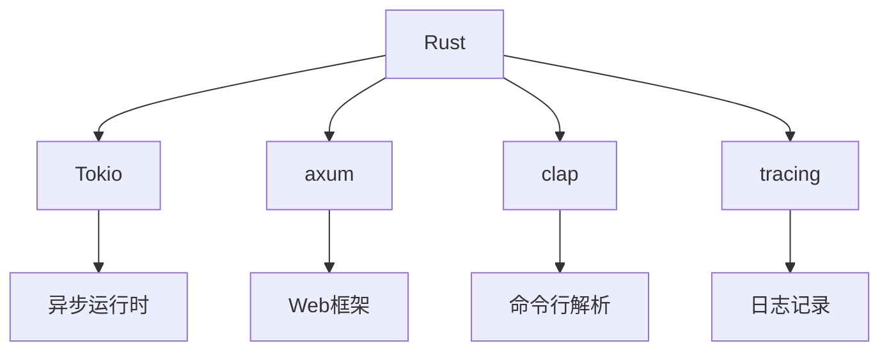

# 服务管理与运维脚本

<cite>
**本文档引用的文件**
- [document-parser-manager.sh](file://scripts/document-parser-manager.sh)
- [main.rs](file://document-parser/src/main.rs)
- [graceful_shutdown.rs](file://document-parser/src/production/graceful_shutdown.rs)
</cite>

## 目录
1. [简介](#简介)
2. [项目结构](#项目结构)
3. [核心组件](#核心组件)
4. [架构概述](#架构概述)
5. [详细组件分析](#详细组件分析)
6. [依赖分析](#依赖分析)
7. [性能考虑](#性能考虑)
8. [故障排除指南](#故障排除指南)
9. [结论](#结论)

## 简介
本指南详细介绍了 `scripts/document-parser-manager.sh` 脚本的功能实现，涵盖服务启停、状态检查、日志输出和错误处理机制。文档结合 `main.rs` 中的信号处理逻辑，解释了 SIGTERM 信号的捕获与响应机制。提供了日常运维命令示例，如批量重启、配置重载和版本检查，并介绍了如何扩展脚本以支持新子服务的集成管理。

## 项目结构
项目结构包含多个核心组件，包括 `document-parser`、`mcp-proxy`、`oss-client` 和 `voice-cli`。每个组件都有其特定的源代码、测试和配置文件。`scripts` 目录包含管理脚本，用于服务的部署和维护。

**图源**
- [document-parser-manager.sh](file://scripts/document-parser-manager.sh)
- [main.rs](file://document-parser/src/main.rs)

## 核心组件
`document-parser-manager.sh` 脚本提供了服务管理的核心功能，包括部署、安装、启动、停止、重启、状态检查、启用、禁用、卸载、日志查看和帮助。脚本通过 `systemd` 管理服务，并支持后台启动和停止。

**节源**
- [document-parser-manager.sh](file://scripts/document-parser-manager.sh#L1-L100)

## 架构概述
系统架构基于 `Rust` 和 `Tokio` 构建，使用 `axum` 作为 Web 框架。服务通过 `systemd` 管理，支持优雅启动和关闭。信号处理机制确保服务在接收到 `SIGTERM` 或 `Ctrl+C` 信号时能够优雅地关闭。

**图源**
- [main.rs](file://document-parser/src/main.rs#L1-L50)
- [graceful_shutdown.rs](file://document-parser/src/production/graceful_shutdown.rs#L1-L20)

## 详细组件分析

### 服务管理脚本分析
`document-parser-manager.sh` 脚本通过 `systemd` 管理服务，支持多种操作，如部署、安装、启动、停止、重启、状态检查、启用、禁用、卸载、日志查看和帮助。脚本动态生成服务文件，并确保服务的正确安装和配置。

#### 服务管理脚本类图

**图源**
- [document-parser-manager.sh](file://scripts/document-parser-manager.sh#L1-L657)

#### 服务启动序列图

**图源**
- [document-parser-manager.sh](file://scripts/document-parser-manager.sh#L1-L657)

### 信号处理机制分析
`main.rs` 文件中的信号处理逻辑确保服务在接收到 `SIGTERM` 或 `Ctrl+C` 信号时能够优雅地关闭。信号处理机制通过 `tokio::signal` 实现，支持 `Unix` 和 `Windows` 平台。

#### 信号处理流程图

**图源**
- [main.rs](file://document-parser/src/main.rs#L1099-L1112)

## 依赖分析
项目依赖包括 `Rust` 标准库、`Tokio`、`axum`、`clap`、`tracing` 等。`Cargo.toml` 文件定义了所有依赖项，确保项目的可维护性和可扩展性。

**图源**
- [Cargo.toml](file://document-parser/Cargo.toml#L59-L120)

## 性能考虑
服务的性能考虑包括资源限制、并发处理和超时管理。`systemd` 服务文件中定义了 `LimitNOFILE` 和 `LimitNPROC`，确保服务不会耗尽系统资源。`Tokio` 的异步任务管理确保高并发下的性能。

## 故障排除指南
故障排除指南提供了常见问题的解决方案，包括环境检查、依赖安装、网络问题和系统环境问题。用户可以通过 `document-parser check` 命令检查环境状态，并通过 `document-parser troubleshoot` 获取详细故障排除指南。

**节源**
- [main.rs](file://document-parser/src/main.rs#L1099-L1112)
- [TROUBLESHOOTING.md](file://document-parser/TROUBLESHOOTING.md#L531-L560)

## 结论
`document-parser-manager.sh` 脚本提供了全面的服务管理功能，结合 `main.rs` 中的信号处理逻辑，确保服务的优雅启动和关闭。通过 `systemd` 管理服务，支持多种运维操作，确保系统的稳定性和可靠性。