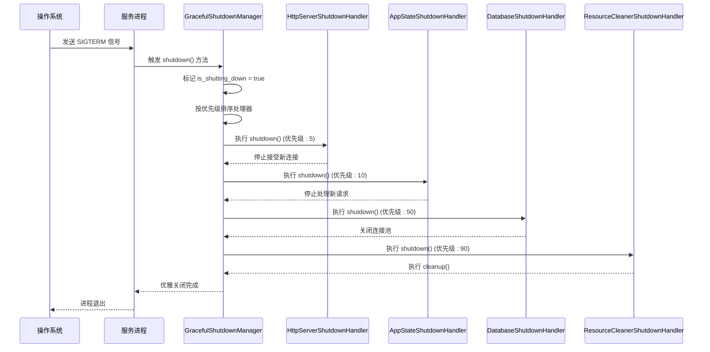
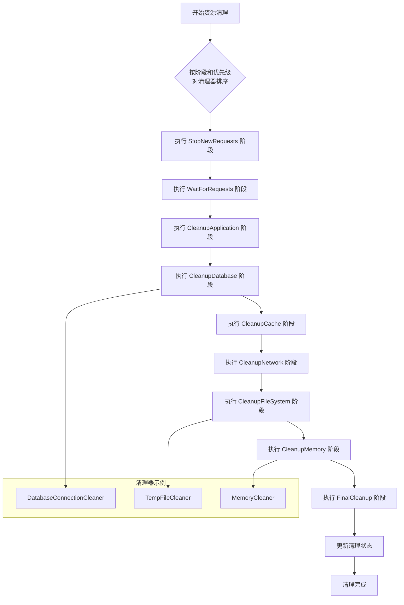
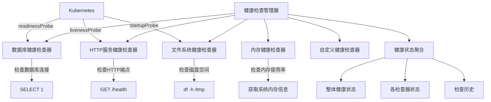

# 生产环境优化

<cite>
**本文档引用的文件**   
- [graceful_shutdown.rs](file://document-parser/src/production/graceful_shutdown.rs)
- [resource_cleanup.rs](file://document-parser/src/production/resource_cleanup.rs)
- [deployment_health.rs](file://document-parser/src/production/deployment_health.rs)
- [alerting.rs](file://document-parser/src/utils/alerting.rs)
- [mod.rs](file://document-parser/src/production/mod.rs)
</cite>

## 目录
1. [引言](#引言)
2. [优雅关闭机制](#优雅关闭机制)
3. [资源清理策略](#资源清理策略)
4. [健康检查设计](#健康检查设计)
5. [告警系统配置](#告警系统配置)
6. [系统资源管理](#系统资源管理)
7. [结论](#结论)

## 引言

本文档旨在为生产环境提供全面的优化实践指南，重点介绍文档解析服务中的关键生产特性。文档详细阐述了优雅关闭机制、资源清理策略、健康检查设计、告警系统配置以及系统资源管理的最佳实践。通过深入分析核心模块的实现原理，为运维人员和开发人员提供可靠的操作指导，确保系统在生产环境中的稳定性、可靠性和可维护性。

## 优雅关闭机制

文档解析服务通过 `graceful_shutdown.rs` 模块实现了完善的优雅关闭机制。该机制确保在服务停止时，所有正在进行的请求能够正常完成，所有资源能够得到正确释放，从而避免数据丢失和资源泄漏。

优雅关闭管理器（`GracefulShutdownManager`）是该机制的核心组件，它通过以下方式实现优雅关闭：

1.  **信号处理**：管理器注册了对 `SIGTERM` 和 `SIGINT` 信号的监听。当接收到这些信号时，会触发优雅关闭流程，而不是立即终止进程。
2.  **连接 draining**：在关闭流程启动后，系统会立即停止接受新的连接和请求，但允许所有已建立的连接和正在处理的请求继续执行，直到它们自然完成。
3.  **有序的资源释放**：关闭过程按照预定义的优先级顺序执行一系列关闭处理器（`ShutdownHandler`）。这种有序的释放确保了依赖关系的正确处理，例如先停止HTTP服务器，再清理应用状态，最后关闭数据库连接。
4.  **超时与强制关闭**：每个关闭处理器都有一个超时时间（默认30秒）。如果处理器在超时时间内未能完成，系统会尝试执行其强制关闭逻辑，以防止关闭过程无限期挂起。

**图表来源**
- [graceful_shutdown.rs](file://document-parser/src/production/graceful_shutdown.rs#L1-L522)

**本节来源**
- [graceful_shutdown.rs](file://document-parser/src/production/graceful_shutdown.rs#L1-L522)

## 资源清理策略

`resource_cleanup.rs` 模块负责在应用关闭时执行全面的资源清理工作，确保所有临时资源被释放，系统状态被正确重置。

资源清理管理器（`ResourceCleanupManager`）采用了一种结构化和可配置的清理策略：

1.  **分阶段清理**：清理过程被划分为多个逻辑阶段（`CleanupPhase`），如 `StopNewRequests`、`WaitForRequests`、`CleanupDatabase`、`CleanupFileSystem` 和 `CleanupMemory`。这种分阶段的方式使得清理逻辑更加清晰和可控。
2.  **临时文件清理**：通过 `TempFileCleaner` 清理器，系统会扫描配置的临时目录（如 `/tmp`, `/var/tmp`），根据文件保留时间、文件大小和文件模式（如 `*.tmp`）来识别并删除过期的临时文件。
3.  **连接池关闭**：`DatabaseConnectionCleaner` 负责优雅地关闭数据库连接池，确保所有正在进行的事务能够完成，然后释放所有连接资源。
4.  **状态持久化与内存清理**：`MemoryCleaner` 清理器在配置启用时，会执行强制垃圾回收、清理应用缓存和释放未使用的内存，以减少进程退出时的内存占用。
5.  **并发与重试**：清理器支持并发执行以提高效率，并具备重试机制。如果某个清理步骤失败，系统会根据配置的重试次数和间隔进行重试，若仍失败则尝试强制清理。

**图表来源**
- [resource_cleanup.rs](file://document-parser/src/production/resource_cleanup.rs#L1-L785)

**本节来源**
- [resource_cleanup.rs](file://document-parser/src/production/resource_cleanup.rs#L1-L785)

## 健康检查设计

`deployment_health.rs` 模块提供了全面的健康检查功能，这对于在Kubernetes等容器编排平台中部署至关重要。

健康检查管理器（`HealthCheckManager`）的设计支持三种标准的健康检查类型：

1.  **启动检查 (Startup Check)**：用于确定应用是否已成功启动。在应用启动后，会执行初始延迟，然后开始定期检查。只有当启动检查通过后，就绪和存活检查才会开始。这确保了应用在完全初始化之前不会被标记为就绪。
2.  **就绪检查 (Readiness Check)**：用于确定应用实例是否准备好接收流量。如果就绪检查失败，Kubernetes会将该实例从服务的负载均衡池中移除，但不会重启它。这适用于应用需要短暂时间来加载数据或恢复连接的场景。
3.  **存活检查 (Liveness Check)**：用于确定应用实例是否仍在运行。如果存活检查失败，Kubernetes会认为该实例已“死亡”，并自动重启该Pod。这可以处理应用卡死或陷入无限循环等严重故障。

健康检查端点的设计允许通过HTTP请求来查询应用的健康状态。在Kubernetes中，这些端点可以被配置为探针（Probes），从而实现自动化的滚动更新、故障恢复和流量管理。

**图表来源**
- [deployment_health.rs](file://document-parser/src/production/deployment_health.rs#L1-L749)

**本节来源**
- [deployment_health.rs](file://document-parser/src/production/deployment_health.rs#L1-L749)

## 告警系统配置

`alerting.rs` 模块实现了灵活的告警系统，用于监控关键异常事件并及时通知相关人员。

告警系统的核心组件包括：

1.  **告警规则 (AlertRule)**：定义了触发告警的条件。规则可以基于健康检查结果（如 `HealthStatusEquals(Unhealthy)`）、性能指标（如 `ResponseTimeExceeds(5000)`）或自定义条件（如 `DetailContains("error_code", "DB_CONN_TIMEOUT")`）来创建。每个规则都有一个级别（Info, Warning, Critical, Emergency）和一个冷却时间，以防止告警风暴。
2.  **告警事件 (AlertEvent)**：当规则匹配时，会生成一个告警事件。事件包含规则ID、级别、消息、详细信息和时间戳。当问题解决时，系统会生成一个对应的解决事件。
3.  **告警通知器 (AlertNotifier)**：负责将告警事件发送到不同的通知渠道。系统支持多种通知器：
    *   **日志通知器 (LogAlertNotifier)**：将告警信息记录到结构化日志中，便于后续分析和审计。
    *   **控制台通知器 (ConsoleAlertNotifier)**：在控制台输出彩色的告警信息，方便开发和调试。
    *   **Webhook通知器 (WebhookAlertNotifier)**：通过HTTP POST请求将告警事件发送到外部系统，如企业微信、钉钉或Slack。

通过组合不同的规则和通知器，可以构建出满足不同需求的告警策略。例如，可以配置一个Critical级别的规则，当数据库连接失败时，同时通过Webhook通知运维团队，并在日志中记录详细信息。

**本节来源**
- [alerting.rs](file://document-parser/src/utils/alerting.rs#L1-L799)

## 系统资源管理

为了确保生产环境的稳定运行，需要对系统资源进行合理的限制和管理。

1.  **CPU和内存限制**：
    *   **CPU限制**：建议在Kubernetes的Pod配置中设置CPU `requests` 和 `limits`。`requests` 保证了应用的最低CPU资源，而 `limits` 防止应用消耗过多CPU影响其他服务。对于此文档解析服务，可以根据负载测试结果设置一个合理的值，例如 `500m` 的request和 `1000m` 的limit。
    *   **内存限制**：同样需要设置内存的 `requests` 和 `limits`。内存 `limits` 尤为重要，因为当进程内存使用超过limit时，会被操作系统直接终止（OOM Killed）。应根据应用的峰值内存使用情况设置一个安全的limit，并结合 `resource_cleanup.rs` 中的内存清理功能来优化内存使用。

2.  **水平扩展时的状态管理**：
    *   该文档解析服务被设计为无状态（Stateless）服务。所有临时文件的处理都在单个Pod的生命周期内完成，不依赖于本地持久化存储。
    *   任务队列和状态存储在外部服务（如Redis或数据库）中，因此在水平扩展（增加Pod副本数）时，新的Pod实例可以立即从队列中获取任务并开始处理，而不会丢失任何状态。
    *   健康检查（`deployment_health.rs`）确保了只有健康的Pod才会接收流量，从而保证了扩展过程的平滑性。

**本节来源**
- [mod.rs](file://document-parser/src/production/mod.rs#L1-L390)

## 结论

本文档详细阐述了文档解析服务在生产环境中的关键优化实践。通过 `graceful_shutdown.rs` 实现的优雅关闭机制，确保了服务在重启或升级时的平稳过渡。`resource_cleanup.rs` 提供了全面的资源清理策略，保障了系统的长期稳定运行。`deployment_health.rs` 设计的健康检查端点，为Kubernetes环境下的自动化运维提供了坚实基础。`alerting.rs` 构建的告警系统，则能及时发现并通知关键异常，提升系统的可观测性。最后，合理的系统资源限制和无状态的设计，使得服务能够安全、高效地进行水平扩展。综合运用这些实践，可以显著提升服务的生产环境质量和可靠性。