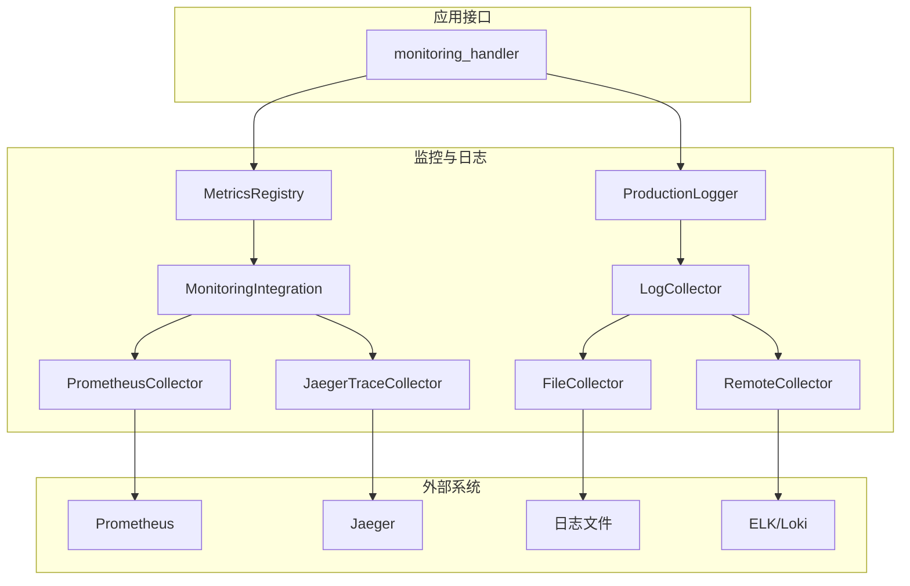
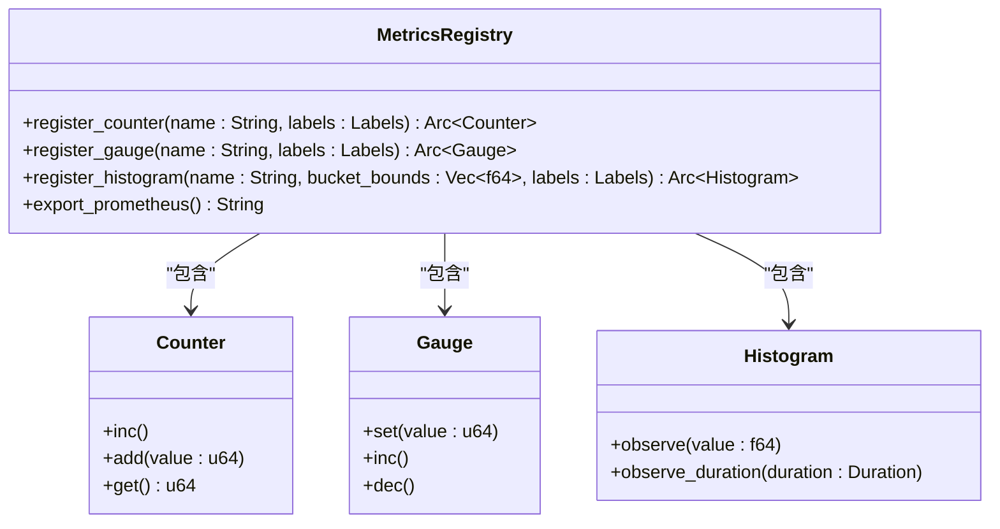
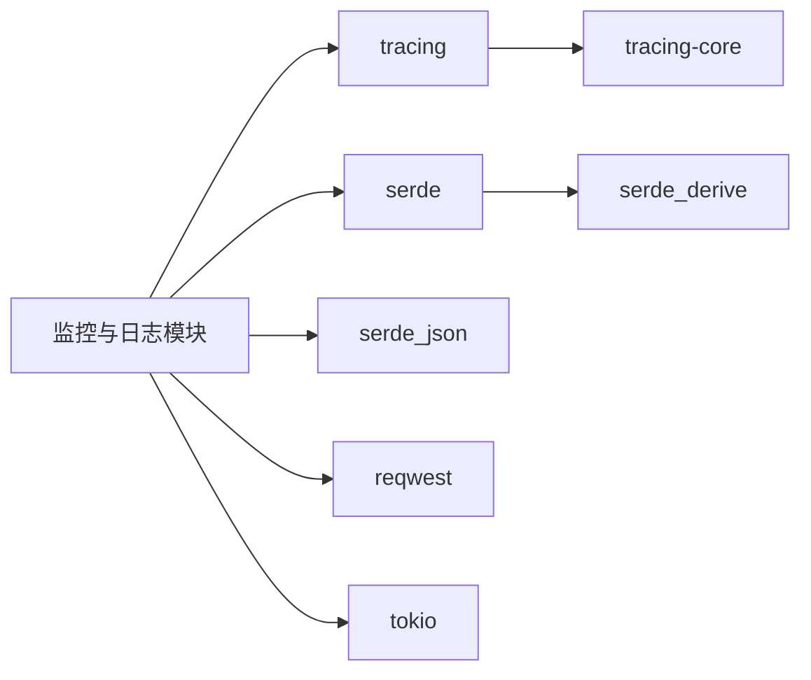

# 监控与日志

<cite>
**本文档中引用的文件**  
- [production_logging.rs](file://document-parser/src/production/production_logging.rs)
- [metrics.rs](file://document-parser/src/utils/metrics.rs)
- [monitoring_handler.rs](file://document-parser/src/handlers/monitoring_handler.rs)
- [monitoring_integration.rs](file://document-parser/src/production/monitoring_integration.rs)
</cite>

## 目录
1. [简介](#简介)
2. [项目结构](#项目结构)
3. [核心组件](#核心组件)
4. [架构概述](#架构概述)
5. [详细组件分析](#详细组件分析)
6. [依赖分析](#依赖分析)
7. [性能考虑](#性能考虑)
8. [故障排除指南](#故障排除指南)
9. [结论](#结论)

## 简介
本文档详细说明了如何在 `mcp-proxy` 项目中实现全面的监控与日志记录功能。重点涵盖通过 Prometheus 暴露应用指标、使用 OpenTelemetry 或 tracing 框架进行分布式追踪、配置结构化日志输出以及集中式日志收集等关键方面。文档旨在为开发人员和运维团队提供清晰的指导，以确保系统的可观测性和稳定性。

## 项目结构
项目中的监控与日志功能主要分布在 `document-parser` 子模块中，具体位于 `src/production` 和 `src/utils` 目录下。`production` 目录包含生产环境专用的 `production_logging.rs` 和 `monitoring_integration.rs` 文件，分别负责日志管理和监控集成。`utils` 目录下的 `metrics.rs` 文件定义了核心的指标类型和注册表。相关的处理逻辑则由 `handlers` 目录下的 `monitoring_handler.rs` 文件提供，它暴露了用于健康检查和指标获取的 HTTP 端点。

**Section sources**
- [production_logging.rs](file://document-parser/src/production/production_logging.rs)
- [metrics.rs](file://document-parser/src/utils/metrics.rs)
- [monitoring_handler.rs](file://document-parser/src/handlers/monitoring_handler.rs)
- [monitoring_integration.rs](file://document-parser/src/production/monitoring_integration.rs)

## 核心组件
本系统的核心监控与日志组件包括：`ProductionLogger` 用于管理生产环境日志，`MetricsRegistry` 作为所有指标的中央注册表，`MonitoringIntegration` 负责与外部监控系统（如 Prometheus 和 Jaeger）的集成，以及 `monitoring_handler` 提供的 REST API 端点用于暴露健康状态和指标数据。

**Section sources**
- [production_logging.rs](file://document-parser/src/production/production_logging.rs#L1-L740)
- [metrics.rs](file://document-parser/src/utils/metrics.rs#L1-L799)
- [monitoring_integration.rs](file://document-parser/src/production/monitoring_integration.rs#L1-L754)

## 架构概述
系统采用分层架构来实现监控与日志功能。在最底层，`metrics.rs` 提供了定义和注册各种指标（计数器、仪表、直方图等）的基础能力。上层的 `MonitoringIntegration` 模块利用这些指标，通过不同的收集器（如 `PrometheusCollector`）将数据推送到外部监控系统。日志方面，`ProductionLogger` 负责收集、过滤和格式化日志条目，并将其发送到多个目标（如文件、远程服务）。最后，`monitoring_handler` 作为对外接口，允许 Prometheus 等工具抓取指标，并提供健康检查端点。



**Diagram sources**
- [metrics.rs](file://document-parser/src/utils/metrics.rs#L1-L799)
- [monitoring_integration.rs](file://document-parser/src/production/monitoring_integration.rs#L1-L754)
- [production_logging.rs](file://document-parser/src/production/production_logging.rs#L1-L740)
- [monitoring_handler.rs](file://document-parser/src/handlers/monitoring_handler.rs#L1-L356)

## 详细组件分析

### 指标注册与采集机制
`metrics.rs` 文件定义了 `MetricsRegistry`，它是所有自定义指标的注册中心。应用通过调用 `register_counter`、`register_gauge` 等方法来注册指标。每个指标都支持标签（Labels），可用于区分不同的维度，例如按 `handler` 或 `status_code` 对请求计数器进行分组。`MetricsRegistry` 还提供了 `export_prometheus` 方法，将所有指标格式化为 Prometheus 可以抓取的文本格式。`AsyncMetricsCollector` 负责定期收集系统和应用指标。

#### 指标类型与注册


**Diagram sources**
- [metrics.rs](file://document-parser/src/utils/metrics.rs#L1-L799)

**Section sources**
- [metrics.rs](file://document-parser/src/utils/metrics.rs#L1-L799)

### 分布式追踪集成
虽然代码中定义了 `TraceCollector` trait 和 `JaegerTraceCollector` 结构体，但目前的实现是简化的。`MonitoringIntegration` 模块预留了与 OpenTelemetry 或 tracing 框架集成的接口。`collect_trace` 方法可以接收 `TraceSpan` 对象，并将其发送到配置的追踪后端（如 Jaeger）。要实现完整的分布式追踪，需要在应用的关键路径上创建和传播 span，并将 `tracing` 库与 `MonitoringIntegration` 连接起来。

**Section sources**
- [monitoring_integration.rs](file://document-parser/src/production/monitoring_integration.rs#L1-L754)

### 结构化日志与上下文注入
`production_logging.rs` 实现了强大的结构化日志功能。`ProductionLogger` 使用 `LogEntry` 结构来表示日志条目，其中包含 `trace_id` 和 `span_id` 字段，便于将日志与追踪信息关联。日志可以配置为 JSON 格式，通过 `JsonFormatter` 输出。`LoggingConfig` 允许设置日志级别（`LogLevel`）、输出目标（`LogTarget`）和缓冲策略。`RequestLogger` 中间件（未在文件中显示，但通常存在于 `middleware` 目录）负责注入 `request_id` 等上下文信息。

#### 日志处理流程
```mermaid
flowchart TD
A[应用代码调用 log()] --> B{应用过滤器}
B --> |通过| C[更新日志统计]
C --> D[添加到缓冲区]
D --> E{是否需要刷新?}
E --> |是| F[并行发送到所有收集器]
E --> |否| G[等待]
F --> H[ConsoleCollector]
F --> I[FileCollector]
F --> J[RemoteCollector]
```

**Diagram sources**
- [production_logging.rs](file://document-parser/src/production/production_logging.rs#L1-L740)

**Section sources**
- [production_logging.rs](file://document-parser/src/production/production_logging.rs#L1-L740)

### 日志轮转与集中收集
`ProductionLogger` 支持通过 `RotationConfig` 进行日志轮转，可以根据文件大小或时间间隔来创建新的日志文件。`FileCollector` 负责将日志写入文件，并在达到轮转条件时进行处理。对于集中式日志收集，`RemoteCollector` 和 `LogTarget::Elasticsearch` 提供了将日志发送到远程服务（如 ELK Stack）或 Loki 的能力。用户需要在 `LoggingConfig` 中配置相应的 `endpoint` 和 `api_key`。

**Section sources**
- [production_logging.rs](file://document-parser/src/production/production_logging.rs#L1-L740)

## 依赖分析
监控与日志模块依赖于 `tracing` crate 进行基础的日志记录，并使用 `serde` 和 `serde_json` 来序列化日志和指标。HTTP 客户端 `reqwest` 被用于与 Prometheus Pushgateway 或远程日志服务通信。`tokio` 的异步运行时是 `AsyncMetricsCollector` 和后台日志刷新任务的基础。这些依赖关系在 `document-parser/Cargo.toml` 文件中定义。



**Diagram sources**
- [Cargo.toml](file://document-parser/Cargo.toml)

**Section sources**
- [Cargo.toml](file://document-parser/Cargo.toml)

## 性能考虑
为了最小化对主应用性能的影响，日志和指标的处理被设计为异步的。日志条目首先被写入内存缓冲区，然后由后台任务批量刷新到各个收集器。同样，指标的收集也是周期性地在后台进行。`BufferConfig` 允许用户调整缓冲区大小和刷新间隔，以在性能和数据实时性之间取得平衡。对于高吞吐量场景，建议启用日志压缩并配置合理的采样率。

## 故障排除指南
如果指标未在 Prometheus 中显示，请检查 `monitoring_handler` 的 `/metrics` 端点是否可访问，并确认返回的格式是否正确。对于日志问题，首先检查 `ProductionLogger` 的配置，确保 `LogTarget` 设置正确，并验证文件路径的写入权限。如果使用远程日志服务，检查网络连接和 API 密钥的有效性。启用 `LogLevel::Debug` 可以获取更详细的内部操作日志，帮助诊断问题。

**Section sources**
- [monitoring_handler.rs](file://document-parser/src/handlers/monitoring_handler.rs#L1-L356)
- [production_logging.rs](file://document-parser/src/production/production_logging.rs#L1-L740)

## 结论
本文档详细阐述了 `mcp-proxy` 项目中监控与日志系统的实现。通过 `MetricsRegistry` 和 `ProductionLogger`，系统能够有效地暴露关键指标并生成结构化的日志。虽然分布式追踪的集成尚在初步阶段，但架构已为未来扩展做好了准备。遵循本文档的指导，用户可以成功配置告警规则、分析性能瓶颈，并建立一个健壮的可观测性体系。