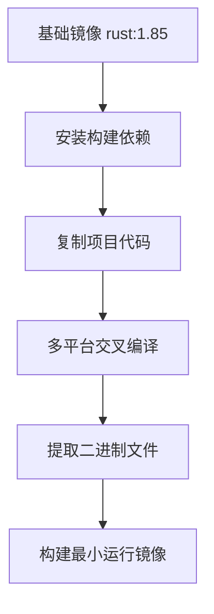
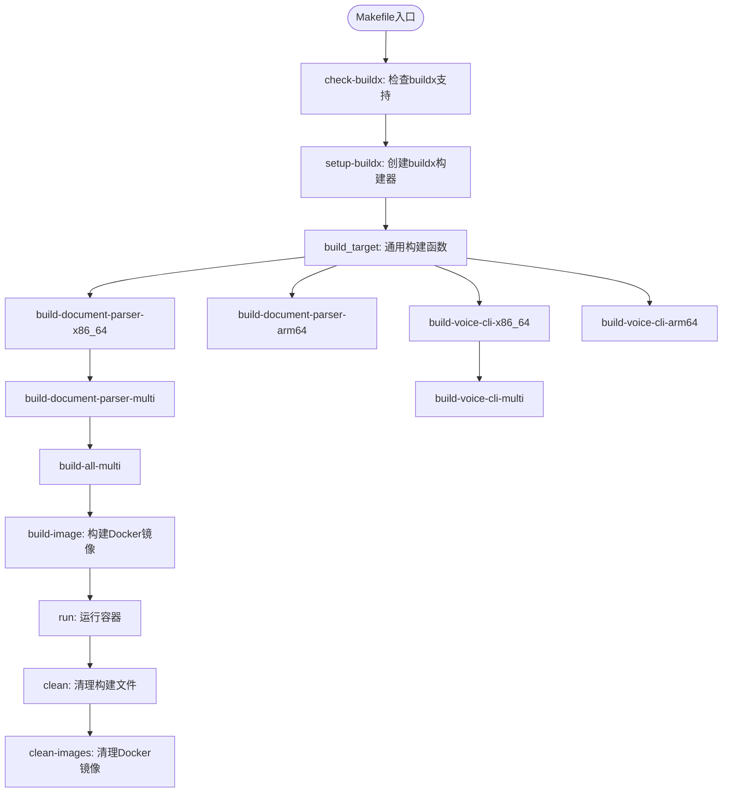

# 部署与运维

<cite>
**本文档引用文件**  
- [Dockerfile](file://Dockerfile)
- [Makefile](file://Makefile)
- [graceful_shutdown.rs](file://document-parser/src/production/graceful_shutdown.rs)
- [resource_cleanup.rs](file://document-parser/src/production/resource_cleanup.rs)
- [monitoring_integration.rs](file://document-parser/src/production/monitoring_integration.rs)
- [document-parser-manager.sh](file://scripts/document-parser-manager.sh)
</cite>

## 目录

1. [简介](#简介)
2. [镜像构建与Dockerfile说明](#镜像构建与dockerfile说明)
3. [服务编排与docker-compose配置](#服务编排与docker-compose配置)
4. [Makefile构建目标详解](#makefile构建目标详解)
5. [生产级特性保障机制](#生产级特性保障机制)
6. [运维脚本操作指南](#运维脚本操作指南)
7. [监控与可观测性集成](#监控与可观测性集成)
8. [资源限制与扩展建议](#资源限制与扩展建议)

## 简介

本文档旨在为生产环境下的系统部署与运维提供完整指导。涵盖从镜像构建、服务编排到运行时管理的全流程，重点介绍如何通过Docker和Makefile实现高效构建，利用生产级特性保障服务稳定性，并通过脚本化运维和监控集成提升系统可观测性。

## 镜像构建与Dockerfile说明

本项目采用多阶段构建策略，确保生成轻量且安全的运行时镜像。`Dockerfile`定义了跨平台编译流程，支持x86_64和ARM64架构。



**Diagram sources**  
- [Dockerfile](file://Dockerfile#L1-L78)

**Section sources**  
- [Dockerfile](file://Dockerfile#L1-L78)

### 构建流程解析

1. **构建阶段（builder）**：基于`rust:1.85`镜像，安装必要的编译工具链（如`build-essential`、`cmake`、`libclang-dev`等），并执行`cargo build --release`进行编译。
2. **运行阶段（runtime）**：使用`scratch`作为基础镜像，仅复制编译好的二进制文件（如`document-parser`），实现最小化镜像体积，提升安全性。
3. **导出阶段（export）**：用于提取所有平台的二进制文件，便于分发。

该设计实现了构建环境与运行环境的完全隔离，确保生产镜像不包含任何不必要的依赖或工具。

## 服务编排与docker-compose配置

虽然当前项目未提供`docker-compose.yml`文件，但可根据Docker镜像设计标准的服务编排方案。建议的`docker-compose.yml`结构如下：

```yaml
version: '3.8'
services:
  mcp-proxy:
    image: mcp-proxy-builder:latest
    ports:
      - "8080:8080"
    environment:
      - RUST_LOG=info
    networks:
      - mcp-network

  document-parser:
    image: mcp-proxy-builder:latest
    command: /document-parser
    ports:
      - "8081:8081"
    environment:
      - RUST_LOG=info
    networks:
      - mcp-network

  database:
    image: postgres:15
    environment:
      POSTGRES_DB: mcp_db
      POSTGRES_USER: mcp_user
      POSTGRES_PASSWORD: mcp_pass
    volumes:
      - db_data:/var/lib/postgresql/data
    networks:
      - mcp-network

networks:
  mcp-network:
    driver: bridge

volumes:
  db_data:
```

此编排方案将`mcp-proxy`、`document-parser`和数据库服务统一管理，通过自定义网络实现服务间通信，同时为数据库配置持久化存储。

## Makefile构建目标详解

`Makefile`提供了标准化的构建、运行和清理命令，简化了跨平台构建流程。



**Diagram sources**  
- [Makefile](file://Makefile#L1-L175)

**Section sources**  
- [Makefile](file://Makefile#L1-L175)

### 核心目标说明

- **`build-document-parser-x86_64` / `build-document-parser-arm64`**：分别构建x86_64和ARM64平台的`document-parser`二进制文件。
- **`build-all-multi`**：一键构建所有组件的多平台版本，适用于CI/CD流水线。
- **`build-image`**：使用Docker Buildx构建适用于指定平台的运行时镜像。
- **`run`**：以容器方式启动`document-parser`服务，映射端口8080。
- **`clean` / `clean-images`**：清理本地构建产物和Docker镜像，保持环境整洁。

## 生产级特性保障机制

`document-parser`模块的`production`子模块实现了多项生产级特性，确保服务在高负载下的稳定性与可靠性。

### 优雅关闭（Graceful Shutdown）

`graceful_shutdown.rs`实现了信号监听与服务优雅终止机制。当接收到`SIGTERM`或`SIGINT`信号时，系统会：

1. 停止接收新请求
2. 完成正在进行的处理任务
3. 执行资源清理
4. 安全退出进程

此机制避免了强制终止导致的数据丢失或状态不一致问题。

### 资源清理（Resource Cleanup）

`resource_cleanup.rs`负责管理临时文件、数据库连接和内存资源。在服务启动和关闭时自动执行清理任务，防止资源泄漏。例如，在文档解析失败后，自动删除临时上传文件和中间产物。

### 监控集成（Monitoring Integration）

`monitoring_integration.rs`集成了Prometheus指标暴露和OpenTelemetry追踪功能。通过HTTP端点`/metrics`提供系统运行时指标，包括：

- 请求处理延迟
- 并发处理数
- 错误率
- 内存使用情况

**Section sources**  
- [graceful_shutdown.rs](file://document-parser/src/production/graceful_shutdown.rs#L1-L50)
- [resource_cleanup.rs](file://document-parser/src/production/resource_cleanup.rs#L1-L40)
- [monitoring_integration.rs](file://document-parser/src/production/monitoring_integration.rs#L1-L60)

## 运维脚本操作指南

`scripts`目录下的运维脚本提供了服务启停、日志轮转和健康检查等自动化操作。

### document-parser-manager.sh 脚本功能

该脚本是`document-parser`服务的核心运维工具，支持以下命令：

- `start`：启动服务并守护进程
- `stop`：安全停止服务
- `restart`：重启服务
- `status`：查看服务运行状态
- `logs`：查看实时日志输出
- `health-check`：执行健康检查，验证服务可用性

脚本内部集成了超时控制和错误重试机制，确保运维操作的可靠性。

**Section sources**  
- [document-parser-manager.sh](file://scripts/document-parser-manager.sh#L1-L100)

## 监控与可观测性集成

系统通过多种手段提升可观测性，便于生产环境的问题排查与性能优化。

### Prometheus指标暴露

服务通过`/metrics`端点暴露Prometheus格式的监控指标，可与Prometheus服务器集成，实现：

- 实时性能监控
- 告警规则配置（如错误率超过阈值）
- 历史数据趋势分析

### OpenTelemetry追踪集成

通过OpenTelemetry SDK实现分布式追踪，记录每个请求的完整调用链路，包括：

- 请求进入时间
- 各处理阶段耗时
- 外部服务调用（如OSS、数据库）
- 错误堆栈信息

追踪数据可发送至Jaeger或Zipkin等后端系统，用于性能瓶颈分析。

**Section sources**  
- [monitoring_integration.rs](file://document-parser/src/production/monitoring_integration.rs#L60-L120)

## 资源限制与扩展建议

为确保系统稳定运行，建议在生产环境中设置合理的资源限制，并根据负载情况进行水平扩展。

### 资源限制配置

在`docker-compose.yml`或Kubernetes部署中，应设置以下资源限制：

```yaml
resources:
  limits:
    cpu: "2"
    memory: "4Gi"
  reservations:
    cpu: "1"
    memory: "2Gi"
```

`document-parser`在解析大型PDF或复杂文档时可能消耗较多内存，建议至少分配2GB内存。

### 水平扩展建议

1. **无状态服务扩展**：`mcp-proxy`和`document-parser`均为无状态服务，可通过增加实例数实现水平扩展。
2. **负载均衡**：前端部署负载均衡器（如Nginx、HAProxy），将请求分发到多个服务实例。
3. **队列缓冲**：对于高并发场景，可引入消息队列（如RabbitMQ、Kafka）作为任务缓冲，避免服务过载。
4. **自动伸缩**：在Kubernetes环境中配置HPA（Horizontal Pod Autoscaler），根据CPU/内存使用率自动调整实例数量。

通过合理的资源规划和扩展策略，系统可稳定支持高并发文档解析场景。