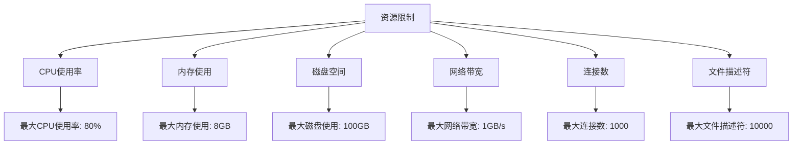
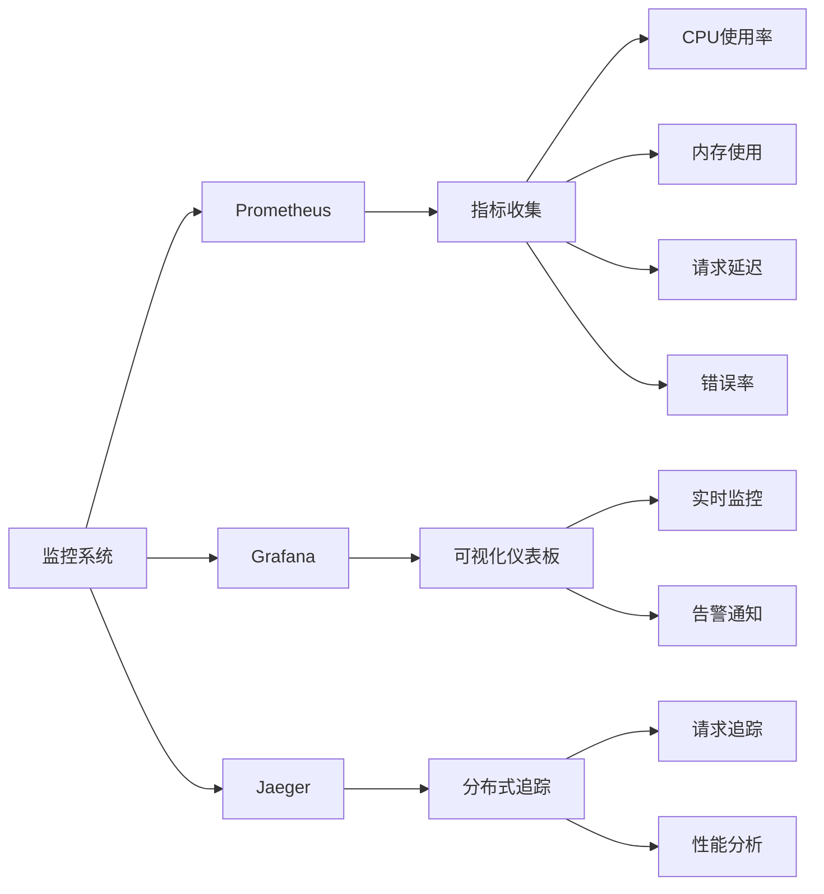
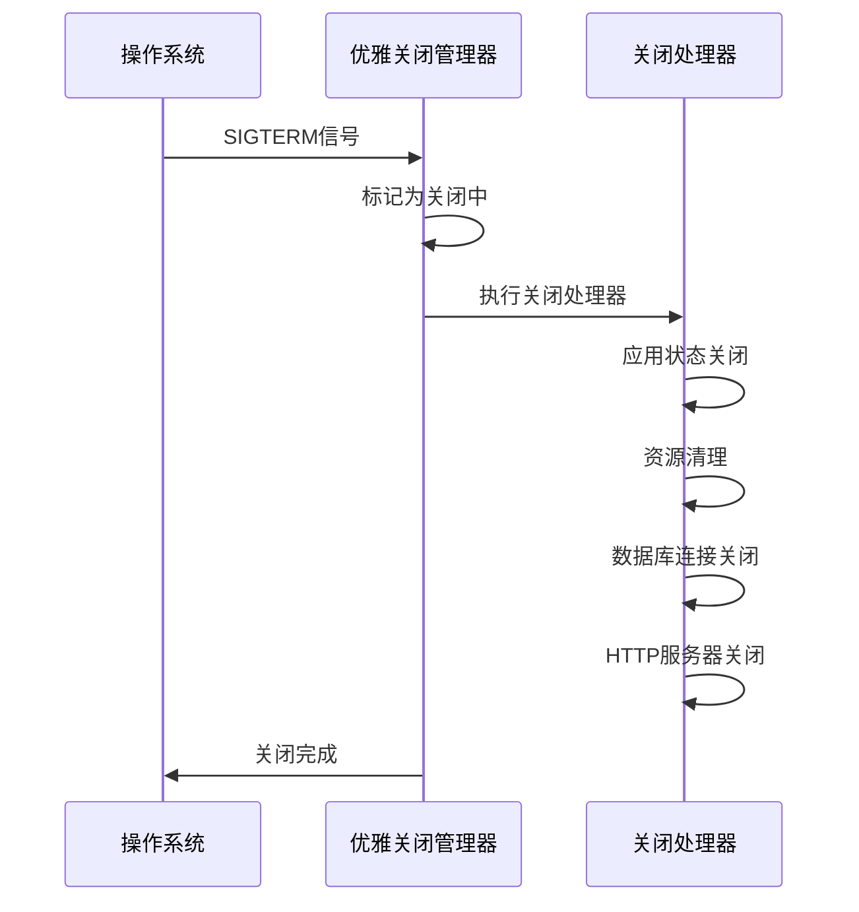
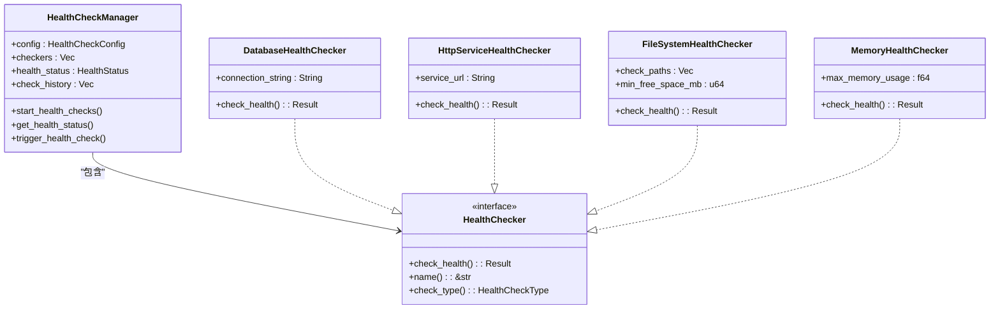
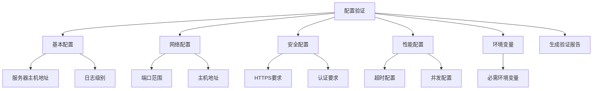

# 部署指南

<cite>
**本文档引用的文件**   
- [Makefile](file://Makefile)
- [Dockerfile](file://Dockerfile)
- [document-parser-manager.sh](file://scripts/document-parser-manager.sh)
- [server-manager.sh](file://voice-cli/scripts/server-manager.sh)
- [config.yml](file://document-parser/config.yml)
- [config.yml](file://voice-cli/config.yml)
- [README.md](file://README.md)
- [graceful_shutdown.rs](file://document-parser/src/production/graceful_shutdown.rs)
- [deployment_health.rs](file://document-parser/src/production/deployment_health.rs)
- [config_validation.rs](file://document-parser/src/production/config_validation.rs)
- [production_logging.rs](file://document-parser/src/production/production_logging.rs)
- [monitoring_integration.rs](file://document-parser/src/production/monitoring_integration.rs)
</cite>

## 目录
1. [本地部署](#本地部署)
2. [Docker部署](#docker部署)
3. [生产环境配置](#生产环境配置)
4. [systemd服务管理](#systemd服务管理)
5. [最佳实践](#最佳实践)

## 本地部署

本项目提供了通过Makefile进行构建和启动的标准流程，支持跨平台编译和多种构建目标。

### 构建流程

使用Makefile可以构建document-parser和voice-cli两个组件，支持Linux x86_64、ARM64架构以及多平台版本。

**构建document-parser:**
```bash
# 构建Linux x86_64版本（默认）
make build-document-parser-x86_64

# 构建Linux ARM64版本
make build-document-parser-arm64

# 构建多平台版本
make build-document-parser-multi
```

**构建voice-cli:**
```bash
# 构建Linux x86_64版本
make build-voice-cli-x86_64

# 构建Linux ARM64版本
make build-voice-cli-arm64

# 构建多平台版本
make build-voice-cli-multi
```

**构建所有组件:**
```bash
# 构建所有组件的Linux x86_64版本
make build-all-x86_64

# 构建所有组件的Linux ARM64版本
make build-all-arm64

# 构建所有组件的多平台版本
make build-all-multi
```

构建完成后，二进制文件将输出到`./dist/`目录下，包括：
- `./dist/document-parser-x86_64/` - Document Parser x86_64二进制文件
- `./dist/document-parser-arm64/` - Document Parser ARM64二进制文件
- `./dist/voice-cli-x86_64/` - Voice CLI x86_64二进制文件
- `./dist/voice-cli-arm64/` - Voice CLI ARM64二进制文件

**Section sources**
- [Makefile](file://Makefile#L1-L183)

### 启动服务

构建完成后，可以通过以下方式启动服务：

**启动mcp-proxy服务:**
```bash
# 启动mcp-proxy并输出日志到指定文件
make run-mcp-proxy

# 或者直接运行
cargo run --bin mcp-proxy
```

**启动document-parser服务:**
```bash
# 进入document-parser目录
cd document-parser

# 启动HTTP服务器
document-parser server

# 或指定端口启动
document-parser server --port 8080
```

**启动voice-cli服务:**
```bash
# 使用默认配置启动
voice-cli server run

# 使用指定配置文件启动
voice-cli server run --config ./server-config.yml
```

Makefile还提供了其他有用的命令：
- `make help` - 显示所有可用命令的帮助信息
- `make check-buildx` - 检查Docker buildx状态
- `make setup-buildx` - 设置Docker buildx builder
- `make clean` - 清理构建文件
- `make clean-images` - 清理Docker镜像

**Section sources**
- [Makefile](file://Makefile#L98-L103)
- [README.md](file://README.md#L639-L645)

## Docker部署

项目提供了完整的Docker部署方案，包括镜像构建、容器运行和网络配置。

### 镜像构建

使用Dockerfile和Makefile可以轻松构建运行镜像。

**构建Docker运行镜像:**
```bash
# 构建Docker运行镜像
make build-image

# 或者直接使用docker命令
docker buildx build \
    --platform linux/amd64 \
    --target runtime \
    -t mcp-proxy-builder:latest \
    -f Dockerfile .
```

Dockerfile采用多阶段构建策略，确保最终镜像尽可能小：
1. **构建阶段 (builder)**: 使用`rust:1.85`基础镜像，安装必要的构建依赖，编译所有包
2. **运行阶段 (runtime)**: 使用`scratch`最小镜像，仅包含编译好的二进制文件

构建过程中会根据目标架构自动编译x86_64或ARM64版本的二进制文件，并复制到输出目录。

**Section sources**
- [Makefile](file://Makefile#L81-L90)
- [Dockerfile](file://Dockerfile#L2-L65)

### 容器运行

构建完成后，可以使用以下命令运行Docker容器：

**运行document-parser容器:**
```bash
# 运行document-parser容器，映射端口8080
make run

# 或者直接使用docker命令
docker run --rm -p 8080:8080 mcp-proxy-builder:latest
```

**自定义运行参数:**
```bash
# 指定不同端口映射
docker run --rm -p 8087:8087 mcp-proxy-builder:latest

# 挂载配置文件和数据目录
docker run --rm \
    -p 8080:8080 \
    -v ./config.yml:/config.yml \
    -v ./data:/data \
    mcp-proxy-builder:latest
```

### 网络配置

容器默认监听`0.0.0.0`地址，可以通过端口映射与宿主机通信。建议在生产环境中使用以下网络配置：

**Docker Compose配置示例:**
```yaml
version: '3.8'
services:
  document-parser:
    image: mcp-proxy-builder:latest
    ports:
      - "8080:8080"
    environment:
      - RUST_LOG=info
    volumes:
      - ./config.yml:/config.yml
      - ./data:/data
      - ./logs:/logs
    restart: always
    networks:
      - app-network

networks:
  app-network:
    driver: bridge
```

**Section sources**
- [Makefile](file://Makefile#L92-L97)
- [Dockerfile](file://Dockerfile#L66-L74)

## 生产环境配置

生产环境部署需要考虑配置管理、资源限制、安全配置和监控集成等关键因素。

### 配置文件

项目提供了详细的配置文件，支持环境变量覆盖。

**document-parser配置 (config.yml):**
```yaml
environment: "development"
server:
  port: 8087
  host: "0.0.0.0"
log:
  level: "info"
  path: "logs"
document_parser:
  max_concurrent: 5
  queue_size: 1000
  download_timeout: 3600
  processing_timeout: 3600
mineru:
  backend: "pipeline"
  python_path: "./venv/bin/python"
  batch_size: 1
  quality_level: "Balanced"
  vram: 8
markitdown:
  python_path: "./venv/bin/python"
  enable_plugins: false
  features:
    ocr: true
    audio_transcription: true
    azure_doc_intel: false
    youtube_transcription: false
storage:
  sled:
    path: "data/document_parser"
    cache_capacity: 104857600
  oss:
    endpoint: "oss-rg-china-mainland.aliyuncs.com"
    public_bucket: "nuwa-packages"
    private_bucket: "edu-nuwa-packages"
    access_key_id: "${OSS_ACCESS_KEY_ID}"
    access_key_secret: "${OSS_ACCESS_KEY_SECRET}"
    region: "oss-rg-china-mainland"
    upload_directory: "document_parser"
file_size_config:
  max_file_size: "200MB"
  large_document_threshold: "50MB"
external_integration:
  webhook_url: ""
  api_key: ""
  timeout: 30
```

**voice-cli配置 (config.yml):**
```yaml
server:
  host: "0.0.0.0"
  port: 8087
  max_file_size: 209715200
  cors_enabled: true
whisper:
  default_model: "large-v3"
  models_dir: "./models"
  auto_download: true
  supported_models:
    - "tiny"
    - "tiny.en"
    # ... 其他模型
  audio_processing:
    supported_formats: ["mp3", "wav", "flac", "m4a", "ogg", "aac", "opus", "amr", "wma", "aiff", "caf", "mp4", "mov", "avi", "mkv", "webm", "3gp", "flv", "wmv", "mpeg", "mxf"]
    auto_convert: true
    conversion_timeout: 60
    temp_file_cleanup: true
    temp_file_retention: 300
  workers:
    transcription_workers: 3
    channel_buffer_size: 100
    worker_timeout: 3600
tts:
  python_path: ".venv/bin/python"
  model_path: "./checkpoints"
  default_model: "default"
  supported_formats: ["mp3", "wav"]
  max_text_length: 5000
  default_speed: 1.0
  default_pitch: 0
  default_volume: 1.0
  timeout_seconds: 300
  script_path: "tts_service.py"
logging:
  level: "info"
  log_dir: "./logs"
  max_file_size: "100MB"
  max_files: 30
daemon:
  pid_file: "./voice-cli-server.pid"
  log_file: "./logs/server-daemon.log"
  work_dir: "./"
task_management:
  max_concurrent_tasks: 4
  retry_attempts: 2
  task_timeout_seconds: 3600
  catch_panic: true
  task_retention_minutes: 1440
  sqlite_db_path: "./data/tasks.db"
```

**Section sources**
- [config.yml](file://document-parser/config.yml#L1-L78)
- [config.yml](file://voice-cli/config.yml#L1-L100)

### 资源限制

生产环境需要合理配置资源限制，防止服务占用过多系统资源。

**资源限制配置:**


**Diagram sources**
- [resource_monitor.rs](file://document-parser/src/performance/resource_monitor.rs#L720-L812)

### 安全配置

生产环境必须配置适当的安全措施，包括权限控制、访问限制和敏感信息保护。

**安全配置要点:**
- 使用环境变量存储敏感信息（如OSS访问密钥）
- 配置适当的文件权限和目录权限
- 限制服务运行用户权限
- 配置防火墙规则
- 启用HTTPS和认证机制

**Section sources**
- [config_validation.rs](file://document-parser/src/production/config_validation.rs#L49-L60)

### 监控集成

生产环境需要集成监控系统，实时了解服务状态和性能指标。

**监控配置:**


**Diagram sources**
- [monitoring_integration.rs](file://document-parser/src/production/monitoring_integration.rs#L666-L677)

## systemd服务管理

项目提供了systemd服务管理脚本，支持一键部署、服务状态管理、日志查看和故障排查。

### 一键部署

使用`document-parser-manager.sh`脚本可以实现一键部署：

```bash
# 一键部署（检查文件 + 安装 + 启动 + 开机自启）
sudo ./scripts/document-parser-manager.sh deploy

# 安装但不启动服务
sudo ./scripts/document-parser-manager.sh deploy --no-start

# 不启用开机自启
sudo ./scripts/document-parser-manager.sh deploy --no-enable
```

脚本会自动完成以下操作：
1. 检查系统依赖和权限
2. 检查可执行文件是否存在
3. 准备部署文件（配置文件等）
4. 动态生成systemd服务文件
5. 安装服务到系统
6. 启动服务（可选）
7. 启用开机自启（可选）

**Section sources**
- [document-parser-manager.sh](file://scripts/document-parser-manager.sh#L456-L519)

### 服务状态管理

使用管理脚本可以方便地管理服务状态：

```bash
# 启动服务
sudo ./scripts/document-parser-manager.sh start

# 停止服务
sudo ./scripts/document-parser-manager.sh stop

# 重启服务
sudo ./scripts/document-parser-manager.sh restart

# 查看服务状态
./scripts/document-parser-manager.sh status

# 启用开机自启
sudo ./scripts/document-parser-manager.sh enable

# 禁用开机自启
sudo ./scripts/document-parser-manager.sh disable
```

### 日志查看

通过journalctl命令查看服务日志：

```bash
# 查看服务日志
./scripts/document-parser-manager.sh logs

# 或直接使用journalctl
journalctl -u document-parser -f --no-pager
```

### 故障排查

管理脚本提供了完善的故障排查功能：

```bash
# 卸载服务
sudo ./scripts/document-parser-manager.sh uninstall

# 查看帮助信息
./scripts/document-parser-manager.sh help
```

脚本还支持后台启动模式，无需安装到系统：

```bash
# 后台启动服务
./scripts/document-parser-manager.sh start-background

# 停止后台服务
./scripts/document-parser-manager.sh stop-background

# 查看后台服务状态
./scripts/document-parser-manager.sh status-background
```

**Section sources**
- [document-parser-manager.sh](file://scripts/document-parser-manager.sh#L176-L282)

## 最佳实践

### 优雅关闭

生产环境必须实现优雅关闭，确保所有资源得到正确清理。

**优雅关闭流程:**


**Diagram sources**
- [graceful_shutdown.rs](file://document-parser/src/production/graceful_shutdown.rs#L80-L125)

### 健康检查

配置完善的健康检查机制，确保服务可用性。

**健康检查类型:**
- **启动检查 (Startup Check)**: 服务启动时的初始检查
- **就绪检查 (Readiness Check)**: 服务是否准备好接收流量
- **存活检查 (Liveness Check)**: 服务是否仍在运行

**健康检查配置:**


**Diagram sources**
- [deployment_health.rs](file://document-parser/src/production/deployment_health.rs#L14-L111)

### 配置验证

在生产环境部署前，必须进行配置验证。

**配置验证流程:**


**Diagram sources**
- [config_validation.rs](file://document-parser/src/production/config_validation.rs#L191-L206)

### 生产日志

配置生产环境专用的日志系统。

**日志配置要点:**
- 使用JSON格式日志，便于日志系统解析
- 配置日志轮转，防止日志文件过大
- 设置适当的日志级别（生产环境建议使用info级别）
- 配置日志缓冲和批量写入，提高性能
- 支持日志采样，减少日志量

**Section sources**
- [production_logging.rs](file://document-parser/src/production/production_logging.rs#L624-L648)