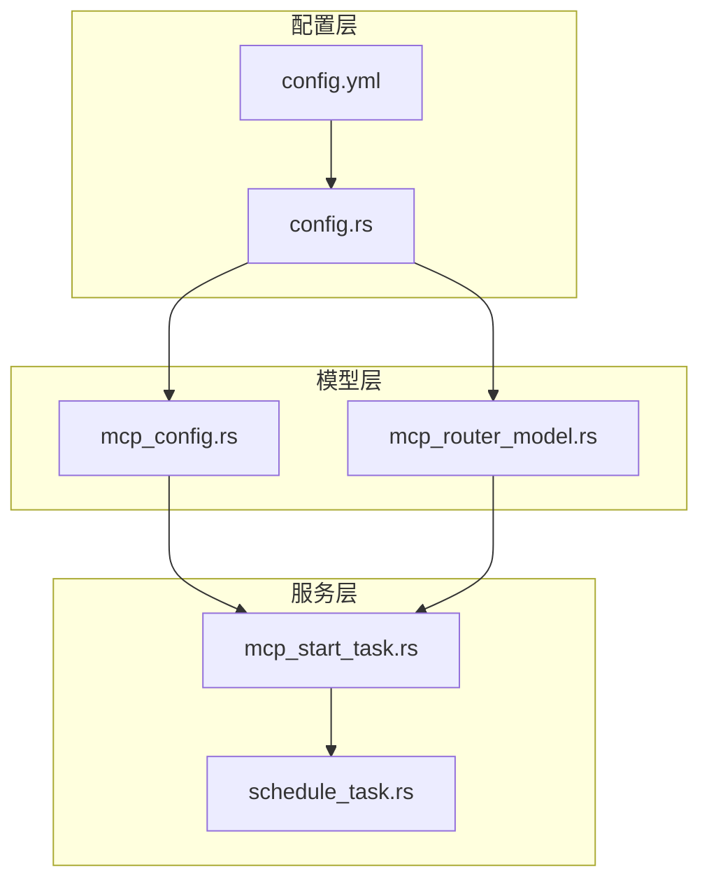
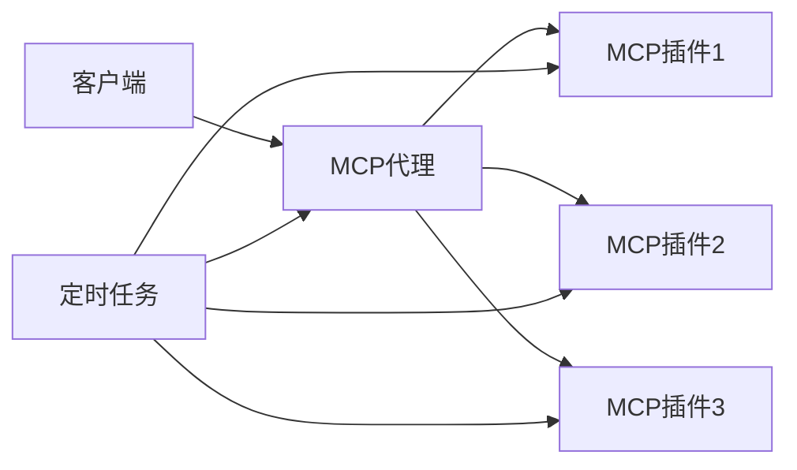
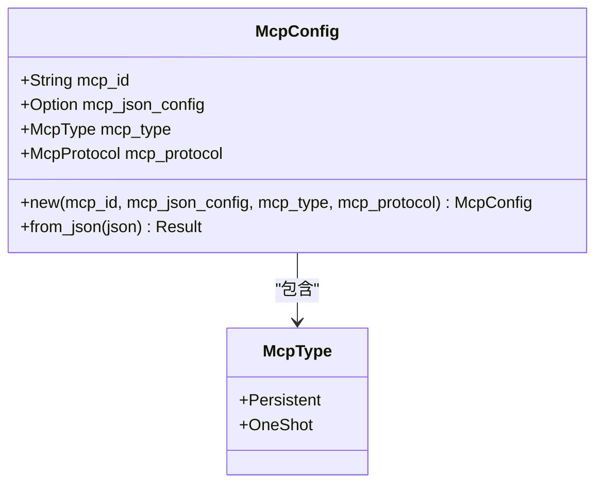
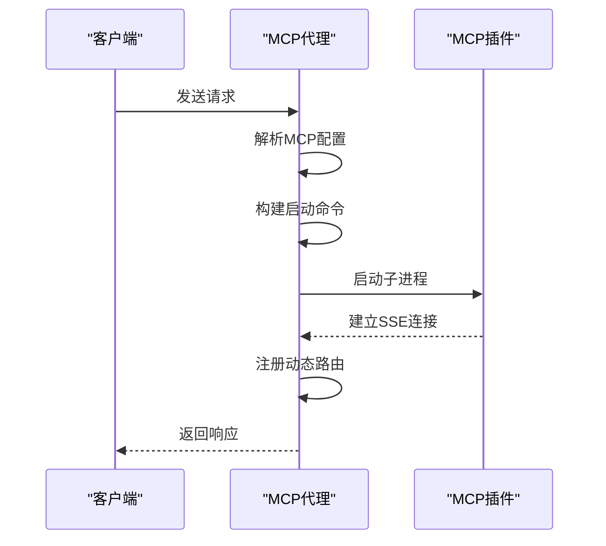
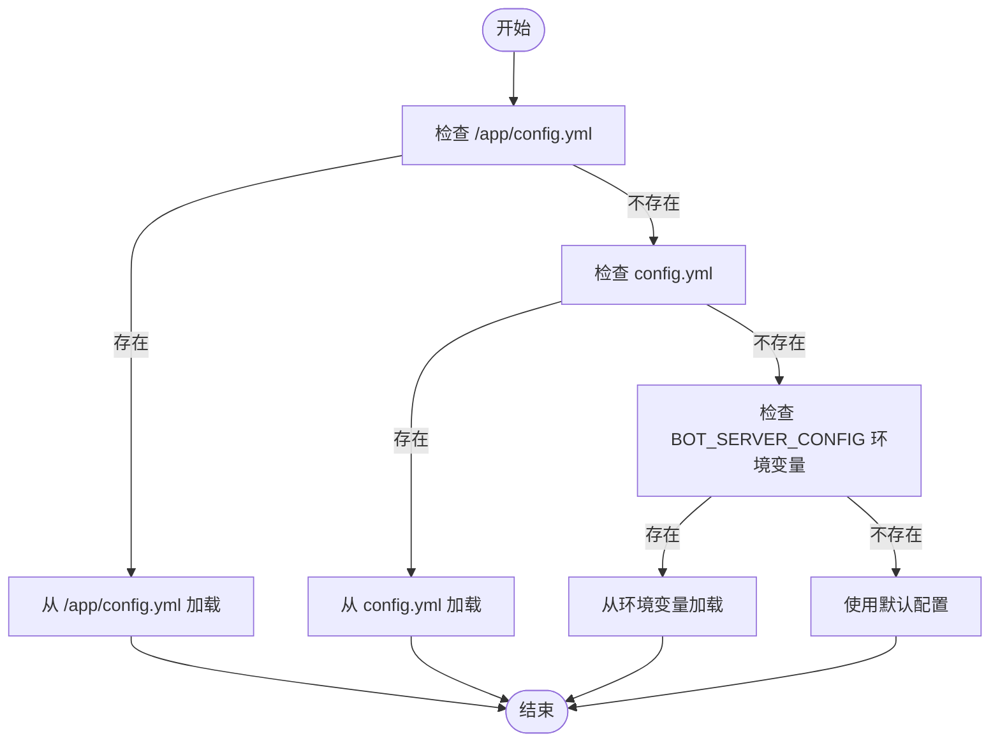
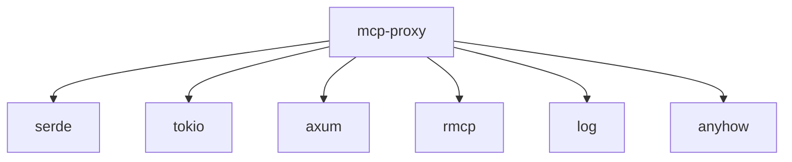

# MCP代理服务配置

<cite>
**本文档中引用的文件**  
- [config.yml](file://mcp-proxy/config.yml)
- [config.rs](file://mcp-proxy/src/config.rs)
- [mcp_config.rs](file://mcp-proxy/src/model/mcp_config.rs)
- [mcp_start_task.rs](file://mcp-proxy/src/server/task/mcp_start_task.rs)
- [mcp_router_model.rs](file://mcp-proxy/src/model/mcp_router_model.rs)
</cite>

## 目录
1. [简介](#简介)
2. [项目结构](#项目结构)
3. [核心组件](#核心组件)
4. [架构概述](#架构概述)
5. [详细组件分析](#详细组件分析)
6. [依赖分析](#依赖分析)
7. [性能考虑](#性能考虑)
8. [故障排除指南](#故障排除指南)
9. [结论](#结论)

## 简介
本文档详细解释了 `mcp-proxy` 服务的 `config.yml` 配置文件结构及其字段含义，重点说明通用配置项、MCP实例配置块、配置反序列化过程、环境变量覆盖机制、启动流程与生命周期管理，以及常见配置错误和排查方法。

## 项目结构
`mcp-proxy` 服务是MCP（Modular Control Plane）代理的核心组件，负责管理MCP插件的生命周期、路由请求、状态检查等。其主要目录结构包括：
- `src/config.rs`：主配置文件解析与加载逻辑
- `src/model/mcp_config.rs`：MCP配置结构体定义
- `src/server/task/mcp_start_task.rs`：MCP服务启动任务实现
- `src/model/mcp_router_model.rs`：MCP路由与命令配置模型



**Diagram sources**
- [config.yml](file://mcp-proxy/config.yml)
- [config.rs](file://mcp-proxy/src/config.rs)
- [mcp_config.rs](file://mcp-proxy/src/model/mcp_config.rs)
- [mcp_router_model.rs](file://mcp-proxy/src/model/mcp_router_model.rs)
- [mcp_start_task.rs](file://mcp-proxy/src/server/task/mcp_start_task.rs)

**Section sources**
- [config.yml](file://mcp-proxy/config.yml)
- [config.rs](file://mcp-proxy/src/config.rs)

## 核心组件
`mcp-proxy` 的核心组件包括配置管理、MCP实例管理、动态路由和定时任务。配置管理负责加载和解析 `config.yml` 文件；MCP实例管理负责启动和监控MCP插件；动态路由负责将请求转发到正确的MCP实例；定时任务负责定期检查MCP服务状态。

**Section sources**
- [config.rs](file://mcp-proxy/src/config.rs)
- [mcp_start_task.rs](file://mcp-proxy/src/server/task/mcp_start_task.rs)
- [mcp_dynamic_router_service.rs](file://mcp-proxy/src/server/mcp_dynamic_router_service.rs)

## 架构概述
`mcp-proxy` 采用模块化架构，通过配置文件定义MCP插件，启动时解析配置并启动相应的MCP服务。每个MCP服务作为一个子进程运行，通过SSE或Stream协议与代理通信。代理使用Axum框架提供HTTP接口，动态注册路由，并通过定时任务定期检查MCP服务状态。



**Diagram sources**
- [main.rs](file://mcp-proxy/src/main.rs)
- [server/mod.rs](file://mcp-proxy/src/server/mod.rs)
- [task/schedule_task.rs](file://mcp-proxy/src/server/task/schedule_task.rs)

## 详细组件分析

### 配置文件结构分析
`config.yml` 文件定义了MCP代理的基本配置和MCP实例配置。基本配置包括服务器端口和日志级别，MCP实例配置通过环境变量注入。

```yaml
server:
  port: 8086
log:
  level: debug
  path: logs
```

**Section sources**
- [config.yml](file://mcp-proxy/config.yml)

#### 配置结构体反序列化
`mcp_config.rs` 文件定义了 `McpConfig` 结构体，用于反序列化MCP配置。该结构体包含MCP ID、JSON配置、MCP类型和协议。MCP类型默认为 `OneShot`，协议默认为 `Sse`。



**Diagram sources**
- [mcp_config.rs](file://mcp-proxy/src/model/mcp_config.rs)

#### MCP启动任务分析
`mcp_start_task.rs` 文件实现了MCP服务的启动逻辑。`mcp_start_task` 函数接收 `McpConfig` 参数，解析命令和环境变量，启动子进程，并注册路由。



**Diagram sources**
- [mcp_start_task.rs](file://mcp-proxy/src/server/task/mcp_start_task.rs)

### 环境变量覆盖机制
`config.rs` 文件实现了配置加载逻辑，支持从多个来源加载配置：`/app/config.yml`、`config.yml`、`BOT_SERVER_CONFIG` 环境变量。如果都没有，则使用默认配置。



**Diagram sources**
- [config.rs](file://mcp-proxy/src/config.rs)

## 依赖分析
`mcp-proxy` 依赖于多个外部库，包括 `serde` 用于配置反序列化，`tokio` 用于异步任务，`axum` 用于HTTP服务，`rmcp` 用于MCP协议处理。



**Diagram sources**
- [Cargo.toml](file://mcp-proxy/Cargo.toml)

**Section sources**
- [Cargo.toml](file://mcp-proxy/Cargo.toml)

## 性能考虑
`mcp-proxy` 通过异步任务和定时检查机制确保高性能。定时任务每60秒检查一次MCP服务状态，使用25秒超时防止任务堆积。子进程通过 `tokio::process::Command` 启动，确保非阻塞执行。

## 故障排除指南
常见配置错误包括MCP服务器配置不唯一、命令或参数错误、环境变量未正确设置等。排查方法包括检查日志输出、验证配置文件格式、确认环境变量覆盖等。

**Section sources**
- [mcp_router_model.rs](file://mcp-proxy/src/model/mcp_router_model.rs)
- [mcp_start_task.rs](file://mcp-proxy/src/server/task/mcp_start_task.rs)
- [config.rs](file://mcp-proxy/src/config.rs)

## 结论
`mcp-proxy` 服务通过灵活的配置机制和模块化设计，实现了对MCP插件的高效管理。通过深入理解配置文件结构、反序列化过程、启动流程和环境变量覆盖机制，可以更好地配置和维护该服务。