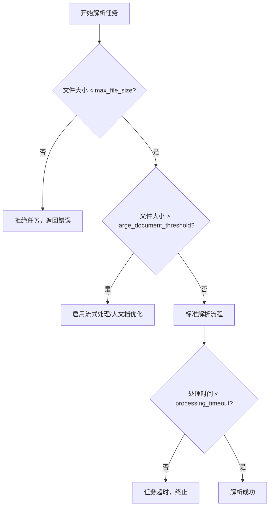
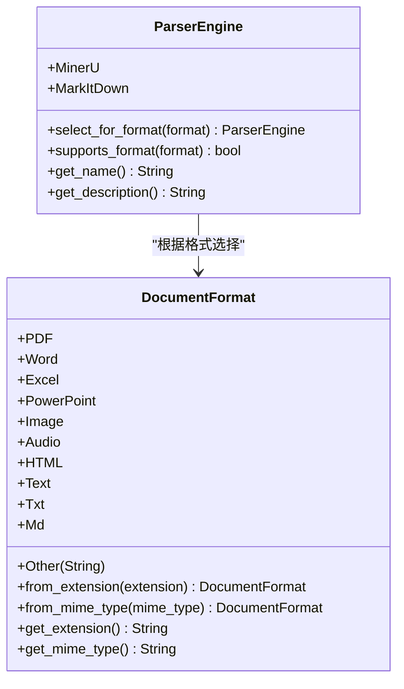
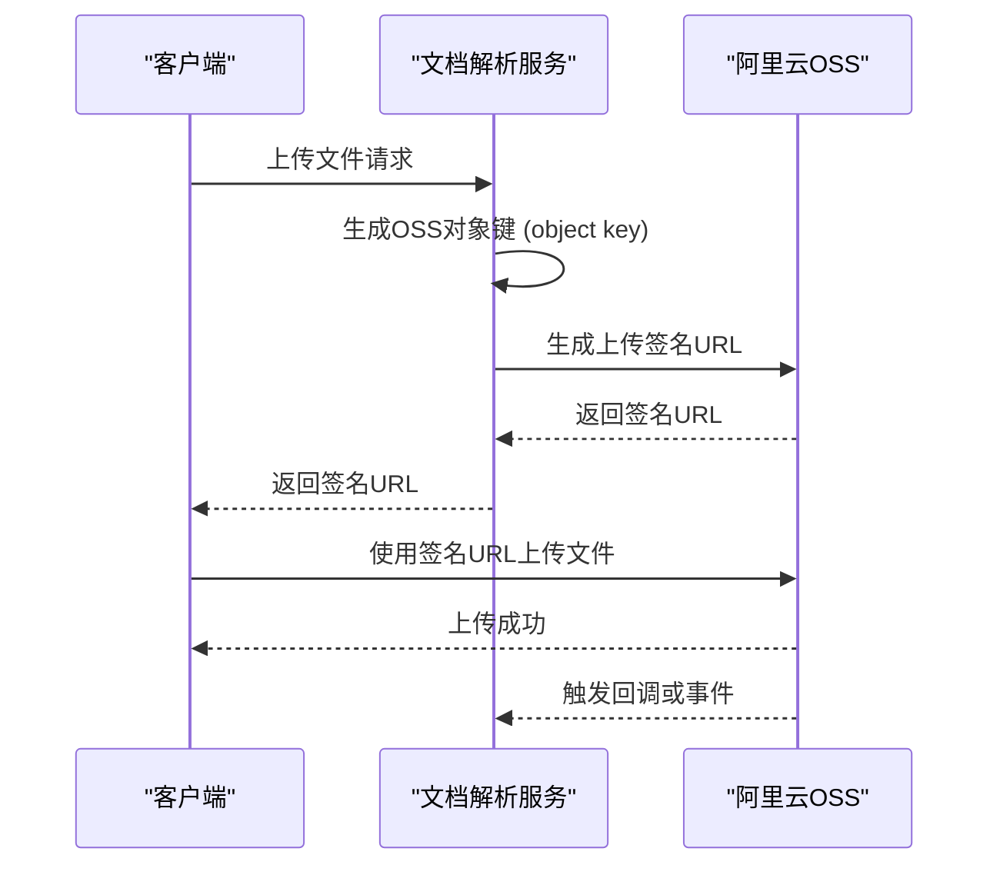
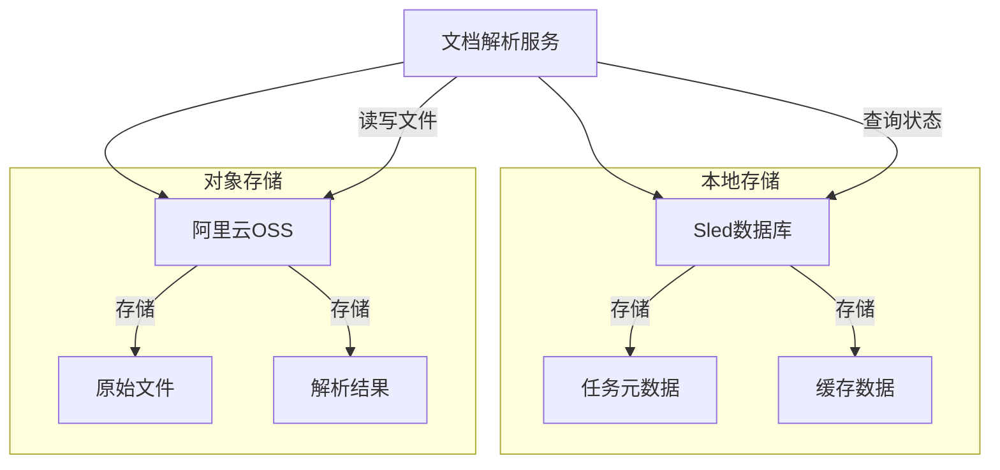
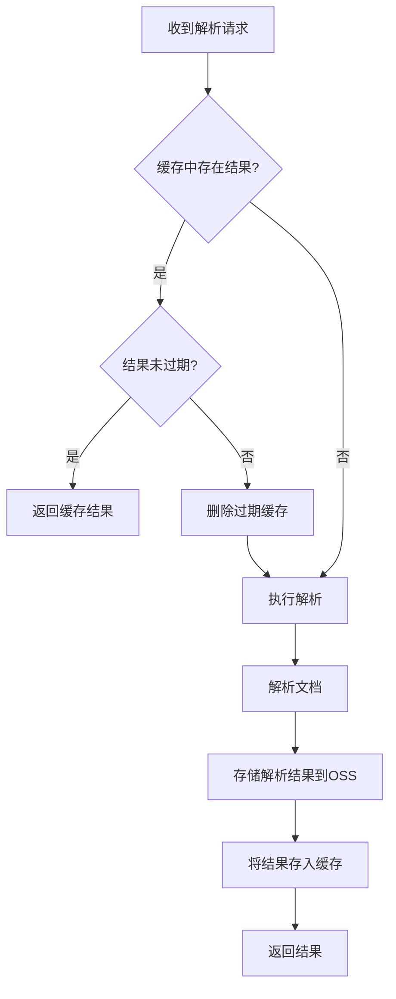
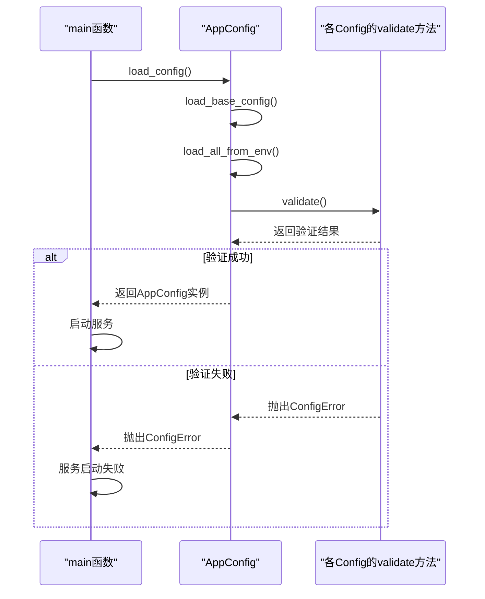

# 文档解析服务配置

<cite>
**本文档中引用的文件**  
- [config.rs](file://document-parser/src/config.rs)
- [config.yml](file://document-parser/config.yml)
- [storage_service.rs](file://document-parser/src/services/storage_service.rs)
- [oss_service.rs](file://document-parser/src/services/oss_service.rs)
- [document_format.rs](file://document-parser/src/models/document_format.rs)
- [parser_engine.rs](file://document-parser/src/models/parser_engine.rs)
</cite>

## 目录
1. [引言](#引言)
2. [解析器核心参数](#解析器核心参数)
3. [对象存储配置](#对象存储配置)
4. [本地存储路径配置](#本地存储路径配置)
5. [缓存配置](#缓存配置)
6. [配置验证机制](#配置验证机制)
7. [开发与生产环境配置差异](#开发与生产环境配置差异)
8. [结论](#结论)

## 引言
文档解析服务（document-parser）是一个支持多格式文档解析的后端服务，能够处理PDF、Word、Excel、PPT、图片、音频等多种文件类型。该服务通过灵活的配置体系，实现了对解析行为、存储策略、性能控制和安全机制的精细化管理。本配置文档旨在全面阐述服务的配置结构，重点说明核心解析参数、对象存储（OSS）配置、本地存储路径、缓存机制以及配置验证流程，为开发和运维人员提供清晰的指导。

## 解析器核心参数

文档解析服务的核心行为由`document_parser`、`mineru`和`markitdown`等配置项控制，这些参数直接影响解析任务的性能、资源消耗和成功率。

### 解析超时与文件大小限制
`parser.timeout`和`parser.max_file_size`是控制解析任务生命周期和资源占用的关键参数。在当前配置中，`download_timeout`和`processing_timeout`统一设置为3600秒（60分钟），这为大型文档的下载和处理提供了充足的时间。`max_file_size`通过`file_size_config`全局配置项设置，当前默认值为"200MB"。此限制可有效防止因处理超大文件而导致的内存溢出或服务阻塞。`large_document_threshold`（大文档阈值）设置为"50MB"，当文件大小超过此阈值时，系统可能会触发流式处理等优化策略。

**Diagram sources**
- [config.rs](file://document-parser/src/config.rs#L200-L250)
- [config.yml](file://document-parser/config.yml#L15-L20)

### 支持的文档格式
`parser.supported_formats`参数定义了服务能够处理的文件类型。该配置通过`DocumentFormat`枚举和`ParserEngine`引擎选择机制实现。服务支持的格式包括PDF、Word、Excel、PowerPoint、Image、Audio、HTML、Text等。系统根据文件扩展名或MIME类型自动判断格式。解析引擎的选择是自动的：PDF文件由`MinerU`引擎处理，而其他所有格式则由`MarkItDown`引擎处理。

**Diagram sources**
- [document_format.rs](file://document-parser/src/models/document_format.rs#L1-L125)
- [parser_engine.rs](file://document-parser/src/models/parser_engine.rs#L1-L47)

**Section sources**
- [config.rs](file://document-parser/src/config.rs#L49-L98)
- [config.yml](file://document-parser/config.yml#L70-L78)

## 对象存储配置

对象存储（OSS）配置是服务与外部存储系统集成的核心，负责文件的持久化存储和访问。

### OSS配置项设置
`oss.bucket`、`oss.region`和`oss.endpoint`等配置项用于连接阿里云OSS服务。`endpoint`指定了OSS服务的访问域名，如`oss-rg-china-mainland.aliyuncs.com`。`region`指定了OSS所在的地理区域，确保服务与存储位于同一区域以降低延迟。`public_bucket`和`private_bucket`分别指定了公共和私有文件的存储桶名称，实现了文件的分类管理。

### 安全考虑
安全是OSS配置的重中之重。`access_key_id`和`access_key_secret`是访问OSS的凭证，**绝不应直接写入配置文件**。在`config.yml`中，它们通过`${OSS_ACCESS_KEY_ID}`和`${OSS_ACCESS_KEY_SECRET}`的环境变量引用方式配置。这要求在运行服务的环境中预先设置这些环境变量，从而避免了敏感信息的硬编码和泄露风险。此外，服务通过`OssClient`和`PublicOssClient`区分私有和公有文件的访问策略，私有文件使用带签名的URL进行安全访问，而公开文件则使用无需签名的永久URL。

**Diagram sources**
- [oss_service.rs](file://document-parser/src/services/oss_service.rs#L344-L368)
- [config.rs](file://document-parser/src/config.rs#L350-L390)

**Section sources**
- [config.rs](file://document-parser/src/config.rs#L350-L390)
- [config.yml](file://document-parser/config.yml#L60-L68)
- [oss-client/README.md](file://oss-client/README.md#L0-L132)

## 本地存储路径配置

`storage.local_path`配置项在代码中体现为`storage.sled.path`，用于指定本地嵌入式数据库Sled的存储路径。

### 配置策略
`storage.sled.path`配置指定了Sled数据库文件的存储目录，例如`data/document_parser`。该路径应指向一个具有足够磁盘空间且I/O性能良好的位置。Sled用于存储任务元数据、解析状态和缓存信息，是服务运行的关键。

### 与OSS的协同工作机制
本地存储（Sled）与OSS存储协同工作，形成分层存储架构。Sled作为**元数据和状态存储层**，快速记录和查询任务的ID、状态、进度、文件路径等信息。OSS作为**原始文件和结果文件的持久化存储层**，负责安全、可靠地存储用户上传的原始文件和解析后生成的Markdown等结果文件。当一个解析任务完成时，服务会将结果文件上传至OSS，并将OSS上的文件路径（URL）作为结果的一部分，同时在Sled数据库中更新任务状态和结果链接。这种分离设计确保了元数据的高效访问和原始文件的高可用性。

**Diagram sources**
- [config.rs](file://document-parser/src/config.rs#L330-L349)
- [storage_service.rs](file://document-parser/src/services/storage_service.rs#L960-L1071)

**Section sources**
- [config.rs](file://document-parser/src/config.rs#L330-L349)
- [config.yml](file://document-parser/config.yml#L50-L55)

## 缓存配置

`cache.redis_url`配置项在当前代码中并未直接出现，服务使用了基于Sled数据库的本地缓存机制，其功能与Redis缓存类似，旨在提升重复解析效率。

### 提升重复解析效率
服务通过`StorageService`中的`cache_tree`实现缓存功能。当一个文档被成功解析后，其解析结果（Markdown内容等）可以被缓存。当下次有相同的文档（通过文件哈希或唯一ID识别）需要解析时，服务会首先检查缓存。如果缓存命中且未过期，则直接返回缓存的结果，从而**完全跳过耗时的解析过程**，极大地提升了响应速度和系统吞吐量。`cleanup_expired_cache`方法会定期清理过期的缓存项，确保缓存空间的有效利用。

**Diagram sources**
- [storage_service.rs](file://document-parser/src/services/storage_service.rs#L960-L1071)

**Section sources**
- [storage_service.rs](file://document-parser/src/services/storage_service.rs#L960-L1071)

## 配置验证机制

配置验证机制是确保服务稳定运行的重要保障，它在服务启动时对所有配置项进行校验。

### 基于结构体定义的验证
配置验证通过`AppConfig`及其子结构体（如`ServerConfig`、`LogConfig`、`DocumentParserConfig`等）的`validate()`方法实现。每个结构体都定义了其自身的验证逻辑。例如：
- `ServerConfig::validate()` 检查端口不能为0，主机地址不能为空。
- `LogConfig::validate()` 检查日志级别是否在有效范围内（trace, debug, info, warn, error）。
- `DocumentParserConfig::validate()` 检查`max_concurrent`和`queue_size`不能为0。
- `OssConfig::validate()` 检查`endpoint`、`public_bucket`和`private_bucket`不能为空。

`AppConfig::load_config()`方法在加载配置后，会调用`validate()`方法，如果任何一项验证失败，都会抛出`ConfigError`，导致服务启动失败，从而防止了因配置错误而引发的运行时问题。

**Diagram sources**
- [config.rs](file://document-parser/src/config.rs#L190-L200)

**Section sources**
- [config.rs](file://document-parser/src/config.rs#L190-L200)

## 开发与生产环境配置差异

开发和生产环境的配置差异主要体现在调试、日志和资源限制上。

### 配置差异示例
- **调试模式与日志级别**：在开发环境中，`environment`通常设置为`"development"`，`log.level`可能设置为`"debug"`或`"trace"`，以便输出详细的调试信息，帮助开发者定位问题。在生产环境中，`environment`应为`"production"`，`log.level`通常设置为`"info"`或`"warn"`，以减少日志量，避免性能损耗和存储浪费。
- **资源限制设置**：生产环境的`max_concurrent`和`queue_size`通常会设置得更高，以充分利用服务器资源，处理高并发请求。例如，`max_concurrent`可能从开发环境的5提升到20或更高。同时，生产环境的`max_file_size`限制可能更严格，以防止恶意用户上传超大文件消耗系统资源。
- **OSS配置**：生产环境会使用真实的、经过安全加固的OSS存储桶和访问密钥，而开发环境可能使用独立的、隔离的测试桶。

**Section sources**
- [config.yml](file://document-parser/config.yml#L1-L5)

## 结论
文档解析服务的配置体系设计周密，涵盖了从核心解析逻辑到存储、缓存和安全的各个方面。通过`config.rs`中的结构体定义和`validate()`方法，实现了类型安全和配置验证。`file_size_config`提供了统一的文件大小管理，`storage`配置实现了本地元数据与OSS持久化存储的协同。虽然当前使用Sled作为缓存，但其设计模式清晰，易于未来替换为Redis等分布式缓存。理解这些配置项的含义和相互关系，对于正确部署、调优和维护该服务至关重要。