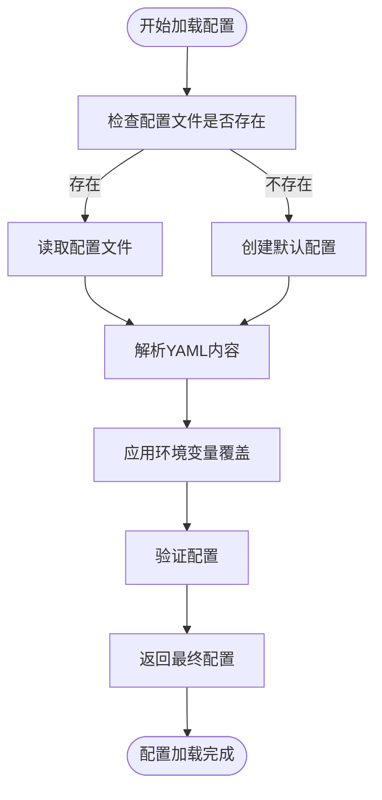
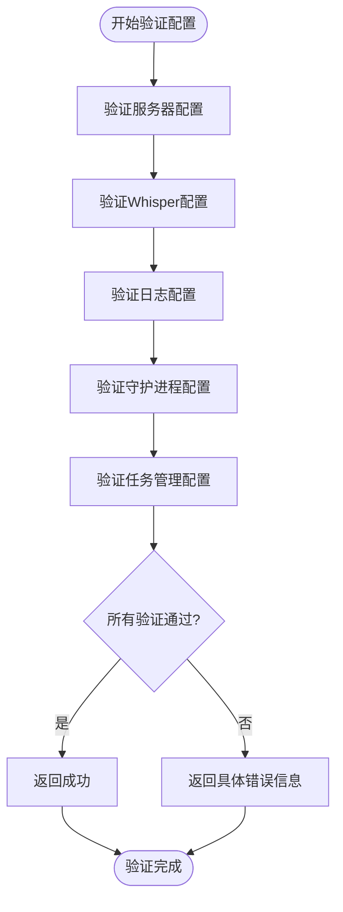

# 语音CLI工具配置

<cite>
**本文档中引用的文件**
- [config.yml](file://voice-cli/config.yml)
- [config.rs](file://voice-cli/src/config.rs)
- [models/config.rs](file://voice-cli/src/models/config.rs)
- [tts_service.py](file://voice-cli/tts_service.py)
- [INDEXTTS_SETUP.md](file://voice-cli/INDEXTTS_SETUP.md)
</cite>

## 目录
1. [简介](#简介)
2. [模型配置](#模型配置)
3. [音频输出参数](#音频输出参数)
4. [任务调度参数](#任务调度参数)
5. [日志配置](#日志配置)
6. [配置加载与环境变量覆盖](#配置加载与环境变量覆盖)
7. [配置示例](#配置示例)
8. [配置验证与错误处理](#配置验证与错误处理)

## 简介

语音CLI工具是一个基于Rust构建的高性能语音转文字服务，支持Whisper引擎和TTS（文本转语音）功能。本配置文档深入解析`config.yml`文件中的各项配置，包括TTS模型路径、音频输出参数、任务调度策略、日志配置等核心内容，帮助用户根据不同使用场景进行定制化配置。

## 模型配置

### model.path配置项

`model.path`配置项用于指定TTS模型文件的存储路径，该路径在配置文件中通过`tts.model_path`字段进行设置。

```yaml
tts:
  # TTS模型目录（可选，用于高级TTS模型）
  model_path: "./checkpoints"
```

- **路径指定**：`model_path`接受相对路径或绝对路径，推荐使用相对路径`./checkpoints`，该目录将存放IndexTTS模型文件
- **版本兼容性**：必须与IndexTTS-1.5版本兼容，模型文件包括`gpt.pth`、`bigvgan_generator.pth`、`dvae.pth`和`config.yaml`
- **默认值**：当未设置时，默认为`None`，系统将使用内置默认路径
- **环境变量覆盖**：可通过`VOICE_CLI_TTS_MODEL_PATH`环境变量进行覆盖

**Section sources**
- [config.yml](file://voice-cli/config.yml#L38-L39)
- [models/config.rs](file://voice-cli/src/models/config.rs#L214-L229)

## 音频输出参数

### audio.format、audio.sample_rate、audio.bitrate

TTS配置中的音频输出参数控制生成语音的质量和格式。

#### 支持的音频格式

```yaml
tts:
  # 支持的音频格式
  supported_formats: ["mp3", "wav"]
```

- **可选值**：`mp3`、`wav`
- **格式影响**：
  - `mp3`：压缩格式，文件较小，适合网络传输
  - `wav`：无损格式，音质更好，文件较大

#### 音频参数说明

虽然配置文件中未直接暴露sample_rate和bitrate，但通过`tts_service.py`实现可知：

- **采样率**：固定为22050Hz，确保语音清晰度
- **比特率**：MP3格式使用VBR（可变比特率）质量等级2，平衡音质和文件大小
- **声道**：单声道输出

**Section sources**
- [config.yml](file://voice-cli/config.yml#L41-L42)
- [tts_service.py](file://voice-cli/tts_service.py#L250-L270)

## 任务调度参数

### task.retry_count、task.timeout、task.concurrency

任务管理配置控制异步任务的执行策略。

```yaml
task_management:
  # 最大并发任务数
  max_concurrent_tasks: 4
  # 重试次数
  retry_attempts: 2
  # 任务超时时间（秒）
  task_timeout_seconds: 3600
```

#### 调优策略

| 参数 | 推荐值 | 说明 |
|------|--------|------|
| `max_concurrent_tasks` | 1-8 | 根据CPU核心数调整，建议设置为CPU核心数 |
| `retry_attempts` | 1-3 | 网络不稳定环境可适当增加 |
| `task_timeout_seconds` | 300-7200 | 根据任务复杂度调整 |

- **批量处理场景**：增加`max_concurrent_tasks`至8，提高吞吐量
- **实时合成场景**：减少`max_concurrent_tasks`至2，降低延迟
- **网络不稳定**：增加`retry_attempts`至3，提高成功率

**Section sources**
- [config.yml](file://voice-cli/config.yml#L90-L94)
- [models/config.rs](file://voice-cli/src/models/config.rs#L188-L198)

## 日志配置

### logging.file_path和logging.max_size

日志配置控制日志文件的存储和管理。

```yaml
logging:
  # 日志目录
  log_dir: "./logs"
  # 最大日志文件大小
  max_file_size: "100MB"
  # 最大日志文件数量
  max_files: 30
```

#### 最佳实践

- **文件路径**：使用`./logs`相对路径，便于部署和迁移
- **文件大小**：设置为`100MB`，平衡单文件大小和文件数量
- **文件保留**：保留30个文件，满足一个月的日志需求
- **日志级别**：生产环境使用`info`，调试时使用`debug`

**Section sources**
- [config.yml](file://voice-cli/config.yml#L76-L80)
- [models/config.rs](file://voice-cli/src/models/config.rs#L150-L159)

## 配置加载与环境变量覆盖

### 配置加载逻辑与优先级

配置系统支持通过环境变量动态覆盖配置文件中的值，优先级顺序为：环境变量 > 配置文件 > 默认值。

#### 加载流程



**Diagram sources**
- [config.rs](file://voice-cli/src/config.rs#L130-L290)

#### 环境变量映射

| 配置项 | 环境变量 | 说明 |
|--------|----------|------|
| server.port | VOICE_CLI_PORT | 覆盖服务器端口 |
| logging.level | VOICE_CLI_LOG_LEVEL | 覆盖日志级别 |
| whisper.models_dir | VOICE_CLI_MODELS_DIR | 覆盖模型目录 |
| tts.model_path | VOICE_CLI_TTS_MODEL_PATH | 覆盖TTS模型路径 |

**Section sources**
- [config.rs](file://voice-cli/src/config.rs#L130-L290)
- [README.md](file://voice-cli/README.md#L250-L270)

## 配置示例

### 不同使用场景的配置

#### 批量处理配置

```yaml
# 批量处理优化配置
task_management:
  max_concurrent_tasks: 8
  retry_attempts: 3
  task_timeout_seconds: 7200

tts:
  timeout_seconds: 600
  supported_formats: ["wav"]
```

#### 实时合成配置

```yaml
# 实时合成优化配置
task_management:
  max_concurrent_tasks: 2
  retry_attempts: 1
  task_timeout_seconds: 1800

tts:
  timeout_seconds: 150
  default_speed: 1.2
```

**Section sources**
- [config.yml](file://voice-cli/config.yml)
- [INDEXTTS_SETUP.md](file://voice-cli/INDEXTTS_SETUP.md#L350-L370)

## 配置验证与错误处理

### 配置验证失败的错误提示与修正

当配置验证失败时，系统会返回详细的错误信息，帮助用户快速定位问题。

#### 常见错误及修正

| 错误信息 | 原因 | 修正方法 |
|---------|------|---------|
| "Server port must be between 1 and 65535" | 端口值无效 | 检查`server.port`值是否在1-65535之间 |
| "Models directory cannot be empty" | 模型目录为空 | 确保`whisper.models_dir`有有效路径 |
| "Invalid log level" | 日志级别无效 | 使用trace, debug, info, warn, error之一 |
| "Max concurrent tasks must be greater than 0" | 并发数为0 | 设置`max_concurrent_tasks`大于0 |

#### 验证流程



**Diagram sources**
- [models/config.rs](file://voice-cli/src/models/config.rs#L300-L400)

**Section sources**
- [models/config.rs](file://voice-cli/src/models/config.rs#L300-L400)
- [config_env_tests.rs](file://voice-cli/src/tests/config_env_tests.rs#L50-L100)