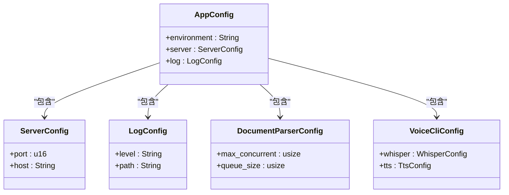
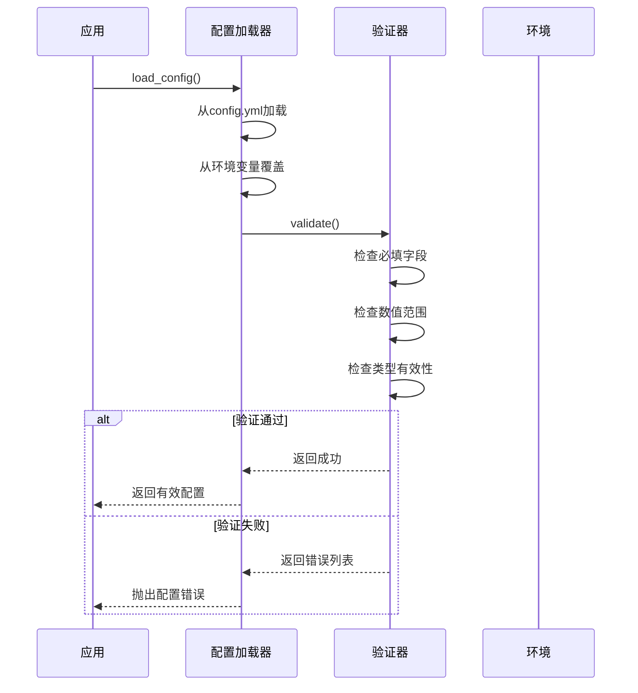

# 跨服务配置管理

<cite>
**本文档引用的文件**   
- [config.rs](file://document-parser/src/config.rs)
- [config.rs](file://mcp-proxy/src/config.rs)
- [config.rs](file://oss-client/src/config.rs)
- [config.rs](file://voice-cli/src/config.rs)
- [config.rs](file://voice-cli/src/models/config.rs)
- [config_validation.rs](file://document-parser/src/production/config_validation.rs)
- [environment_manager.rs](file://document-parser/src/utils/environment_manager.rs)
</cite>

## 目录
1. [引言](#引言)
2. [核心服务配置体系对比](#核心服务配置体系对比)
3. [统一基础配置块设计](#统一基础配置块设计)
4. [环境变量覆盖机制](#环境变量覆盖机制)
5. [配置验证机制](#配置验证机制)
6. [跨服务配置最佳实践](#跨服务配置最佳实践)
7. [配置继承与覆盖高级用法](#配置继承与覆盖高级用法)
8. [结论](#结论)

## 引言
本文档旨在深入分析 `document-parser`、`mcp-proxy` 和 `voice-cli` 三个核心服务的配置管理体系，揭示其共性与差异。文档将详细阐述统一的服务器、日志、数据库等基础配置块的设计原则与复用机制，解释环境变量覆盖配置的通用规则及其在不同服务中的实现一致性。同时，将描述配置验证机制在各服务中的应用模式，并提供跨服务配置的最佳实践建议。

## 核心服务配置体系对比

本文分析的三个核心服务（`document-parser`、`mcp-proxy`、`voice-cli`）在配置体系上展现出显著的共性与差异。

**共性方面**：
1.  **配置格式**：所有服务均采用 YAML 格式的配置文件（如 `config.yml`），并利用 `serde` 库进行序列化和反序列化，确保了配置结构的清晰性和可读性。
2.  **分层结构**：配置均采用分层的结构，将不同功能的配置项（如 `server`、`log`）组织在独立的块中，提高了配置的可维护性。
3.  **环境变量覆盖**：所有服务都支持通过环境变量来覆盖配置文件中的值，为不同部署环境（开发、测试、生产）提供了灵活性。

**差异方面**：
1.  **配置复杂度**：`document-parser` 的配置最为复杂，包含了 `mineru`、`markitdown` 等多个解析器的详细配置，以及全局的文件大小限制。`mcp-proxy` 的配置相对简单，主要集中在 `server` 和 `log` 两个基础模块。`voice-cli` 的配置则专注于语音处理，包含了 `whisper` 模型、`tts` 服务和 `daemon` 守护进程等特定配置。
2.  **配置加载机制**：`document-parser` 和 `voice-cli` 实现了更复杂的配置加载流程，包括从默认配置、配置文件、环境变量中逐层加载和覆盖，并包含配置验证和目录初始化。`mcp-proxy` 的加载逻辑相对直接，优先级为 `/app/config.yml` > `config.yml` > 环境变量 `BOT_SERVER_CONFIG`。
3.  **配置验证**：`document-parser` 拥有最完善的验证体系，不仅在 `config.rs` 中对单个配置块进行验证，还通过独立的 `config_validation.rs` 模块进行生产环境级别的全面验证。`voice-cli` 在 `config.rs` 中实现了详细的验证逻辑。`mcp-proxy` 则没有显式的配置验证逻辑。

**Section sources**
- [config.rs](file://document-parser/src/config.rs#L0-L1493)
- [config.rs](file://mcp-proxy/src/config.rs#L0-L67)
- [config.rs](file://voice-cli/src/models/config.rs#L0-L720)

## 统一基础配置块设计

尽管三个服务的业务逻辑不同，但它们在基础配置块的设计上遵循了相似的原则，体现了模块化和复用的思想。

### 设计原则
1.  **单一职责**：每个配置块（如 `ServerConfig`、`LogConfig`）只负责管理与其功能相关的配置项，确保了配置的内聚性。
2.  **类型安全**：利用 Rust 的结构体和枚举类型，为配置项定义了明确的数据类型（如 `u16`、`String`、`bool`），避免了类型错误。
3.  **默认值**：通过 `Default` trait 为配置项提供合理的默认值，降低了配置的复杂性，使用户只需覆盖必要的选项。
4.  **可扩展性**：配置结构设计为易于扩展，例如 `AppConfig` 可以轻松添加新的子配置块。

### 复用机制
基础配置块的复用主要体现在设计模式的统一，而非代码的直接共享。例如，`ServerConfig` 在三个服务中都包含 `port` 和 `host` 字段，其验证逻辑（端口非零、主机非空）也高度相似。这种一致性使得开发人员可以快速理解任何服务的配置结构。



**Diagram sources**
- [config.rs](file://document-parser/src/config.rs#L0-L1493)
- [config.rs](file://voice-cli/src/models/config.rs#L0-L720)

**Section sources**
- [config.rs](file://document-parser/src/config.rs#L0-L1493)
- [config.rs](file://mcp-proxy/src/config.rs#L0-L67)
- [config.rs](file://voice-cli/src/models/config.rs#L0-L720)

## 环境变量覆盖机制

环境变量覆盖是实现配置灵活性的关键机制，允许在不修改配置文件的情况下动态调整服务行为。

### 通用规则
环境变量覆盖遵循以下通用规则：
1.  **命名约定**：环境变量的名称通常由配置项的路径转换而来，使用大写字母和下划线。例如，`server.port` 对应 `SERVER_PORT`。
2.  **覆盖优先级**：环境变量的优先级高于配置文件中的值。当环境变量存在时，其值将覆盖配置文件中的对应值。
3.  **类型转换**：程序在加载时会将环境变量的字符串值解析为配置项所需的数据类型（如 `u16`、`bool`）。

### 实现一致性
三个服务在环境变量覆盖的实现上保持了高度的一致性：
-   `document-parser`：虽然其 `config.rs` 中没有直接实现环境变量覆盖，但通过 `environment_manager.rs` 模块管理了 Python 路径等环境相关的配置，体现了对环境变量的依赖。
-   `mcp-proxy`：在 `config.rs` 中通过 `env::var("BOT_SERVER_CONFIG")` 直接读取环境变量来指定配置文件路径，这是一种间接的覆盖方式。
-   `voice-cli`：在 `config.rs` 中实现了最直接和全面的覆盖。它定义了如 `VOICE_CLI_HOST`、`VOICE_CLI_PORT`、`VOICE_CLI_LOG_LEVEL` 等一系列环境变量，并在 `apply_env_overrides` 方法中逐一检查并应用这些变量，覆盖 `Config` 结构体中的相应字段。

这种一致性表明，项目团队已形成统一的实践，即使用环境变量作为配置的最终覆盖层，以适应不同的部署环境。

**Section sources**
- [config.rs](file://mcp-proxy/src/config.rs#L0-L67)
- [config.rs](file://voice-cli/src/models/config.rs#L0-L720)
- [environment_manager.rs](file://document-parser/src/utils/environment_manager.rs#L0-L4857)

## 配置验证机制

配置验证是确保服务稳定运行的重要环节，防止因错误的配置导致服务启动失败或运行异常。

### 应用模式
配置验证主要在配置加载完成后、服务启动前执行，其应用模式包括：
1.  **必填字段检查**：验证关键配置项是否被设置，例如 `server.host` 不能为空。
2.  **类型验证**：虽然 Rust 的类型系统保证了编译时的类型安全，但验证逻辑会检查字符串值是否符合预期（如日志级别是否为 `trace`、`debug` 等）。
3.  **范围限制**：对数值型配置项进行范围检查，例如端口号必须在 1-65535 之间，文件大小不能为 0 或超过 10GB。

### 各服务中的实现
-   `document-parser`：实现了最强大的验证机制。每个子配置块（如 `ServerConfig`、`LogConfig`）都实现了 `validate` 方法，进行基础验证。更重要的是，它拥有独立的 `config_validation.rs` 模块，该模块定义了 `ConfigValidator` 和 `EnvironmentValidator`，能够进行生产环境级别的深度验证，包括系统资源检查、网络配置检查和安全要求检查，并生成详细的验证报告。
-   `voice-cli`：在 `config.rs` 的 `validate` 方法中实现了全面的验证，覆盖了服务器、Whisper 模型、日志、守护进程和任务管理等多个模块的配置项，确保了配置的完整性。
-   `mcp-proxy`：在当前代码中未发现显式的配置验证逻辑，这可能是一个潜在的风险点。



**Diagram sources**
- [config.rs](file://document-parser/src/config.rs#L0-L1493)
- [config_validation.rs](file://document-parser/src/production/config_validation.rs#L0-L622)

**Section sources**
- [config.rs](file://document-parser/src/config.rs#L0-L1493)
- [config_validation.rs](file://document-parser/src/production/config_validation.rs#L0-L622)
- [config.rs](file://voice-cli/src/models/config.rs#L0-L720)

## 跨服务配置最佳实践

基于对三个服务的分析，总结出以下跨服务配置的最佳实践。

### 敏感信息管理
敏感信息（如数据库密码、API 密钥）**绝不应**以明文形式存储在配置文件中。正确的做法是：
1.  **使用环境变量**：将敏感信息通过环境变量注入。例如，`oss-client` 的 `OssConfig` 要求 `access_key_id` 和 `access_key_secret` 必须通过环境变量设置。
2.  **使用密钥管理服务**：在生产环境中，应使用专门的密钥管理服务（如 HashiCorp Vault、AWS KMS）来存储和分发敏感信息。

### 配置版本控制策略
1.  **配置文件纳入版本控制**：将配置文件（如 `config.yml`）纳入 Git 等版本控制系统，以便追踪变更历史。
2.  **提供配置模板**：提供一个 `config.yml.template` 文件，其中包含所有配置项的示例和说明，但不包含任何敏感信息。用户可以根据模板创建自己的 `config.yml`。
3.  **忽略实际配置文件**：将实际的 `config.yml` 文件添加到 `.gitignore` 中，防止敏感信息被意外提交。

### 多环境配置管理方案
1.  **环境变量驱动**：这是最推荐的方案。使用统一的配置文件，通过不同环境下的环境变量来覆盖特定值。例如，开发环境使用 `LOG_LEVEL=debug`，生产环境使用 `LOG_LEVEL=info`。
2.  **配置文件分支**：为不同的环境（`dev`、`test`、`prod`）维护不同的配置文件分支。这种方法简单直接，但不如环境变量灵活。
3.  **配置中心**：对于大型分布式系统，可以使用配置中心（如 Spring Cloud Config、Apollo）来集中管理和动态推送配置。

**Section sources**
- [config.rs](file://oss-client/src/config.rs#L0-L86)
- [config.rs](file://voice-cli/src/config.rs#L0-L96)

## 配置继承与覆盖高级用法示例

配置的继承与覆盖是实现配置复用和精细化管理的高级特性。

### 配置继承
在 `document-parser` 中，`ConfigBuilder` 模式体现了配置继承的思想。它允许从一个基础配置（如 `DEFAULT_CONFIG_YAML`）开始，然后有选择地覆盖其中的某些部分，从而构建出一个定制化的配置实例。这在单元测试中非常有用，可以快速创建具有特定配置的测试场景。

### 配置覆盖
`voice-cli` 的 `apply_env_overrides` 方法是配置覆盖的典范。它展示了如何系统地检查一系列环境变量，并将它们的值应用到配置对象上。一个高级用法示例如下：

假设 `voice-cli` 服务部署在 Kubernetes 集群中，可以通过以下方式动态调整其行为：
```yaml
# Kubernetes Deployment 配置片段
env:
  - name: VOICE_CLI_MAX_CONCURRENT_TASKS
    value: "8"
  - name: VOICE_CLI_LOG_LEVEL
    value: "warn"
  - name: VOICE_CLI_TRANSCRIPTION_WORKERS
    value: "6"
```
通过修改 Kubernetes 的部署配置，无需重建镜像或修改任何文件，即可将最大并发任务数从默认的 4 提升到 8，并将日志级别调整为 `warn`。这体现了配置覆盖在动态运维中的强大能力。

**Section sources**
- [config.rs](file://document-parser/src/config.rs#L0-L1493)
- [config.rs](file://voice-cli/src/models/config.rs#L0-L720)

## 结论
通过对 `document-parser`、`mcp-proxy` 和 `voice-cli` 三个核心服务的配置体系进行对比分析，可以看出项目在配置管理上既有统一的设计原则，也根据各服务的特点进行了差异化实现。`document-parser` 展现了最完善的配置验证和管理能力，而 `voice-cli` 在环境变量覆盖方面提供了最佳实践。未来，可以考虑将 `document-parser` 的 `config_validation.rs` 模块抽象为一个共享库，供其他服务复用，从而进一步提升整个项目的配置管理水平。同时，`mcp-proxy` 应尽快引入配置验证机制，以增强其健壮性。