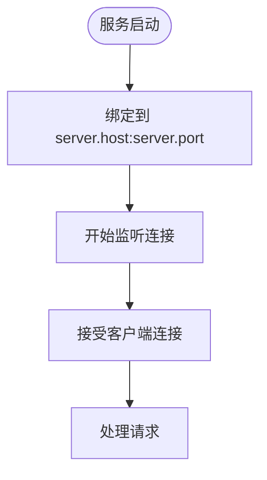
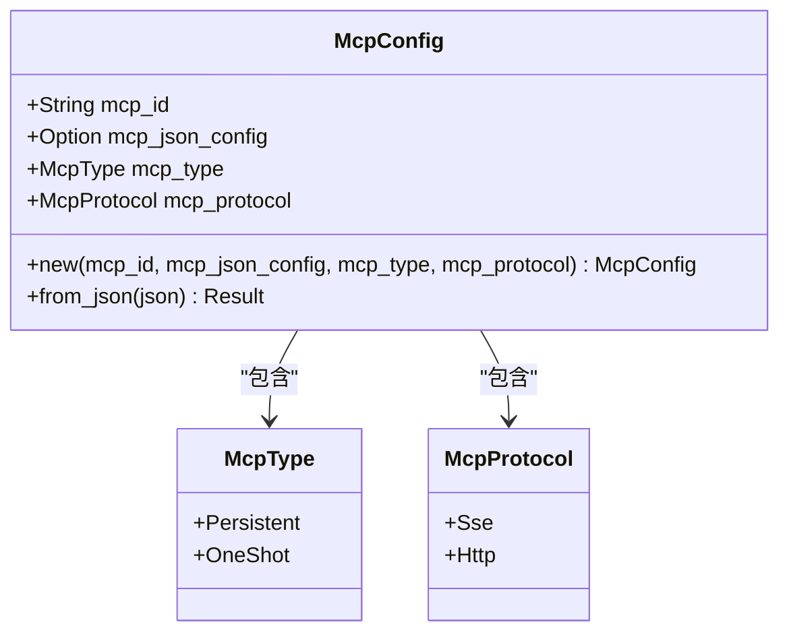
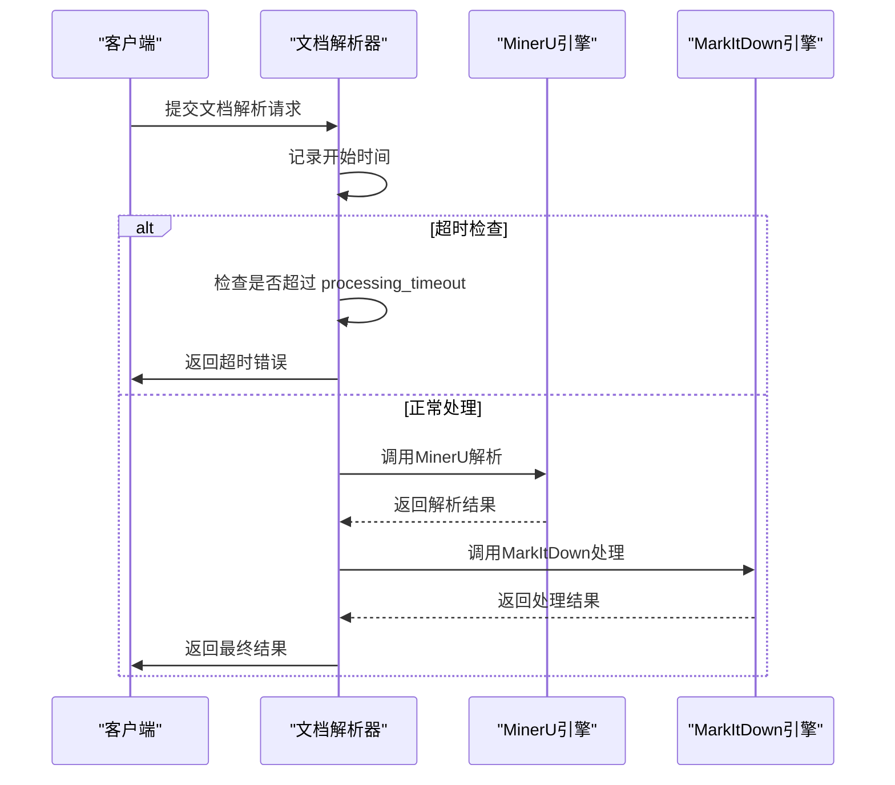
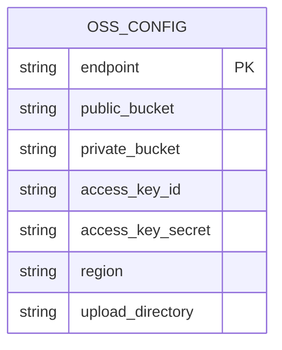
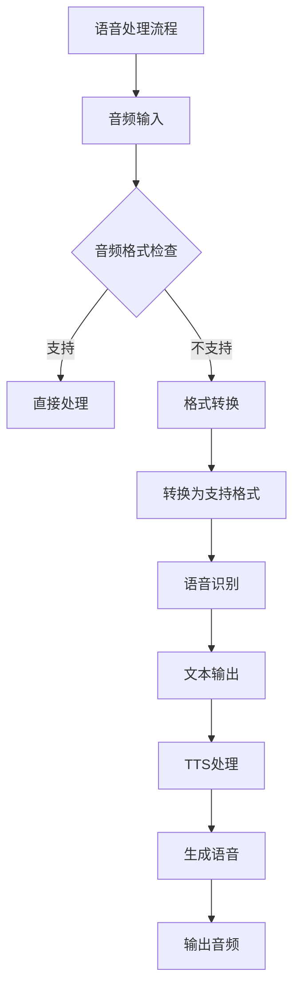
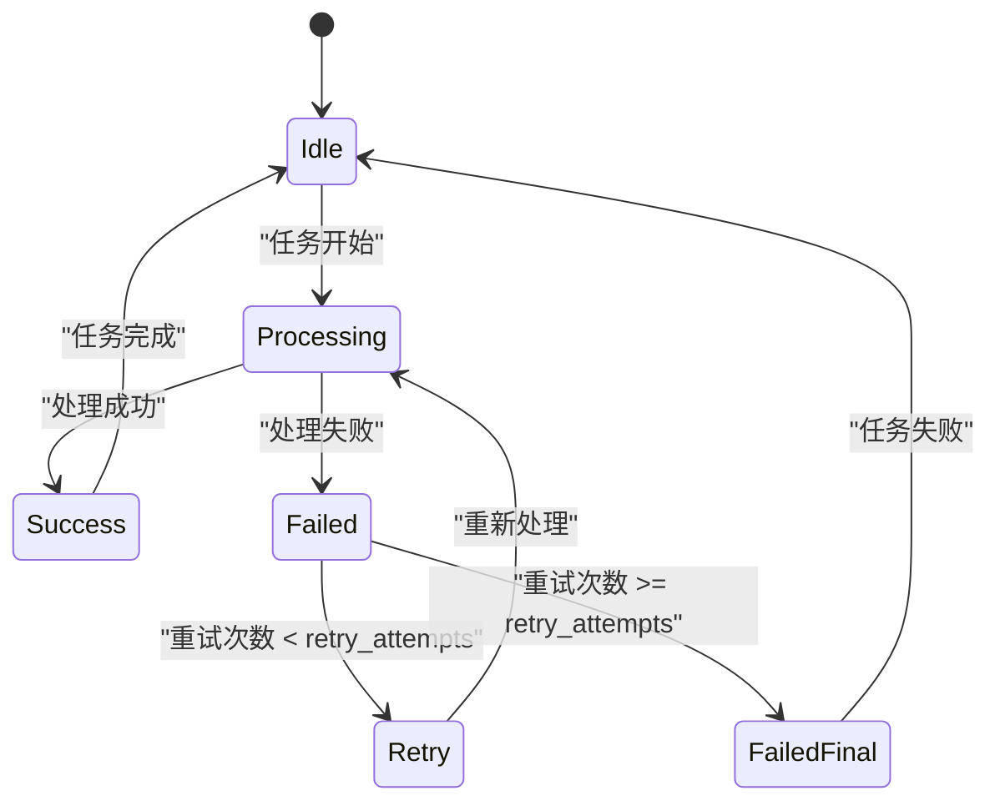
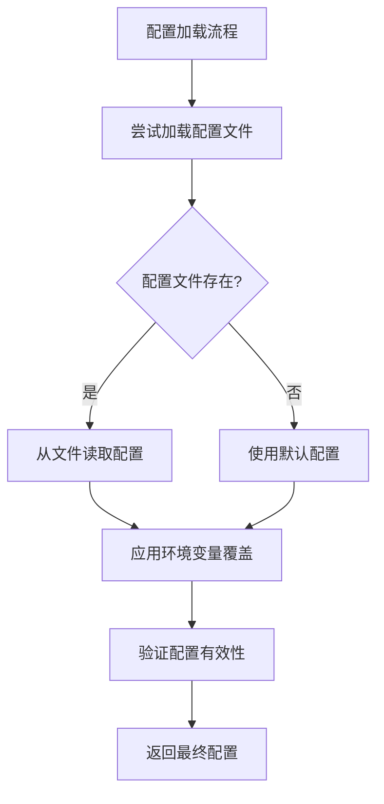
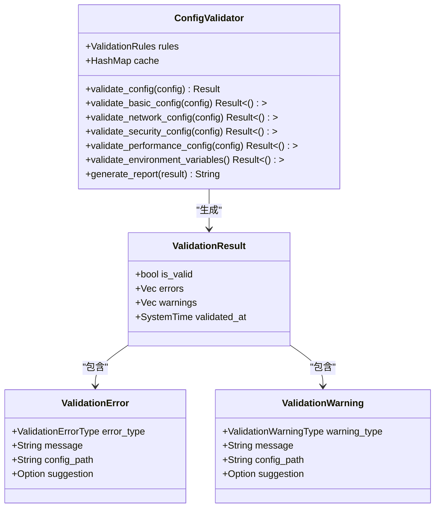
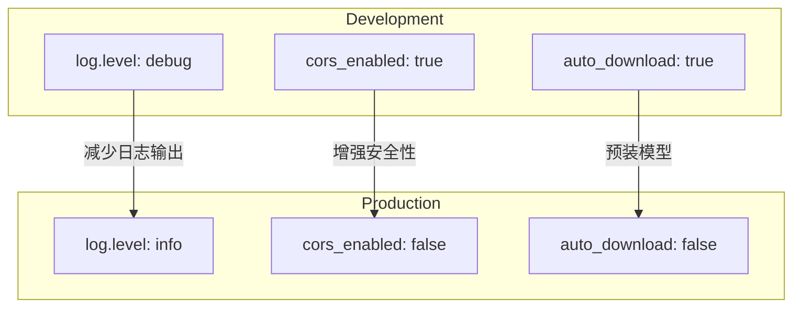

# 配置指南

<cite>
**本文档中引用的文件**  
- [config.yml](file://mcp-proxy/config.yml)
- [config.yml](file://document-parser/config.yml)
- [config.yml](file://voice-cli/config.yml)
- [config_validation.rs](file://document-parser/src/production/config_validation.rs)
- [config.rs](file://mcp-proxy/src/config.rs)
- [config.rs](file://voice-cli/src/config.rs)
- [config.rs](file://document-parser/src/config.rs)
- [mcp_config.rs](file://mcp-proxy/src/model/mcp_config.rs)
</cite>

## 目录
1. [简介](#简介)
2. [通用配置项说明](#通用配置项说明)
3. [mcp-proxy配置详解](#mcp-proxy配置详解)
4. [document-parser配置详解](#document-parser配置详解)
5. [voice-cli配置详解](#voice-cli配置详解)
6. [环境变量覆盖机制](#环境变量覆盖机制)
7. [配置验证机制](#配置验证机制)
8. [生产与开发环境配置对比](#生产与开发环境配置对比)

## 简介
本配置指南详细说明了项目中各服务的 `config.yml` 文件结构与字段含义。文档涵盖 `mcp-proxy`、`document-parser` 和 `voice-cli` 三个核心服务的配置细节，解释了通用配置项的作用，以及各服务特有的配置块和参数调优建议。同时介绍了如何通过环境变量覆盖YAML配置，以及配置验证机制如何防止无效设置。

## 通用配置项说明
通用配置项在多个服务中共享，主要包含服务器和日志配置。

### server.host 与 server.port
`server.host` 指定服务监听的网络接口地址，`server.port` 指定监听的端口号。

- **server.host**: 设置为 `"0.0.0.0"` 表示监听所有网络接口，允许外部访问；设置为 `"127.0.0.1"` 则仅限本地访问。
- **server.port**: 指定服务监听的端口号，需确保端口未被其他进程占用。

**Diagram sources**
- [config.rs](file://mcp-proxy/src/config.rs#L18-L25)
- [config.rs](file://document-parser/src/config.rs#L393-L404)

### logging.level
`logging.level` 控制日志输出的详细程度，支持多个级别：

- **trace**: 最详细，包含所有调试信息
- **debug**: 调试信息，用于开发阶段
- **info**: 一般信息，记录正常运行状态
- **warn**: 警告信息，表示潜在问题
- **error**: 错误信息，表示发生错误

日志级别按严重程度递增，设置某个级别后，该级别及更高级别的日志都会被记录。

**Section sources**
- [config.yml](file://mcp-proxy/config.yml#L4-L6)
- [config.yml](file://document-parser/config.yml#L5-L6)
- [config.yml](file://voice-cli/config.yml#L85-L88)

## mcp-proxy配置详解
`mcp-proxy` 服务的配置主要包含服务器和日志设置。

### mcp_instances 配置块
`mcp-proxy` 服务通过 `mcp_instances` 配置块定义MCP实例的默认插件集及其启动参数。虽然在提供的 `config.yml` 中未直接体现，但通过 `mcp_config.rs` 文件可以了解其结构。

**Diagram sources**
- [mcp_config.rs](file://mcp-proxy/src/model/mcp_config.rs#L1-L72)

`mcp_instances` 配置块通常包含以下字段：
- **mcpId**: MCP实例的唯一标识符
- **mcpJsonConfig**: 可选的JSON配置字符串，用于传递插件特定参数
- **mcpType**: 实例类型，支持 `Persistent`（持续运行）和 `OneShot`（一次性任务）
- **mcpProtocol**: 通信协议，默认为 `Sse`（Server-Sent Events）

**Section sources**
- [config.yml](file://mcp-proxy/config.yml#L1-L8)
- [mcp_config.rs](file://mcp-proxy/src/model/mcp_config.rs#L1-L72)

## document-parser配置详解
`document-parser` 服务的配置较为复杂，包含多个功能模块的设置。

### parser.timeout 配置
`parser.timeout` 配置项已统一到 `document_parser.processing_timeout`，用于控制文档处理的超时时间。

- **download_timeout**: 下载文档的超时时间，单位为秒
- **processing_timeout**: 文档处理的超时时间，单位为秒，目前设置为3600秒（60分钟）

**Diagram sources**
- [config.yml](file://document-parser/config.yml#L13-L16)
- [config.rs](file://document-parser/src/config.rs#L257-L275)

### oss.bucket 配置
OSS（对象存储服务）配置包含两个存储桶：

- **public_bucket**: 公共存储桶，用于存储公共文件，如文档文件
- **private_bucket**: 私有存储桶，用于存储私有文件，如模型文件

**Diagram sources**
- [config.yml](file://document-parser/config.yml#L60-L67)
- [config.rs](file://document-parser/src/config.rs#L558-L592)

### storage.local_path 配置
本地存储路径配置主要涉及Sled数据库：

- **sled.path**: Sled数据库的存储路径，用于持久化存储文档解析相关的元数据
- **cache_capacity**: Sled数据库的缓存容量，单位为字节

**Section sources**
- [config.yml](file://document-parser/config.yml#L52-L58)
- [config.rs](file://document-parser/src/config.rs#L543-L556)

## voice-cli配置详解
`voice-cli` 服务的配置主要针对语音处理和TTS（文本转语音）功能。

### model.path 配置
`model.path` 配置项在TTS配置中对应 `model_path`，用于指定TTS模型的存储路径。

- **model_path**: TTS模型目录，可选配置，用于存放高级TTS模型
- **models_dir**: Whisper模型存储目录，用于语音转文字功能

**Diagram sources**
- [config.yml](file://voice-cli/config.yml#L48-L50)
- [config.rs](file://voice-cli/src/models/config.rs#L184-L194)

### audio.format 配置
音频格式配置包含多个相关设置：

- **supported_formats**: 支持的音频格式列表，包括mp3、wav、flac等
- **auto_convert**: 是否自动转换不支持的音频格式
- **conversion_timeout**: 音频转换超时时间，单位为秒

**Section sources**
- [config.yml](file://voice-cli/config.yml#L32-L38)
- [config.rs](file://voice-cli/src/models/config.rs#L105-L117)

### task.retry_count 配置
任务重试配置在 `task_management` 配置块中：

- **retry_attempts**: 失败任务的重试次数，目前设置为2次
- **max_concurrent_tasks**: 最大并发任务数，控制同时处理的任务数量
- **task_timeout_seconds**: 任务处理超时时间，单位为秒

**Diagram sources**
- [config.yml](file://voice-cli/config.yml#L90-L95)
- [config.rs](file://voice-cli/src/models/config.rs#L164-L178)

## 环境变量覆盖机制
系统支持通过环境变量覆盖YAML配置文件中的设置，提供更大的灵活性。

### 覆盖机制实现
`voice-cli` 和 `document-parser` 服务都实现了环境变量覆盖机制，优先级顺序为：环境变量 > 配置文件 > 默认值。

**Diagram sources**
- [config.rs](file://voice-cli/src/models/config.rs#L350-L550)
- [config.rs](file://document-parser/src/config.rs#L850-L970)

### 常用环境变量
各服务支持的环境变量遵循统一的命名规范：

- **VOICE_CLI_HOST**: 覆盖 `server.host`
- **VOICE_CLI_PORT**: 覆盖 `server.port`
- **SERVER_PORT**: 覆盖 `server.port`（通用）
- **LOG_LEVEL**: 覆盖 `log.level`（通用）
- **OSS_ACCESS_KEY_ID**: 覆盖OSS访问密钥ID

**Section sources**
- [config.rs](file://voice-cli/src/models/config.rs#L350-L550)
- [config.rs](file://document-parser/src/config.rs#L850-L970)

## 配置验证机制
系统通过 `config_validation.rs` 模块实现生产环境配置验证，确保所有配置项都符合要求。

### 验证规则
配置验证器包含多种验证规则：

- **必需的环境变量**: 检查关键环境变量是否存在
- **端口范围限制**: 确保端口在有效范围内（1024-65535）
- **安全配置要求**: 检查是否启用HTTPS和身份认证
- **超时限制**: 验证超时设置是否合理

**Diagram sources**
- [config_validation.rs](file://document-parser/src/production/config_validation.rs#L1-L621)

### 验证流程
配置验证流程包括多个步骤：

1. 验证基本配置（主机、端口等）
2. 验证网络配置（端口范围、主机地址等）
3. 验证安全配置（HTTPS、认证等）
4. 验证性能配置（超时设置等）
5. 验证环境变量（必需变量是否存在）

**Section sources**
- [config_validation.rs](file://document-parser/src/production/config_validation.rs#L1-L621)

## 生产与开发环境配置对比
不同环境下的配置存在显著差异，以满足各自的需求。

### 配置差异对比表
| 配置项 | 开发环境 | 生产环境 | 说明 |
|--------|----------|----------|------|
| environment | "development" | "production" | 环境标识 |
| log.level | "debug" | "info" | 生产环境减少日志输出 |
| server.host | "0.0.0.0" | "0.0.0.0" | 通常都监听所有接口 |
| max_concurrent | 5 | 根据硬件调整 | 生产环境通常更高 |
| cors_enabled | true | false | 生产环境更严格的安全策略 |
| auto_download | true | false | 生产环境预装模型 |

### 环境特定配置
`document-parser` 的 `config.yml` 中明确设置了 `environment: "development"`，而生产环境应修改为 `"production"`。

**Diagram sources**
- [config.yml](file://document-parser/config.yml#L1)
- [config.yml](file://voice-cli/config.yml)

**Section sources**
- [config.yml](file://document-parser/config.yml#L1-L77)
- [config.yml](file://voice-cli/config.yml#L1-L99)