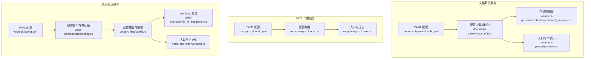
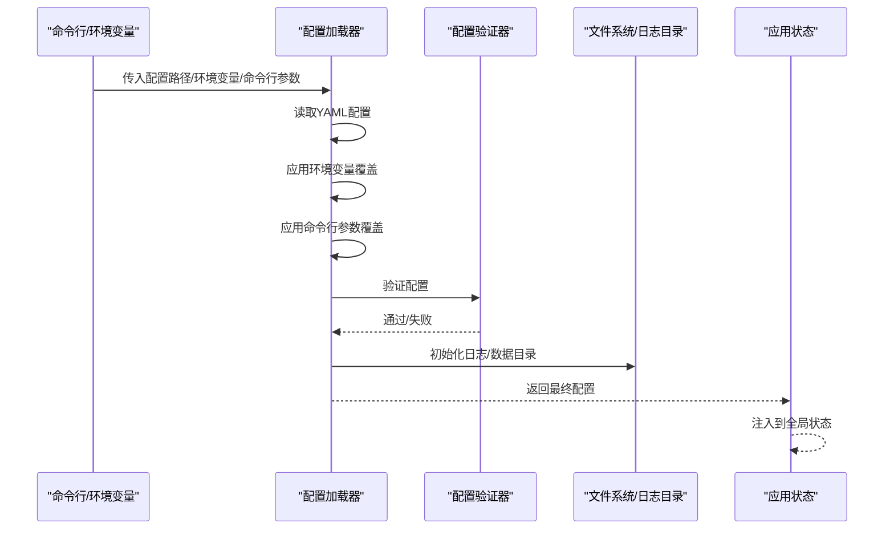
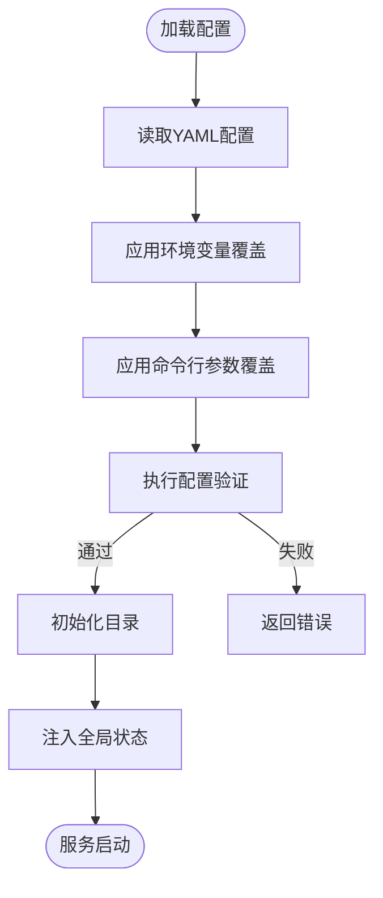
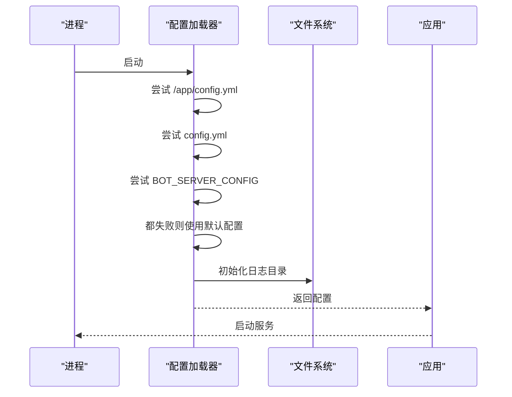
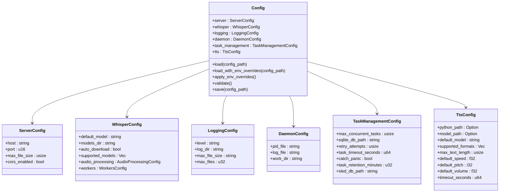
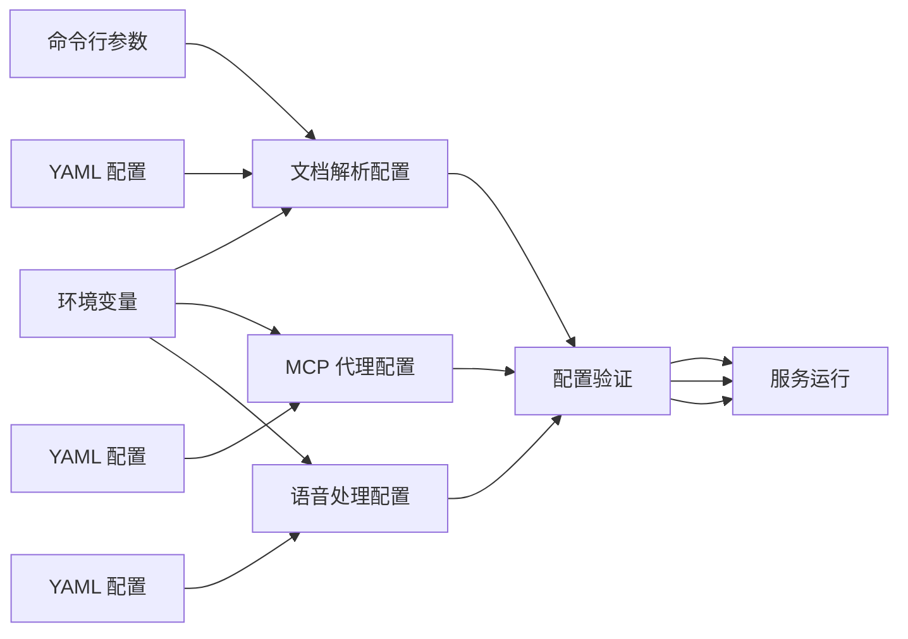

# 配置管理

<cite>
**本文引用的文件**
- [document-parser/config.yml](file://document-parser/config.yml)
- [document-parser/src/config.rs](file://document-parser/src/config.rs)
- [document-parser/src/utils/environment_manager.rs](file://document-parser/src/utils/environment_manager.rs)
- [document-parser/src/main.rs](file://document-parser/src/main.rs)
- [mcp-proxy/config.yml](file://mcp-proxy/config.yml)
- [mcp-proxy/src/config.rs](file://mcp-proxy/src/config.rs)
- [mcp-proxy/src/main.rs](file://mcp-proxy/src/main.rs)
- [voice-cli/config.yml](file://voice-cli/config.yml)
- [voice-cli/src/config.rs](file://voice-cli/src/config.rs)
- [voice-cli/src/models/config.rs](file://voice-cli/src/models/config.rs)
- [voice-cli/src/config_rs_integration.rs](file://voice-cli/src/config_rs_integration.rs)
- [voice-cli/src/server/mod.rs](file://voice-cli/src/server/mod.rs)
- [voice-cli/test_config.yml](file://voice-cli/test_config.yml)
- [document-parser/production/config_validation.rs](file://document-parser/production/config_validation.rs)
</cite>

## 目录
1. [简介](#简介)
2. [项目结构](#项目结构)
3. [核心组件](#核心组件)
4. [架构总览](#架构总览)
5. [详细组件分析](#详细组件分析)
6. [依赖关系分析](#依赖关系分析)
7. [性能考量](#性能考量)
8. [故障排查指南](#故障排查指南)
9. [结论](#结论)
10. [附录](#附录)

## 简介
本文件系统性梳理仓库的配置管理体系，覆盖 YAML 配置文件结构、配置项含义与作用范围、环境变量与命令行参数的交互方式、配置验证与默认值策略、各服务（文档解析、MCP 代理、语音处理）的配置示例与最佳实践，并扩展至配置热更新、敏感信息管理与多环境配置策略。目标是帮助开发者快速理解并正确使用配置系统，同时提供可操作的排障与优化建议。

## 项目结构
- 文档解析服务（document-parser）
  - 配置文件：YAML，位于根目录
  - 配置加载与校验：通过 Rust 模块解析、验证、初始化
  - 环境变量与命令行参数：支持覆盖与注入
- MCP 代理服务（mcp-proxy）
  - 配置文件：YAML，位于根目录
  - 配置加载：优先级明确，支持环境变量覆盖
- 语音处理服务（voice-cli）
  - 配置文件：YAML，位于根目录
  - 配置模型：强类型结构体，支持默认值与环境变量覆盖
  - 配置模板生成与变更通知：便于运维与自动化

图表来源
- [document-parser/config.yml](file://document-parser/config.yml#L1-L78)
- [document-parser/src/config.rs](file://document-parser/src/config.rs#L774-L976)
- [document-parser/src/utils/environment_manager.rs](file://document-parser/src/utils/environment_manager.rs#L1-L120)
- [document-parser/src/main.rs](file://document-parser/src/main.rs#L150-L210)
- [mcp-proxy/config.yml](file://mcp-proxy/config.yml#L1-L11)
- [mcp-proxy/src/config.rs](file://mcp-proxy/src/config.rs#L40-L75)
- [mcp-proxy/src/main.rs](file://mcp-proxy/src/main.rs#L1-L120)
- [voice-cli/config.yml](file://voice-cli/config.yml#L1-L100)
- [voice-cli/src/models/config.rs](file://voice-cli/src/models/config.rs#L1-L120)
- [voice-cli/src/config.rs](file://voice-cli/src/config.rs#L1-L92)
- [voice-cli/src/config_rs_integration.rs](file://voice-cli/src/config_rs_integration.rs#L152-L176)
- [voice-cli/src/server/mod.rs](file://voice-cli/src/server/mod.rs#L1-L44)

章节来源
- [document-parser/config.yml](file://document-parser/config.yml#L1-L78)
- [mcp-proxy/config.yml](file://mcp-proxy/config.yml#L1-L11)
- [voice-cli/config.yml](file://voice-cli/config.yml#L1-L100)

## 核心组件
- 配置文件（YAML）
  - 文档解析：包含环境、服务器、日志、解析器、存储、文件大小、外部集成等
  - MCP 代理：包含服务器端口、日志级别、日志路径、日志保留天数
  - 语音处理：包含服务器、Whisper、TTS、日志、守护进程、任务管理等
- 配置加载与验证
  - 文档解析：支持从 YAML 加载、环境变量覆盖、目录初始化、强类型验证
  - MCP 代理：支持多来源加载（绝对路径、当前目录、环境变量指向的文件路径）、默认回退、日志目录初始化
  - 语音处理：支持默认配置、文件读取、环境变量覆盖、严格校验
- 环境变量与命令行参数
  - 文档解析：支持 SERVER_PORT/SERVER_HOST/LOG_LEVEL/LOG_PATH 等覆盖；命令行支持 --config/--port/--host
  - MCP 代理：支持环境变量覆盖（通过配置加载逻辑）
  - 语音处理：支持大量 VOICE_CLI_* 环境变量覆盖，含端口、日志、模型、并发、数据库路径等
- 默认值策略
  - 文档解析：全局文件大小默认值、解析器默认后端、Python 路径默认值、OSS 上传目录默认值等
  - MCP 代理：日志保留天数默认值
  - 语音处理：大量字段提供默认值（端口、日志级别、模型目录、并发、超时等）
- 敏感信息管理
  - 文档解析：OSS 访问密钥通过环境变量注入，避免硬编码
  - 语音处理：大量敏感字段通过环境变量覆盖，避免写入配置文件
- 多环境配置策略
  - 通过环境变量覆盖不同环境差异（开发/测试/生产）
  - 通过命令行参数覆盖短期运行需求
  - 通过 config-rs 集成支持更复杂的层次化配置（如 underscore 前缀的环境变量）

章节来源
- [document-parser/src/config.rs](file://document-parser/src/config.rs#L774-L976)
- [document-parser/src/main.rs](file://document-parser/src/main.rs#L150-L210)
- [mcp-proxy/src/config.rs](file://mcp-proxy/src/config.rs#L40-L75)
- [mcp-proxy/src/main.rs](file://mcp-proxy/src/main.rs#L1-L120)
- [voice-cli/src/models/config.rs](file://voice-cli/src/models/config.rs#L138-L268)
- [voice-cli/src/config.rs](file://voice-cli/src/config.rs#L1-L92)
- [voice-cli/src/config_rs_integration.rs](file://voice-cli/src/config_rs_integration.rs#L152-L176)

## 架构总览
配置加载与生效的总体流程如下：
- 服务启动时读取 YAML 配置文件
- 应用环境变量覆盖（按模块支持的键名）
- 对于文档解析服务，还会从命令行参数覆盖部分字段
- 执行配置验证与必要目录初始化
- 将最终配置注入到应用状态，供业务模块使用

图表来源
- [document-parser/src/config.rs](file://document-parser/src/config.rs#L774-L976)
- [document-parser/src/main.rs](file://document-parser/src/main.rs#L150-L210)
- [mcp-proxy/src/config.rs](file://mcp-proxy/src/config.rs#L40-L75)
- [voice-cli/src/models/config.rs](file://voice-cli/src/models/config.rs#L270-L326)

## 详细组件分析

### 文档解析服务（document-parser）
- 配置文件结构要点
  - 环境、服务器、日志、文档解析、MinerU、MarkItDown、存储（Sled/OSS）、文件大小、外部集成
  - OSS 密钥通过环境变量占位，避免硬编码
- 环境变量覆盖
  - 支持 SERVER_PORT、SERVER_HOST、LOG_LEVEL、LOG_PATH 等
  - MinerU/MarkItDown 的 Python 路径支持默认虚拟环境自动检测
- 命令行参数覆盖
  - 支持 --config、--port、--host，优先级高于 YAML
- 验证与默认值
  - 服务器端口/主机、日志级别/路径、并发/队列、超时、OSS 端点/桶名等均有严格校验
  - 全局文件大小默认值、MinerU/MarkItDown 默认后端、Python 路径默认值、OSS 上传目录默认值
- 目录初始化
  - 启动时确保日志、数据库、模型等目录存在
- 环境检查与 CUDA 状态
  - 启动时检查 CUDA 状态并注入全局状态，便于解析器选择 CPU/GPU

图表来源
- [document-parser/src/config.rs](file://document-parser/src/config.rs#L774-L976)
- [document-parser/src/main.rs](file://document-parser/src/main.rs#L150-L210)

章节来源
- [document-parser/config.yml](file://document-parser/config.yml#L1-L78)
- [document-parser/src/config.rs](file://document-parser/src/config.rs#L774-L976)
- [document-parser/src/utils/environment_manager.rs](file://document-parser/src/utils/environment_manager.rs#L1-L120)
- [document-parser/src/main.rs](file://document-parser/src/main.rs#L150-L210)

### MCP 代理服务（mcp-proxy）
- 配置文件结构要点
  - 服务器端口、日志级别、日志路径、日志保留天数
- 配置加载优先级
  - /app/config.yml > config.yml > BOT_SERVER_CONFIG 环境变量指向的文件路径
  - 若均无，则使用内置默认配置
- 日志目录初始化
  - 启动时确保日志目录存在
- 运行特性
  - 启动后初始化 OpenTelemetry、定时任务、日志清理任务（按保留天数）

图表来源
- [mcp-proxy/src/config.rs](file://mcp-proxy/src/config.rs#L40-L75)
- [mcp-proxy/src/main.rs](file://mcp-proxy/src/main.rs#L1-L120)

章节来源
- [mcp-proxy/config.yml](file://mcp-proxy/config.yml#L1-L11)
- [mcp-proxy/src/config.rs](file://mcp-proxy/src/config.rs#L40-L75)
- [mcp-proxy/src/main.rs](file://mcp-proxy/src/main.rs#L1-L120)

### 语音处理服务（voice-cli）
- 配置文件结构要点
  - 服务器、Whisper、TTS、日志、守护进程、任务管理等
- 配置模型与默认值
  - 大量字段提供默认值（端口、日志级别、模型目录、并发、超时、数据库路径等）
- 环境变量覆盖
  - 支持 VOICE_CLI_HOST、VOICE_CLI_PORT、VOICE_CLI_MAX_FILE_SIZE、VOICE_CLI_CORS_ENABLED、VOICE_CLI_LOG_LEVEL、VOICE_CLI_LOG_DIR、VOICE_CLI_LOG_MAX_FILES、VOICE_CLI_DEFAULT_MODEL、VOICE_CLI_MODELS_DIR、VOICE_CLI_AUTO_DOWNLOAD、VOICE_CLI_TRANSCRIPTION_WORKERS、VOICE_CLI_WORK_DIR、VOICE_CLI_PID_FILE、VOICE_CLI_MAX_CONCURRENT_TASKS、VOICE_CLI_SQLITE_DB_PATH、VOICE_CLI_TASK_RETENTION_MINUTES、VOICE_CLI_SLED_DB_PATH 等
- 配置模板生成与变更通知
  - 支持生成配置模板文件
  - 提供配置变更通知结构体
- config-rs 集成
  - 支持 underscore 前缀的环境变量合并（如 _cache 等）

图表来源
- [voice-cli/src/models/config.rs](file://voice-cli/src/models/config.rs#L1-L120)
- [voice-cli/src/models/config.rs](file://voice-cli/src/models/config.rs#L138-L268)

章节来源
- [voice-cli/config.yml](file://voice-cli/config.yml#L1-L100)
- [voice-cli/src/models/config.rs](file://voice-cli/src/models/config.rs#L1-L120)
- [voice-cli/src/models/config.rs](file://voice-cli/src/models/config.rs#L270-L326)
- [voice-cli/src/config.rs](file://voice-cli/src/config.rs#L1-L92)
- [voice-cli/src/config_rs_integration.rs](file://voice-cli/src/config_rs_integration.rs#L152-L176)
- [voice-cli/src/server/mod.rs](file://voice-cli/src/server/mod.rs#L1-L44)

## 依赖关系分析
- 配置来源与优先级
  - 文档解析：YAML → 环境变量 → 命令行参数
  - MCP 代理：/app/config.yml > config.yml > BOT_SERVER_CONFIG > 默认
  - 语音处理：文件读取/默认值 → 环境变量覆盖
- 配置验证与错误处理
  - 文档解析：严格的字段校验、路径有效性、数值边界检查
  - 语音处理：严格的字段校验、日志级别合法性、端口范围、并发数与数据库路径等
- 敏感信息与安全
  - 文档解析：OSS 密钥通过环境变量注入
  - 语音处理：大量敏感字段通过环境变量覆盖
- 多环境与热更新
  - 通过环境变量覆盖实现多环境切换
  - 仓库未提供配置热更新机制，建议通过外部配置中心或重启拉起的方式实现

图表来源
- [document-parser/src/config.rs](file://document-parser/src/config.rs#L774-L976)
- [mcp-proxy/src/config.rs](file://mcp-proxy/src/config.rs#L40-L75)
- [voice-cli/src/models/config.rs](file://voice-cli/src/models/config.rs#L270-L326)

章节来源
- [document-parser/src/config.rs](file://document-parser/src/config.rs#L774-L976)
- [mcp-proxy/src/config.rs](file://mcp-proxy/src/config.rs#L40-L75)
- [voice-cli/src/models/config.rs](file://voice-cli/src/models/config.rs#L270-L326)

## 性能考量
- 并发与队列
  - 文档解析：max_concurrent、queue_size 控制并发与排队能力
  - 语音处理：transcription_workers、channel_buffer_size 控制转录并发与通道容量
- 超时与资源
  - 文档解析：download_timeout、processing_timeout 控制下载与处理超时
  - 语音处理：worker_timeout、task_timeout_seconds 控制工作线程与任务超时
- 日志与存储
  - 日志轮转与保留策略（MCP 代理的 retain_days）
  - 数据库路径与缓存容量（Sled/OSS/SQLite）
- GPU/CPU 选择
  - 文档解析：MinerU 的 device/vram 设置，结合 CUDA 状态自动选择

章节来源
- [document-parser/config.yml](file://document-parser/config.yml#L1-L78)
- [voice-cli/config.yml](file://voice-cli/config.yml#L1-L100)
- [mcp-proxy/src/main.rs](file://mcp-proxy/src/main.rs#L120-L214)

## 故障排查指南
- 配置验证失败
  - 文档解析：检查端口/host、日志级别/路径、并发/队列、超时、OSS 配置等
  - 语音处理：检查端口范围、日志级别、模型目录、并发数、数据库路径等
- 环境变量覆盖异常
  - 确认变量名拼写正确、值合法（如端口必须为 1-65535、日志级别必须在允许集合内）
- 目录与权限问题
  - 确保日志目录、模型目录、数据库目录存在且具备写权限
- CUDA/GPU 问题
  - 文档解析：若 CUDA 不可用，将回退到 CPU；可通过环境变量或命令行参数调整
- 多环境切换
  - 使用环境变量覆盖实现不同环境差异；生产环境建议通过外部配置中心或容器编排工具注入

章节来源
- [document-parser/src/config.rs](file://document-parser/src/config.rs#L330-L453)
- [voice-cli/src/models/config.rs](file://voice-cli/src/models/config.rs#L607-L706)
- [document-parser/src/main.rs](file://document-parser/src/main.rs#L150-L210)

## 结论
本仓库的配置管理体系采用“YAML 基础配置 + 环境变量覆盖 + 命令行参数覆盖”的分层设计，配合严格的配置验证与默认值策略，能够满足多服务、多环境的部署需求。文档解析服务在 CUDA 状态与目录初始化方面提供了额外的工程化保障；MCP 代理服务在日志清理与保留策略上体现了生产级特性；语音处理服务通过丰富的默认值与环境变量覆盖，提供了高度可定制的运行时配置。建议在生产环境中结合外部配置中心与容器编排工具，实现更灵活的配置管理与变更发布。

## 附录

### 配置项参考与最佳实践

- 文档解析服务（document-parser）
  - 关键配置项
    - 服务器：host/port
    - 日志：level/path
    - 文档解析：max_concurrent/queue_size/download_timeout/processing_timeout
    - MinerU：backend/python_path/max_concurrent/queue_size/batch_size/quality_level/device/vram
    - MarkItDown：python_path/enable_plugins/features(ocr/audio_transcription/azure_doc_intel/youtube_transcription)
    - 存储：sled(path/cache_capacity)/oss(endpoint/public_bucket/private_bucket/access_key_id/access_key_secret/region/upload_directory)
    - 文件大小：max_file_size/large_document_threshold
    - 外部集成：webhook_url/api_key/timeout
  - 最佳实践
    - 使用环境变量注入敏感信息（如 OSS 密钥）
    - 合理设置并发与队列，避免资源争用
    - 生产环境开启日志轮转与保留策略
    - GPU 环境下根据显存合理设置 vram

章节来源
- [document-parser/config.yml](file://document-parser/config.yml#L1-L78)
- [document-parser/src/config.rs](file://document-parser/src/config.rs#L330-L453)

- MCP 代理服务（mcp-proxy）
  - 关键配置项
    - 服务器：port
    - 日志：level/path/retain_days
  - 最佳实践
    - 使用环境变量覆盖端口与日志路径
    - 启用日志清理任务，控制日志保留天数
    - 结合 OpenTelemetry 进行可观测性

章节来源
- [mcp-proxy/config.yml](file://mcp-proxy/config.yml#L1-L11)
- [mcp-proxy/src/config.rs](file://mcp-proxy/src/config.rs#L40-L75)
- [mcp-proxy/src/main.rs](file://mcp-proxy/src/main.rs#L120-L214)

- 语音处理服务（voice-cli）
  - 关键配置项
    - 服务器：host/port/max_file_size/cors_enabled
    - Whisper：default_model/models_dir/auto_download/supported_models/audio_processing/auto_convert/conversion_timeout/temp_file_cleanup/temp_file_retention/workers/transcription_workers/channel_buffer_size/worker_timeout
    - TTS：python_path/model_path/default_model/supported_formats/max_text_length/default_speed/default_pitch/default_volume/timeout_seconds
    - 日志：level/log_dir/max_file_size/max_files
    - 守护进程：pid_file/log_file/work_dir
    - 任务管理：max_concurrent_tasks/sqlite_db_path/retry_attempts/task_timeout_seconds/catch_panic/task_retention_minutes/sled_db_path
  - 最佳实践
    - 使用环境变量覆盖端口、日志、模型、并发、数据库路径等
    - 合理设置并发与超时，避免资源耗尽
    - 使用默认配置文件模板，再通过环境变量微调

章节来源
- [voice-cli/config.yml](file://voice-cli/config.yml#L1-L100)
- [voice-cli/src/models/config.rs](file://voice-cli/src/models/config.rs#L138-L268)
- [voice-cli/src/config.rs](file://voice-cli/src/config.rs#L1-L92)

### 环境变量与命令行参数对照表

- 文档解析（document-parser）
  - 环境变量：SERVER_PORT、SERVER_HOST、LOG_LEVEL、LOG_PATH
  - 命令行：--config、--port、--host
- MCP 代理（mcp-proxy）
  - 配置加载：/app/config.yml、config.yml、BOT_SERVER_CONFIG
- 语音处理（voice-cli）
  - 环境变量：VOICE_CLI_HOST、VOICE_CLI_PORT、VOICE_CLI_MAX_FILE_SIZE、VOICE_CLI_CORS_ENABLED、VOICE_CLI_LOG_LEVEL、VOICE_CLI_LOG_DIR、VOICE_CLI_LOG_MAX_FILES、VOICE_CLI_DEFAULT_MODEL、VOICE_CLI_MODELS_DIR、VOICE_CLI_AUTO_DOWNLOAD、VOICE_CLI_TRANSCRIPTION_WORKERS、VOICE_CLI_WORK_DIR、VOICE_CLI_PID_FILE、VOICE_CLI_MAX_CONCURRENT_TASKS、VOICE_CLI_SQLITE_DB_PATH、VOICE_CLI_TASK_RETENTION_MINUTES、VOICE_CLI_SLED_DB_PATH

章节来源
- [document-parser/src/config.rs](file://document-parser/src/config.rs#L944-L976)
- [document-parser/src/main.rs](file://document-parser/src/main.rs#L150-L210)
- [mcp-proxy/src/config.rs](file://mcp-proxy/src/config.rs#L40-L75)
- [voice-cli/src/models/config.rs](file://voice-cli/src/models/config.rs#L291-L326)
- [voice-cli/src/config.rs](file://voice-cli/src/config.rs#L329-L588)

### 配置验证与默认值策略
- 文档解析
  - 服务器端口/host、日志级别/路径、并发/队列、超时、OSS 配置等严格校验
  - 全局文件大小默认值、MinerU/MarkItDown 默认后端、Python 路径默认值、OSS 上传目录默认值
- MCP 代理
  - 日志保留天数默认值；日志目录初始化
- 语音处理
  - 严格的字段校验与默认值；支持 config-rs 的 underscore 前缀环境变量合并

章节来源
- [document-parser/src/config.rs](file://document-parser/src/config.rs#L330-L453)
- [document-parser/src/production/config_validation.rs](file://document-parser/production/config_validation.rs#L101-L200)
- [mcp-proxy/src/config.rs](file://mcp-proxy/src/config.rs#L40-L75)
- [voice-cli/src/models/config.rs](file://voice-cli/src/models/config.rs#L138-L268)
- [voice-cli/src/config_rs_integration.rs](file://voice-cli/src/config_rs_integration.rs#L152-L176)

### 配置热更新与多环境策略
- 热更新
  - 仓库未提供配置热更新机制；建议通过外部配置中心或容器编排工具实现
- 多环境
  - 使用环境变量覆盖实现不同环境差异
  - 建议在 CI/CD 中按环境注入变量，避免直接修改配置文件

章节来源
- [document-parser/src/config.rs](file://document-parser/src/config.rs#L944-L976)
- [voice-cli/src/models/config.rs](file://voice-cli/src/models/config.rs#L291-L326)